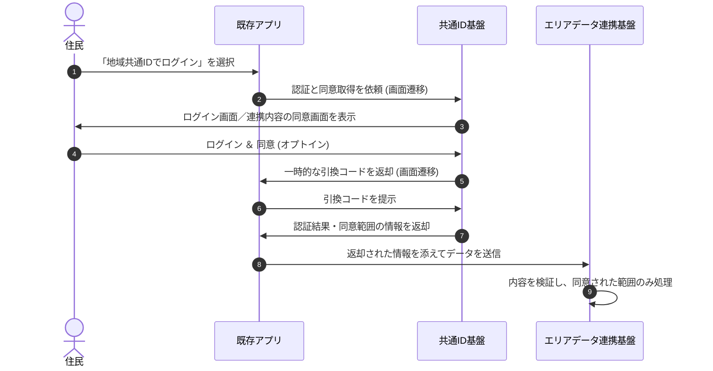

# エリアデータ連携基盤の共同利用ガイドブック第3.0版
 

日付: 2026年9月4日
 
発行元: デジタル庁

 
## まえがき
旧来は「データ連携基盤」という名称を使っておりましたが、類似の用語が登場・普及している背景から、役割や扱うデータをより具体的にイメージできるよう、昨年度から「エリアデータ連携基盤」という名称に統一しています。
 
本ガイドブックは、タイトルにあるとおり、元々はエリアデータ連携基盤の共同利用を目的とした、共同利用ビジョンを作成するためのものでした。現在は、エリアデータ連携基盤の共同利用に向けた方針や検討内容だけでなく、その背景、活用事例、エリアデータの利活用について、デジタル庁として考えを網羅した内容に改版しています。
 
**更新履歴** 
|版 |公開日  |目的・概要   |
|---|---|---|
|第1.0版   |2024年10月10日   |エリアデータ連携基盤の「共同利用」   |
|第2.0版   |2025年9月1日   |エリアデータ連携基盤を活用した「データ利活用の推進」   |
|第3.0版   |2026年9月4日   | エリアデータ連携基盤の「より一層の活用」   |
 
- 【追加内容】 共同利用に至るプロセス、エリアデータ活用や接続サービスの拡充方法、サービス利用者の拡大施策など
 
 

**資料構成**  
提供形式を以下の2種類となります。
 
|提供ドキュメント|形式|
| --- | --- | 
|本編|構造化された文書|
|Appendix|関連する図表等を用いたスライド|
 
Github上には、ビジュアルを整え見やすく読みやすいドキュメントとしてHTMLファイルを提供しています。 また、AI等の活用を想定した機械判読可能な、構造化されたドキュメントとしてMarkdownファイルを提供しています。
 
[エリアデータ連携基盤 共同利用ガイドブック（GitHub）](https://github.com/digital-go-jp/area-data-coordination/tree/main/guidebook)
 

[TOC]

## 1. 本ガイドブックでの用語の定義

エリアデータ連携基盤に関する、根底となる共通の理念と領域の定義は以下の通りです。

| 用語  | 定義 |
| --- | --- |
| **分野** <!--domain-->|  地域が直面する社会的課題の解決および将来的なサービスニーズを見据え、それらの取組において頻繁に連携・共有されるデータの内容や属性の共通性に基づいて設定されるもの。<!-- 参考文書: 共同利用ガイドブック/ 発行元:デジタル庁 --> |
| **パーソナルデータ**<!--personal data--> | 個人情報に加え、個人情報との境界が曖昧なものを含み、個人の属性情報、移動・行動・購買履歴、ウェアラブル機器等から収集されたデータあるいは加工された情報等、個人と関係性が見出される広範囲のデータ。 <!-- 参考文書: [スマートシティリファレンスアーキテクチャホワイトペーパー（SCRA）](https://www8.cao.go.jp/cstp/society5_0/smartcity/scra4_2025_0523.pdf) / 発行元: 内閣府 --> |
| **非パーソナルデータ**<!--non-personal data--> | オープンデータに代表される、個人情報が含まれないデータ（パーソナルデータ以外のデータ）。 <!-- 参考文書: [「デジタル田園都市国家構想の実現に向けた生活用データ連携基盤におけるデータ仲介機能に関する機能および運用等に係る調査研究」 調査報告書 ](https://www.digital.go.jp/assets/contents/node/basic_page/field_ref_resources/82a1ea56-128f-4cf6-bbd5-9ef6d4b7bafc/3685a475/20230423_policies_budget_entrustment_deliverables_report_01_01.pdf) / 発行元: デジタル庁 --> |
| **データアセット** <!--data asset--> | 地域に存在するデータを、複数の主体やサービスから利用・再利用できるよう、価値ある資産として管理したデータのまとまり。<!-- 参考文書: データマネジメントとデータ資産に関する案内 / 発行元: IPA（情報処理推進機構）、 data asset (https://csrc.nist.gov/glossary/term/data_asset?utm_source=chatgpt.com) / NIST（National Institute of Standards and Technology：米国国立標準技術研究所）--> |
| **エリアデータ**<!-- area data--> | 行政手続、健康、交通、防災、観光などの暮らしを支える様々なサービスのデータや、地理データ、公共データ等の様々なデータアセット。<!-- R8重点 / デジタル庁 -->  |
| **協調領域** <!--collaborative areas--> | 各事業者が協調・協力して、機能を共有していくことで、産業の成長を見込む領域。 <!-- 参考文書: 4次元時空間情報利活用のための空間IDガイドライン / 発行元: デジタル庁 / IPA --> |
| **競争領域**<!--competitive areas --> | 各事業者が競争して、全体として産業の成長を見込む領域。 <!-- 参考文書: 4次元時空間情報利活用のための空間IDガイドライン / 発行元: デジタル庁 / IPA --> |
| **サイロ化** <!--information silo--> | 各システムが独立し、データ連携がされていない「縦割り」の状態。 <!-- 参考文書: スマートシティ・リファレンス・アーキテクチャ（SCRA） / 発行元: 内閣府 --> |
| **バックキャスト（逆算）思考** <!--backcasting--> | 予測可能な未来の延長線上で考えるのではなく、まず「あるべき理想の未来像」を最初に設定し、そのゴールから現在に遡って、今、何をすべきか、どのような課題を解決すべきかを導き出す思考・計画策定の手法。 <!-- 参考文書: バックキャスティング手法の活用資料 / 発行元: 環境省 --> |
| **AIネイティブ**<!--AI-native--> | システムの開発や運用の初期段階から大規模言語モデル（LLM）をはじめとする人工知能の活用を前提とし、その全プロセスにおいて安全性、透明性、権利保護などのガバナンスやリスク管理の仕組みが一体として組み込まれている設計思想。 <!-- AI事業者ガイドライン / AI制度ワーキンググループ報告書 / 内閣府 / 総務省・経済産業省：『AI事業者ガイドライン（第1.0版）』--> |
| **データモデル**<!--data model--> | 異なるシステムや地域間でデータを円滑に相互連携（相互運用）させるために、データの意味、項目及び相互の関係性を構造化して定義したもの。 <!-- 参考文書: [生活用データ連携に関する機能等に係る調査研究 調査報告書](https://www.digital.go.jp/assets/contents/node/basic_page/field_ref_resources/82a1ea56-128f-4cf6-bbd5-9ef6d4b7bafc/22ab734b/20221020_policies_budget_subsidies_01.pdf) / 発行元: デジタル庁 --> |

▲[目次に戻る](#00)
 
 

## 2. エリアデータ連携基盤とは

### 2.1. 目指すべき姿
日本の多くの地域が人口減少局面を迎える中、「限られたリソースでの住民サービスの維持」が喫緊の課題です。

地域に関わる全ての人々の満足度を向上させるため、以下の3つの軸で取組の推進が必要だと考えます。
* **地域の生活を守る**：住民サービスや生活インフラの維持・確保
* **より良い生活をつくる**：暮らしの利便性向上や新たな価値の創出
* **地域で稼ぐ力をつける**：地場産業の活性化や地域経済の循環

これらのまちづくりを机上の空論で終わらせず、具体的に実現するためには「協業」と「利活用」の両輪が不可欠です。
* **多様な主体との「協業」** 行政単独の枠組みを超え、民間企業、NPO、住民などが一体となった推進体制。
* **エリアデータの「利活用」** 既存サービスの付加価値向上や新サービス創出に向け、地域に眠る様々なデータを分野横断でつなぐ。

<svg xmlns="http://www.w3.org/2000/svg" width="1200" height="900" viewBox="0 0 1200 900" role="img" aria-labelledby="title desc">
  <title>01_2-1_データドリブンなまちづくりのビジョン</title>
  <desc id="desc">
    エリアデータ連携基盤を支える協業とデータ利活用を土台として、
    地域の生活を守る、より良い生活をつくる、地域で稼ぐ力をつける、
    という3つのビジョンを示した図。
  </desc>
  
  <defs>
    

    <filter id="shadow" x="-20%" y="-20%" width="140%" height="150%">
      <feDropShadow dx="0" dy="7" stdDeviation="10" flood-color="#0017b6" flood-opacity="0.12"/>
    </filter>

    <marker id="arrow" viewBox="0 0 12 12" refX="10" refY="6" markerWidth="10" markerHeight="10" orient="auto-start-reverse">
      <path d="M1 1 L11 6 L1 11 Z" fill="#0017b6"/>
    </marker>

    
    <symbol id="icon-shield" viewBox="0 0 72 72">
      <path d="M36 7C29 14 20 17 12 19v18c0 15 9 24 24 31 15-7 24-16 24-31V19C52 17 43 14 36 7Z" fill="#C0D7FB" stroke="#0017B6" stroke-width="4" stroke-linejoin="round"/>
      <path d="M36 18v38c9-5 14-11 14-20V27c-5-1-10-4-14-9Z" fill="#0017B6"/>
    </symbol>

    
    <symbol id="icon-sparkles" viewBox="0 0 72 72">
      <path d="M36 4c2 14 8 20 22 22-14 2-20 8-22 22-2-14-8-20-22-22C28 24 34 18 36 4Z" fill="#0017B6"/>
      <path d="M57 38c1.2 8 4.8 11.6 13 13-8.2 1.4-11.8 5-13 13-1.4-8-5-11.6-13-13 8-1.4 11.6-5 13-13Z" fill="#C0D7FB" stroke="#0017B6" stroke-width="2"/>
      <path d="M17 46c.8 5.2 3.2 7.6 8.5 8.5C20.2 55.4 17.8 57.8 17 63c-.9-5.2-3.3-7.6-8.5-8.5C13.7 53.6 16.1 51.2 17 46Z" fill="#0017B6"/>
    </symbol>

    
    <symbol id="icon-economy" viewBox="0 0 72 72">
      <path d="M25 9h22l-3 10c9 6 15 16 15 28 0 13-9 20-23 20S13 60 13 47c0-12 6-22 15-28L25 9Z" fill="#C0D7FB" stroke="#0017B6" stroke-width="4" stroke-linejoin="round"/>
      <path d="M24 9c7 4 17 4 24 0" fill="none" stroke="#0017B6" stroke-width="4" stroke-linecap="round"/>
      <path d="M27 31l9 12 9-12M36 43v15M27 45h18M27 51h18" fill="none" stroke="#0017B6" stroke-width="4" stroke-linecap="round" stroke-linejoin="round"/>
    </symbol>

    
    <symbol id="icon-collab" viewBox="0 0 80 72">
      <path d="M8 25l14-11 14 8-12 17-16-14Z" fill="#C0D7FB" stroke="#0017B6" stroke-width="3" stroke-linejoin="round"/>
      <path d="M72 25L58 14l-14 8 12 17 16-14Z" fill="#C0D7FB" stroke="#0017B6" stroke-width="3" stroke-linejoin="round"/>
      <path d="M26 24l8-3 9 7 11-3 8 9-21 21c-3 3-8 3-11 0L18 43" fill="#F3EEE5" stroke="#0017B6" stroke-width="3" stroke-linecap="round" stroke-linejoin="round"/>
      <path d="M30 48l7 7M37 42l8 8M44 36l8 7" fill="none" stroke="#0017B6" stroke-width="3" stroke-linecap="round"/>
    </symbol>

    
    <symbol id="icon-data" viewBox="0 0 80 72">
      <rect x="7" y="39" width="11" height="25" rx="2" fill="#C0D7FB"/>
      <rect x="24" y="27" width="11" height="37" rx="2" fill="#0017B6"/>
      <rect x="41" y="15" width="11" height="49" rx="2" fill="#C0D7FB"/>
      <path d="M59 19a18 18 0 1 1-1 36V37h18" fill="#F3EEE5" stroke="#0017B6" stroke-width="3" stroke-linejoin="round"/>
      <path d="M59 19v18h17A18 18 0 0 0 59 19Z" fill="#0017B6"/>
    </symbol>
  </defs>

  
  <rect width="1200" height="900" fill="#FFFFFF"/>

  
  <rect x="45" y="38" width="1110" height="410" rx="26" fill="#FFFFFF" stroke="#0017B6" stroke-width="4"/>

  <text x="600" y="90" text-anchor="middle" class="text heading">
    データドリブンなまちづくりのビジョン（目指すべき姿）
  </text>

  
  <g filter="url(#shadow)">
    <rect x="78" y="125" width="318" height="280" rx="24" fill="#FFFFFF" stroke="#0017B6" stroke-width="3"/>
    <rect x="441" y="125" width="318" height="280" rx="24" fill="#FFFFFF" stroke="#0017B6" stroke-width="3"/>
    <rect x="804" y="125" width="318" height="280" rx="24" fill="#FFFFFF" stroke="#0017B6" stroke-width="3"/>
  </g>

  
  <use href="#icon-shield" x="201" y="148" width="72" height="72"/>
  <text x="237" y="254" text-anchor="middle" class="text card-title">
    地域の生活を守る
  </text>
  <text x="237" y="296" text-anchor="middle" class="body">
    <tspan x="237" dy="0">住民サービスや</tspan>
    <tspan x="237" dy="29">生活インフラの</tspan>
    <tspan x="237" dy="29">維持・確保</tspan>
  </text>

  
  <use href="#icon-sparkles" x="564" y="148" width="72" height="72"/>
  <text x="600" y="254" text-anchor="middle" class="text card-title">
    より良い生活をつくる
  </text>
  <text x="600" y="311" text-anchor="middle" class="body">
    <tspan x="600" dy="0">利便性向上・</tspan>
    <tspan x="600" dy="29">新たな価値創出</tspan>
  </text>

  
  <use href="#icon-economy" x="927" y="148" width="72" height="72"/>
  <text x="963" y="254" text-anchor="middle" class="text card-title">
    地域で稼ぐ力をつける
  </text>
  <text x="963" y="296" text-anchor="middle" class="body">
    <tspan x="963" dy="0">地場産業活性化・</tspan>
    <tspan x="963" dy="29">地域経済循環</tspan>
  </text>

  
  <path d="M600 535 L600 472 L237 472 L237 426" class="connector" marker-end="url(#arrow)"/>
  <path d="M600 535 L600 426" class="connector" marker-end="url(#arrow)"/>
  <path d="M600 535 L600 472 L963 472 L963 426" class="connector" marker-end="url(#arrow)"/>

  
  <rect x="45" y="535" width="1110" height="325" rx="28" fill="#F8FBFF" stroke="#0017B6" stroke-width="4" stroke-dasharray="12 10"/>

  
  <circle cx="600" cy="535" r="41" fill="#0017B6" stroke="#FFFFFF" stroke-width="9"/>
  <circle cx="600" cy="535" r="52" fill="none" stroke="#0017B6" stroke-width="3" stroke-dasharray="9 8"/>

  <text x="600" y="624" text-anchor="middle" class="text foundation-title">
    まちづくりを支える両輪（土台）
  </text>

  
  <rect x="92" y="660" width="450" height="120" rx="22" fill="#F3EEE5" stroke="#0017B6" stroke-width="3"/>
  <rect x="658" y="660" width="450" height="120" rx="22" fill="#C0D7FB" stroke="#0017B6" stroke-width="3"/>

  
  <path d="M542 722 H658" fill="none" stroke="#0017B6" stroke-width="5" stroke-linecap="round"/>

  
  
  <text x="197" y="702" class="text foundation-card-title">
    多様な主体との「協業」
  </text>
  <text x="217" y="741" class="body">
    <tspan x="157" dy="0">行政・民間企業・NPO・住民の推進体制</tspan>
  </text>

  
  
  <text x="763" y="702" class="text foundation-card-title">
    エリアデータの「利活用」
  </text>
  <text x="783" y="741" class="body">
    <tspan x="733" dy="0">地域の様々なデータを分野横断でつなぐ</tspan>
    
  </text>
</svg>

これら「協業」と「利活用」を掛け合わせ、経験や勘に頼るのではなく、客観的なデータを根拠に施策を決定・実行する「データドリブン」な取組への転換を行い、供給側の都合ではなく、需要側（住民一人ひとり）の事情やニーズに合わせた「個人に最適化されたサービス」の実現を目指すことが必要です。

 

### 2.2. データ利活用に向けた現状
デジタルサービスの導入は進みつつあるものの、住民サービスの多くはバラバラに提供されているのが現実であり、データ利活用が困難な状況です。
* **サービスごとのID分離とシステムのサイロ化**： 各システムが独立しサイロ化されていて、住民はサービスごとに何度も同じ情報の入力を求められます。
* **データ利活用の限界**： 行政側が利用者の全体像を把握できず、データの紐付けが困難なため、データ利活用が進まない要因となっています。
* **データアセットの紐付け作業の重複**： 同じデータアセットをサービス毎に個別に紐付けるといった非効率な作業が必要となっています。
 

<svg xmlns="http://www.w3.org/2000/svg" width="1280" height="720" viewBox="0 0 1280 720" role="img" aria-labelledby="title desc">
  <title>02_2-2_分断された行政サービスとエリアデータ連携基盤</title>
  <desc id="desc">
    住民にとって煩雑な手続きと、サービスごとに分断されたID・データを表した概念図
  </desc>

  <defs>
    

    <marker id="arrow" viewBox="0 0 10 10" refX="8.5" refY="5" markerWidth="8" markerHeight="8" orient="auto-start-reverse">
      <path d="M0 0 L10 5 L0 10 Z" fill="#1B243B"/>
    </marker>

    <marker id="arrowAccent" viewBox="0 0 10 10" refX="8.5" refY="5" markerWidth="8" markerHeight="8" orient="auto-start-reverse">
      <path d="M0 0 L10 5 L0 10 Z" fill="#0017B6"/>
    </marker>

    <linearGradient id="hubGradient" x1="0" y1="0" x2="1" y2="1">
      <stop offset="0" stop-color="#273B70"/>
      <stop offset="1" stop-color="#0017B6"/>
    </linearGradient>

    <filter id="shadow" x="-30%" y="-30%" width="160%" height="160%">
      
    </filter>
  </defs>

  
  <rect width="1280" height="720" fill="#FFFFFF"/>

  
  <text class="text" x="580" y="120" font-size="25" font-weight="500">
    各サービスが独自のIDとデータを保有
  </text>

  
  
  <g transform="translate(80 214)">
    
    <path class="thin" d="M7 34 C10 22 19 14 31 10"/>
    <path class="thin" d="M17 45 C20 35 25 29 35 24"/>
    <path class="thin" d="M98 18 L104 4"/>
    <path class="thin" d="M112 28 L124 21"/>
    <path class="thin" d="M114 43 L129 45"/>

    
    <path class="line" d="M42 70         C42 45 58 29 82 29         C105 29 121 47 121 70         C121 89 107 109 82 109         C58 109 42 90 42 70         Z"/>

    <path class="thin" d="M46 60 C56 57 63 50 68 40"/>
    <path class="thin" d="M68 40 C81 53 97 56 116 55"/>

    <circle cx="65" cy="70" r="2.6" fill="#1B243B"/>
    <circle cx="99" cy="70" r="2.6" fill="#1B243B"/>

    <path class="thin" d="M75 90 C82 85 89 85 96 90"/>

    
    <path class="line" d="M47 112 C25 121 16 139 14 174"/>
    <path class="line" d="M117 112 C139 121 148 139 150 174"/>
    <path class="line" d="M47 112 C59 124 105 124 117 112"/>
    <path class="line" d="M43 174 L43 145"/>
    <path class="line" d="M121 174 L121 145"/>
  </g>

  
  <g aria-label="サービスごとに分断されたIDと煩雑な手続き">
    
    <path class="line" d="M226 290 C252 277 272 267 294 256"/>
    <path class="line" d="M225 318 C252 314 271 309 292 303"/>
    <path class="line" d="M227 347 C252 350 271 354 292 359"/>

    
    <path class="line" d="M276 282         C304 240 348 213 389 226         C434 240 452 288 431 329         C409 373 351 392 308 367         C266 343 261 292 291 258         C321 223 374 221 409 251         C448 285 442 341 408 374         C371 409 313 404 283 367         C253 331 266 285 304 264         C345 240 397 257 419 296         C442 338 417 388 374 407         C330 427 280 405 265 365         C249 323 273 278 316 264"/>

    <path class="line" d="M282 308         C322 281 368 277 405 297         C443 317 451 362 427 394         C401 430 350 438 311 414         C273 391 261 348 284 316         C307 283 354 273 391 292         C430 312 441 357 418 390         C393 424 343 430 306 407"/>

    <path class="line" d="M286 341         C320 314 365 306 401 324         C438 342 449 384 427 415         C403 448 354 456 317 434         C280 412 267 372 288 341         C309 310 350 300 386 313"/>

    <path class="line" d="M299 376         C330 352 374 347 407 366         C440 385 446 425 421 451         C394 479 346 479 314 452         C284 427 281 398 299 376"/>

    
    <path class="line" d="M319 251         C360 225 403 218 435 220         C449 221 459 212 468 199"/>

    <path class="line" d="M286 301         C335 282 386 276 426 281         C444 283 456 278 468 274"/>

    <path class="line" d="M287 354         C335 348 384 347 425 350         C443 351 456 351 468 351"/>

    <path class="line" d="M306 407         C348 413 388 423 424 430         C443 434 456 431 468 429"/>
  </g>

  
  <g aria-label="サービスごとの個別ID">
    <g transform="translate(470 199)">
      <circle cx="0" cy="0" r="9" fill="#8396F0" stroke="#0017B6" stroke-width="3"/>
      <circle cx="-2.5" cy="-2.5" r="2.2" fill="#FFFFFF"/>

      <path class="accent-line" d="M10 0 H46" marker-end="url(#arrowAccent)"/>
    </g>

    <g transform="translate(470 274)">
      <circle cx="0" cy="0" r="9" fill="#8396F0" stroke="#0017B6" stroke-width="3"/>
      <circle cx="-2.5" cy="-2.5" r="2.2" fill="#FFFFFF"/>

      <path class="accent-line" d="M10 0 H46" marker-end="url(#arrowAccent)"/>
    </g>

    <g transform="translate(470 351)">
      <circle cx="0" cy="0" r="9" fill="#8396F0" stroke="#0017B6" stroke-width="3"/>
      <circle cx="-2.5" cy="-2.5" r="2.2" fill="#FFFFFF"/>

      <path class="accent-line" d="M10 0 H46" marker-end="url(#arrowAccent)"/>
    </g>

    <g transform="translate(470 429)">
      <circle cx="0" cy="0" r="9" fill="#8396F0" stroke="#0017B6" stroke-width="3"/>
      <circle cx="-2.5" cy="-2.5" r="2.2" fill="#FFFFFF"/>

      <path class="accent-line" d="M10 0 H46" marker-end="url(#arrowAccent)"/>
    </g>
  </g>

  
  <g>
    
    <g transform="translate(540 150)">
      <rect class="card" width="102" height="274" rx="12"/>

      <text class="accent-text" x="51" y="34" text-anchor="middle" font-size="22" font-weight="700">
        子育て
      </text>

      <g transform="translate(29 48)">
        <circle class="icon-line" cx="22" cy="22" r="18"/>
        <path class="icon-line" d="M7 22 C12 13 18 10 22 10 C27 10 33 13 38 22"/>
        <circle cx="16" cy="23" r="2" fill="#0017B6"/>
        <circle cx="28" cy="23" r="2" fill="#0017B6"/>
        <path class="icon-line" d="M17 31 C20 34 24 34 27 31"/>
        <path class="icon-line" d="M11 39 L15 57 L22 67 L29 57 L33 39"/>
      </g>

      <g transform="translate(30 190)">
        <path class="icon-line" d="M0 0 H27 L38 11 V42 H0 Z"/>
        <path class="icon-line" d="M27 0 V11 H38"/>
        <path class="icon-line" d="M8 17 H27 M8 24 H25 M8 31 H21"/>
        <circle class="icon-line" cx="35" cy="34" r="10"/>
        <path class="icon-line" d="M35 27 V31 M35 37 V41 M28 34 H32 M38 34 H42"/>
      </g>

      <text class="accent-text" x="51" y="256" text-anchor="middle" font-size="15" font-weight="700">
        データアセット
      </text>
    </g>

    
    <g transform="translate(670 150)">
      <rect class="card" width="102" height="274" rx="12"/>

      <text class="accent-text" x="51" y="34" text-anchor="middle" font-size="21" font-weight="700">
        税・手続き
      </text>

      <g transform="translate(25 51)">
        <path class="icon-line" d="M5 48 H47"/>
        <path class="icon-line" d="M10 48 V24 H42 V48"/>
        <path class="icon-line" d="M6 24 L26 12 L46 24 Z"/>
        <path class="icon-line" d="M15 29 V43 M25 29 V43 M35 29 V43"/>
        <rect class="icon-line" x="22" y="2" width="8" height="8" rx="1"/>
      </g>

      <g transform="translate(30 190)">
        <path class="icon-line" d="M0 0 H27 L38 11 V42 H0 Z"/>
        <path class="icon-line" d="M27 0 V11 H38"/>
        <path class="icon-line" d="M8 17 H27 M8 24 H25 M8 31 H21"/>
        <circle class="icon-line" cx="35" cy="34" r="10"/>
        <path class="icon-line" d="M35 27 V31 M35 37 V41 M28 34 H32 M38 34 H42"/>
      </g>

      <text class="accent-text" x="51" y="256" text-anchor="middle" font-size="15" font-weight="700">
        データアセット
      </text>
    </g>

    
    <g transform="translate(800 150)">
      <rect class="card" width="102" height="274" rx="12"/>

      <text class="accent-text" x="51" y="34" text-anchor="middle" font-size="21" font-weight="700">
        図書館
      </text>

      <g transform="translate(18 54)">
        <path class="icon-line" d="M6 4 C20 3 28 8 33 15 V50 C24 43 16 41 6 43 Z"/>
        <path class="icon-line" d="M60 4 C46 3 38 8 33 15 V50 C42 43 50 41 60 43 Z"/>
        <path class="icon-line" d="M0 10 H6 M60 10 H66 V48 H39"/>
        <path class="icon-line" d="M0 10 V48 H27"/>
      </g>

      <g transform="translate(27 191)">
        <ellipse class="icon-line" cx="24" cy="6" rx="18" ry="6"/>
        <path class="icon-line" d="M6 6             V40             C6 44 14 47 24 47             C34 47 42 44 42 40             V6"/>
        <path class="icon-line" d="M6 23             C6 27 14 30 24 30             C34 30 42 27 42 23"/>
      </g>

      <text class="accent-text" x="51" y="256" text-anchor="middle" font-size="15" font-weight="700">
        データ
      </text>
    </g>

    
    <g transform="translate(930 150)">
      <rect class="card" width="102" height="274" rx="12"/>

      <text class="accent-text" x="51" y="34" text-anchor="middle" font-size="22" font-weight="700">
        交通
      </text>

      <g transform="translate(27 49)">
        <rect class="icon-line" x="4" y="4" width="42" height="45" rx="8"/>
        <rect class="icon-line" x="10" y="10" width="30" height="19" rx="2"/>
        <path class="icon-line" d="M10 37 H40"/>
        <circle class="icon-line" cx="13" cy="44" r="3"/>
        <circle class="icon-line" cx="37" cy="44" r="3"/>
        <path class="icon-line" d="M13 49 V55 M37 49 V55 M10 55 H16 M34 55 H40"/>
      </g>

      <g transform="translate(29 119)">
        <ellipse class="icon-line" cx="22" cy="6" rx="17" ry="6"/>
        <path class="icon-line" d="M5 6             V40             C5 44 12 47 22 47             C32 47 39 44 39 40             V6"/>
        <path class="icon-line" d="M5 23             C5 27 12 30 22 30             C32 30 39 27 39 23"/>
      </g>

      <text class="accent-text" x="51" y="180" text-anchor="middle" font-size="15" font-weight="700">
        データ
      </text>

      <g transform="translate(30 190)">
        <path class="icon-line" d="M0 0 H27 L38 11 V42 H0 Z"/>
        <path class="icon-line" d="M27 0 V11 H38"/>
        <path class="icon-line" d="M8 17 H27 M8 24 H25 M8 31 H21"/>
        <circle class="icon-line" cx="35" cy="34" r="10"/>
        <path class="icon-line" d="M35 27 V31 M35 37 V41 M28 34 H32 M38 34 H42"/>
      </g>

      <text class="accent-text" x="51" y="256" text-anchor="middle" font-size="15" font-weight="700">
        データアセット
      </text>
    </g>
  </g>
  
  <path class="line" d="M590 438 C680 505 785 503 891 443" marker-start="url(#arrow)" marker-end="url(#arrow)"/>

  <path class="line" d="M610 446 C744 535 892 516 978 444" marker-start="url(#arrow)" marker-end="url(#arrow)"/>

  <path class="line" d="M700 435 C790 530 880 530 970 435" marker-start="url(#arrow)" marker-end="url(#arrow)"/>

  
  <path class="line" d="M1070 309 L1012 286" marker-end="url(#arrow)"/>

  <path class="line" d="M1070 309 L1014 360" marker-end="url(#arrow)"/>

  <text class="text" x="1078" y="274" font-size="24" font-weight="500">
    <tspan x="1078" dy="0">データアセット</tspan>
    <tspan x="1078" dy="29">(公開情報など)も</tspan>
    <tspan x="1078" dy="29">個別に紐付けられ</tspan>
    <tspan x="1078" dy="29">非効率</tspan>
  </text>

  
  <path class="line" d="M218 489 L271 431" marker-end="url(#arrow)"/>

  <text class="text" x="105" y="520" font-size="24" font-weight="500">
    <tspan x="105" dy="0">住民にとっては、</tspan>
    <tspan x="105" dy="30">手続きが煩雑で一貫性がない</tspan>
  </text>

  
  <path class="line" d="M730 566 L671 516" marker-end="url(#arrow)"/>

  <text class="text" x="738" y="558" font-size="23" font-weight="500">
    <tspan x="738" dy="0">
      行政にとっては、データが連携できず、
    </tspan>
    <tspan x="738" dy="30">
      横断的な施策が打ちにくい
    </tspan>
  </text>
</svg>

 

### 2.3. データ利活用に必要な要素
この分断を解消するためには、サービスやデータアセットをつなげることが重要です。 その際、繋ぎ合わせるサービスやデータアセットが少ない場合は、一つ一つを繋ぎ合わせる形でも問題ないかもしれないですが、その数が多くなっていくと、サービスやデータアセットが複雑に絡み合い、いわゆる「スパゲティ化」の状態となってしまいます。そのため、サービスやデータアセットを繋ぐハブのようなものを置く必要があり、住民サービスを中心とした地域のデータを活用するためのエリアデータ連携基盤が必要になります。 
そして、エリアデータ連携基盤は、多くのサービスやデータアセットが繋がることにより、その真価が発揮されるものです。

>🍝スパゲティ化とは
>システムやプログラムの構造が複雑に絡み合い、どこを変更すると、どこに影響するのかが分からない状態になることです。スパゲティの麺が絡まって、1本だけ取り出せない様子を例えて「スパゲティ化」と呼ばれます。一般には、プログラム内部を指す「スパゲティコード」だけでなく、システム間連携やデータ連携が複雑化した状態にも使われます。
>理論上、全てのシステムを相互接続する場合の接続数は、「接続数 ＝ システム数 ×（システム数－1）÷ 2」といわれていて、システム数が5つであれば接続数は10。システム数が10であれば接続数は45。システム数が20であれば接続数は190と大幅に増えていきます。
>こうなると問題は、「改修の影響範囲が分からなくなる」、「保守費用が増える」、「障害の原因が特定しにくい」、「新しいサービスを追加しにくい」などの問題が生じてしまいます。

▲[目次に戻る](#00)
 
 

## 3. エリアデータ連携基盤の構成
エリアデータ連携基盤は、内閣府 科学技術・イノベーション推進事務局が定める「スマートシティリファレンスアーキテクチャ」を共通の指針として設計されています。これは、全国の地域で共通的に活用可能な「データ利活用の設計図」に相当するものです。

 

### 3.1. 基盤を支える「3つの要素」
この基盤は、まち全体のデータをスムーズに動かすために、以下の3つの要素を技術的に実現しています。

* **① 相互運用（つながる）：**  異なるサービスや他のエリアデータ連携基盤同士が、安全かつ効率的に連携・接続し合えるようにします。
* **② データ流通（ながれる）：**  スマートフォンアプリやまちのIoTセンサーなど、異なる形式で流れるデータを扱いやすい形式に変換し、効率的に仲介します。
* **③ 拡張容易（ひろげられる）：**  必要に応じて機能を追加し、システムを段階的に拡張することが可能です。

<svg xmlns="http://www.w3.org/2000/svg" width="1440" height="620" viewBox="0 0 1440 620">
  <title>03_3-1_エリアデータ連携基盤による課題解決と期待される変化</title>
  <desc>
    現状の3つの課題に対し、エリアデータ連携基盤が相互運用、データ流通、拡張容易の3要素を実現し、
    地域横展開、分野横断サービス、段階的な機能追加につなげる図。
  </desc>

  <defs>
    

    <filter id="shadow_card" x="-20%" y="-20%" width="140%" height="150%">
      <feDropShadow dx="0" dy="6" stdDeviation="8" flood-color="#0017B6" flood-opacity="0.10"/>
    </filter>

    <marker id="arrow_head" markerWidth="10" markerHeight="10" refX="8" refY="5" orient="auto" markerUnits="strokeWidth">
      <path d="M 0 0 L 10 5 L 0 10 Z" fill="#0017B6"/>
    </marker>
  </defs>

  <rect x="0" y="0" width="1440" height="620" fill="#FFFFFF"/>

  
  <rect x="52" y="20" width="390" height="580" rx="28" fill="#F3EEE5"/>
  <rect x="525" y="20" width="390" height="580" rx="28" fill="#C0D7FB" opacity="0.42"/>
  <rect x="998" y="20" width="390" height="580" rx="28" fill="#F3EEE5"/>

  
  <text x="116" y="70" class="section-label" transform="translate(65.88, 4.6)" style="">現状の課題</text>

  <text x="589" y="64" class="section-label" transform="translate(16.85, 10.72)" style="">基盤で実現する3要素</text>
 
  <text x="1062" y="70" class="section-label" transform="translate(42.9, 12.26)" style="">期待される変化</text>

  
  <text x="484" y="139" text-anchor="middle" class="flow-label">解決</text>
  <text x="956" y="139" text-anchor="middle" class="flow-label">実現</text>

  <text x="484" y="299" text-anchor="middle" class="flow-label">解決</text>
  <text x="956" y="299" text-anchor="middle" class="flow-label">実現</text>

  <text x="484" y="459" text-anchor="middle" class="flow-label">解決</text>
  <text x="956" y="459" text-anchor="middle" class="flow-label">実現</text>

  
  <line x1="411" y1="170" x2="548" y2="170" stroke="#0017B6" stroke-width="3" stroke-linecap="round" marker-end="url(#arrow_head)"/>
  <line x1="892" y1="170" x2="1029" y2="170" stroke="#0017B6" stroke-width="3" stroke-linecap="round" marker-end="url(#arrow_head)"/>

  <line x1="411" y1="330" x2="548" y2="330" stroke="#0017B6" stroke-width="3" stroke-linecap="round" marker-end="url(#arrow_head)"/>
  <line x1="892" y1="330" x2="1029" y2="330" stroke="#0017B6" stroke-width="3" stroke-linecap="round" marker-end="url(#arrow_head)"/>

  <line x1="411" y1="490" x2="548" y2="490" stroke="#0017B6" stroke-width="3" stroke-linecap="round" marker-end="url(#arrow_head)"/>
  <line x1="892" y1="490" x2="1029" y2="490" stroke="#0017B6" stroke-width="3" stroke-linecap="round" marker-end="url(#arrow_head)"/>

  
  <g id="problem_card_1" filter="url(#shadow_card)">
    <rect x="80" y="115" width="332" height="110" rx="18" fill="#FFFFFF" stroke="#0017B6" stroke-width="1.5"/>
    <text x="144" y="156" class="card-body">
      <tspan x="144" dy="10">サービスの横展開が</tspan>
      <tspan x="144" dy="28">難しい</tspan>
    </text>
  </g>

  <g id="problem_card_2" filter="url(#shadow_card)">
    <rect x="80" y="275" width="332" height="110" rx="18" fill="#FFFFFF" stroke="#0017B6" stroke-width="1.5"/>
    <text x="144" y="322" class="card-body">
      <tspan x="144" dy="0">分野横断的な</tspan>
      <tspan x="144" dy="28">データ利活用が困難</tspan>
    </text>
  </g>

  <g id="problem_card_3" filter="url(#shadow_card)">
    <rect x="80" y="435" width="332" height="110" rx="18" fill="#FFFFFF" stroke="#0017B6" stroke-width="1.5"/>
    <text x="144" y="482" class="card-body">
      <tspan x="144" dy="0">拡張性が低く、継続的な</tspan>
      <tspan x="144" dy="28">機能拡張がしにくい</tspan>
    </text>
  </g>

  
  <g id="solution_card_1" filter="url(#shadow_card)">
    <rect x="552" y="105" width="340" height="130" rx="22" fill="#FFFFFF" stroke="#0017B6" stroke-width="3"/>
    <circle cx="590" cy="170" r="20" fill="#0017B6"/>
    <text x="590" y="175" text-anchor="middle" class="solution-number">1</text>
    <text x="722" y="168" text-anchor="middle" class="solution-title">相互運用</text>
    <text x="722" y="190" text-anchor="middle" class="solution-reading">（つながる）</text>
  </g>

  <g id="solution_card_2" filter="url(#shadow_card)">
    <rect x="552" y="265" width="340" height="130" rx="22" fill="#FFFFFF" stroke="#0017B6" stroke-width="3"/>
    <circle cx="590" cy="330" r="20" fill="#0017B6"/>
    <text x="590" y="335" text-anchor="middle" class="solution-number">2</text>
    <text x="722" y="330" text-anchor="middle" class="solution-title">データ流通</text>
    <text x="722" y="350" text-anchor="middle" class="solution-reading">（ながれる）</text>
  </g>

  <g id="solution_card_3" filter="url(#shadow_card)">
    <rect x="552" y="425" width="340" height="130" rx="22" fill="#FFFFFF" stroke="#0017B6" stroke-width="3"/>
    <circle cx="590" cy="485" r="20" fill="#0017B6"/>
    <text x="590" y="490" text-anchor="middle" class="solution-number">3</text>
    <text x="722" y="485" text-anchor="middle" class="solution-title">拡張容易</text>
    <text x="722" y="510" text-anchor="middle" class="solution-reading">（ひろげられる）</text>
  </g>

  
  <g id="outcome_card_1" filter="url(#shadow_card)">
    <rect x="1028" y="115" width="332" height="110" rx="18" fill="#FFFFFF" stroke="#0017B6" stroke-width="1.5"/>
    <text x="1092" y="166" class="card-body">
      <tspan x="1092" dy="0">優れたサービスを</tspan>
      <tspan x="1092" dy="28">他地域へ横展開</tspan>
    </text>
  </g>

  <g id="outcome_card_2" filter="url(#shadow_card)">
    <rect x="1028" y="275" width="332" height="110" rx="18" fill="#FFFFFF" stroke="#0017B6" stroke-width="1.5"/>
    <text x="1092" y="325" class="card-body">
      <tspan x="1092" dy="0">防災・交通・医療などの</tspan>
      <tspan x="1092" dy="28">分野横断サービス創出</tspan>
    </text>
  </g>

  <g id="outcome_card_3" filter="url(#shadow_card)">
    <rect x="1028" y="435" width="332" height="110" rx="18" fill="#FFFFFF" stroke="#0017B6" stroke-width="1.5"/>
    <text x="1092" y="485" class="card-body">
      <tspan x="1092" dy="0">必要な機能を段階的に</tspan>
      <tspan x="1092" dy="28">追加・交換</tspan>
    </text>
  </g>
</svg>

 

**主要な機能構成**
目的に合わせて必要な部品を組み合わせる「ビルディングブロック方式」を採用し、以下の機能（モジュール群）を柔軟に組み合わせて、目指す姿を実現させます。
* **データ仲介機能**： オープンデータ等の資産の有効的な活用や、各サービス間の効率的なデータ連携を推進。
* **共通モジュール群**： ユーザー管理、認証管理（本人確認など）、認可管理（権限付与）、センサー等のデバイス管理など。

 

### 3.2. エリアデータ連携基盤の4つの管理層
エリアデータ連携基盤は、大きく分けて「サービスマネジメント」「データマネジメント」「アセットマネジメント」「外部連携」の4つのブロックを管理する機能群で構成されています。

<svg xmlns="http://www.w3.org/2000/svg" width="1400" height="760" viewBox="0 0 1400 760" role="img" aria-labelledby="svgTitle svgDesc">
  <title id="svgTitle">04_3-2_エリアデータ連携基盤の構成図</title>
  <desc id="svgDesc">
    エリアデータ連携基盤を上部中央に配置し、その下にサービスマネジメント、
    データマネジメント、アセットマネジメント、外部連携の4項目を横並びで中央配置した構成図。
    各項目の番号は黒字で表示している。
  </desc>

  <defs>
    

    <marker id="arrow_head_main" markerWidth="12" markerHeight="12" refX="10" refY="6" orient="auto" markerUnits="strokeWidth">
      <path d="M 0 0 L 12 6 L 0 12 Z" fill="#0017B6"/>
    </marker>
  </defs>

  <rect id="bg_rect" class="bg" x="0" y="0" width="1400" height="760"/>

  <g id="connectors_group">
    <path id="connector_vertical_main" class="connector" d="M 700 262 L 700 320"/>
    <path id="connector_horizontal_bus" class="connector" d="M 220 320 L 1180 320"/>
    <path id="connector_node_1" class="connector" d="M 220 320 L 220 410" marker-end="url(#arrow_head_main)"/>
    <path id="connector_node_2" class="connector" d="M 540 320 L 540 410" marker-end="url(#arrow_head_main)"/>
    <path id="connector_node_3" class="connector" d="M 860 320 L 860 410" marker-end="url(#arrow_head_main)"/>
    <path id="connector_node_4" class="connector" d="M 1180 320 L 1180 410" marker-end="url(#arrow_head_main)"/>
  </g>

  <g id="hub_group">
    <rect id="hub_shadow_rect" class="hub_shadow" x="467" y="102" width="480" height="170" rx="28"/>
    <rect id="hub_main_rect" class="hub_box" x="460" y="92" width="480" height="170" rx="28"/>
    <text id="hub_text" x="700" y="170" class="hub_text_main">
      <tspan x="700" dy="0">エリアデータ連携基盤</tspan>
      <tspan x="700" dy="42" class="hub_text_sub">（データ連携のハブ）</tspan>
    </text>
  </g>

  <g id="node_service_group">
    <rect id="node_service_shadow" class="node_shadow" x="94" y="432" width="266" height="138" rx="22"/>
    <rect id="node_service_rect" class="node_box_primary" x="87" y="422" width="266" height="138" rx="22"/>
    <text id="node_service_num_text" class="node_num_text" x="126" y="465"/>
    <text id="node_service_text" class="node_text" x="220" y="485">
      <tspan x="220" dy="0">①サービス</tspan>
      <tspan x="220" dy="34">マネジメント</tspan>
    </text>
  </g>

  <g id="node_data_group">
    <rect id="node_data_shadow" class="node_shadow" x="414" y="432" width="266" height="138" rx="22"/>
    <rect id="node_data_rect" class="node_box_tertiary" x="407" y="422" width="266" height="138" rx="22"/>
    <text id="node_data_num_text" class="node_num_text" x="446" y="465"/>
    <text id="node_data_text" class="node_text" x="540" y="485">
      <tspan x="540" dy="0">②データ</tspan>
      <tspan x="540" dy="34">マネジメント</tspan>
    </text>
  </g>

  <g id="node_asset_group">
    <rect id="node_asset_shadow" class="node_shadow" x="734" y="432" width="266" height="138" rx="22"/>
    <rect id="node_asset_rect" class="node_box_primary" x="727" y="422" width="266" height="138" rx="22"/>
    <text id="node_asset_num_text" class="node_num_text" x="766" y="465"/>
    <text id="node_asset_text" class="node_text" x="860" y="485">
      <tspan x="860" dy="0">③アセット</tspan>
      <tspan x="860" dy="34">マネジメント</tspan>
    </text>
  </g>

  <g id="node_external_group">
    <rect id="node_external_shadow" class="node_shadow" x="1054" y="432" width="266" height="138" rx="22"/>
    <rect id="node_external_rect" class="node_box_tertiary" x="1047" y="422" width="266" height="138" rx="22"/>
    <text id="node_external_num_text" class="node_num_text" x="1086" y="465"/>
    <text id="node_external_text" class="node_text" x="1180" y="505">
      <tspan x="1180" dy="0">④外部連携</tspan>
    </text>
  </g>
</svg>

 

**① 主なサービスマネジメント機能群**
利用者やアプリが基盤にアクセスする際の「玄関口」となり、セキュリティの確保や利便性の向上を図る機能となります。

| 機能名 | 役割 |
| --- | --- |
| **APIゲートウェイ** | 様々なアプリからのリクエストを一括で受け付け、交通整理を行う「総合受付」です。 |
| **ユーザー管理・認証・認可** | 誰が（ID）、本当に本人か（認証）を確認し、その人が「どのデータを見てよいか（認可）」の権限を厳密にチェックします。 |
| **サービスライフサイクル管理** | 基盤に接続する新しいアプリやサービスの登録・変更・削除を管理します。 |
| **サービス利用履歴管理** | どのアプリがどの程度基盤を使ったかの履歴を記録し、レポートにします。 |
| **サブスクリプション管理** | サービスの利用権限や、利用の開始・終了状態を管理します。 |
| **開発ポータルサービス** | 開発者が「どのようなデータやAPIがあるか」を検索し、テストできる専用のウェブサイトです。 |

コアとなるAPIゲートウェイについて、デジタル庁は推奨モジュールとして[「Kong Gateway」](https://digital-service-catalog.digital.go.jp/service/a0PQ800000QvvxBMAR/a001075)を提供。

 

**② 主なデータマネジメント機能群**
収集されたデータを、適切に整理し必要に応じて即時に利用できる環境を提供する「心臓部」となる機能です。

| 機能名 | 役割 |
| --- | --- |
|**データ仲介機能（非パーソナルブローカー）**| 非パーソナルデータを蓄積、または分散管理し、サービス間のデータ流通を制御するAPIを提供するブローカーモジュール。|
|**データ仲介機能（パーソナルブローカー）**|サービス事業者が保有しているパーソナルデータを、目的別の個人同意に基づき組織をまたがって共有できるAPIを提供するブローカーモジュール。|
 

コアとなるデータブローカーについて、デジタル庁は2つの推奨モジュールを提供。
非パーソナルブローカー[「NGSI v2 FIWARE Orion」](https://digital-service-catalog.digital.go.jp/service/a0PQ800000QwsHBMAZ/a001077)
パーソナルブローカー[「パーソナルデータ連携モジュール」](https://digital-service-catalog.digital.go.jp/service/a0PQ800000QwrL7MAJ/a001072)

 

**③主なアセットマネジメント機能群**
まちに設置されたIoTセンサーや、既に動いている他のシステムを管理・監視する機能です。

| 機能名 | 役割 |
| --- | --- |
|**デバイス管理ブロック（IoTセンサーなどの管理）**|まちのカメラや温度センサーなどの「登録（ライフサイクル）」から、「稼働しているかどうかの監視（死活監視）」、さらに遠隔での再起動などの「制御（アクチュエーション）」、安全な接続のための「デバイス認証」までを包括的に担います。|
|**システム管理ブロック（他システムとの連携管理）**|既に自治体や民間企業が保有している外部システムとつなぐための連携情報（鍵やパスワードなど）や、その接続状態を管理します。|

 

**④主な外部データ連携機能群**
外部システムと連携する際に、データの変換・補完およびデータ交換を行う機能です。

| 機能名 | 役割 |
| --- | --- |
|**データ処理**|データアセットから取得したデータの差異を吸収し、標準データモデル等へ変換する機能を提供。取得したデータを 様々な用途で汎用的に利用することが可能となり、多様な基盤間でのデータ利活用が促進されます。|
|**データ転送**|異なる都市・地域、他分野のシステムといった、共通のガバナンスを持たない外部システムとの間で、安全（セキュア）かつ円滑にデータの送受信やアクセスを行う役割を担います。|

 

### 3.3.エリアデータ連携基盤の全体像

<svg xmlns="http://www.w3.org/2000/svg" width="1600" height="900" viewBox="0 0 1600 900">
  <title id="svgTitle">05_3-3_エリアデータ連携基盤の全体像</title>
  <defs>
    

    <marker id="arrowEnd" markerWidth="10" markerHeight="10" refX="8" refY="3" orient="auto">
      <path d="M0,0 L8,3 L0,6 Z" fill="#0017B6"/>
    </marker>
    <marker id="arrowStart" markerWidth="10" markerHeight="10" refX="0" refY="3" orient="auto">
      <path d="M8,0 L0,3 L8,6 Z" fill="#0017B6"/>
    </marker>
  </defs>

  <rect width="100%" height="100%" fill="white"/>

  
  <rect x="70" y="40" width="160" height="820" rx="18" class="dashed"/>
  <text x="150" y="100" text-anchor="middle" class="head">各サービス</text>
  <text x="150" y="135" text-anchor="middle" class="title">（随時拡張）</text>

  <g transform="translate(90 170)">
    <g>
      <rect width="120" height="55" rx="10" class="panel"/>
      <text x="60" y="35" text-anchor="middle" class="title">行政手続</text>
    </g>
    <g transform="translate(0 80)">
      <rect width="120" height="55" rx="10" class="panel"/>
      <text x="60" y="35" text-anchor="middle" class="title">交通</text>
    </g>
    <g transform="translate(0 160)">
      <rect width="120" height="55" rx="10" class="panel"/>
      <text x="60" y="35" text-anchor="middle" class="title">観光</text>
    </g>
    <g transform="translate(0 240)">
      <rect width="120" height="56" rx="10" class="panel"/>
      <text x="60" y="25" text-anchor="middle" class="txt">地域通貨</text>
      <text x="60" y="44" text-anchor="middle" class="txt">ポイント</text>
    </g>
    <g transform="translate(0 320)">
      <rect width="120" height="55" rx="10" class="panel"/>
      <text x="60" y="35" text-anchor="middle" class="title">健康</text>
    </g>
    <g transform="translate(0 400)">
      <rect width="120" height="55" rx="10" class="panel"/>
      <text x="60" y="35" text-anchor="middle" class="title">教育</text>
    </g>
    <g transform="translate(0 480)">
      <rect width="120" height="55" rx="10" class="panel"/>
      <text x="60" y="35" text-anchor="middle" class="title">環境</text>
    </g>
    <g transform="translate(0 560)">
      <rect width="120" height="55" rx="10" class="panel"/>
      <text x="60" y="35" text-anchor="middle" class="title">防災</text>
    </g>
    <text x="60" y="650" text-anchor="middle" class="title">……など</text>
  </g>

  
  <rect x="380" y="40" width="700" height="720" rx="20" class="panel"/>
  <text x="730" y="95" text-anchor="middle" class="head">エリアデータ連携基盤</text>

  
  <rect x="400" y="130" width="660" height="200" rx="16" class="panel"/>
  <text x="730" y="170" text-anchor="middle" class="title">サービスマネジメント</text>

  <rect x="415" y="195" width="200" height="42" rx="10" class="blue"/>
  <text x="515" y="222" text-anchor="middle" class="blueText">APIゲートウェイ</text>

  <rect x="630" y="195" width="200" height="42" rx="10" class="panel"/>
  <text x="725" y="222" text-anchor="middle" class="txt">ユーザー管理</text>

  <rect x="845" y="195" width="200" height="42" rx="10" class="panel"/>
  <text x="945" y="222" text-anchor="middle" class="txt">認証・許可</text>

  <rect x="415" y="250" width="200" height="42" rx="10" class="panel"/>
  <text x="515" y="277" text-anchor="middle" class="txt">サービス管理</text>

  <rect x="630" y="250" width="200" height="42" rx="10" class="panel"/>
  <text x="730" y="268" text-anchor="middle" class="txt">サービス利用</text>
  <text x="730" y="285" text-anchor="middle" class="txt">履歴管理</text>

  <rect x="845" y="250" width="200" height="42" rx="10" class="panel"/>
  <text x="945" y="277" text-anchor="middle" class="txt">開発者ポータル</text>

  
  <rect x="400" y="345" width="660" height="120" rx="16" class="panel"/>
  <text x="730" y="385" text-anchor="middle" class="title">データマネジメント</text>

  <rect x="420" y="400" width="300" height="42" rx="10" class="blue"/>
  <text x="570" y="427" text-anchor="middle" class="blueText">パーソナルブローカー</text>

  <rect x="750" y="400" width="300" height="42" rx="10" class="blue"/>
  <text x="905" y="427" text-anchor="middle" class="blueText">非パーソナルブローカー</text>

  
  <rect x="400" y="480" width="660" height="105" rx="16" class="panel"/>
  <text x="730" y="520" text-anchor="middle" class="title">アセットマネジメント</text>

  <rect x="420" y="535" width="300" height="36" rx="8" class="panel"/>
  <rect x="750" y="535" width="300" height="36" rx="8" class="panel"/>
  <text x="565" y="558" text-anchor="middle" class="txt">デバイス管理</text>
  <text x="895" y="558" text-anchor="middle" class="txt">システム管理</text>

  
  <rect x="400" y="615" width="660" height="105" rx="16" class="panel"/>
  <text x="730" y="655" text-anchor="middle" class="title">外部データ連携</text>

  <rect x="420" y="670" width="300" height="36" rx="8" class="panel"/>
  <rect x="750" y="670" width="300" height="36" rx="8" class="panel"/>
  <text x="565" y="693" text-anchor="middle" class="txt">データ処理</text>
  <text x="895" y="693" text-anchor="middle" class="txt">データ転送</text>

  
  <rect x="380" y="800" width="700" height="60" rx="18" class="panel"/>
  <text x="730" y="840" text-anchor="middle" class="head">外部トラストサービス</text>

  
  <rect x="1170" y="40" width="340" height="820" rx="18" class="dashed"/>
  <text x="1340" y="90" text-anchor="middle" class="head">データアセット</text>
  <text x="1290" y="120" class="title">（随時拡張）</text>

  <rect x="1190" y="130" width="300" height="220" rx="16" class="panel"/>
  <text x="1340" y="170" text-anchor="middle" class="title">データホルダー</text>

  <rect x="1205" y="195" width="130" height="55" rx="10" class="panel"/>
  <rect x="1347" y="195" width="130" height="55" rx="10" class="panel"/>
  <rect x="1205" y="270" width="130" height="55" rx="10" class="panel"/>

  <text x="1272" y="230" text-anchor="middle" class="txt">地理空間データ</text>
  <text x="1410" y="220" text-anchor="middle" class="txt">オープン</text>
  <text x="1410" y="236" text-anchor="middle" class="txt">データ</text>
  <text x="1270" y="302" text-anchor="middle" class="txt">公共データ</text>
  <text x="1420" y="310" text-anchor="middle" class="txt">……など</text>

  <rect x="1190" y="390" width="300" height="230" rx="16" class="panel"/>
  <text x="1340" y="420" text-anchor="middle" class="title">他のネットワーク基盤のデータ</text>

  <rect x="1210" y="445" width="130" height="60" rx="10" class="panel"/>
  <rect x="1360" y="445" width="110" height="60" rx="10" class="panel"/>
  <rect x="1210" y="530" width="130" height="60" rx="10" class="panel"/>

  <text x="1275" y="472" text-anchor="middle" class="txt">公共サービス</text>
  <text x="1275" y="492" text-anchor="middle" class="txt">メッシュ</text>
  <text x="1415" y="479" text-anchor="middle" class="txt">PMH</text>
  <text x="1275" y="565" text-anchor="middle" class="txt">防災データ</text>
  <text x="1415" y="570" text-anchor="middle" class="txt">……など</text>

  <rect x="1190" y="660" width="300" height="120" rx="16" class="panel"/>
  <text x="1340" y="710" text-anchor="middle" class="title">センサー・ドローン</text>
  <text x="1340" y="740" text-anchor="middle" class="title">などのデータ</text>
  <text x="1340" y="820" text-anchor="middle" class="title">……など</text>

  
  <line x1="240" y1="465" x2="365" y2="465" stroke="#0017B6" stroke-width="3" marker-start="url(#arrowStart)" marker-end="url(#arrowEnd)"/>
  <text x="302" y="410" text-anchor="middle" class="title">データ連携・</text>
  <text x="302" y="440" text-anchor="middle" class="title">利活用</text>

  <line x1="1160" y1="465" x2="1085" y2="465" stroke="#0017B6" stroke-width="3" marker-end="url(#arrowEnd)"/>
  <text x="1095" y="410" class="title">データ</text>
  <text x="1105" y="440" class="title">提供</text>

  <line x1="730" y1="760" x2="730" y2="800" stroke="#0017B6" stroke-width="2" marker-start="url(#arrowStart)" marker-end="url(#arrowEnd)"/>
  <text x="752" y="787" class="title">連携</text>

  
  <circle cx="38" cy="400" r="10" stroke="#222" stroke-width="3" fill="none"/>
  <path d="M20 430 Q38 405 56 430" stroke="#222" stroke-width="3" fill="none"/>
  <text x="38" y="470" text-anchor="middle" class="head">住民</text>

</svg>

 

これら全ての機能を最初から全て作る必要はありません。自治体や地域の予算、「まずは観光から始めたい」「次は防災を強化したい」といった目的に合わせ、必要な部品だけを組み合わせる「ビルディングブロック方式」で構築することが可能です。これにより、コストを抑えながら賢く成長させることができます。

ビルディングブロック方式の考え方やシステムの構成などは、内閣府が公開するスマートシティリファレンスアーキテクチャに、推奨される設計図として、自治体や企業なども含めた全体の枠組みや関係性が示されています。このリファレンスアーキテクチャを活用することで、相互運用性が確保され、スムーズなデータの利活用が実現できますので、エリアデータ連携基盤の構築、活用の際には必ず押さえておく必要があります。

また、デジタル庁の推奨モジュールに関する導入・活用方法や、推奨モジュールの更新情報は以下のリンクから確認できます。
[エリアデータ連携基盤に関する取り組み（一般社団法人データ社会推進協議会）](https://data-society-alliance.org/data-ex/area-data/)
[基礎からわかるデータ連携基盤ガイド（一般社団法人データ社会推進協議会）](https://data-society-alliance.org/data-ex/area-data/article/)

▲[目次に戻る](#00)
 
 

## 4. エリアデータ連携基盤の属性整理の解説
共同利用の検討に向けて、現状のエリアデータ連携基盤の把握やエリアデータ連携基盤の設計を行う際に、**域内の基盤の状況を把握し、共同利用に向けた基盤設計に必要な項目（パラメータ）を整理したもの**が以下となります。これを参考にしながら整理し、協議の際に活用をしてみてください。

<svg xmlns="http://www.w3.org/2000/svg" width="1200" height="900" viewBox="0 0 1200 900" role="img" aria-labelledby="diagramTitle diagramDesc">
  <title id="diagramTitle">06_4_現状棚卸しから共同利用に向けた基盤設計までの整理フロー</title>
  <desc id="diagramDesc">
    現状棚卸しを起点に、スキーム・利用範囲、基盤の数量、データ管理方式、
    個人認証と基盤間連携、規約の整備という5つの観点を整理し、
    共同利用に向けた基盤設計へ集約するフロー図。
  </desc>

  <defs>
    

    <filter id="shadowSoft" x="-20%" y="-20%" width="140%" height="150%">
      <feDropShadow dx="0" dy="5" stdDeviation="7" flood-color="#0017B6" flood-opacity="0.15"/>
    </filter>

    <marker id="arrowPrimary" markerWidth="12" markerHeight="12" refX="10" refY="6" orient="auto" markerUnits="strokeWidth">
      <path d="M 0 0 L 12 6 L 0 12 Z" fill="#0017B6"/>
    </marker>
  </defs>

  <rect class="background" x="0" y="0" width="1200" height="900"/>

  
  <g id="inventoryGroup" filter="url(#shadowSoft)">
    <rect id="inventoryBox" class="primary-box" x="430" y="55" width="340" height="92" rx="18" ry="18"/>
    <text class="title-text" x="600" y="111">
      現状棚卸し
    </text>
  </g>

  
  <g id="branchConnectors">
    <path id="inventoryStem" class="connector" d="M 600 147 L 600 196"/>
    <path id="branchLine" class="connector" d="M 120 196 L 1080 196"/>

    <circle id="branchNodeCenter" class="connector-node" cx="600" cy="196" r="6"/>

    <path id="branchToScheme" class="connector" d="M 120 196 L 120 238" marker-end="url(#arrowPrimary)"/>
    <path id="branchToCount" class="connector" d="M 360 196 L 360 238" marker-end="url(#arrowPrimary)"/>
    <path id="branchToStorage" class="connector" d="M 600 196 L 600 238" marker-end="url(#arrowPrimary)"/>
    <path id="branchToIdentity" class="connector" d="M 840 196 L 840 238" marker-end="url(#arrowPrimary)"/>
    <path id="branchToRule" class="connector" d="M 1080 196 L 1080 238" marker-end="url(#arrowPrimary)"/>
  </g>

  <text class="section-label" x="600" y="184">
    5つの確認観点
  </text>

  
  <g id="schemeGroup" filter="url(#shadowSoft)">
    <rect id="schemeBox" class="topic-box" x="25" y="255" width="190" height="270" rx="18" ry="18"/>
    <circle id="schemeNumberCircle" cx="120" cy="302" r="25" fill="#C0D7FB" stroke="#0017B6" stroke-width="2"/>
    <text class="topic-number" x="120" y="310">1</text>

    <text class="topic-title" x="120" y="358">
      <tspan x="120" dy="5">スキーム・</tspan>
      <tspan x="120" dy="30">利用範囲</tspan>
    </text>

    <line id="schemeDivider" x1="55" y1="430" x2="185" y2="430" stroke="#C0D7FB" stroke-width="3"/>

    <text class="topic-detail" x="120" y="466">
      <tspan x="120" dy="0">提供主体</tspan>
      <tspan x="120" dy="27">利用範囲</tspan>
    </text>
  </g>

  
  <g id="countGroup" filter="url(#shadowSoft)">
    <rect id="countBox" class="topic-box" x="265" y="255" width="190" height="270" rx="18" ry="18"/>
    <circle id="countNumberCircle" cx="360" cy="302" r="25" fill="#C0D7FB" stroke="#0017B6" stroke-width="2"/>
    <text class="topic-number" x="360" y="310">2</text>

    <text class="topic-title" x="360" y="373">
      基盤の数量
    </text>

    <line id="countDivider" x1="295" y1="430" x2="425" y2="430" stroke="#C0D7FB" stroke-width="3"/>

    <text class="topic-detail" x="360" y="457">
      <tspan x="360" dy="0">認証</tspan>
      <tspan x="360" dy="25">非パーソナル</tspan>
      <tspan x="360" dy="25">パーソナル</tspan>
    </text>
  </g>

  
  <g id="storageGroup" filter="url(#shadowSoft)">
    <rect id="storageBox" class="topic-box" x="505" y="255" width="190" height="270" rx="18" ry="18"/>
    <circle id="storageNumberCircle" cx="600" cy="302" r="25" fill="#C0D7FB" stroke="#0017B6" stroke-width="2"/>
    <text class="topic-number" x="600" y="310">3</text>

    <text class="topic-title" x="600" y="358">
      <tspan x="600" dy="0">データ</tspan>
      <tspan x="600" dy="30">管理方式</tspan>
    </text>

    <line id="storageDivider" x1="535" y1="430" x2="665" y2="430" stroke="#C0D7FB" stroke-width="3"/>

    <text class="topic-detail" x="600" y="457">
      <tspan x="600" dy="0">外部</tspan>
      <tspan x="600" dy="25">内部</tspan>
      <tspan x="600" dy="25">データベース分離</tspan>
    </text>
  </g>

  
  <g id="identityGroup" filter="url(#shadowSoft)">
    <rect id="identityBox" class="topic-box" x="745" y="255" width="190" height="270" rx="18" ry="18"/>
    <circle id="identityNumberCircle" cx="840" cy="302" r="25" fill="#C0D7FB" stroke="#0017B6" stroke-width="2"/>
    <text class="topic-number" x="840" y="310">4</text>

    <text class="topic-title" x="840" y="351">
      <tspan x="840" dy="10">個人認証と</tspan>
      <tspan x="840" dy="30">基盤間連携</tspan>
    </text>

    <line id="identityDivider" x1="775" y1="430" x2="905" y2="430" stroke="#C0D7FB" stroke-width="3"/>

    <text class="topic-detail" x="840" y="451">
      <tspan x="840" dy="0">IAL / AAL</tspan>
      <tspan x="840" dy="24">認証連携</tspan>
      <tspan x="840" dy="24">データ連携</tspan>
    </text>
  </g>

  
  <g id="ruleGroup" filter="url(#shadowSoft)">
    <rect id="ruleBox" class="topic-box" x="985" y="255" width="190" height="270" rx="18" ry="18"/>
    <circle id="ruleNumberCircle" cx="1080" cy="302" r="25" fill="#C0D7FB" stroke="#0017B6" stroke-width="2"/>
    <text class="topic-number" x="1080" y="310">5</text>

    <text class="topic-title" x="1080" y="373">
      規約の整備
    </text>

    <line id="ruleDivider" x1="1015" y1="430" x2="1145" y2="430" stroke="#C0D7FB" stroke-width="3"/>

    <text class="topic-detail" x="1080" y="457">
      <tspan x="1080" dy="0">責任範囲</tspan>
      <tspan x="1080" dy="25">認定</tspan>
      <tspan x="1080" dy="25">監査</tspan>
    </text>
  </g>

  
  <g id="mergeConnectors">
    <path id="schemeToMerge" class="connector" d="M 120 525 L 120 593 L 600 593"/>
    <path id="countToMerge" class="connector" d="M 360 525 L 360 593"/>
    <path id="storageToMerge" class="connector" d="M 600 525 L 600 593"/>
    <path id="identityToMerge" class="connector" d="M 840 525 L 840 593 L 600 593"/>
    <path id="ruleToMerge" class="connector" d="M 1080 525 L 1080 593 L 600 593"/>

    <circle id="mergeNode" class="connector-node" cx="600" cy="593" r="7"/>

    <path id="mergeToDesign" class="connector" d="M 600 593 L 600 648" marker-end="url(#arrowPrimary)"/>
  </g>

  
  <g id="designGroup" filter="url(#shadowSoft)">
    <rect id="designBox" class="design-box" x="260" y="670" width="680" height="160" rx="24" ry="24"/>

    <text class="design-title" x="600" y="732">
      共同利用に向けた基盤設計
    </text>

    <line id="designDivider" x1="370" y1="758" x2="830" y2="758" stroke="#0017B6" stroke-width="2" opacity="0.35"/>

    <text class="design-detail" x="600" y="798">
      型の選定・移行計画・規約整備
    </text>
  </g>
</svg>

 

### 4.1. スキームおよび利用範囲
サービスや基盤を「誰が提供し、どこまで届けるか」という運営の枠組みを整理します。

* **サービス提供スキーム：**  基盤に接続するサービスを提供する組織の体制を示します。
	* *【選択肢】* なし ／ 自治体のみ ／ 民間のみ ／ 自治体と民間 ／ 運営組織
* **基盤提供スキーム：**  エリアデータ連携基盤そのものを運営・提供する組織の体制を示します。
	* *【選択肢】* なし ／ 自治体のみ ／ 民間のみ ／ 自治体と民間 ／ 運営組織
* **サービス利用者の範囲：**  提供されるサービスが利用可能な地理的範囲を示します。
	* *【選択肢】* 特定の「基礎自治体内（市町村など）」限定 ／ 「都道府県内」全域

 

### 4.2. 基盤の数量（データ・認証の受け皿）
域内に存在する、認証やデータ連携のための基盤の「数」を整理します。
* **個人認証サービスの数：** 域内に存在する個人認証サービスの数（0 ／ 1 ／ 2つ以上）
* **非パーソナルエリアデータ連携基盤の数：** 天気や交通量など、個人情報を含まないデータを扱う基盤の数（0 ／ 1 ／ 2つ以上）
* **パーソナルエリアデータ連携基盤の数：** 健康や行政手続など、個人に紐づくデータを扱う基盤の数（0 ／ 1 ／ 2つ以上）

 

### 4.3. ブローカーのデータ管理方式
データの生成・蓄積・利用・管理（認可）の責任を明確にし、最適なデータベースの所有方法を整理します。

| 管理方式 | 概要 | メリットと注意点 |
| --- | --- | --- |
| **なし** | ブローカー（データ仲介者）が存在しない状態。 | - |
| **外部** | 基盤の内部にはデータを溜めず、外部のサービスごとのデータベースを**仲介（パス）するだけ**の方式。 | 内部にデータを持たないため安全です。 |
| **内部（データベース分離なし）** | 接続する全てのサービスのデータを、**1つの巨大なデータベース**に丸ごと蓄積する方式。 | まとめて扱いやすい反面、組織ごとのデータ状態の把握が難しくなる場合があります。 |
| **内部（データベース分離あり）** | データを1つの基盤に入れつつも、**組織・サービスごとにコンテナ（データベース）を分離**して蓄積する方式。 | セキュリティが高く、組織ごとのデータ状態の把握が容易になります。 |

 

### 4.4. 個人認証の要素と基盤間連携
安全にデータをやり取りするための「本人確認のルール」と「基盤同士のつなぎ方」を整理します。

**個人認証サービスの3要素**
個人認証は、以下の3つの属性（ステップ）で構成されます。
1. **身元確認：** 書類等で「その人が本当に実在するか」を確認するレベル。
2. **当人認証：** パスワードや生体認証等で「今操作しているのは本人か」を確認するレベル。
3. **認証連携：** 認証を行うシステム（IdP）とサービスを安全につなぐ処理。

**基盤同士の連携（あり／なし）**
* **基盤間連携（認証連携）：**  複数の基盤が統合する際、お互いの「身元確認」や「当人認証」のレベルが一致（整合）しているかを示します。

> ⚠️ **注意：** レベルがズレていると、厳しいセキュリティを求めるサービスが利用できず、住民の利便性が損なわれます。そのため、連携相手のレベルを引き上げるなどの調整が必要です。
* **基盤間連携（データ連携）：**  基盤同士でデータを融通し合えるかを示します。特に個人データ（パーソナル）をやり取りする場合は、お互いの基盤で「このデータはAさん自身のものだ」と正しく一致させるため、上記の**認証連携が必須**となります。

 

### 4.5. 規約の記載状態（ルールの見える化）
住民向けの利用規約に、必要な項目（「あり」「なし」「区別しているか」等）が網羅されているかを確認し整理します。

* **責任範囲の明確化：** 部品（モジュール）ごとの責任や、基盤側とサービス側の責任の境界が記載されているか。
* **信頼性の担保：** サービスを提供する組織の認定要件や、サービス開始後の定期的な監査に関するルールが記載されているか。

 
これらを整理しておくことで、共同利用の検討やエリアデータ連携基盤の設計がスムーズに行えます。
 
 

🔖詳細については[Appendix](https://www.digital.go.jp/assets/contents/node/basic_page/field_ref_resources/84c08375-e8c4-440f-8ef4-521a4a36ed9f/e9c28525/20260904_policies_digital-garden-city-nation_guideline-of-area-data-coordination-platform_appendix.pdf)  P.3「エリアデータ連携基盤の検討に向けた属性整理」をご確認ください。

▲[目次に戻る](#00)
 
 

## 5. エリアデータ連携基盤のコスト構造
エリアデータ連携基盤の導入および継続的な運営に当たっては、「費用の内訳が不透明」「継続的に発生するコストの全体像が把握しづらい」「適正価格を判断する基準が示されていない」といった課題が多くの自治体から挙げられています。 コストの全体像を正しく把握し、どのプロセスで費用をコントロールできるかを見極めることが重要です。

基盤に関わる費用は、実務上、初期費用と運用費用に大別されます。
初期費用と運用費用それぞれに対して、3つの費用区分から構造を整理しました。

 

### 5.1. 初期費用と運用費用の構造

| 費用区分 | 初期費用（新規導入・構築） | 運用費用（ランニングコスト） | 費用発生個所の実務的解説 |
| --- | --- | --- | --- |
| **クラウドサービス利用料**  （インフラ費用） | ✕  *(原則発生しない)* | ◯  *(毎月発生)* | クラウドを前提とするため、初期に仮想マシン（VM：Virtual Machine）等のサーバー開設費が単独で発生することは通常ない。運用期に、流通するデータ量やアクセス数に応じた「従量課金」として発生する。 |
| **運用保守費用**  （役務費・SI費） | ◯  *(初期構築・設定)* | ◯  *(毎年の監視・保守)* | 24時間365日の死活監視、アップデート、ヘルプデスク窓口対応の対価。 |
| **アプリライセンス料**  （サービス費用） | ◯  *(初期環境設定等)* | ◯  *(月額・年額サブスク)* | 防災、交通、医療といった個々のデジタルアプリ（フロントサービス）の利用料。自治体ごとに個別契約するか、基盤事業者が一括して窓口を一本化するかを選択する。 |

 

### 5.2. 運用保守コスト構造の明確化と対策
クラウドサービス利用料やアプリライセンス料については、必要経費として見込まざるを得ず、運用保守費用については役務となります。運用保守作業を人件費ベースで4つの区分に構造化して「適正コスト」を可視化し、共同利用を検討する際に活用できる共通言語を整備することを目的としています。

|区分|内容|必須/任意|難易度|主作業者|コストの集中ポイント|
|---|---|---|---|---|---|
|a：運用| アカウント管理／問合せ／障害対応／基盤管理|必須|低～高|運用保守者| 問合せ＋障害対応に40〜70% 集中|
|b：データ整備|静的データ登録・更新／オープンデータ公開|必須|低～中| データ提供者・自治体職員|モデル設計＋登録に60〜100% 集中|
|c：データ連携|外部システム／センサーとのAPI連携|任意|高|委託事業者中心|外部連携設計＋テストに70〜90% 集中 ←最大膨張要因|
|d：外部サービス連携| 外部サービスへの提供・接続設定|任意|中～高|基盤管理者・委託事業者| 接続設計＋テストに55〜75% 集中|

**コスト適正化のポイント**
上記のコスト構造を踏まえ、コストを抑え共同利用を推進するためには以下の観点が重要です。
1. **内製化による抑制（区分a・b）** アカウント管理や静的データの登録といった「定常×標準化」が可能な作業は、自治体職員による内製化の余地があります。この作業を内製化することで、共同利用におけるスケールメリットが効きやすくなります。
2. **仕様共通化による削減（区分c・d）** 外部システムやサービスとの連携といった「連携×外部依存」の高コスト・高難度領域については、仕様の共通化や標準化を行うことが有効です。これにより、委託費の構造的な削減が見込めます。
3. **指標化とガイドラインへの組み込み** 本コスト構造を適正調達の指標として組み込むことで、調達時の検討を促し、自治体間の価格妥当性評価や他地域への横展開の判断材料として活用することが推奨されます。

🔖詳細については[Appendix](https://www.digital.go.jp/assets/contents/node/basic_page/field_ref_resources/84c08375-e8c4-440f-8ef4-521a4a36ed9f/e9c28525/20260904_policies_digital-garden-city-nation_guideline-of-area-data-coordination-platform_appendix.pdf) P.16「エリアデータ連携基盤 運営保守コスト構造の明確化」をご確認ください。

 

### 5.3. 財政負担を賢く抑えるための「費用軽減アプローチ」
限られた財政リソースの中で、基盤のコストを最小限に抑え込むための具体的な戦略を解説します。5.1.初期費用と運用費用の構造で示した費用区分ごとに適切な対策を講じます。

**初期構築時・運用時の「運用保守費用（役務費・SI費）」を抑える**
* **デジタル庁の推奨モジュールを活用することによる仕様検討工数の削減：** 推奨モジュールを採用することで、システム要件や基本仕様をゼロから検討・個別設計する「設計工数（人件費）」を徹底的に排除します。仕様を1から作らないことが最大の抑制につながります。

* **標準データモデルの採用によるデータ設計工数の削減：** デジタル庁が公開する「標準データモデル」のルールを仕様に指定することで、異なるシステム間でデータを受け渡す際、名寄せやデータ変換のための「個別マッピング開発・設計工数」を劇的に削減します。

* **個別要件の徹底的な排除：** 「自地域だけの特別なオリジナル機能」を安易に追加しないことがポイントです。運用のフェーズにおいても、メニューが標準化されていることで、ベンダー側の保守作業がシンプルになり、毎年のランニングコストを低く抑えられます。

* **自身で対応できる範囲（内製化）の見極め：** サポートや保守内容のメニューを事前に可視化し、「単純なアカウント追加」や「簡易なデータマッピング」など、共同利用の運営組織の内部で対応できる作業を切り分けることで、事業者に支払う委託料を削減します。

**運用（ランニング）時の「クラウドサービス利用料」を抑える**
* **過剰サイジング（オーバープロビジョニング）の防止：** 将来のデータ流通量の増加を恐れて、最初から巨大なサーバーパワーを確保するような過剰な初期サイジングを避ける必要があります。クラウドの最大のメリットである「必要に応じて柔軟に拡張できる特性」を活かし、最初はスモールスタートで実流動量に見合った適切なサイズ（ジャストサイズ）に設定することが基本となります。

**「アプリライセンス料」について**
* アプリライセンス料については、利用ユーザー数や導入サービス数に応じたパッケージが多く、調達時のボリュームディスカウント交渉や、国・関係団体が提供するマッチング事業等の枠組みを有効活用するほかに独自の削減余地は小さいため、固定費として予め予算枠を固めておく必要があります。

**構築における推奨モジュールの活用による経費抑制**
* エリアデータ連携基盤の新規構築に当たっては、独自仕様での個別SIではなく、推奨モジュールやオープンソースソフトウェア（以下、OSSという。）を利用して構築することで費用の抑制が行えます。

 

🔖詳細については[Appendix](https://www.digital.go.jp/assets/contents/node/basic_page/field_ref_resources/84c08375-e8c4-440f-8ef4-521a4a36ed9f/e9c28525/20260904_policies_digital-garden-city-nation_guideline-of-area-data-coordination-platform_appendix.pdf) P.25「推奨モジュールの活用による経費抑制効果」をご確認ください。

 
 
### 5.4. OSSの正しい捉え方と活用

**デジタルインフラとしてのOSSと「無意識のバイアス」**
現代のデジタル社会において、OSSは、目に見えない巨大な「デジタルインフラ」の役割を果たしています。

* **圧倒的な普及率：** 世界の企業向け（エンタープライズ）製品やクラウドサービスの **90%以上** で何らかのOSSが稼働していると言われています。  
* **開発のベース：** 現在、新しく構築されるシステムのソフトウェアコード（プログラム）のうち、実質 **70%〜90%** は既存のOSSコンポーネント（部品）を組み合わせて作られていると言われています。

>💡 **OSSの成り立ち**
>元々は、ソフトウェアを誰もが自由に「実行」「学習」「改変」「再配布」できるようにするという、技術者の純粋な倫理・コミュニティ運動から始まったもの。

 

現在では、ソースコードが広く公開されていることで、世界中の何万人もの優秀なエンジニアたちが日々バグを修正し、機能のアップデートを重ねています。そのため、一企業の独占製品よりもむしろ **高品質で安全なソフトウェアへと進化を遂げる仕組み** が確立されています。

一方で、私たちの周りには依然としてOSSに対する「無意識のバイアス（思い込み）」が存在しています。

1. **「タダで使えるものは、品質もセキュリティも低いに違いない」**  
2. **「ネットにあるコードはフリー素材と同じで、どう使ってもいいはずだ」**  
3. **「OSS活動は、業務時間外に個人の趣味でやるものだ」**

これらの知識不足が招いたバイアスを見過ごすことは、有用な技術の採用を遅らせる「機会損失」や、安易な利用による「ライセンス違反・セキュリティ事故」という重大なリスクをもたらす原因となり得るため、簡単にOSSについて解説します。

**「フリー＝何でも自由」ではない：ライセンスの罠と「配布」の定義**
「OSSはフリー（無償公開）だから、どのような使い方をしても制約はない」と誤解されることがありますが、実際には作者の権利や利用ルールを定めた「OSSライセンス」を厳格に遵守する必要があります。これは、開発者の権利と利用者の自由を守るための「取り決め」です。

ライセンスは大きく以下の2つのタイプに分類されます。

| ライセンスの類型 | 主な特徴とルール（利用時の条件） | 代表的なライセンス例 |
| :---- | :---- | :---- |
| **① パーミッシブ型** （寛容型ルール） | 利用条件が非常に緩く、「著作権の表示」さえ残せば、OSSを組み込んだ自作のプログラムを**有料の秘密製品（非公開）として販売・配布してもよい**とするライセンスです。企業が独自のビジネスに最も取り入れやすい形といえます。 | MITライセンス、Apache 2.0、BSDライセンスなど |
| **② コピーレフト型** （恩返し型ルール） | 自由の連鎖を守るための強いルールです。このOSSを改変したりシステムに組み込んだりして新しいソフトウェアを作った場合、**その新しいプログラムの設計図（ソースコード）も、同じようにオープンソースとして無償公開しなければならない**という義務（伝播）が生じます。 | GPL（General Public License）など |

エリアデータ連携基盤の中核としてデジタル庁の推奨モジュールは、ライセンス条件（改変部分の公開義務等）を確認のうえで利用できます。

**品質を見極める「目利き力」と3段階の評価プロセス**
なぜ、有償の商用ソフトウェアよりも、無償のOSSの方が高品質であるケースが存在するのか。その根拠は、OSS特有の検証メカニズムにあります。

**リーナスの法則（Linus's Law）**
**「十分な数の目があれば、全てのバグは洗い出される（Given enough eyeballs, all bugs are shallow）」**。
閉ざされた商用開発と異なり、人気のあるOSSプロジェクトでは、世界中の何千、何万人というエンジニアがソースコードを日々チェックし、自らのプロジェクトで酷使しています。この圧倒的な「検証量の違い」と、中身がブラックボックスではない「透明性」こそが、堅牢性を生み出す源泉です。

しかし、公開されている全てのOSSが高品質なわけではありません。組織が利用する上で最も重要なのは、無条件に信じることではなく、「正しく疑い、品質を評価する目（目利き力）」を持つことです。以下に、失敗しないための実践的な3段階のチェックプロセスを提案します。

**【第1段階】基本チェック**
* **ライセンス適合性：** 自組織の提供モデル（社内利用、配布、SaaS）に合致するか確認します。  
* **プロジェクトの活発性：** OSSコミュニティの「休眠中」を避けるため、過去数ヶ月以内にコミット（更新）やIssueへの返信があるか確認します。  
* **機能要件：** ドキュメントを読み、必要最低限の機能が備わっているか確認します。

**【第2段階】技術的評価**
* **動作の容易さ：** ドキュメント通りにスムーズに動くか（導入コストに直結）確認します。  
* **パフォーマンスと安定性：** 実環境に近いユースケースで負荷やメモリリークを測定します。  
* **統合性と依存関係：** 既存システムとスムーズに連携できるか、依存している他ライブラリの品質に問題はないか確認します。

**【第3段階】セキュリティとリスク評価**
* **脆弱性履歴と対応の透明性：** 単に脆弱性がゼロかを見るのではなく、発見された際に「どれほどのスピードで修正され、情報公開されたか」という対応の迅速さを見ます。  
* **持続可能性：** 特定の1社や個人だけに依存せず、複数のスポンサー企業や多様なコミュニティが存在しているか確認します。  
* **リスクの受容可能性：** 完璧な安全性を求めるあまりに導入を諦めるのではなく、インターネット未接続の社内ツールなら受容するなど、ビジネス価値とのトレードオフで判断します。

デジタル庁の推奨モジュールについては、一般社団法人データ社会推進協議会（DSA）において、バグ情報やコミュニティ内での対応を定期的に確認し、[国内への情報提供](https://data-society-alliance.org/data-ex/area-data/module/update/)などを実施しています。

▲[目次に戻る](#00)
 

<!--
**「無償（フリー）」が「費用ゼロ」を意味しない：OpExからCapExへのシフト**
予算要求や経営戦略において、最も正確に理解が必要なこととして、「OSSはライセンス料がゼロであっても、総所有コスト（TCO）はゼロではない」という点である。OSS活用は、単なる経費削減の手段ではなく、「コストの性質」を変化させる攻めの投資戦略である。

>**💸 コスト構造の転換：商用ソフトとOSSの違い**
>* **商用ソフトウェア**  
>ライセンス料は「事業経費（OpEx）」として、システムを使い続ける限り永遠に発生する。ユーザー数やデータ量が増えればコストも比例して増大し、ビジネスのスケールに伴う「税金」のようにのしかかる。また、このコストは全て外部ベンダーに流れ、自社の資産にはならない。  
>* **OSS**  
>初期のコード購入費（ライセンス料）がゼロである代わり、自社仕様に組み込むための人材コストや保守・アセンブリ費用といった「設備投資（CapEx）」がかかる。しかし、ここで投資した技術ノウハウやカスタマイズしたコードは「自社の技術資産」として手元に残る。システムがスケールしても複製コストはゼロに近いため、将来的な利益率が向上する。

 
つまりOSSの活用とは、外部ベンダーへの依存（ベンダーロックイン）を減らし、その分を「ほかの開発等への投資」に振り替える判断である。

>**🛠️ 実務上発生する具体的な役務コスト**
>1. **初期の組み込み・アセンブリ費用（役務費）**  
>OSSを地域の既存システムやエリアデータ連携基盤と安全に相互接続するための「初期設定（アセンブリ）」「ネットワーク構築」「変換コネクタの配置」など、技術者が手を動かす構築役務の対価（運用保守費用）が必ず発生する。  
>2. **事業者の技術習得コストの転嫁**  
>   最先端の次世代規格を扱うには、エンジニア側にも高度な専門知識が必要である。事業者がその技術をキャッチアップするための学習コストや研究開発費が、初期のインテグレーション費用に適切に転嫁される。
>3. **周辺コンポーネントへの影響を考慮した保守コスト（ランニング）**  
>   「ある最新のバグ修正プログラムを適用した結果、隣に繋がっている別のアプリのAPIが動かなくなる」といった**コンポーネント間相互影響（デグレード検証）のテストや検証作業**は、地域の運用委託事業者が責任を持って行う必要があり、これには毎年の一定の人役務コスト（保守料）が不可欠となる。
  -->

## 6. 共同利用の必要性と効果

### 6.1. 協調領域と競争領域

人口減少下において、地域の住民サービスの維持等が課題となっています。このような状況下で、各事業者が独自の基準でバラバラにシステムを乱立させれば、社会全体の投資効率は著しく低下し、コストの回収も困難になります。

そこで、お互いに共通化できる基盤やデータの標準ルールを「協調領域」とし、無駄な重複投資を排除し、競争領域へ集中することが必要です。これは、地域サービスを維持するというマクロ（国・自治体）の視点と、生存戦略というミクロ（事業者）の視点の双方から極めて重要なアプローチです。

<svg xmlns="http://www.w3.org/2000/svg" width="1200" height="980" viewBox="0 0 1200 980" role="img" aria-labelledby="title desc">
  <title>07_6-1_協調領域への集約から持続可能な地域DXへ至る流れ</title>
  <desc id="desc">
    個別最適の乱立から、協調領域への集約、投資余力の創出、競争領域への集中を経て、
    持続可能な地域DXへ至る流れと、利用データ・成果を基盤へ還元する循環を示した図。
  </desc>

  <defs>
    

    <filter id="shadowBox" x="-20%" y="-20%" width="140%" height="150%">
      <feDropShadow dx="0" dy="4" stdDeviation="6" flood-color="#0017B6" flood-opacity="0.14"/>
    </filter>

    <marker id="arrowHead" viewBox="0 0 12 12" refX="10" refY="6" markerWidth="12" markerHeight="12" orient="auto">
      <path d="M 0 0 L 12 6 L 0 12 Z" fill="#0017B6"/>
    </marker>

    <marker id="arrowHeadSmall" viewBox="0 0 12 12" refX="10" refY="6" markerWidth="10" markerHeight="10" orient="auto">
      <path d="M 0 0 L 12 6 L 0 12 Z" fill="#0017B6"/>
    </marker>
  </defs>

  <rect x="0" y="0" width="1200" height="980" fill="#FFFFFF"/>
  
  <g id="box_dup" filter="url(#shadowBox)">
    <rect x="280" y="80" width="640" height="124" rx="24" fill="#F3EEE5" stroke="#0017B6" stroke-width="2.5"/>
    <text x="600" y="126" class="titleText" fill="#0017B6">
      個別最適の乱立
    </text>
    <text x="600" y="164" class="bodyText">
      重複投資・接続コスト増
    </text>
  </g>

  
  <g id="box_coop" filter="url(#shadowBox)">
    <rect x="280" y="246" width="640" height="124" rx="24" fill="#C0D7FB" stroke="#0017B6" stroke-width="2.5"/>
    <text x="600" y="292" class="titleText" fill="#0017B6">
      協調領域へ集約
    </text>
    <text x="600" y="326" class="bodyText">
      <tspan x="600" dy="0">共通基盤・データ標準・</tspan>
      <tspan x="600" dy="24">認証ルール</tspan>
    </text>
  </g>

  
  <g id="box_saving" filter="url(#shadowBox)">
    <rect x="280" y="412" width="640" height="124" rx="24" fill="#C0D7FB" stroke="#0017B6" stroke-width="2.5"/>
    <text x="600" y="458" class="titleText" fill="#0017B6">
      投資余力の創出
    </text>
    <text x="600" y="496" class="bodyText">
      割り勘効果・再利用・標準化
    </text>
  </g>

  
  <g id="box_compete" filter="url(#shadowBox)">
    <rect x="280" y="578" width="640" height="124" rx="24" fill="#F3EEE5" stroke="#0017B6" stroke-width="2.5"/>
    <text x="600" y="624" class="titleText" fill="#0017B6">
      競争領域へ集中
    </text>
    <text x="600" y="658" class="bodyText">
      <tspan x="600" dy="0">住民向けサービス・UI/UX・</tspan>
      <tspan x="600" dy="24">地域独自価値</tspan>
    </text>
  </g>

  
  <g id="box_sustainable" filter="url(#shadowBox)">
    <rect x="280" y="744" width="640" height="124" rx="24" fill="#0017B6" stroke="#0017B6" stroke-width="2.5"/>
    <text x="600" y="790" class="titleText" fill="#FFFFFF">
      持続可能な地域DX
    </text>
    <text x="600" y="824" class="bodyText" fill="#FFFFFF">
      <tspan x="600" dy="0" fill="#FFFFFF">サービス品質向上・</tspan>
      <tspan x="600" dy="24" fill="#FFFFFF">地域経済循環</tspan>
    </text>
  </g>

  
  <path class="arrowMain" d="M 600 204 L 600 246"/>
  <path class="arrowMain" d="M 600 370 L 600 412"/>
  <path class="arrowMain" d="M 600 536 L 600 578"/>
  <path class="arrowMain" d="M 600 702 L 600 744"/>

  
  <path class="arrowReturn" d="M 920 800        L 1045 800        L 1045 300         920 300"/>

  <g id="return_label">
    <rect x="935" y="480" width="210" height="82" rx="18" fill="#FFFFFF" stroke="#C0D7FB" stroke-width="2"/>
    <text x="1040" y="512" class="labelText">
      <tspan x="1040" dy="0">利用データ・成果を</tspan>
      <tspan x="1040" dy="26">基盤へ還元</tspan>
    </text>
  </g>
  <g>
    <text x="515" y="50" class="titleText2">
      投資をシフトする「好循環」のメカニズム
    </text>
  </g>
</svg>

 

### 6.2. デジタル公共インフラ（DPI）とデジタル公共財（DPG）
デジタル庁として協調領域における標準化/共通化については、以下のように捉えています。 
* **デジタル公共インフラ（DPI：Digital Public Infrastructure）** 国が中心となって整備し、社会全体の共通基盤とするもの。（例：マイナポータル、ベース・レジストリなど ） 
* **デジタル公共財（DPG：Digital Public Goods）** 誰もが標準的に使えるように公開されたシステム、ソフトウェア、データモデルなどの知的な資産。

> 💡 **エリアデータ連携基盤の位置付け**
> 「エリアデータ連携基盤」は、その中核（コア）にデジタル庁が示す推奨モジュールを含んでおり、特定の事業者に縛られないオープンな仕様を前提としています。そのため、デジタル庁は本基盤を標準的に扱うツール＝「デジタル公共財（DPG）」に該当するものと考えています。
> したがって、本基盤は各自治体でバラバラに抱え込むのではなく、「協調領域として、共同利用すること」が極めて合理的であると言えます。

 

### 6.3. エリアデータ連携基盤を共同利用する「3つの目的と効果」
2025年5月の自治体向け調査結果から、エリアデータ連携基盤を複数自治体や広域で共同利用することには、主に以下の3つの大きな効果があることが分かっています。

| 期待される効果 | 具体的なメリット（解説） |
| --- | --- |
| **①負担の軽減（割り勘効果）** | 共通の基盤をシェアし、重複投資を回避することで、1自治体当たりの初期構築費や毎年の運用経費の負担が軽減します。 |
| **②広域でのDX推進** | 近隣の自治体が同じエリアデータ連携基盤を活用することで、住民が居住地（自治体の境界）を意識することなく、どこでも等しく高度なデジタルサービスを享受できる環境に繋がります。 |
| **③サービスの共同利用促進** | データ連携の土台（ハブ）が共通化されるため、その上で動く民間企業や自治体のデジタルサービス自体も、他の地域へ横展開しやすく（相互に共同利用しやすく）なります。|

 

### 6.4. 利用モデル（テナント方式）による費用感と「割り勘効果」の本質
クラウドサーバーの利用形態が「シングルテナント（一戸建て型）」か、「マルチテナント（アパート型）」かによって、費用構造、特に **運用委託料（役務費）** の面で大きな差が生じます。

* **シングルテナント（自組織専用にインフラ環境を構築）：** セキュリティの分離レベルやカスタマイズ性は極めて高いものの、インフラの維持だけでなく、**保守・監視体制やパッチ適用などの「役務」を単独で維持・負担する**ため、全体の料金は高額になります。

* **マルチテナント（複数自治体・広域でシステム環境を共同利用）：** 1つの強固な基盤環境をシェア（共同利用）することで、コストを大幅に抑えることができます。

> 🪄 **マルチテナントにおける「割り勘効果」の本質**
> マルチテナントによって費用負担の軽減（割り勘効果）が見込めるのは、主に **「運用委託料（役務費）」** です。基盤全体のセキュリティ監視、システムの保守・更新作業、不具合対応などの役務は、1つの環境に集約されているマルチテナントの方が事業者の作業効率が圧倒的に高くなるため、1自治体当たりの負担額を軽減できます。
> 一方で、**「クラウドサービス利用料」** や **「アプリライセンス料」** は、参加自治体（利用者）や流通するデータ量が増えればそれに応じたキャパシティ（サーバーパワーやアカウント数）が必要となるため、割り勘による単価の低下は限定的であり、流通量に応じたスケールアップによるランニングコストの変更を考慮しておく必要があります。

 
 

### 6.5. 近隣自治体で連携するメリット
エリアデータ連携基盤の共同利用を進めるに当たっては、遠く離れた地域と組むよりも、**「近隣の自治体同士」で共同利用する方が、地域課題や住民のニーズが近く、円滑にプロジェクトを進めやすい**という特徴があります。
また、実際のデータ利活用の効果という観点からも、生活圏や経済圏が重なる「隣のまちのデータ」を掛け合わせる方が、遠いまちのデータを使うよりも、はるかに地域活性化や利便性向上に対して効果的です。

デジタル庁では以下の「都道府県ごとに1つ」というコンセプトを掲げ、2025年3月末までに各都道府県に対して「共同利用ビジョン」の策定を要請しました。

> 📌 **共同利用の基本概念**
> * **分野別のデータ連携基盤：** 医療、交通、防災など、特定の「専門分野ごと」の基盤は、原則として各都道府県に**1つ**。
> * **分野間のデータ連携基盤：** それら異なる分野のデータをさらに横断的につなぐ「全体のまとめ役」としての基盤も、各都道府県に**1つ**。
> * **推奨モジュール：** これらは原則、デジタル庁が公開するサービス／システムのカタログが推奨するエリアデータ連携基盤技術から採用する

 

**都道府県単位としている理由** 
デジタル庁は、地域の実情を細かく把握した上で、それぞれの市町村とスムーズに協議・調整を行うための司令塔（コーディネーター）としての役割を考えた際に、**「都道府県」という単位でまとまることが妥当である**と考えています。

 

### 6.6. 全国における共同利用の現状
47都道府県のうち、過半数の地域で基盤の導入が進んでいるものの、「都道府県間の広域での共同利用」という観点では、**まだまだ多くの自治体において協議や調整が続いている発展途上の状況** です。 だからこそ、先行している13団体や5団体の「共同利用ビジョン」を横展開し、残りの地域がスムーズに合流できるようなサポート体制の強化が、今後の日本全体のDX（デジタルトランスフォーメーション）の成否を分ける鍵と考えています。 
47都道府県におけるエリアデータ連携基盤の共同利用のステータスは、以下の通りです。(2026年9月4日現在)
| 共同利用のステータス | 団体数 | 現在の状況と評価 |
| --- | --- | --- |
| **都道府県基盤を共同利用している** | **13** | 都道府県がリーダーシップを取り、域内の市町村が共通の基盤を効果的に共同利用できている先行地域です。 |
| **域内市町村基盤を市町村同士で共同利用している** | **5** | 都道府県単位ではないものの、近隣の市町村同士が自発的に共同し、広域で共同利用を進めている地域です。 |
| **域内に基盤はあるが、共同利用は行っていない** | **19** | 既にデータ連携の土台は立ち上がっているものの、まだ特定の自治体内での利用にとどまっており、周辺への横展開を模索している地域です。 |
| **基盤を保有していない** | **10** | 基盤を有していないものの、これからデータ連携の検討を本格化させる地域です。 |

各都道府県が策定した「共同利用ビジョン」の具体的な内容やリンクは、デジタル庁の公式ウェブサイトにて公開しています。
🔗 [デジタル庁：エリアデータ連携基盤 共同利用ビジョン一覧](https://app.powerbi.com/view?r=eyJrIjoiNTMyOTA0OGYtMzQyZS00MTMxLWI5ZTItMDFmNzEyMDE4MTdlIiwidCI6IjA2ZTRhMGZmLTQ5NzItNGE4Yi1hZjMwLTQ1NzEzNjFkMTM0NCJ9&pageName=c8a4c7eb46e700641073)
 

▲[目次に戻る](#00)
 

## 7. 共同利用前後の型の定義

### 7.1. 型の概要
共同利用の「型」は、共同利用ビジョンの策定に当たり、各都道府県や各市区町村が「現在どのような状態にあり（前の型）」、「共同利用によってどのような状態を目指すのか（後の型）」を客観的に把握・選択できるよう、エリアデータ連携基盤の運営・提供ステータスを類型化（パターン化）したものです。

 

**【共同利用前の型】現状のパターン（型1.1〜1.5）**
共同利用を始める前に、自治体が単独で基盤を抱えている、あるいは全く導入していない状態を分類したものです。

<svg xmlns="http://www.w3.org/2000/svg" width="1400" height="560" viewBox="0 0 1400 560" role="img" aria-labelledby="diagramTitle diagramDesc">
  <title id="diagramTitle">08_7-1_共同利用前の状態における5つの類型</title>
  <desc id="diagramDesc">
    共同利用前の状態から、基盤なし、フル機能の単独運営、官民混在の単独運営、
    非パーソナルのみの単独運営、パーソナルのみの単独運営という5つの類型に分岐する図。
  </desc>

  <defs>
    

    <filter id="cardShadow" x="-20%" y="-20%" width="140%" height="150%">
      <feDropShadow dx="0" dy="5" stdDeviation="6" flood-color="#0017B6" flood-opacity="0.13"/>
    </filter>

    <marker id="arrowHead" markerWidth="10" markerHeight="10" refX="8" refY="5" orient="auto" markerUnits="strokeWidth">
      <path d="M 0 0 L 10 5 L 0 10 Z" fill="#0017B6"/>
    </marker>
  </defs>

  <rect id="background" x="0" y="0" width="1400" height="560" fill="#FFFFFF"/>

  
  <g id="rootNode" filter="url(#cardShadow)">
    <rect id="rootBox" x="505" y="40" width="390" height="92" rx="20" fill="#0017B6"/>
    <text id="rootText" x="700" y="96" text-anchor="middle" fill="#FFFFFF" font-family="Noto Sans JP, sans-serif" font-size="25" font-weight="700" letter-spacing="0.04em">
      共同利用前の状態
    </text>
  </g>

  
  <g id="connectors">
    <path id="rootStem" class="connector" d="M 700 132 L 700 185"/>

    <path id="branchLine" class="connector" d="M 140 185 L 1260 185"/>

    <circle id="branchPoint" cx="700" cy="185" r="6" fill="#0017B6"/>

    <path id="connectorTypeOne" class="connector" d="M 140 185 L 140 242" marker-end="url(#arrowHead)"/>

    <path id="connectorTypeTwo" class="connector" d="M 420 185 L 420 242" marker-end="url(#arrowHead)"/>

    <path id="connectorTypeThree" class="connector" d="M 700 185 L 700 242" marker-end="url(#arrowHead)"/>

    <path id="connectorTypeFour" class="connector" d="M 980 185 L 980 242" marker-end="url(#arrowHead)"/>

    <path id="connectorTypeFive" class="connector" d="M 1260 185 L 1260 242" marker-end="url(#arrowHead)"/>
  </g>

  
  <g id="typeOneCard" filter="url(#cardShadow)">
    <rect id="typeOneBox" class="card" x="25" y="260" width="230" height="225" rx="18"/>

    <rect id="typeOneHeader" x="25" y="260" width="230" height="58" rx="18" fill="#0017B6"/>
    <path id="typeOneHeaderFill" d="M 25 300 L 255 300 L 255 318 L 25 318 Z" fill="#0017B6"/>

    <text id="typeOneTitle" x="140" y="297" text-anchor="middle" fill="#FFFFFF" font-family="Noto Sans JP, sans-serif" font-size="20" font-weight="700">
      型1.1
    </text>

    <text id="typeOneMain" class="diagram-text" x="140" y="365" text-anchor="middle">
      <tspan id="typeOneMainLine" class="type-title" x="140" dy="0">基盤なし</tspan>
      <tspan id="typeOneDescriptionLineOne" class="type-description" x="140" dy="45">域内に運営自治体が</tspan>
      <tspan id="typeOneDescriptionLineTwo" class="type-description" x="140" dy="28">ない</tspan>
    </text>
  </g>

  
  <g id="typeTwoCard" filter="url(#cardShadow)">
    <rect id="typeTwoBox" class="card" x="305" y="260" width="230" height="225" rx="18"/>

    <rect id="typeTwoHeader" x="305" y="260" width="230" height="58" rx="18" fill="#0017B6"/>
    <path id="typeTwoHeaderFill" d="M 305 300 L 535 300 L 535 318 L 305 318 Z" fill="#0017B6"/>

    <text id="typeTwoTitle" x="420" y="297" text-anchor="middle" fill="#FFFFFF" font-family="Noto Sans JP, sans-serif" font-size="20" font-weight="700">
      型1.2
    </text>

    <text id="typeTwoMain" class="diagram-text" x="420" y="359" text-anchor="middle">
      <tspan id="typeTwoMainLine" class="type-title" x="420" dy="0">単独運営</tspan>
      <tspan id="typeTwoFeature" class="type-description" x="420" dy="41">フル機能</tspan>
      <tspan id="typeTwoDescriptionLineOne" class="type-description" x="420" dy="33">非パーソナル</tspan>
      <tspan id="typeTwoDescriptionLineTwo" class="type-description" x="420" dy="28">＋ パーソナル</tspan>
    </text>
  </g>

  
  <g id="typeThreeCard" filter="url(#cardShadow)">
    <rect id="typeThreeBox" class="card" x="585" y="260" width="230" height="225" rx="18"/>

    <rect id="typeThreeHeader" x="585" y="260" width="230" height="58" rx="18" fill="#0017B6"/>
    <path id="typeThreeHeaderFill" d="M 585 300 L 815 300 L 815 318 L 585 318 Z" fill="#0017B6"/>

    <text id="typeThreeTitle" x="700" y="297" text-anchor="middle" fill="#FFFFFF" font-family="Noto Sans JP, sans-serif" font-size="20" font-weight="700">
      型1.3
    </text>

    <text id="typeThreeMain" class="diagram-text" x="700" y="359" text-anchor="middle">
      <tspan id="typeThreeMainLine" class="type-title" x="700" dy="0">単独運営</tspan>
      <tspan id="typeThreeFeature" class="type-description" x="700" dy="41">官民混在</tspan>
      <tspan id="typeThreeDescriptionLineOne" class="type-description" x="700" dy="33">非パーソナル</tspan>
      <tspan id="typeThreeDescriptionLineTwo" class="type-description" x="700" dy="28">＋ パーソナル</tspan>
    </text>
  </g>

  
  <g id="typeFourCard" filter="url(#cardShadow)">
    <rect id="typeFourBox" class="card" x="865" y="260" width="230" height="225" rx="18"/>

    <rect id="typeFourHeader" x="865" y="260" width="230" height="58" rx="18" fill="#0017B6"/>
    <path id="typeFourHeaderFill" d="M 865 300 L 1095 300 L 1095 318 L 865 318 Z" fill="#0017B6"/>

    <text id="typeFourTitle" x="980" y="297" text-anchor="middle" fill="#FFFFFF" font-family="Noto Sans JP, sans-serif" font-size="20" font-weight="700">
      型1.4
    </text>

    <text id="typeFourMain" class="diagram-text" x="980" y="365" text-anchor="middle">
      <tspan id="typeFourMainLine" class="type-title" x="980" dy="0">単独運営</tspan>
      <tspan id="typeFourFeature" class="type-description" x="980" dy="41">機能限定</tspan>
      <tspan id="typeFourDescriptionLineOne" class="type-description" x="980" dy="37">非パーソナルのみ</tspan>
    </text>
  </g>

  
  <g id="typeFiveCard" filter="url(#cardShadow)">
    <rect id="typeFiveBox" class="card" x="1145" y="260" width="230" height="225" rx="18"/>

    <rect id="typeFiveHeader" x="1145" y="260" width="230" height="58" rx="18" fill="#0017B6"/>
    <path id="typeFiveHeaderFill" d="M 1145 300 L 1375 300 L 1375 318 L 1145 318 Z" fill="#0017B6"/>

    <text id="typeFiveTitle" x="1260" y="297" text-anchor="middle" fill="#FFFFFF" font-family="Noto Sans JP, sans-serif" font-size="20" font-weight="700">
      型1.5
    </text>

    <text id="typeFiveMain" class="diagram-text" x="1260" y="365" text-anchor="middle">
      <tspan id="typeFiveMainLine" class="type-title" x="1260" dy="0">単独運営</tspan>
      <tspan id="typeFiveFeature" class="type-description" x="1260" dy="41">機能限定</tspan>
      <tspan id="typeFiveDescriptionLineOne" class="type-description" x="1260" dy="37">パーソナルのみ</tspan>
    </text>
  </g>
</svg>

| 型番号 | 基盤の種類 | 基盤・サービスの提供スキーム | 特徴・詳細 |
| --- | --- | --- | --- |
| **型1.1** | なし | なし | 都道府県内にエリアデータ連携基盤を運営している自治体が1つもない状態。 |
| **型1.2** | フル機能 （非パーソナル＋パーソナル） | **自治体(C1)** が双方を提供 |  基礎自治体が自前で1つの個人認証サービスと両基盤を運営し、閉じた環境で提供している状態。 |
| **型1.3** | フル機能 （非パーソナル＋パーソナル） | 基盤：**自治体** サービス：**自治体と民間が混在** | 基盤自体は自治体が提供しているが、その上で動くサービスには民間企業も参入している状態。 |
| **型1.4** | 機能限定 （**非パーソナルのみ**） | **自治体(C1)** が双方を提供 |  天気や交通量などのオープンなデータ基盤のみを1つ運営。個人認証やパーソナル基盤は「なし」。 |
| **型1.5** | 機能限定 （**パーソナルのみ**） | **自治体(C1)** が双方を提供 | 住民手続きや医療など個人に紐づく基盤と個人認証（各1つ）を運営。非パーソナル基盤は「なし」。 |

 

**【共同利用後の型】目指すべきパターン（型2.1〜2.8）**
共同利用に移行した後の状態を分類したものです。「サービスの提供主体」「利用者の範囲」「元々の基盤の数や個人認証レベルの統合度」によって8パターンに分かれます。
第1.0版から、共同利用の検討に当たっては、都道府県下の基盤を単一の共同利用基盤として集約し、官民混在サービスを広域展開する【型2.4】を、共同利用の目標として位置付けています。
また、検討結果によって無理な共同利用が弊害を生む場合については、基盤間をつなぐなどの複数基盤の活用が考えられます。

>💡 後の型を見分ける「3つのチェックポイント」
>1. サービスの提供主体は？ ➔「自治体のみ」か、「自治体と民間が混在」か
>2. 利用者の範囲は？ ➔単独自治体内に閉じるか、都道府県内の他の自治体に広げるか
>3. 元になった基盤の数は？ ➔「単一（1つの基盤を後からシェア）」か、「複数（別々の基盤を1つに統合）」か

<svg xmlns="http://www.w3.org/2000/svg" width="1600" height="980" viewBox="0 0 1600 980" role="img" aria-labelledby="diagramTitle diagramDesc">
  <title id="diagramTitle">09_7-1_サービス類型判定フローチャート</title>
  <desc id="diagramDesc">
    元になった基盤の数、利用者の範囲、サービス提供主体の順に条件を選び、
    型2.1から型2.8までのサービス類型を判定するフローチャート。
  </desc>

  <defs>
    

    <filter id="decisionShadow" x="-20%" y="-20%" width="140%" height="150%">
      <feDropShadow dx="0" dy="4" stdDeviation="5" flood-color="#0017B6" flood-opacity="0.14"/>
    </filter>

    <filter id="resultShadow" x="-20%" y="-20%" width="140%" height="150%">
      <feDropShadow dx="0" dy="3" stdDeviation="4" flood-color="#253A73" flood-opacity="0.12"/>
    </filter>

    <filter id="highlightShadow" x="-20%" y="-20%" width="140%" height="150%">
      <feDropShadow dx="0" dy="5" stdDeviation="7" flood-color="#0017B6" flood-opacity="0.28"/>
    </filter>

    <marker id="arrowPrimary" viewBox="0 0 10 10" refX="9" refY="5" markerWidth="8" markerHeight="8" orient="auto-start-reverse">
      <path d="M 0 0 L 10 5 L 0 10 z" fill="#0017B6"/>
    </marker>

    <marker id="arrowSoft" viewBox="0 0 10 10" refX="9" refY="5" markerWidth="8" markerHeight="8" orient="auto-start-reverse">
      <path d="M 0 0 L 10 5 L 0 10 z" fill="#7184B9"/>
    </marker>
  </defs>

  
  <rect class="background" x="0" y="0" width="1600" height="980"/>

  
  <rect class="column-guide" x="28" y="88" width="252" height="830" rx="22"/>
  <rect class="column-guide" x="310" y="88" width="290" height="830" rx="22"/>
  <rect class="column-guide" x="630" y="88" width="320" height="830" rx="22"/>
  <rect class="column-guide" x="980" y="88" width="592" height="830" rx="22"/>

  
  <text class="column-title" x="154" y="44">STEP 1</text>
  <text class="column-subtitle" x="154" y="67">基盤構成</text>

  <text class="column-title" x="455" y="44">STEP 2</text>
  <text class="column-subtitle" x="455" y="67">利用者の範囲</text>

  <text class="column-title" x="790" y="44">STEP 3</text>
  <text class="column-subtitle" x="790" y="67">サービス提供主体</text>

  <text class="column-title" x="1276" y="44">判定結果</text>
  <text class="column-subtitle" x="1276" y="67">サービス類型</text>

  
  <path class="connector" d="M 242 490 H 330 V 280 H 365"/>
  <path class="connector" d="M 242 490 H 330 V 700 H 365"/>

  
  <path class="connector-soft" d="M 545 280 H 610 V 175 H 685"/>
  <path class="connector-soft" d="M 545 280 H 610 V 385 H 685"/>
  <path class="connector-soft" d="M 545 700 H 610 V 595 H 685"/>
  <path class="connector-soft" d="M 545 700 H 610 V 805 H 685"/>

  
  <path class="connector-soft" d="M 895 175 H 1005 V 130 H 1040"/>
  <path class="connector-soft" d="M 895 175 H 1005 V 230 H 1040"/>

  <path class="connector-soft" d="M 895 385 H 1005 V 340 H 1040"/>
  <path class="connector" d="M 895 385 H 1005 V 440 H 1040"/>

  <path class="connector-soft" d="M 895 595 H 1005 V 550 H 1040"/>
  <path class="connector-soft" d="M 895 595 H 1005 V 650 H 1040"/>

  <path class="connector-soft" d="M 895 805 H 1005 V 755 H 1040"/>
  <path class="connector-soft" d="M 895 805 H 1005 V 860 H 1040"/>

  
  <rect class="branch-label" x="273" y="257" width="62" height="28" rx="14"/>
  <text class="branch-label-text" x="304" y="271">単一</text>

  <rect class="branch-label" x="268" y="677" width="72" height="28" rx="14"/>
  <text class="branch-label-text" x="304" y="691">複数</text>

  
  <rect class="branch-label" x="552" y="174" width="126" height="28" rx="14"/>
  <text class="branch-label-text" x="615" y="188">自治体内に閉じる</text>

  <rect class="branch-label" x="546" y="368" width="138" height="28" rx="14"/>
  <text class="branch-label-text" x="615" y="382">都道府県内へ拡大</text>

  <rect class="branch-label" x="552" y="594" width="126" height="28" rx="14"/>
  <text class="branch-label-text" x="615" y="608">自治体内に閉じる</text>

  <rect class="branch-label" x="546" y="788" width="138" height="28" rx="14"/>
  <text class="branch-label-text" x="615" y="802">都道府県内へ拡大</text>

  
  <rect class="branch-label" x="915" y="111" width="86" height="28" rx="14"/>
  <text class="branch-label-text" x="958" y="125">自治体のみ</text>

  <rect class="branch-label" x="915" y="216" width="86" height="28" rx="14"/>
  <text class="branch-label-text" x="958" y="230">官民混在</text>

  <rect class="branch-label" x="915" y="321" width="86" height="28" rx="14"/>
  <text class="branch-label-text" x="958" y="335">自治体のみ</text>

  <rect class="branch-label" x="915" y="426" width="86" height="28" rx="14"/>
  <text class="branch-label-text" x="958" y="440">官民混在</text>

  <rect class="branch-label" x="915" y="531" width="86" height="28" rx="14"/>
  <text class="branch-label-text" x="958" y="545">自治体のみ</text>

  <rect class="branch-label" x="915" y="636" width="86" height="28" rx="14"/>
  <text class="branch-label-text" x="958" y="650">官民混在</text>

  <rect class="branch-label" x="915" y="741" width="86" height="28" rx="14"/>
  <text class="branch-label-text" x="958" y="755">自治体のみ</text>

  <rect class="branch-label" x="915" y="846" width="86" height="28" rx="14"/>
  <text class="branch-label-text" x="958" y="860">官民混在</text>

  
  <polygon id="decision_platform_count" class="decision" points="154,395 242,490 154,585 66,490"/>
  <text class="decision-text" x="154" y="474">
    <tspan x="154" dy="0">元になった</tspan>
    <tspan x="154" dy="23">基盤の数は？</tspan>
  </text>

  
  <polygon id="decision_user_scope_single" class="decision-secondary" points="455,200 545,280 455,360 365,280"/>
  <text class="decision-text" x="455" y="268">
    <tspan x="455" dy="0">利用者の</tspan>
    <tspan x="455" dy="23">範囲は？</tspan>
  </text>

  <polygon id="decision_user_scope_multiple" class="decision-secondary" points="455,620 545,700 455,780 365,700"/>
  <text class="decision-text" x="455" y="688">
    <tspan x="455" dy="0">利用者の</tspan>
    <tspan x="455" dy="23">範囲は？</tspan>
  </text>

  
  <polygon id="decision_provider_single_local" class="decision" points="790,105 895,175 790,245 685,175"/>
  <text class="decision-text" x="790" y="163">
    <tspan x="790" dy="0">サービス</tspan>
    <tspan x="790" dy="22">提供主体は？</tspan>
  </text>

  <polygon id="decision_provider_single_wide" class="decision" points="790,315 895,385 790,455 685,385"/>
  <text class="decision-text" x="790" y="373">
    <tspan x="790" dy="0">サービス</tspan>
    <tspan x="790" dy="22">提供主体は？</tspan>
  </text>

  <polygon id="decision_provider_multiple_local" class="decision" points="790,525 895,595 790,665 685,595"/>
  <text class="decision-text" x="790" y="583">
    <tspan x="790" dy="0">サービス</tspan>
    <tspan x="790" dy="22">提供主体は？</tspan>
  </text>

  <polygon id="decision_provider_multiple_wide" class="decision" points="790,735 895,805 790,875 685,805"/>
  <text class="decision-text" x="790" y="793">
    <tspan x="790" dy="0">サービス</tspan>
    <tspan x="790" dy="22">提供主体は？</tspan>
  </text>

  
  <g id="result_type_2_1">
    <rect class="result" x="1040" y="91" width="490" height="78" rx="14"/>
    <text class="result-type" x="1285" y="120">型2.1</text>
    <text class="result-description" x="1285" y="147">
      自治体主導サービス
    </text>
  </g>

  <g id="result_type_2_3">
    <rect class="result" x="1040" y="196" width="490" height="78" rx="14"/>
    <text class="result-type" x="1285" y="225">型2.3</text>
    <text class="result-description" x="1285" y="252">
      官民混在サービス
    </text>
  </g>

  <g id="result_type_2_2">
    <rect class="result" x="1040" y="301" width="490" height="78" rx="14"/>
    <text class="result-type" x="1285" y="330">型2.2</text>
    <text class="result-description" x="1285" y="357">
      自治体主導・広域サービス
    </text>
  </g>

  <g id="result_type_2_4">
    <rect class="result-highlight" x="1040" y="406" width="490" height="78" rx="14"/>
    <rect class="target-badge" x="1429" y="418" width="78" height="24" rx="12"/>
    <text class="target-badge-text" x="1468" y="430">目標</text>
    <text class="result-type-light" x="1285" y="435">型2.4</text>
    <text class="result-description-light" x="1285" y="462">
      官民混在・広域サービス
    </text>
  </g>

  <g id="result_type_2_5">
    <rect class="result" x="1040" y="511" width="490" height="78" rx="14"/>
    <text class="result-type" x="1285" y="540">型2.5</text>
    <text class="result-description" x="1285" y="567">
      自治体主導（認証整合なし）
    </text>
  </g>

  <g id="result_type_2_7">
    <rect class="result" x="1040" y="616" width="490" height="78" rx="14"/>
    <text class="result-type" x="1285" y="645">型2.7</text>
    <text class="result-description" x="1285" y="672">
      官民混在（認証整合なし）
    </text>
  </g>

  <g id="result_type_2_6">
    <rect class="result" x="1040" y="716" width="490" height="88" rx="14"/>
    <text class="result-type" x="1285" y="746">型2.6</text>
    <text class="result-description" x="1285" y="771">
      <tspan x="1285" dy="0">自治体主導・広域</tspan>
      <tspan x="1285" dy="20">（認証整合あり）</tspan>
    </text>
  </g>

  <g id="result_type_2_8">
    <rect class="result" x="1040" y="821" width="490" height="88" rx="14"/>
    <text class="result-type" x="1285" y="851">型2.8</text>
    <text class="result-description" x="1285" y="876">
      <tspan x="1285" dy="0">官民混在・広域</tspan>
      <tspan x="1285" dy="20">（認証整合＋データ連携）</tspan>
    </text>
  </g>

  
  <g id="legend">
    <line x1="48" y1="948" x2="87" y2="948" stroke="#0017B6" stroke-width="3" marker-end="url(#arrowPrimary)"/>
    <text class="legend-text" x="99" y="953">条件に沿って右方向へ進む</text>

    <rect x="342" y="935" width="58" height="25" rx="12" fill="#0017B6"/>
    <text x="371" y="948" fill="#FFFFFF" font-family="Noto Sans JP, sans-serif" font-size="12" font-weight="700" text-anchor="middle" dominant-baseline="middle">
      目標
    </text>
    <text class="legend-text" x="412" y="953">
      型2.4は目標となるサービス類型
    </text>
  </g>
</svg>

 

**型2.xの比較表**

| 分類 | 元の基盤数 | サービス提供スキーム | サービス利用者の範囲 | 個人認証整合 | 主な狙い |
| --- | --- | --- | --- | --- | --- |
| 型2.1 | 単一 | 自治体 | 自治体内 | 原則不要 | 既存基盤を共同運営に移管し、個別自治体向けに継続利用する |
| 型2.2 | 単一 | 自治体 | 都道府県内 | 必要に応じて整合 | 既存サービスを広域に展開する |
| 型2.3 | 単一 | 自治体＋民間 | 自治体内 | 原則不要 | 民間サービスを含めて個別自治体内で利用する |
| 型2.4 | 単一 | 自治体＋民間 | 都道府県内 | 必要に応じて整合 | 単一基盤上で民間サービスを含めて広域展開する**共同利用の目標** |
| 型2.5 | 複数 | 自治体 | 自治体内 | 整合なし | 複数基盤を共同運営下で管理するが、利用範囲は各自治体内にとどめる |
| 型2.6 | 複数 | 自治体 | 都道府県内 | 整合あり | 複数基盤を統合し、自治体主導サービスを広域展開する |
| 型2.7 | 複数 | 自治体＋民間 | 自治体内 | 整合なし | 官民混在サービスを含め、拠点ごとの利用を維持する |
| 型2.8 | 複数 | 自治体＋民間 | 都道府県内 | 整合あり | 認証連携とデータ連携を両立する複数基盤系の高度統合形。将来的な基盤統合による型2.4への収斂を視野に入れる |

 

### 7.2. 目標（型2.4）への2つの経路
型2.1〜2.8は並列の選択肢ではなく、地域の現状に応じた**2つの発展経路**として捉えられます。単一基盤から出発する地域は理想経路をそのまま進み、複数基盤が既に稼働している地域は現実経路（統合・整合）を経て、いずれも最終的に単一基盤上の官民混在・広域サービス（型2.4）へ収斂していきます。

<svg xmlns="http://www.w3.org/2000/svg" width="1400" height="650" viewBox="0 0 1400 650" role="img" aria-labelledby="diagramTitle diagramDesc">
  <title id="diagramTitle">10_7-2_単一基盤系と複数基盤系の発展経路</title>
  <desc id="diagramDesc">
    理想経路では型2.1・型2.3の個別利用から、型2.2の自治体主導・広域を経て、
    型2.4の官民混在・広域へ進む。現実経路では型2.5・型2.7の拠点統合から、
    型2.6・型2.8の広域統合へ進み、将来的な基盤統合によって型2.4へ収斂する。
  </desc>

  <defs>
    

    <linearGradient id="idealSectionGradient" x1="0" y1="0" x2="1" y2="0">
      <stop offset="0" stop-color="#FFFFFF"/>
      <stop offset="1" stop-color="#F3EEE5"/>
    </linearGradient>

    <linearGradient id="realSectionGradient" x1="0" y1="0" x2="1" y2="0">
      <stop offset="0" stop-color="#FFFFFF"/>
      <stop offset="1" stop-color="#C0D7FB"/>
    </linearGradient>

    <linearGradient id="goalNodeGradient" x1="0" y1="0" x2="1" y2="1">
      <stop offset="0" stop-color="#0017B6"/>
      <stop offset="1" stop-color="#263DCC"/>
    </linearGradient>

    <filter id="nodeShadow" x="-20%" y="-25%" width="140%" height="160%">
      <feDropShadow dx="0" dy="5" stdDeviation="6" flood-color="#0017B6" flood-opacity="0.14"/>
    </filter>

    <marker id="mainArrowHead" markerWidth="12" markerHeight="12" refX="10" refY="6" orient="auto" markerUnits="strokeWidth">
      <path d="M 0 0 L 12 6 L 0 12 Z" fill="#0017B6"/>
    </marker>

    <marker id="futureArrowHead" markerWidth="12" markerHeight="12" refX="10" refY="6" orient="auto" markerUnits="strokeWidth">
      <path d="M 0 0 L 12 6 L 0 12 Z" fill="#0017B6"/>
    </marker>
  </defs>

  <rect id="background" x="0" y="0" width="1400" height="650" fill="#FFFFFF"/>

  <g id="idealPathGroup">
    <rect id="idealPathContainer" class="section-box" x="55" y="45" width="1290" height="250" rx="24" fill="url(#idealSectionGradient)"/>

    <rect id="idealPathTitlePlate" x="80" y="25" width="490" height="48" rx="24" fill="#0017B6"/>

    <text id="idealPathTitle" class="white-text section-title" x="140" y="57">
      理想経路（単一基盤系：型2.1〜2.4）
    </text>

    <g id="nodeAOne" filter="url(#nodeShadow)">
      <rect id="nodeAOneBox" class="node-box" x="105" y="115" width="300" height="120" rx="10" fill="#FFFFFF"/>
      <rect id="nodeAOneAccent" x="103" y="115" width="12" height="120" rx="6" fill="#C0D7FB"/>
      <text id="nodeAOneText" class="diagram-text" x="255" y="160" text-anchor="middle">
        <tspan class="node-title" x="255">型2.1 ／ 型2.3</tspan>
        <tspan class="node-subtitle" x="255" dy="35">個別利用</tspan>
      </text>
    </g>

    <path id="arrowAOneToATwo" class="main-arrow" d="M 420 175 L 500 175" marker-end="url(#mainArrowHead)"/>

    <g id="nodeATwo" filter="url(#nodeShadow)">
      <rect id="nodeATwoBox" class="node-box" x="520" y="115" width="300" height="120" rx="10" fill="#F3EEE5"/>
      <rect id="nodeATwoAccent" x="521" y="115" width="12" height="120" rx="6" fill="#0017B6"/>
      <text id="nodeATwoText" class="diagram-text" x="670" y="160" text-anchor="middle">
        <tspan class="node-title" x="670">型2.2</tspan>
        <tspan class="node-subtitle" x="670" dy="35">自治体主導・広域</tspan>
      </text>
    </g>

    <path id="arrowATwoToAThree" class="main-arrow" d="M 835 175 L 915 175" marker-end="url(#mainArrowHead)"/>

    <g id="nodeAThree" filter="url(#nodeShadow)">
      <rect id="nodeAThreeBox" x="935" y="100" width="340" height="150" rx="10" fill="url(#goalNodeGradient)" stroke="#0017B6" stroke-width="3"/>

      <rect id="goalLabelPlate" x="1022" y="115" width="166" height="30" rx="15" fill="#F3EEE5"/>

      <text id="goalLabel" class="diagram-text goal-label" x="1105" y="136" text-anchor="middle">
        最終目標
      </text>

      <text id="nodeAThreeText" class="white-text" x="1105" y="182" text-anchor="middle">
        <tspan class="node-title" x="1105">型2.4</tspan>
        <tspan class="node-subtitle" x="1105" dy="36">官民混在・広域</tspan>
      </text>
    </g>
  </g>

  <g id="realPathGroup">
    <rect id="realPathContainer" class="section-box" x="55" y="355" width="905" height="245" rx="24" fill="url(#realSectionGradient)"/>

    <rect id="realPathTitlePlate" x="80" y="335" width="505" height="48" rx="24" fill="#0017B6"/>

    <text id="realPathTitle" class="white-text section-title" x="150" y="367">
      現実経路（複数基盤系：型2.5〜2.8）
    </text>

    <g id="nodeBOne" filter="url(#nodeShadow)">
      <rect id="nodeBOneBox" class="node-box" x="105" y="425" width="340" height="125" rx="10" fill="#FFFFFF"/>
      <rect id="nodeBOneAccent" x="103" y="425" width="12" height="125" rx="6" fill="#C0D7FB"/>
      <text id="nodeBOneText" class="diagram-text" x="275" y="465" text-anchor="middle">
        <tspan class="node-title" x="275">型2.5 ／ 型2.7</tspan>
        <tspan class="node-subtitle" x="275" dy="32">拠点統合</tspan>
        <tspan class="node-subtitle" x="275" dy="27">（認証整合なし）</tspan>
      </text>
    </g>

    <path id="arrowBOneToBTwo" class="main-arrow" d="M 460 487 L 535 487" marker-end="url(#mainArrowHead)"/>

    <g id="nodeBTwo" filter="url(#nodeShadow)">
      <rect id="nodeBTwoBox" class="node-box" x="555" y="425" width="350" height="125" rx="10" fill="#C0D7FB"/>
      <rect id="nodeBTwoAccent" x="555" y="425" width="12" height="125" rx="6" fill="#0017B6"/>
      <text id="nodeBTwoText" class="diagram-text" x="730" y="465" text-anchor="middle">
        <tspan class="node-title" x="730">型2.6 ／ 型2.8</tspan>
        <tspan class="node-subtitle" x="730" dy="32">広域統合</tspan>
        <tspan class="node-subtitle" x="730" dy="27">（認証整合あり）</tspan>
      </text>
    </g>
  </g>

  <g id="futureConvergenceGroup">
    <path id="futureConvergenceArrow" class="future-arrow" d="M 905 487          L 1070 487, 1155 487          L 1155 260," marker-end="url(#futureArrowHead)"/>

    <rect id="futureConvergenceLabelBox" x="985" y="355" width="350" height="78" rx="16" fill="#FFFFFF" stroke="#0017B6" stroke-width="2" stroke-dasharray="7 6"/>

    <text id="futureConvergenceLabel" class="diagram-text arrow-label" x="1240" y="386" text-anchor="middle">
      <tspan x="1160">将来的な基盤統合</tspan>
      <tspan x="1160" dy="27">（単一基盤への収斂）</tspan>
    </text>
  </g>
</svg>

 

**パートA：【単一の基盤】をみんなでシェアする形（型2.1〜2.4）**
1つの自治体（C1）が使っていた基盤を共通基盤とし、後から他の自治体（C2、C3）が相乗りしていくパターンです。

* **サービス利用範囲：自治体内にとどまる**
	* **型2.1：自治体主導サービス**
		*  運営組織が基盤を提供し、基礎自治体（C1）が住民ポータルや行政サービスを「自分の自治体内向け」に提供します。
	* **型2.3：官民混在サービス**
		*  型2.1の構成に加え、サービスを届ける組織に民間企業も混在している状態です。利用範囲は変わらず「自分の自治体内」です。

* **サービス利用範囲：都道府県内へ拡大**
	* **型2.2：自治体主導・広域サービス**
		*  C1が使っていた地域社会サービスを、後から参加したC2の住民も含めた「都道府県内全域」で広く利用可能にします。
	* **型2.4：官民混在・広域サービス【目標】**
		*  共同利用の目標です。運営組織の共通基盤（個人認証・非パーソナル・パーソナル各1つの単一構成）を使い、後からC2やC3が利用に加わります。C1で民間が提供していた医療サービスなどの利用範囲を「都道府県全域」へ一気に拡大します。
		*  単一基盤への集約により、基盤間の認証連携・データ連携の仕組みや複数基盤の重複維持コストが不要となるため、運営のシンプルさと財政面の持続可能性を最も高く両立できる姿です。

 

**パートB：【複数の基盤】を1つにまとめて共同運営する形（型2.5〜2.8）**
既に複数の自治体（C1、C2）がバラバラに運営していた基盤を、運営組織が「一元管理（統合）」し、後からC3などが合流する高度なパターンです。既に複数基盤が稼働している地域が現実的に選択する経路であり、ここでは「個人認証レベルのすり合わせ（整合）」が重要になります。

* **サービス利用範囲：自治体内にとどまる**
	* **型2.5：自治体主導（個人認証レベル：整合なし）**
		* C1とC2の基盤を1つにまとめ、C3が後から加わります。ただし、それぞれの身元確認や当人認証の厳しさ（個人認証レベル）はバラバラで、すり合わせ（整合）がされていない状態です。
	* **型2.7：官民混在（個人認証レベル：整合なし）**
		* 型2.5と同様に複数基盤を統合しますが、サービス提供に民間が混在します。こちらも個人認証レベルのすり合わせはされておらず、利用範囲は各自治体内に閉じます。

* **サービス利用範囲：都道府県内へ拡大**
	* **型2.6：自治体主導・広域（個人認証レベル：整合あり）**
		* C1とC2の基盤を統合し、C1の地域社会サービスを「都道府県全域」へ拡大します。安全に広域連携するため、お互いの個人認証レベルのズレを解消（整合）させています。
	* **型2.8：官民混在・広域（個人認証レベル：整合あり・データ連携）**
		* 複数基盤系における到達点です。統合した基盤の上で、民間が提供する高度な医療サービス（レベル3）等を都道府県全域に拡大します。C2の住民がC1のサービスを安全に利用できるよう、基盤間で強固な「認証連携」と「データ連携」を両立させています。
		* ただし、複数基盤を維持し続ける限り、連携の仕組みの運用負荷や重複コストは残ります。そのため、将来的には基盤の統合による単一基盤化（型2.4への収斂）を視野に入れます。

> 💡 **型の選定に当たっての留意点**
> 全ての地域が直ちに型2.4を目指せるわけではありません。域内に基盤がない地域は型2.1等から段階的に、複数基盤が乱立している地域は無理な統合が弊害を生んでしまう場合は型2.6/2.8（基盤間連携）を経由するなど、現状に応じた現実的な到達型を選定したうえで、長期的な目標として型2.4への収斂を見据えることが重要です。具体的な検討プロセスと移行パターンは8章を参照してください。

 

🔖詳細については[Appendix](https://www.digital.go.jp/assets/contents/node/basic_page/field_ref_resources/84c08375-e8c4-440f-8ef4-521a4a36ed9f/e9c28525/20260904_policies_digital-garden-city-nation_guideline-of-area-data-coordination-platform_appendix.pdf) P.31「共同利用前後の型整理」をご確認ください。
 
 

▲[目次に戻る](#00)
 

## 8. 共同利用に向けた検討プロセス

### 8.1. バックキャストによる「5つのステップ」
エリアデータ連携基盤の導入や共同利用を検討するに当たっては、現在からの延長線上で考えるのではなく、まず地域の「目指す姿（Vision）」をゴールとして定め、そこから逆算して、何をすべきかを導き出す**バックキャスト（逆算）思考**での検討が必要です。

<svg xmlns="http://www.w3.org/2000/svg" width="1600" height="610" viewBox="0 0 1600 610" role="img" aria-labelledby="diagram-title diagram-desc">
  <title id="diagram-title">11_8-1_地域プロジェクトを検討する5つのステップ</title>
  <desc id="diagram-desc">
    目指す姿の設定から要件整理までの5段階と、現場の実情に合わせてステップ5からステップ3へ戻る反復プロセスを示した図。
  </desc>

  <defs>
    

    <filter id="card-shadow" x="-20%" y="-20%" width="140%" height="150%">
      <feDropShadow dx="0" dy="7" stdDeviation="8" flood-color="#0017B6" flood-opacity="0.13"/>
    </filter>

    <marker id="arrow-primary" markerWidth="14" markerHeight="14" refX="11" refY="7" orient="auto" markerUnits="userSpaceOnUse">
      <path d="M 1 1 L 12 7 L 1 13 Z" fill="#0017B6"/>
    </marker>

    <linearGradient id="step-band-gradient" x1="0" y1="0" x2="1" y2="0">
      <stop offset="0%" stop-color="#C0D7FB"/>
      <stop offset="100%" stop-color="#E7F0FF"/>
    </linearGradient>
  </defs>

  <g class="diagram">
    <rect id="background" x="0" y="0" width="1600" height="610" fill="#FFFFFF"/>

    <rect id="process-guide" x="62" y="64" width="1476" height="316" rx="30" fill="url(#step-band-gradient)" opacity="0.42"/>

    <path id="flow-step-one-two" class="flow-line" d="M 342 220 L 382 220" marker-end="url(#arrow-primary)"/>

    <path id="flow-step-two-three" class="flow-line" d="M 632 220 L 672 220" marker-end="url(#arrow-primary)"/>

    <path id="flow-step-three-four" class="flow-line" d="M 922 220 L 962 220" marker-end="url(#arrow-primary)"/>

    <path id="flow-step-four-five" class="flow-line" d="M 1212 220 L 1252 220" marker-end="url(#arrow-primary)"/>

    <g id="step-one" filter="url(#card-shadow)">
      <rect id="step-one-card" class="step-card" x="92" y="85" width="250" height="270" rx="24"/>

      <path id="step-one-header" class="step-header" d="M 116 85            H 318            A 24 24 0 0 1 342 109            V 147            H 92            V 109            A 24 24 0 0 1 116 85            Z"/>

      <text id="step-one-number" class="step-number" x="217" y="133">
        STEP 1
      </text>

      <circle id="step-one-icon-bg" cx="217" cy="180" r="22" fill="#C0D7FB"/>

      <path id="step-one-icon" d="M 207 182            L 217 172            L 227 182            M 217 172            V 190            M 210 190            H 224" fill="none" stroke="#0017B6" stroke-width="3" stroke-linecap="round" stroke-linejoin="round"/>

      <text id="step-one-title" class="step-title" x="217" y="228">
        <tspan x="217" dy="0">目指す姿</tspan>
        <tspan x="217" dy="29">（Vision）の設定</tspan>
      </text>

      <text id="step-one-body" class="step-body" x="217" y="300">
        <tspan x="217" dy="0">地域の未来像や</tspan>
        <tspan x="217" dy="26">グランドデザインを描く</tspan>
      </text>
    </g>

    <g id="step-two" filter="url(#card-shadow)">
      <rect id="step-two-card" class="step-card" x="382" y="85" width="250" height="270" rx="24"/>

      <path id="step-two-header" class="step-header" d="M 406 85            H 608            A 24 24 0 0 1 632 109            V 147            H 382            V 109            A 24 24 0 0 1 406 85            Z"/>

      <text id="step-two-number" class="step-number" x="507" y="133">
        STEP 2
      </text>

      <circle id="step-two-icon-bg" cx="507" cy="180" r="22" fill="#C0D7FB"/>

      <path id="step-two-icon" d="M 496 185            L 503 178            L 509 183            L 519 172            M 514 172            H 519            V 177" fill="none" stroke="#0017B6" stroke-width="3" stroke-linecap="round" stroke-linejoin="round"/>

      <text id="step-two-title" class="step-title" x="507" y="228">
        <tspan x="507" dy="0">期待・効果・変化の</tspan>
        <tspan x="507" dy="29">洗い出し</tspan>
      </text>

      <text id="step-two-body" class="step-body" x="507" y="300">
        <tspan x="507" dy="0">住民や企業にどのような</tspan>
        <tspan x="507" dy="26">価値が出るかを整理</tspan>
      </text>
    </g>

    <g id="step-three" filter="url(#card-shadow)">
      <rect id="step-three-card" class="step-card" x="672" y="85" width="250" height="270" rx="24"/>

      <path id="step-three-header" class="step-header" d="M 696 85            H 898            A 24 24 0 0 1 922 109            V 147            H 672            V 109            A 24 24 0 0 1 696 85            Z"/>

      <text id="step-three-number" class="step-number" x="797" y="133">
        STEP 3
      </text>

      <circle id="step-three-icon-bg" cx="797" cy="180" r="22" fill="#C0D7FB"/>

      <rect id="step-three-icon-box" x="787" y="170" width="20" height="20" rx="3" fill="none" stroke="#0017B6" stroke-width="3"/>

      <path id="step-three-icon-check" d="M 791 180 L 796 185 L 804 175" fill="none" stroke="#0017B6" stroke-width="3" stroke-linecap="round" stroke-linejoin="round"/>

      <text id="step-three-title" class="step-title" x="797" y="243">
        事業や取組の検討
      </text>

      <text id="step-three-body" class="step-body" x="797" y="287">
        <tspan x="797" dy="0">具体的な事業や取組を</tspan>
        <tspan x="797" dy="26">洗い出し、プロジェクトを</tspan>
        <tspan x="797" dy="26">計画する</tspan>
      </text>
    </g>

    <g id="step-four" filter="url(#card-shadow)">
      <rect id="step-four-card" class="step-card" x="962" y="85" width="250" height="270" rx="24"/>

      <path id="step-four-header" class="step-header" d="M 986 85            H 1188            A 24 24 0 0 1 1212 109            V 147            H 962            V 109            A 24 24 0 0 1 986 85            Z"/>

      <text id="step-four-number" class="step-number" x="1087" y="133">
        STEP 4
      </text>

      <circle id="step-four-icon-bg" cx="1087" cy="180" r="22" fill="#C0D7FB"/>

      <rect id="step-four-icon-device" x="1078" y="168" width="18" height="24" rx="3" fill="none" stroke="#0017B6" stroke-width="3"/>

      <line id="step-four-icon-screen" x1="1082" y1="173" x2="1092" y2="173" stroke="#0017B6" stroke-width="2" stroke-linecap="round"/>

      <circle id="step-four-icon-button" cx="1087" cy="187" r="1.8" fill="#0017B6"/>

      <text id="step-four-title" class="step-title" x="1087" y="243">
        サービスの検討
      </text>

      <text id="step-four-body" class="step-body" x="1087" y="287">
        <tspan x="1087" dy="0">具体的に実装する</tspan>
        <tspan x="1087" dy="26">アプリやサービスを選定</tspan>
        <tspan x="1087" dy="26">例：防災・交通など</tspan>
      </text>
    </g>

    <g id="step-five" filter="url(#card-shadow)">
      <rect id="step-five-card" class="step-card" x="1252" y="85" width="250" height="270" rx="24"/>

      <path id="step-five-header" class="step-header" d="M 1276 85            H 1478            A 24 24 0 0 1 1502 109            V 147            H 1252            V 109            A 24 24 0 0 1 1276 85            Z"/>

      <text id="step-five-number" class="step-number" x="1377" y="133">
        STEP 5
      </text>

      <circle id="step-five-icon-bg" cx="1377" cy="180" r="22" fill="#C0D7FB"/>

      <path id="step-five-icon-shield" d="M 1377 168            L 1388 172            V 180            C 1388 187 1383 192 1377 195            C 1371 192 1366 187 1366 180            V 172            Z" fill="none" stroke="#0017B6" stroke-width="3" stroke-linejoin="round"/>

      <path id="step-five-icon-check" d="M 1371 180 L 1375 184 L 1383 176" fill="none" stroke="#0017B6" stroke-width="3" stroke-linecap="round" stroke-linejoin="round"/>

      <text id="step-five-title" class="step-title" x="1377" y="243">
        要件の整理
      </text>

      <text id="step-five-body" class="step-body" x="1377" y="287">
        <tspan x="1377" dy="0">システムやセキュリティ、</tspan>
        <tspan x="1377" dy="26">同意管理に求める要件を</tspan>
        <tspan x="1377" dy="26">整理する</tspan>
      </text>
    </g>

    <path id="feedback-path" class="feedback-line" d="M 1377 355          V 460          Q 1377 500 1337 500          H 837          Q 797 500 797 460          V 376" marker-end="url(#arrow-primary)"/>

    <g id="feedback-label">
      <rect id="feedback-label-box" class="feedback-box" x="921" y="438" width="332" height="88" rx="20"/>

      <text id="feedback-label-text" class="feedback-text" x="1087" y="470">
        <tspan x="1087" dy="0">現場の実情に合わせて</tspan>
        <tspan x="1087" dy="28">「行きつ戻りつ」検討する</tspan>
      </text>
    </g>

    <circle id="iteration-note-dot" cx="695" cy="500" r="6" fill="#0017B6"/>

    <text id="iteration-note" x="675" y="507" fill="#53617A" font-size="16" font-weight="500" text-anchor="end">
      一方向ではなく、必要に応じて前の段階へ戻る
    </text>
  </g>
</svg>

> 💡 **検討の進め方における注意点**
> ビジョンやアウトカム（期待される成果）の策定には、行政単独ではなく民間の事業者や地域住民などの関係者を交え、継続的に協議・共有しながら納得感を持って進める必要があります。
> また、STEP 3〜5の事業・サービス・要件の検討は、一方通行の順序に囚われる必要はありません。現場の実情に合わせて「行きつ戻りつ」しながら、具体的な要素へと細かく分解していくプロセスが不可欠です。
> さらに、検討時に課題を軸に検討すると、「課題」という言葉は非常に多義的であり、文脈によって解釈のブレが生じる可能性があります。また「現状の不満や不足」にのみ焦点が当たりやすく、マイナスをゼロに戻すという対症療法的な改善に偏重しやすくなります。そのため、「ニーズ」すなわち「理想のゴール」に焦点をあてて検討することで、未来志向の問いが生まれるため、期待や効果、変化の洗い出しが行いやすくなります。

 
 

### 8.2. 移行パターン別の重要な取組事項
共同利用前の現状（型1.x）から、目指すべき共同利用後の姿（型2.x）へ安全にシステムを移行させるための、事業・制度面および技術面における具体的な取組事項です。

**移行パターンと到達型の対応**

| 移行パターン | 現状 | 主な到達型 | 重点論点 |
| --- | --- | --- | --- |
| パターンA: 新規構築 | 域内に基盤がない | 型2.1、将来的に型2.2/2.4 | サービス企画、共同運営組織、費用負担、規約整備 |
| パターンB: 広域展開 | 単一市区町村基盤がある | 型2.2、型2.4 | 利用範囲拡大、参加自治体の認可制御、規約共通化 |
| パターンC: 複数基盤の高度統合 | 複数基盤が存在 | 型2.6、型2.8| ID突合、認証レベル整合、マルチテナント、データ分離 |
| パターンD: 広域基盤への統合 | 市区町村基盤から都道府県基盤へ参加 | 型2.4、型2.8 | 既存資産の移行、個人IDマッピング、責任分界 |

 

**📌 都道府県下の状況に応じた「型の選定指針」**
* 域内にエリアデータ連携基盤を運営している自治体が【ない】**場合 ➔ 基盤をゼロから立ち上げる**「パターンA」
* 域内にエリアデータ連携基盤を運営している自治体が【1つだけある】**場合 ➔ その資産を広域へ広げる**「パターンB」「パターンD」
* 域内にエリアデータ連携基盤が【複数乱立している】**場合 ➔ 無理に1つに統合して破綻させるのを避け、お互いのシステムを安全なハブで結ぶ**「パターンC」

いずれのパターンも、長期的には単一の共同利用基盤上で官民混在サービスを広域展開する **型2.4** への収斂を見据えて検討を進めます。
 

<svg xmlns="http://www.w3.org/2000/svg" width="1400" height="1600" viewBox="0 0 1400 1600">
  <title id="diagramTitle">12_8-2_エリアデータ連携基盤の共同利用パターン検討フロー</title>
  <desc id="diagramDescription">
    既存のエリアデータ連携基盤の状況、利用者範囲、基盤統合方針から、
    共同利用パターンと重要タスクを整理するフローチャート。
  </desc>

  <defs>
    

    <filter id="cardShadow" x="-15%" y="-15%" width="130%" height="140%">
      <feDropShadow dx="0" dy="5" stdDeviation="6" flood-color="#0017B6" flood-opacity="0.13"/>
    </filter>

    <marker id="arrowMarker" viewBox="0 0 10 10" refX="9" refY="5" markerWidth="8" markerHeight="8" orient="auto">
      <path d="M0,0 L10,5 L0,10 Z" fill="#0017B6"/>
    </marker>

    <linearGradient id="blueCardGradient" x1="0" y1="0" x2="1" y2="1">
      <stop offset="0%" stop-color="#FFFFFF"/>
      <stop offset="100%" stop-color="#C0D7FB"/>
    </linearGradient>
  </defs>

  <rect id="background" x="0" y="0" width="1400" height="1600" fill="#FFFFFF" transform="matrix(1.12, 0, 0, 1.14, -124.27, -60.54)"/>

  
  <g id="startNode" class="card">
    <rect id="startNodeBackground" x="525" y="35" width="350" height="72" rx="36" fill="#0017B6"/>
    <text id="startNodeLabel" class="nodeTitle whiteText" x="700" y="80" text-anchor="middle">
      共同利用の検討開始
    </text>
  </g>

  <path id="startToExisting" class="connector" d="M700 107 V155"/>

  
  <g id="existingQuestion" class="card">
    <polygon id="existingQuestionShape" points="700,155 930,245 700,335 470,245" fill="#F3EEE5" stroke="#0017B6" stroke-width="3"/>
    <text id="existingQuestionLabel" class="nodeTitle" x="700" y="235" text-anchor="middle">
      <tspan x="700" dy="0">域内に既存の</tspan>
      <tspan x="700" dy="29">データ連携基盤は？</tspan>
    </text>
  </g>

  
  <path id="existingToNone" class="connector" d="M475 245 H205 V385"/>
  <path id="existingToSingle" class="connector" d="M700 335 V385"/>
  <path id="existingToMultiple" class="connector" d="M928 245 H1180 V385"/>

  
  <g id="noneBranchLabel">
    <rect id="noneBranchLabelBackground" x="260" y="228" width="90" height="36" rx="18" fill="#FFFFFF" stroke="#0017B6" stroke-width="2"/>
    <text id="noneBranchLabelText" class="smallText" x="305" y="252" text-anchor="middle">
      なし
    </text>
  </g>

  <g id="singleBranchLabel">
    <rect id="singleBranchLabelBackground" x="615" y="343" width="170" height="36" rx="18" fill="#FFFFFF" stroke="#0017B6" stroke-width="2"/>
    <text id="singleBranchLabelText" class="smallText" x="700" y="367" text-anchor="middle">
      1つだけ稼働中
    </text>
  </g>

  <g id="multipleBranchLabel">
    <rect id="multipleBranchLabelBackground" x="982" y="228" width="166" height="36" rx="18" fill="#FFFFFF" stroke="#0017B6" stroke-width="2"/>
    <text id="multipleBranchLabelText" class="smallText" x="1065" y="252" text-anchor="middle">
      複数乱立している
    </text>
  </g>

  
  <g id="modelOneOne" class="card">
    <rect id="modelOneOneBackground" x="65" y="385" width="280" height="92" rx="18" fill="#FFFFFF" stroke="#0017B6" stroke-width="3"/>

    <text id="modelOneOneTitle" class="nodeTitle" x="205" y="423" text-anchor="middle">
      型 1.1
    </text>
    <text id="modelOneOneDescription" class="nodeText" x="205" y="454" text-anchor="middle">
      （基盤なし）
    </text>
  </g>

  <g id="modelOneTwo" class="card">
    <rect id="modelOneTwoBackground" x="525" y="385" width="350" height="104" rx="18" fill="#FFFFFF" stroke="#0017B6" stroke-width="3"/>
    <text id="modelOneTwoTitle" class="nodeTitle" x="700" y="422" text-anchor="middle">
      型 1.2等
    </text>
    <text id="modelOneTwoDescription" class="nodeText" x="700" y="454" text-anchor="middle">
      （単独運営・市区町村基盤）
    </text>
  </g>

  <g id="multiplePlatforms" class="card">
    <rect id="multiplePlatformsBackground" x="1015" y="385" width="330" height="92" rx="18" fill="#FFFFFF" stroke="#0017B6" stroke-width="3"/>
    <text id="multiplePlatformsTitle" class="nodeTitle" x="1180" y="422" text-anchor="middle">
      複数の個別基盤が
    </text>
    <text id="multiplePlatformsDescription" class="nodeText" x="1180" y="453" text-anchor="middle">
      稼働中
    </text>
  </g>

  
  <path id="modelOneOneToPatternA" class="connector" d="M205 477 V575"/>

  
  <path id="modelOneTwoToScope" class="connector" d="M700 489 H710 V550"/>

  
  <path id="multiplePlatformsToMerge" class="connector" d="M1180 477 V520 H1120 V550"/>

  
  <g id="patternA" class="card">
    <rect id="patternABackground" x="45" y="575" width="320" height="92" rx="20" fill="url(#blueCardGradient)" stroke="#0017B6" stroke-width="4"/>
    <circle id="patternABadge" cx="90" cy="621" r="25" fill="#0017B6"/>
    <text id="patternABadgeText" class="nodeTitle whiteText" x="90" y="629" text-anchor="middle">
      A
    </text>
    <text id="patternATitle" class="nodeTitle" x="220" y="618" text-anchor="middle">
      パターンA
    </text>
    <text id="patternADescription" class="nodeText" x="220" y="639" text-anchor="middle">
      新規構築/
    </text>
        <text class="nodeText" x="220" y="658" text-anchor="middle">
      近隣市区町村との共同利用
    </text>
  </g>
  
  <g id="scopeQuestion" class="card">
    <polygon id="scopeQuestionShape" points="710,550 875,625 710,700 545,625" fill="#F3EEE5" stroke="#0017B6" stroke-width="3"/>
    <text id="scopeQuestionLabel" class="nodeTitle" x="650" y="617" text-anchor="middle">
      <tspan x="710" dy="0">利用者の範囲を</tspan>
      <tspan x="710" dy="28">広げるか？</tspan>
    </text>
  </g>

  
  <g id="mergeQuestion" class="card">
    <polygon id="mergeQuestionShape" points="1120,550 1280,625 1120,700 960,625" fill="#F3EEE5" stroke="#0017B6" stroke-width="3"/>
    <text id="mergeQuestionLabel" class="nodeTitle" x="1120" y="617" text-anchor="middle">
      <tspan x="1120" dy="0">基盤を1つに</tspan>
      <tspan x="1120" dy="28">統合するか？</tspan>
    </text>
  </g>

  
  <path id="scopeToIndividual" class="connector" d="M550 625 375 625"/>
  <path id="scopeToPatternB" class="connector" d="M710 700 V820"/>

  <path id="patternAToTasks" class="connector" d="M205 667 V1230"/>
  <g id="closedScopeLabel">
    <rect id="closedScopeLabelBackground" x="343" y="655" width="110" height="50" rx="20" fill="#FFFFFF" stroke="#0017B6" stroke-width="2" transform="matrix(1, 0, 0, 1, 68.36, -55.93)"/>
    <text id="closedScopeLabelText" class="smallText" x="395" y="675" text-anchor="middle" transform="matrix(1, 0, 0, 1, 71.45, -59.02)">
      市区町村内に
    </text>
        <text class="smallText" x="395" y="695" text-anchor="middle" transform="matrix(1, 0, 0, 1, 71.45, -59.02)">
      閉じる
    </text>
  </g>

  <g id="expandedScopeLabel">
    <rect id="expandedScopeLabelBackground" x="650" y="730" width="120" height="40" rx="20" fill="#FFFFFF" stroke="#0017B6" stroke-width="2"/>
    <text id="expandedScopeLabelText" class="smallText" x="710" y="756" text-anchor="middle">
      広域へ拡大
    </text>
  </g>

  
  <path id="mergeToPatternC" class="connector" d="M960 624 V790 H1150 V820"/>
  <path id="mergeToInterconnect" class="connector" d="M1275 625 H1380 V1020 H1270 V1080"/>

  
  <g id="physicalMergeLabel">
    <rect id="physicalMergeLabelBackground" x="885" y="710" width="215" height="58" rx="20" fill="#FFFFFF" stroke="#0017B6" stroke-width="2"/>
    <text id="physicalMergeLabelText" class="smallText" x="992" y="733" text-anchor="middle">
      <tspan x="992" dy="0">物理統合・</tspan>
      <tspan x="992" dy="20">認証整合あり</tspan>
    </text>
  </g>

  <g id="noMergeLabel">
    <rect id="noMergeLabelBackground" x="1230" y="720" width="165" height="58" rx="20" fill="#FFFFFF" stroke="#0017B6" stroke-width="2"/>
    <text id="noMergeLabelText" class="smallText" x="1272" y="743" text-anchor="middle">
      <tspan x="1312" dy="0">統合せず</tspan>
      <tspan x="1312" dy="20">基盤間をつなぐ</tspan>
    </text>
  </g>
  <g id="patternBD" class="card">
    <rect id="patternBDBackground" x="540" y="820" width="360" height="136" rx="20" fill="url(#blueCardGradient)" stroke="#0017B6" stroke-width="4"/>
    <circle id="patternBDBadge" cx="584" cy="866" r="24" fill="#0017B6"/>
    <text id="patternBDBadgeText" class="nodeTitle whiteText" x="584" y="874" text-anchor="middle">
      B
    </text>
    <text id="patternBDTitle" class="nodeTitle" x="735" y="860" text-anchor="middle">
      パターンB（広域展開）
    </text>
    <line id="patternBDDivider" x1="580" y1="886" x2="860" y2="886" stroke="#C0D7FB" stroke-width="2"/>
    <text id="patternBDDescription" class="nodeText" x="720" y="921" text-anchor="middle">
      または パターンD（上位合流）
    </text>
  </g>

  
  <g id="patternC" class="card">
    <rect id="patternCBackground" x="940" y="820" width="420" height="154" rx="20" fill="url(#blueCardGradient)" stroke="#0017B6" stroke-width="4"/>
    <circle id="patternCBadge" cx="985" cy="868" r="24" fill="#0017B6"/>
    <text id="patternCBadgeText" class="nodeTitle whiteText" x="985" y="876" text-anchor="middle">
      C
    </text>
    <text id="patternCTitle" class="nodeTitle" x="1150" y="858" text-anchor="middle">
      パターンC
    </text>
    <text id="patternCDescription" class="nodeText" x="1150" y="895" text-anchor="middle">
      複数基盤の高度統合 → 型 2.8
    </text>
    <text id="patternCFutureText" class="smallText" x="1150" y="928" text-anchor="middle">
      <tspan x="1150" dy="0">（将来的な基盤統合により</tspan>
      <tspan x="1150" dy="22">型2.4へ収斂）</tspan>
    </text>
  </g>

  

  <path id="patternBDToTasks" class="connector" d="M720 956 V1230"/>
  <path id="patternCToTasks" class="connector" d="M1150 974 V1230"/>

  
  <g id="platformInterconnection" class="card">
    <rect id="platformInterconnectionBackground" x="1060" y="1080" width="310" height="106" rx="20" fill="#FFFFFF" stroke="#0017B6" stroke-width="3" stroke-dasharray="10 7"/>
    <circle id="platformInterconnectionIconBackground" cx="1110" cy="1133" r="23" fill="#C0D7FB" stroke="#0017B6" stroke-width="2"/>
    <path id="platformInterconnectionCheck" d="M1099 1133 L1107 1141 L1122 1124" fill="none" stroke="#0017B6" stroke-width="4" stroke-linecap="round" stroke-linejoin="round"/>
    <text id="platformInterconnectionTitle" class="nodeTitle" x="1240" y="1128" text-anchor="middle">
      基盤間連携
    </text>
    <text id="platformInterconnectionDescription" class="nodeText" x="1240" y="1160" text-anchor="middle">
      （認証・データ連携）
    </text>
  </g>

  
  <g id="taskSectionTitle">
    <line id="taskSectionLeftLine" x1="55" y1="1203" x2="485" y2="1203" stroke="#C0D7FB" stroke-width="3"/>
    <rect id="taskSectionTitleBackground" x="485" y="1178" width="430" height="50" rx="25" fill="#0017B6"/>
    <text id="taskSectionTitleText" class="nodeTitle whiteText" x="700" y="1211" text-anchor="middle">
      選択パターン別の重要タスク
    </text>
    <line id="taskSectionRightLine" x1="915" y1="1203" x2="1345" y2="1203" stroke="#C0D7FB" stroke-width="3"/>
  </g>

  
  <g id="tasksA" class="card">
    <rect id="tasksABackground" x="45" y="1230" width="400" height="310" rx="24" fill="#FFFFFF" stroke="#0017B6" stroke-width="3"/>
    <rect id="tasksAHeader" x="45" y="1230" width="400" height="74" rx="24" fill="#C0D7FB"/>
    <rect id="tasksAHeaderFill" x="45" y="1280" width="400" height="24" fill="#C0D7FB"/>
    <circle id="tasksABadge" cx="91" cy="1267" r="24" fill="#0017B6"/>
    <text id="tasksABadgeText" class="nodeTitle whiteText" x="91" y="1275" text-anchor="middle">
      A
    </text>
    <text id="tasksATitle" class="taskTitle" x="250" y="1260" text-anchor="middle">
      パターンA
    </text>
    <text id="tasksASubtitle" class="smallText" x="250" y="1287" text-anchor="middle">
      新設時の重要タスク
    </text>

    <circle id="tasksABulletOne" cx="78" cy="1340" r="6" fill="#0017B6"/>
    <text id="tasksAItemOne" class="taskText" x="98" y="1346">
      <tspan x="98" dy="0">地域課題の分析と</tspan>
      <tspan x="98" dy="25">サービス企画</tspan>
    </text>

    <circle id="tasksABulletTwo" cx="78" cy="1410" r="6" fill="#0017B6"/>
    <text id="tasksAItemTwo" class="taskText" x="98" y="1416">
      <tspan x="98" dy="0">パーソナルデータ管理の</tspan>
      <tspan x="98" dy="25">論理分離設計</tspan>
    </text>

    <circle id="tasksABulletThree" cx="78" cy="1480" r="6" fill="#0017B6"/>
    <text id="tasksAItemThree" class="taskText" x="98" y="1486">
      <tspan x="98" dy="0">参加自治体間での</tspan>
      <tspan x="98" dy="25">コスト負担割合の決定</tspan>
    </text>
  </g>

  
  <g id="tasksBD" class="card">
    <rect id="tasksBDBackground" x="500" y="1230" width="400" height="310" rx="24" fill="#FFFFFF" stroke="#0017B6" stroke-width="3"/>
    <rect id="tasksBDHeader" x="500" y="1230" width="400" height="74" rx="24" fill="#C0D7FB"/>
    <rect id="tasksBDHeaderFill" x="500" y="1280" width="400" height="24" fill="#C0D7FB"/>
    <circle id="tasksBDBadge" cx="546" cy="1267" r="24" fill="#0017B6"/>
    <text id="tasksBDBadgeText" class="smallText whiteText" x="546" y="1273" text-anchor="middle">
      B/D
    </text>
    <text id="tasksBDTitle" class="taskTitle" x="705" y="1260" text-anchor="middle">
      パターンB／D
    </text>
    <text id="tasksBDSubtitle" class="smallText" x="705" y="1287" text-anchor="middle">
      広域化・合流の重要タスク
    </text>

    <circle id="tasksBDBulletOne" cx="533" cy="1340" r="6" fill="#0017B6"/>
    <text id="tasksBDItemOne" class="taskText" x="553" y="1346">
      <tspan x="553" dy="0">サービス範囲の</tspan>
      <tspan x="553" dy="25">都道府県下への拡大</tspan>
    </text>

    <circle id="tasksBDBulletTwo" cx="533" cy="1410" r="6" fill="#0017B6"/>
    <text id="tasksBDItemTwo" class="taskText" x="553" y="1416">
      <tspan x="553" dy="0">利用規約の都道府県</tspan>
      <tspan x="553" dy="25">レベルでの共通化</tspan>
    </text>

    <circle id="tasksBDBulletThree" cx="533" cy="1480" r="6" fill="#0017B6"/>
    <text id="tasksBDItemThree" class="taskText" x="553" y="1486">
      <tspan x="553" dy="0">基盤間IDマッピング</tspan>
      <tspan x="553" dy="25">（名寄せ）処理の実装</tspan>
    </text>
  </g>

  
  <g id="tasksC" class="card">
    <rect id="tasksCBackground" x="955" y="1230" width="400" height="310" rx="24" fill="#FFFFFF" stroke="#0017B6" stroke-width="3"/>
    <rect id="tasksCHeader" x="955" y="1230" width="400" height="74" rx="24" fill="#C0D7FB"/>
    <rect id="tasksCHeaderFill" x="955" y="1280" width="400" height="24" fill="#C0D7FB"/>
    <circle id="tasksCBadge" cx="1001" cy="1267" r="24" fill="#0017B6"/>
    <text id="tasksCBadgeText" class="nodeTitle whiteText" x="1001" y="1275" text-anchor="middle">
      C
    </text>
    <text id="tasksCTitle" class="taskTitle" x="1160" y="1260" text-anchor="middle">
      パターンC
    </text>
    <text id="tasksCSubtitle" class="smallText" x="1160" y="1287" text-anchor="middle">
      高度統合の重要タスク
    </text>

    <circle id="tasksCBulletOne" cx="988" cy="1340" r="6" fill="#0017B6"/>
    <text id="tasksCItemOne" class="taskText" x="1008" y="1346">
      <tspan x="1008" dy="0">マルチテナント</tspan>
      <tspan x="1008" dy="25">（部屋分け）構造の構築</tspan>
    </text>

    <circle id="tasksCBulletTwo" cx="988" cy="1410" r="6" fill="#0017B6"/>
    <text id="tasksCItemTwo" class="taskText" x="1008" y="1416">
      <tspan x="1008" dy="0">異なる基盤間の</tspan>
      <tspan x="1008" dy="25">ID突合自動化</tspan>
    </text>

    <circle id="tasksCBulletThree" cx="988" cy="1480" r="6" fill="#0017B6"/>
    <text id="tasksCItemThree" class="taskText" x="1008" y="1486">
      <tspan x="1008" dy="0">サービス間連携における</tspan>
      <tspan x="1008" dy="24">認証・認可レベルの自動整合チェック</tspan>
    </text>
  </g>

  <line id="footerDivider" x1="55" y1="1565" x2="1345" y2="1565" stroke="#C0D7FB" stroke-width="2"/>
  <text id="footerNote" class="smallText" x="700" y="1590" text-anchor="middle">
    実線は検討の進行、破線枠は基盤を統合しない連携方針を示す
  </text>
</svg>

 

**🟩 パターンA：基盤ナシのパターン（新規構築）**
* **対象：** 【型 1.1】（基盤運営自治体なし）/【型 1.2】（単一市区町村基盤） ➔ 【型 2.1】（共同運営組織による新設・個別利用）への移行

| 検討領域 | 分類 | 必須となる取組事項（要取組） |
| --- | --- | --- |
| **魅力的なサービスづくり** | 事業・制度 | ・地域課題の緻密な分析と、課題解決手段となるサービスの企画・検討 ・提供開始後のサービスの定期的な評価・見直しサイクルの確立 ・住民が特定のサービスだけに縛られない（ロックインされない）ための工夫 |
| **共同利用する基盤の設計** | 技術 | ・基礎自治体（市区町村）に特化した固有サービスを提供できる仕組みの確保 ・個人データを扱う層（パーソナルデータ管理層）を、サービス提供組織単位で確実に論理分離すること |
| **責任範囲の明確化とコスト負担** | 事業・制度 | ・「サービスの提供責任」と「基盤の運営責任」を負う組織・境界の明確化 ・基盤の年間維持コストについて、参加自治体間での公平な負担割合の決定 ・ 民間等からも広く回収するための利用料徴収の仕組みづくり |
| **住民の理解・セキュリティ** | 事業・制度 | ・基盤に参加するサービス提供組織の厳格な審査・認定要件の策定 ・データの流通状況が適正かを外部からチェックする監査ルールの確立 |
|**住民の理解・セキュリティ**| 技術 | ・パーソナルデータの連携に対する同意状態を、サービス単位できめ細かく管理・制御する手段の提供 ・各サービスが求める最も高い身元確認・当人認証レベル（例：マイナンバーカード等）を自動で適用・判定する認証機能の実装 |

 

**🟨 パターンB：共同利用していない市区町村基盤ありのパターン（広域展開）**
* **対象：** 【型 1.2～1.5】（単一市区町村基盤） ➔ 【型 2.2】（都道府県内へ利用範囲を拡大）への移行

既に1つの市区町村が自前で基盤とサービス（住民向け地域社会サービス等）を動かしている状態から、その基盤を「共同運営組織」へ移管し、周辺の市区町村（C2など）へと利用者を広げていくパターンです。起点となるサービスが存在するため、サービスづくりは大枠の「見直し」が中心となり、「利用者を広げたときのエコシステム設計」に注力します。さらに民間サービスの参画を進めることで、目標ある【型 2.4】へと発展していきます。

| 検討領域 | 分類 | 必須となる取組事項（要取組） |
| --- | --- | --- |
| **魅力的なサービスづくり** | 事業・制度 | ・既存サービスがあるため、事業・制度の新規構築は「必要に応じ見直し」で可。 |
| **共同利用する基盤の設計** | 技術 | ・サービス利用者の範囲を「都道府県下」全域に拡大するためのシステム拡張 ・新旧の参加組織が混在するため、パーソナルデータ管理層をサービス提供組織単位で強固に部屋分け（分離）すること |
| **責任範囲・コスト・住民の理解** | 共通 | ・新しく相乗りする自治体（C2等）との間での、維持コストの再割り勘（負担割合）の契約締結 ・自治体をまたいだ広域利用となるため、住民向け利用規約の都道府県レベルでの共通化・改定 |
| **責任範囲・コスト・住民の理解**| 技術 | ・異なる市区町村の住民が同じサービスにアクセスする際、システム側で安全にユーザー属性（所属自治体など）を判別する認可機能の追加 |

 

**🟥 パターンC：市区町村間で共同利用している基盤ありのパターン（複数基盤の高度統合）**

* **対象：** 【型 1.2～1.5】＋【型 1.2～1.5】（別々に動く複数基盤） ➔ 【型 2.8】（官民混在・広域・データ＆認証連携の高度連携形）への移行

**複数基盤の統合を伴う、最も難易度が高いパターンです。** 既に別々の市区町村や地域で個別に動いていた複数のフル機能基盤を「共同運営組織」のガバナンス下で1つにまとめ、さらに民間提供の高度なサービス（医療、決済など）を都道府県全域に拡大します。なお、型2.8は複数基盤を維持したままの到達点であり、基盤間連携の運用負荷と重複コストが残るため、将来的には基盤の統合による単一基盤化（目標である型2.4への収斂）を視野に入れます。

| 検討領域 | 分類 | 必須となる取組事項（要取組） |
| --- | --- | --- |
| **魅力的なサービスづくり** | 事業・制度 | ・既存サービスがあるため、事業・制度の新規構築は「必要に応じ見直し」で可。 |
| **共同利用する基盤の設計** | 技術 | ・住民情報（パーソナル）だけでなく、気象や交通センサーなどの **「非パーソナルデータ管理層」についても、サービス提供組織・地域ごとに安全に部屋分け（分離）して管理できるマルチテナント構造**を構築すること |
| **責任範囲・コスト・住民の理解** | 共通 | ➔ パターンA〜Cの全てのガバナンス項目・規約改定が「要取組」となります。 |
| **責任範囲・コスト・住民の理解**  | 技術 | **【このパターン固有の最重要項目（認証・認可の完全整合）】** ・異なる基盤に登録されている個人IDをシステム間で正確に結びつける「個人IDの突合（マッピング）」の自動化 ・サービス間やコンポーネント（システム部品）間でパーソナルデータを連携させる際、データ提供元と提供先の「身元確認レベル」および「当人認証レベル」のズレをシステムが自動で検知し、整合確認（レベルが満たない場合はアクセスを拒否する等）を行う認可処理（セキュリティチェック）を確実に実装すること。 |

**🟦 パターンD：都道府県基盤へ参加するパターン（広域基盤への合流）**
* **対象：** 【型 1.2～1.5】（単一市区町村基盤） ➔ 【型 2.4】（都道府県基盤をハブとした官民広域連携・**共同利用の目標**）への移行

既に基礎自治体によるサービス提供実績がある状態から、都道府県が用意した、あるいは広域で運営されている巨大な共通データハブへと合流・移行するパターンです。単一の共同利用基盤へ直接合流するため、目標である型2.4へ最短で到達できる経路となります。

| 検討領域 | 分類 | 必須となる取組事項（要取組） |
| --- | --- | --- |
| **魅力的なサービスづくり** | 事業・制度 | ・既存サービスがあるため、事業・制度の新規構築は「必要に応じ見直し」で可。 |
| **共同利用する基盤の設計** | 技術 | ・サービス利用者の範囲を「都道府県下」全域とする共通サービスの提供 ・民間企業や多組織が交じるため、パーソナルデータ管理層をサービス提供組織単位で確実に分離すること |
| **責任範囲・コスト・住民の理解** | 共通 | ➔ 基本的には「パターンA（新規構築）」と同様のガバナンスルール・コスト負担の取り決めが要取組となります。|
|**責任範囲・コスト・住民の理解** | 技術 | **【このパターン固有の最重要項目】** ・各自治体のエリアデータ連携基盤間でパーソナルデータを安全にやり取り（融通）する際、それぞれの基盤が独自に発行した個人ID同士をシステム的に結びつける「個人IDの突合（名寄せ・マッピング）」の処理を確実に実装すること |

 

🔖詳細については[Appendix](https://www.digital.go.jp/assets/contents/node/basic_page/field_ref_resources/84c08375-e8c4-440f-8ef4-521a4a36ed9f/e9c28525/20260904_policies_digital-garden-city-nation_guideline-of-area-data-coordination-platform_appendix.pdf) P.71「取組事項の整理」をご確認ください。

 

### 8.3. 事業の健全性を測る「成果指標（KPI）」の設定

**曖昧な目標が招く「エリアデータ連携基盤の形骸化」**
エリアデータ連携基盤を継続的に運用するための考え方や体制をどれほど立派に整えても、目指すべきゴールが曖昧なままでは、プロジェクトの持続や発展にはつながりません。

全国の様々な自治体のデジタル活動を俯瞰して見ると、エリアデータ連携基盤を導入したものの、何をもって「成功」とするかの基準が無いために、費用対効果を何年も示せず継続困難な状態に陥ることがあります。持続可能な事業運営には、目標達成度を客観的に測る「成果指標」の確立が絶対に必要です。運営組織内でしっかりと地域で目指す姿に対しての成果指標を設定し、合意のもと事業推進を行う必要があります。

 

**バックキャストから導く「2つの評価指標（ロジックモデル）」**
成果指標を設定する際は、「バックキャスト（逆算）思考」を用います。「まちをどう変えたいか」という未来のビジョンから逆算し、日々の活動をシステム的に測定できる **「アウトプット」** と **「アウトカム」** の2つの階層に落とし込んで管理します。

 

<svg xmlns="http://www.w3.org/2000/svg" width="1440" height="630" viewBox="0 0 1440 630" role="img" aria-labelledby="diagramTitle diagramDesc">
  <title id="diagramTitle">13_8-3_施策・サービス実装から評価・改善までの循環とKPIダッシュボード</title>
  <desc id="diagramDesc">
    施策・サービス実装、アウトプット、アウトカム、評価・改善の循環と、
    KPIダッシュボードによる量と質の確認、根拠に基づく意思決定の関係を示す図。
  </desc>

  <defs>
    

    <filter id="nodeShadow" x="-20%" y="-20%" width="140%" height="150%">
      <feDropShadow dx="0" dy="7" stdDeviation="8" flood-color="#0017B6" flood-opacity="0.14"/>
    </filter>

    <marker id="arrowPrimary" markerWidth="14" markerHeight="14" refX="11" refY="7" orient="auto" markerUnits="strokeWidth">
      <path d="M 1 1 L 13 7 L 1 13 Z" fill="#0017B6"/>
    </marker>

    <marker id="arrowSecondary" markerWidth="12" markerHeight="12" refX="10" refY="6" orient="auto" markerUnits="strokeWidth">
      <path d="M 1 1 L 11 6 L 1 11 Z" fill="#0017B6"/>
    </marker>

    <linearGradient id="primaryNodeGradient" x1="0" y1="0" x2="1" y2="1">
      <stop offset="0%" stop-color="#FFFFFF"/>
      <stop offset="100%" stop-color="#C0D7FB"/>
    </linearGradient>

    <linearGradient id="metricNodeGradient" x1="0" y1="0" x2="1" y2="1">
      <stop offset="0%" stop-color="#FFFFFF"/>
      <stop offset="100%" stop-color="#F3EEE5"/>
    </linearGradient>

    <linearGradient id="dashboardGradient" x1="0" y1="0" x2="0" y2="1">
      <stop offset="0%" stop-color="#F3EEE5"/>
      <stop offset="100%" stop-color="#FFFFFF"/>
    </linearGradient>
  </defs>

  <rect id="background" class="svg-bg" x="0" y="0" width="1440" height="630"/>

  <g id="diagramBody" transform="translate(0,-90)">
    <g id="mainFlow">
      <path id="flowPolicyToOutput" class="main-flow" d="M 330 267 L 418 267"/>
      <path id="flowOutputToOutcome" class="main-flow" d="M 675 267 L 763 267"/>
      <path id="flowOutcomeToReview" class="main-flow" d="M 1020 267 L 1108 267"/>

      <path id="flowReviewToPolicy" class="feedback-flow" d="M 1235 182            L 1235 135            L 205 135, 205 182"/>

      <rect id="feedbackLabelBackground" x="596" y="115" width="248" height="42" rx="21" fill="#FFFFFF" stroke="#C0D7FB" stroke-width="2"/>
      <text class="flow-label" x="720" y="143">
        評価結果を次の施策へ反映
      </text>
    </g>

    <g id="policyNode" class="node-shadow">
      <rect id="policyNodeShape" x="80" y="182" width="250" height="170" rx="24" fill="url(#primaryNodeGradient)" stroke="#0017B6" stroke-width="3"/>
      <circle id="policyStepCircle" cx="205" cy="211" r="18" fill="#0017B6"/>
      <text x="205" y="218" font-family="Noto Sans JP, sans-serif" font-size="16" font-weight="700" fill="#FFFFFF" text-anchor="middle">
        1
      </text>
      <text class="node-title" x="205" y="265">
        <tspan x="205" dy="0">施策・サービス</tspan>
        <tspan x="205" dy="32">実装</tspan>
      </text>
    </g>

    <g id="outputNode" class="node-shadow">
      <rect id="outputNodeShape" x="425" y="182" width="250" height="170" rx="24" fill="url(#metricNodeGradient)" stroke="#0017B6" stroke-width="3"/>
      <circle id="outputStepCircle" cx="550" cy="211" r="18" fill="#0017B6"/>
      <text x="550" y="218" font-family="Noto Sans JP, sans-serif" font-size="16" font-weight="700" fill="#FFFFFF" text-anchor="middle">
        2
      </text>
      <text class="node-title" x="550" y="258">
        アウトプット
      </text>
      <line x1="465" y1="278" x2="635" y2="278" stroke="#C0D7FB" stroke-width="2"/>
      <text class="node-body" x="550" y="307">
        <tspan x="550" dy="0">接続サービス数</tspan>
        <tspan x="550" dy="25">データアセット数・API利用数</tspan>
      </text>
    </g>

    <g id="outcomeNode" class="node-shadow">
      <rect id="outcomeNodeShape" x="770" y="182" width="250" height="170" rx="24" fill="url(#metricNodeGradient)" stroke="#0017B6" stroke-width="3"/>
      <circle id="outcomeStepCircle" cx="895" cy="211" r="18" fill="#0017B6"/>
      <text x="895" y="218" font-family="Noto Sans JP, sans-serif" font-size="16" font-weight="700" fill="#FFFFFF" text-anchor="middle">
        3
      </text>
      <text class="node-title" x="895" y="258">
        アウトカム
      </text>
      <line x1="810" y1="278" x2="980" y2="278" stroke="#C0D7FB" stroke-width="2"/>
      <text class="node-body" x="895" y="307">
        <tspan x="895" dy="0">利用者数・満足度</tspan>
        <tspan x="895" dy="25">地域課題の改善</tspan>
      </text>
    </g>

    <g id="reviewNode" class="node-shadow">
      <rect id="reviewNodeShape" x="1115" y="182" width="250" height="170" rx="24" fill="url(#primaryNodeGradient)" stroke="#0017B6" stroke-width="3"/>
      <circle id="reviewStepCircle" cx="1240" cy="211" r="18" fill="#0017B6"/>
      <text x="1240" y="218" font-family="Noto Sans JP, sans-serif" font-size="16" font-weight="700" fill="#FFFFFF" text-anchor="middle">
        4
      </text>
      <text class="node-title" x="1240" y="258">
        評価・改善
      </text>
      <line x1="1155" y1="278" x2="1325" y2="278" stroke="#C0D7FB" stroke-width="2"/>
      <text class="node-body" x="1240" y="307">
        <tspan x="1240" dy="0">優先順位見直し</tspan>
        <tspan x="1240" dy="25">追加投資判断</tspan>
      </text>
    </g>

    <g id="dashboardConnections">
      <path id="flowOutputToDashboard" class="dashboard-flow" d="M 585 352 585 460"/>
      <path id="flowOutcomeToDashboard" class="dashboard-flow" d="M 860 352 860 460"/>
      <path id="flowDashboardToReview" class="dashboard-flow" d="M 930 523            L 1300 523, 1300 355"/>

      <rect id="quantityLabelBackground" x="435" y="390" width="132" height="34" rx="17" fill="#FFFFFF" stroke="#C0D7FB" stroke-width="2"/>
      <text class="flow-label" x="500" y="412">
        量の確認
      </text>

      <rect id="qualityLabelBackground" x="872" y="389" width="132" height="34" rx="17" fill="#FFFFFF" stroke="#C0D7FB" stroke-width="2"/>
      <text class="flow-label" x="938" y="412">
        質の確認
      </text>

      <rect id="decisionLabelBackground" x="997" y="535" width="240" height="38" rx="19" fill="#FFFFFF" stroke="#C0D7FB" stroke-width="2"/>
      <text class="flow-label" x="1117" y="560">
        根拠に基づく意思決定
      </text>
    </g>

    <g id="dashboardNode" class="node-shadow">
      <rect id="dashboardNodeShape" x="510" y="470" width="420" height="130" rx="26" fill="url(#dashboardGradient)" stroke="#0017B6" stroke-width="3"/>

      <rect id="dashboardIconFrame" x="542" y="500" width="72" height="70" rx="14" fill="#C0D7FB" stroke="#0017B6" stroke-width="2"/>
      <rect id="dashboardBarOne" x="559" y="540" width="10" height="20" rx="3" fill="#0017B6"/>
      <rect id="dashboardBarTwo" x="576" y="526" width="10" height="34" rx="3" fill="#0017B6"/>
      <rect id="dashboardBarThree" x="593" y="514" width="10" height="46" rx="3" fill="#0017B6"/>

      <text class="dashboard-title" x="762" y="520">
        KPIダッシュボード
      </text>
      <text class="dashboard-body" x="762" y="550">
        <tspan x="770" dy="0">アウトプットとアウトカムを一元的に可視化</tspan>
        <tspan x="762" dy="25">施策の進捗・成果・改善根拠を共有</tspan>
      </text>
    </g>
  </g>
  <g>
    <text class="flow-label2" x="287" y="20">
        【事業運営の健全性を測定するロジックモデル】
      </text>
  </g>
</svg>

* **アウトプット指標（提供したモノ・量）：**  システムや行政側がどれだけ動いたかを示す数値です。（例：基盤に接続された総サービス数、データアセットの連携数など）

* **アウトカム指標（住民やまちの変化・質）：**  それによって住民の暮らしがどう豊かになったか、生活がどう向上したかを示す数値です。（例：サービス毎の月間アクティブ利用者数、サービス毎の住民満足度など）

**KPI例**

| 区分 | KPI例 | 見るべき意味 | 注意点 |
| --- | --- | --- | --- |
| アウトプット | 接続サービス数 | 基盤の利用面が広がっているか | 数だけでなく、実利用の有無も確認する |
| アウトプット | 連携データアセット数 | 利用可能なデータ資産が増えているか | 重複データや低品質データを含めない |
| アウトプット | API利用回数 | システム間連携が実際に発生しているか | バッチ処理等で数が過大にならないよう定義する |
| アウトカム | 月間アクティブ利用者数 | 住民・事業者が継続利用しているか | サービス別・属性別に分けて見る |
| アウトカム | 手続き時間の短縮 | 住民体験・行政効率が改善しているか | 導入前後の比較条件を揃える |
| アウトカム | 住民満足度 | Well-beingや利便性向上につながっているか | アンケート設計を固定し、経年比較できるようにする |
| アウトカム | 民間サービス・実証件数 | 官民共創が進んでいるか | 実証止まりではなく、本番化率も追う |

 

**成果の見える化による「データ駆動型PDCAサイクル」の確立**
これら「アウトプット」と「アウトカム」の目標値（ターゲット）とリアルな実績値を常にダッシュボードなどで意識・比較することが、客観的でブレのない「事業評価」へと直結します。

地域課題の解決度合いをデータで可視化し、エビデンス（根拠）に基づいて、施策を毎年アップデートしていく、官民協働のPDCAサイクルを確立することこそが、エリアデータ連携基盤を何年にもわたって健全に下支えする必須条件となります。

 

▲[目次に戻る](#00)
 

## 9. エリアデータ連携基盤の継続的な運用

### 9.1. 共同利用・データ利活用における「3つの主体」の役割分担
エリアデータ連携基盤の共同利用とデータ利活用を円滑に進めるためには、**「都道府県」「市区町村」「民間事業者」の3者が協力し、それぞれの強みを活かした役割を果たすこと**が必要です。

それぞれの主体が担うべき主な役割は、以下のように整理されます。

**① 都道府県：広域連携の「司令塔（コーディネーター）」**
市区町村や民間事業者を有機的につなぎ、都道府県全体の方向性をハンドリングして地域でのデータ利活用を強力に推進します。

* **全体方針（共同利用ビジョン）の策定：**  都道府県内だけでなく、必要に応じて他の都道府県との連携も見据えた、広域的な基盤の共同利用方針を定めます。

* **マッチングの場づくり：**  市町村間や事業者間の橋渡し（マッチング）を担い、新しいデジタルサービスが生まれる機会を積極的に創出します。

* **市区町村へのリソース支援：**  人材やノウハウなどのリソースが不足している市区町村に対し、人的・情報の両面から伴走型の支援を行います。

* **広域データ利活用の検討：**  複数の自治体をまたぐような、広域でのデータ利活用施策や、具体的な利活用方法の検討を主導します。

 

**② 市区町村：地域課題と向き合う「推進役（プレイヤー）」**
エリアデータ連携基盤をフルに活用し、目の前の地域課題を解決するためのデジタルサービス創出を主導します。
* **住民ニーズの的確な把握：**  最も住民に近い基礎自治体として、現場のニーズを捉え、都道府県や民間事業者と連携しながら、具体的な解決策を検討します。

* **ローカルなステークホルダーの巻き込み：**  地元の企業、NPO、地域住民などを積極的に巻き込み、地域のリアルな課題発掘とサービス創出の起点となります。

* **官民連携によるサービス設計：**  都道府県の支援を受けながら、民間事業者と二人三脚でデータ利活用および具体的なサービス開発を進めます。

 

**③ 民間事業者：技術をカタチにする「実装役（パートナー）」**
プロフェッショナルとしての技術的な知見やノウハウを基に、具体的なサービスを生み出し、エリアデータ連携基盤と接続して地域のスマート化を支えます。
* **最適なサービス設計への知見提供：**  最先端のIT技術を基に、その地域にとって本当に使いやすいサービス設計に向けて、市区町村と深く連携して検討を進めます。

* **円滑な導入と持続的な運用の支援：**  他地域での導入実績やビジネスのノウハウを活かし、市区町村へのスムーズなシステム導入と、サステナブル（継続的）なサービス運用をサポートします。

* **有用なデータ活用方法の提案：**  民間ならではのデータ分析ノウハウを基に、都道府県・市区町村と連携し、ただデータを蓄えるだけで終わらない効果的な活用方法を提案します。

 

### 9.2. まちづくり全体をデザインする「アーキテクト」の重要性
これら3つの主体（都道府県・市区町村・民間事業者）がバラバラに動くのを防ぎ、まちづくり全体のグランドデザイン（全体設計）を描きながら、最適なサービス創出やデータ利活用に関してプロの視点から助言・事業推進を行うのが「アーキテクト」という存在です。

**📌 アーキテクトが担う主な役割**
* **まちづくりのグランドデザイン（全体設計）：**  都道府県・市区町村・民間事業者のそれぞれの動きやニーズを踏まえ、特定のシステムに偏らない「まちづくり全体のビジョン」をデザインします。

> 💡 **ポイント**
> アーキテクトは行政の内側の人間ではなく、民間人材など、全てのステークホルダーを中立的な立場で巻き込みやすい独立したセクター（外部の専門組織や有識者など）が担うことが想定されます。

* **サービス間の関係性整理と助言：**  バラバラに立ち上がりそうな各サービスの関係性を綺麗に整理し、「まちづくり全体」の視点から、新規サービス創出に向けたアドバイスや推進体制の構築を行います。

* **最適なデータ利活用のエコシステム構築：**  他の先進団体や他地域の優れた取組をベンチマークしながら、自分たちの地域に最も適したデータ活用の実施に向けた技術的・組織的な助言を行い、持続可能な体制を作ります。

 

### 9.3. 目的と課題：エリアデータ連携基盤を「デジタルハコモノ」にしないために

エリアデータ連携基盤を巨額の予算で整備し、共同利用を開始したとしても、継続して運営（維持・発展）ができなければ、自治体にとっては、「毎年、ランニングコストが垂れ流しになるだけのハコモノ」と化してしまいます。

基盤を構築すること自体が目的なのではなく、あくまでも「地域におけるデータ利活用を進め、住民生活を豊かにするためのツール」であることを忘れてはなりません。

**【放置すると陥る「データ利活用の負のスパイラル」】**

<svg xmlns="http://www.w3.org/2000/svg" width="1200" height="820" viewBox="0 0 1200 820" role="img" aria-labelledby="diagram_title diagram_desc">
  <title id="diagram_title">14_9-3_データ利活用基盤における負の循環</title>
  <desc id="diagram_desc">
    接続するサービスの不足からデータが蓄積されず、分野横断のデータ利活用と新規サービス創出ができなくなり、
    利用者が減少してさらに状況が悪化する循環を示した図。
  </desc>

  <defs>
    

    <filter id="card_shadow" x="-20%" y="-20%" width="140%" height="150%">
      <feDropShadow dx="0" dy="8" stdDeviation="10" flood-color="#0017B6" flood-opacity="0.14"/>
    </filter>

    <marker id="arrow_head" viewBox="0 0 12 12" refX="10" refY="6" markerWidth="12" markerHeight="12" orient="auto-start-reverse">
      <path d="M 1 1 L 11 6 L 1 11 Z" fill="#0017B6"/>
    </marker>
  </defs>

  <rect id="background" class="diagram-bg" x="0" y="0" width="1200" height="820"/>

  <circle id="cycle_ring" class="cycle-ring" cx="600" cy="400" r="268"/>

  
  <path id="arrow_a_to_b" class="arrow" d="M 765 183 C 870 210, 936 278, 956 320"/>

  <path id="arrow_b_to_c" class="arrow" d="M 958 472 C 930 556, 855 616, 799 638"/>

  <path id="arrow_c_to_d" class="arrow" d="M 431 639 C 342 614, 273 556, 243 490"/>

  <path id="arrow_d_to_a" class="return-arrow" d="M 244 341 C 268 267, 337 207, 412 182"/>

  
  <circle id="center_circle" class="center-circle" cx="600" cy="405" r="190" filter="url(#card_shadow)"/>

  <text id="center_title" class="center-title" x="600" y="385">
    <tspan x="600" dy="0">エリアデータ連携基盤の</tspan>
    <tspan x="600" dy="42">負の循環</tspan>
  </text>

  <text id="center_subtitle" class="center-subtitle" x="600" y="464">
    利用低下が次の課題を生む
  </text>

  
  <g id="node_a" filter="url(#card_shadow)">
    <rect id="node_a_card" class="card" x="420" y="70" width="360" height="150" rx="28"/>
    <rect id="node_a_accent" class="card-accent" x="420" y="70" width="78" height="150" rx="28"/>
    <rect id="node_a_accent_cover" class="card-accent" x="470" y="70" width="28" height="150"/>
    <circle id="node_a_number_circle" cx="459" cy="145" r="25" fill="#FFFFFF"/>
    <text id="node_a_number" class="card-number" x="459" y="146">1</text>
    <text id="node_a_text" class="card-text" x="631" y="132">
      <tspan x="631" dy="0">接続するサービスが</tspan>
      <tspan x="631" dy="38">先細る・足りない</tspan>
    </text>
  </g>

  
  <g id="node_b" filter="url(#card_shadow)">
    <rect id="node_b_card" class="card" x="810" y="330" width="340" height="150" rx="28"/>
    <rect id="node_b_accent" class="card-accent" x="810" y="330" width="78" height="150" rx="28"/>
    <rect id="node_b_accent_cover" class="card-accent" x="860" y="330" width="28" height="150"/>
    <circle id="node_b_number_circle" cx="849" cy="405" r="25" fill="#FFFFFF"/>
    <text id="node_b_number" class="card-number" x="849" y="406">2</text>
    <text id="node_b_text" class="card-text" x="1015" y="392">
      <tspan x="1015" dy="0">基盤に「データ」が</tspan>
      <tspan x="1015" dy="38">蓄積されない</tspan>
    </text>
  </g>

  
  <g id="node_c" filter="url(#card_shadow)">
    <rect id="node_c_card" class="card" x="410" y="590" width="380" height="160" rx="28"/>
    <rect id="node_c_accent" class="card-accent" x="410" y="590" width="78" height="160" rx="28"/>
    <rect id="node_c_accent_cover" class="card-accent" x="460" y="590" width="28" height="160"/>
    <circle id="node_c_number_circle" cx="449" cy="670" r="25" fill="#FFFFFF"/>
    <text id="node_c_number" class="card-number" x="449" y="671">3</text>
    <text id="node_c_text" class="card-text" x="640" y="646">
      <tspan x="640" dy="0">分野を横断した</tspan>
      <tspan x="640" dy="38">「データの利活用」が</tspan>
      <tspan x="640" dy="38">できない</tspan>
    </text>
  </g>

  
  <g id="node_d" filter="url(#card_shadow)">
    <rect id="node_d_card" class="card" x="50" y="330" width="350" height="150" rx="28"/>
    <rect id="node_d_accent" class="card-accent" x="50" y="330" width="78" height="150" rx="28"/>
    <rect id="node_d_accent_cover" class="card-accent" x="100" y="330" width="28" height="150"/>
    <circle id="node_d_number_circle" cx="89" cy="405" r="25" fill="#FFFFFF"/>
    <text id="node_d_number" class="card-number" x="89" y="406">4</text>
    <text id="node_d_text" class="card-text" x="260" y="373">
      <tspan x="260" dy="0">魅力的な</tspan>
      <tspan x="260" dy="38">「サービスの創出」が</tspan>
      <tspan x="260" dy="38">できない</tspan>
    </text>
  </g>

  
  <g id="return_label" filter="url(#card_shadow)">
    <rect id="return_label_box" class="label-box" x="44" y="205" width="330" height="78" rx="20"/>
    <text id="return_label_text" class="label-text" x="209" y="237">
      <tspan x="209" dy="0">誰も使わなくなり、</tspan>
      <tspan x="209" dy="29">さらに悪化</tspan>
    </text>
  </g>
</svg>

>**📑 運営における4つの代表的課題**
>1. **タッチポイントの不足：** 接続サービスを増やし、住民や企業との接点をいかに確保するか。
>2. **データの孤立：** 既存サービスから生み出されるデータを、いかに分野横断で次の価値へつなげるか。
>3. **人材の枯渇：** サービスを次々と創出し、基盤を安定運用できるデジタル人材をどう確保・育成するか。
>4. **財政の持続性：** 毎年の基盤運営コストをいかに官民で負担し、あるいはビジネスとして回収（マネタイズ）するか。

 

これらの山積する課題をクリアするためには、基盤のシステム運用だけを見つめるのではなく、**「データ利活用を通じた地域課題の解決」、ひいては「自分たちのまちの未来像」から逆算して考えるアプローチ**が効果的です。(バックキャスト思考)

<svg xmlns="http://www.w3.org/2000/svg" width="1520" height="440" viewBox="0 0 1520 440" role="img" aria-labelledby="diagram_title diagram_desc">
  <title id="diagram_title">15_9-4_地域の未来像から基盤の運営までの4ステップ</title>
  <desc id="diagram_desc">4つの同じサイズの箱を横並びに配置し、地域の未来像、必要な施策、データの価値、基盤の運営の流れを示したSVG図です。</desc>

  <defs>
    

    <filter id="shadow_card" x="-20%" y="-20%" width="140%" height="150%">
      <feDropShadow dx="0" dy="6" stdDeviation="6" flood-color="#0017B6" flood-opacity="0.14"/>
    </filter>

    <marker id="arrow_head" markerWidth="12" markerHeight="12" refX="10" refY="6" orient="auto" markerUnits="strokeWidth">
      <path d="M 0 0 L 12 6 L 0 12 Z" fill="#0017B6"/>
    </marker>
  </defs>

  <rect id="bg_rect" class="bg" x="0" y="0" width="1520" height="440"/>

  
  <g id="group_step_1" filter="url(#shadow_card)">
    <rect id="card_step_1" class="card" x="40" y="90" width="280" height="270" rx="22" ry="22"/>
    <path id="header_step_1" class="header-primary" d="M 62 90 H 298          A 22 22 0 0 1 320 112          V 172          H 40          V 112          A 22 22 0 0 1 62 90 Z"/>
    <circle id="badge_step_1" class="badge-primary" cx="83" cy="131" r="24"/>
    <text id="num_step_1" class="num-light" x="83" y="138" text-anchor="middle">1</text>
    <text id="title_step_1" class="title-light" x="118" y="140">地域の未来像</text>
    <text id="body_step_1" class="body-text" x="180" y="216" text-anchor="middle">
      <tspan x="180" dy="0">自分たちの地域を</tspan>
      <tspan x="180" dy="34">どのような地域に</tspan>
      <tspan x="180" dy="34">したいのか？</tspan>
    </text>
    <rect id="outline_step_1" class="card-outline" x="40" y="90" width="280" height="270" rx="22" ry="22"/>
  </g>

  
  <g id="group_arrow_1">
    <text id="text_arrow_1" class="arrow-text" x="360" y="188" text-anchor="middle">具体化</text>
    <line id="line_arrow_1" class="arrow-line" x1="332" y1="225" x2="390" y2="225" marker-end="url(#arrow_head)"/>
  </g>

  
  <g id="group_step_2" filter="url(#shadow_card)">
    <rect id="card_step_2" class="card" x="400" y="90" width="280" height="270" rx="22" ry="22"/>
    <path id="header_step_2" class="header-secondary" d="M 425 90 H 658 A 22 22 0 0 1 680 112          V 172          H 400          V 112          A 22 22 0 0 1 422 90 Z"/>
    <circle id="badge_step_2" class="badge-secondary" cx="443" cy="131" r="24"/>
    <text id="num_step_2" class="num-dark" x="443" y="138" text-anchor="middle">2</text>
    <text id="title_step_2" class="title-dark" x="478" y="140">必要な施策</text>
    <text id="body_step_2" class="body-text" x="540" y="216" text-anchor="middle">
      <tspan x="540" dy="0">そのためには、</tspan>
      <tspan x="540" dy="34">どのような住民サービスが</tspan>
      <tspan x="540" dy="34">必要か？</tspan>
    </text>
    <rect id="outline_step_2" class="card-outline" x="400" y="90" width="280" height="270" rx="22" ry="22"/>
  </g>

  
  <g id="group_arrow_2">
    <text id="text_arrow_2" class="arrow-text" x="720" y="188" text-anchor="middle">設計</text>
    <line id="line_arrow_2" class="arrow-line" x1="692" y1="225" x2="750" y2="225" marker-end="url(#arrow_head)"/>
  </g>

  
  <g id="group_step_3" filter="url(#shadow_card)">
    <rect id="card_step_3" class="card" x="760" y="90" width="280" height="270" rx="22" ry="22"/>
    <path id="header_step_3" class="header-tertiary" d="M 782 90 H 1018          A 22 22 0 0 1 1040 112          V 172          H 760          V 112          A 22 22 0 0 1 782 90 Z"/>
    <circle id="badge_step_3" class="badge-secondary" cx="803" cy="131" r="24"/>
    <text id="num_step_3" class="num-dark" x="803" y="138" text-anchor="middle">3</text>
    <text id="title_step_3" class="title-dark" x="838" y="140">データの価値</text>
    <text id="body_step_3" class="body-text" x="900" y="204" text-anchor="middle">
      <tspan x="900" dy="0">解決にデジタルの力が</tspan>
      <tspan x="900" dy="34">必要なら、どのデータを</tspan>
      <tspan x="900" dy="34">どう掛け合わせるか？</tspan>
    </text>
    <rect id="outline_step_3" class="card-outline" x="760" y="90" width="280" height="270" rx="22" ry="22"/>
  </g>

  
  <g id="group_arrow_3">
    <text id="text_arrow_3" class="arrow-text" x="1080" y="188" text-anchor="middle">持続化</text>
    <line id="line_arrow_3" class="arrow-line" x1="1052" y1="225" x2="1110" y2="225" marker-end="url(#arrow_head)"/>
  </g>

  
  <g id="group_step_4" filter="url(#shadow_card)">
    <rect id="card_step_4" class="card" x="1120" y="90" width="280" height="270" rx="22" ry="22"/>
    <path id="header_step_4" class="header-primary" d="M 1142 90 H 1378          A 22 22 0 0 1 1400 112          V 172          H 1120          V 112          A 22 22 0 0 1 1142 90 Z"/>
    <circle id="badge_step_4" class="badge-primary" cx="1163" cy="131" r="24"/>
    <text id="num_step_4" class="num-light" x="1163" y="138" text-anchor="middle">4</text>
    <text id="title_step_4" class="title-light" x="1198" y="140">基盤の運営</text>
    <text id="body_step_4" class="body-text" x="1260" y="196" text-anchor="middle">
      <tspan x="1260" dy="0">そのデータを</tspan>
      <tspan x="1260" dy="32">安全に仲介するため、</tspan>
      <tspan x="1260" dy="32">基盤をどう継続運用</tspan>
      <tspan x="1260" dy="32">すべきか？</tspan>
    </text>
    <rect id="outline_step_4" class="card-outline" x="1120" y="90" width="280" height="270" rx="22" ry="22"/>
  </g>
</svg>

 

### 9.4. 継続的な組織運営を支える「3つのコア要素」
サステナブルな運営組織を確立するためには、「サービス創出の仕掛け」「柔軟な組織形態」「自立的な人材確保」の3つの要素を同時並行で検討・実行していく必要があります。

**サービス創出・既存サービス接続の仕掛け**
エリアデータ連携基盤の価値は「つながるデータの量とサービス数」で決まります。「新しいサービスを作る」「既存のシステムを基盤につなぐ」「データの利活用を試す」の3つを、現状に合わせて着手しやすいところから並行してすすめていくため、以下のような取組を参考にしてください。
* **官民協働によるサービス創出の具体策・事例**
	* **ステークホルダーとの常設の議論（コンソーシアムの結成）：**  行政・民間企業・地域住民が定期的に地域課題を議論し、机上の空論で終わらせず実際の政策形成やサービス開発へ直結させます。
	* **行政課題の提示と民間からの解決策公募（コンペティション）：**  行政が困っている課題を開示し、民間企業からデータを使った解決アイデアを募る手法です。
		* *事例（静岡県浜松市）：「Hamamatsu ORI-Project」* … 市の地域課題に対し、データを活用して解決を図るプロジェクトを民間から公募。
		* *事例（大阪府）：「OSAKAイノベーションデータラボ」* … 府のデータプラットフォーム「ODPO」のデータ等を活用した課題解決ユースケースを広く公募。

* **民間企業の実証実験の強力なバックアップ（テストベッド化）：**  地域の課題解決をテーマにした民間企業の実証実験を、行政がデータやフィールドの提供で支援します。企業側は、そのまちでの成功モデルを「他地域へ横展開」することで自社のビジネスにできるため、民間からの自発的な投資を呼び込むことができます。

 

**運営組織形態の選択**
「誰が基盤を動かすのか」という組織のカタチは、事業の継続性や将来の拡張性を左右する極めて重要な決断です。
* **多様な組織の選択肢：**  都道府県が直接運営する形、官民共同の株式会社、機動性の高い一般社団法人など、地域の特性に合わせた最適な組織体制を選択します。 9.7.サステナブルな３つの運営組織の事例で具体的に紹介していますので、ご参照ください。

 

**人材確保と「中核キーマン」を中心としたチーム作り**
デジタル人材の確保には、外部からの「登用（連れてくる）」と、内部での「育成（育てる）」の2つのルートを適切に組み合わせます。
* **外部人材・制度の有効活用：**  「地域情報化アドバイザー」といった外部専門家を招き入れ、プロの知識や経験を現場に注入します。単に作業を丸投げするのではなく、そのノウハウを地域に蓄積し、地元の職員の「人材育成」に活用します。

* **「キーマン」の存在とチームビルディング：**  先進的なデータ連携で全国のモデルとなっている地域には、いずれも全体の強力な推進力となる「中核のキーマン」が存在し、さらにそのキーマンを孤立させずに組織の壁を越えて支える「多才なチーム作り」が行われています。

 

### 9.5. 3つのコスト負担・役割スキームの事例
自治体がエリアデータ連携基盤を広域で安定的かつ迅速に普及させるためには、都道府県と市区町村の間における導入・維持管理費用の分担ルールが重要なポイントとなります。実際の導入実態からは、取り扱うデータの性質（非パーソナルかパーソナルか）や自治体の財政規模に基づき、大きく3つのパターンに分類されます。

| コスト負担スキーム | 事例 | スキームの特徴 | 展開されるサービスの特徴 |　
| --- | --- | --- | --- | 
|**都道府県先行負担型**|**栃木県** |基盤の初期構築から、毎年の運用保守にかかる費用を含め、先行して県が負担。市町のニーズに応じたサービス追加や基盤の直接利用が生じた際には、予め定めた負担金ルールが適用される。| 次世代GIS、空き家対策総合プラットフォーム等。防災データ（リアルタイム雨量・河川水位、道路ライブカメラ画像データ等）を地図上に重ね合わせて展開。 |
| **都道府県・市町村共同負担型**|**福島県** |県が構築するエリアデータ連携基盤の運用保守費用に対し、県が2分の1を負担し、残り2分の1を利用する市町村が負担金として分担して支払う。また市町村は、利用したいサービスに対し、応分の負担金を支払う。| オンライン行政手続き、防災アプリ、健康アプリ、ポイントサービス等、生活直結分野のサービスパッケージ。|
| **協調・競争領域別負担型**|**鳥取県** |協調領域であるエリアデータ連携基盤やキャッシュレス基盤を県が整備し、エリアデータ連携基盤の運用保守は県が負担する。また、競争領域である個々のアプリやフロントサービスの費用は市町村等が自己負担する。| 県は「データ連携の土台（ハブ）」となる「エリアデータ連携基盤」を市町村等に提供。市町村等は、エリアデータ連携基盤を活用した住民サービスを自由に選定。|

 

**①都道府県先行負担（事例：栃木県）**
県が、インフラとなるエリアデータ連携基盤の構築経費を先行して全額負担し、管内市町の財政負担を抑えながら基盤整備とサービス展開を主導するコスト負担スキームです。単なる県の全額負担ではなく、市町が基盤を共同利用する際の運用保守経費について、負担金等の費用負担ルールを予め確立しておき、市町のニーズが顕在化した段階で応分負担へ移行する二段階の設計である点に特徴があります。 栃木県では、2026年3月にエリアデータ連携基盤の運用を開始しました。県が構築した「とちぎまるっとマップ（次世代GIS）」と「とちぎ空き家サイト（空き家対策総合プラットフォーム）」を基盤と一体的に運用し、県内全25市町のデータを集約・一元化した上で、防災・インフラ・空き家情報を県サービスとして実装しています。 本スキームの最大のメリットは、各市町が個別に基盤をスクラッチ構築する重複投資を回避しつつ、市町の財政状況やIT専門人材の有無にかかわらず、信頼性の高い広域防災・空き家対策の仕組みを迅速に普及できる点にあります。

<svg xmlns="http://www.w3.org/2000/svg" width="1500" height="720" viewBox="0 0 1500 720">
  <title id="svg_title_main">16_9-5_栃木県</title>
  <desc id="svg_desc_main">
    県がエリアデータ連携基盤を整備し、市町データを活用して、
    防災・インフラ・空き家情報を県サービスとして一元発信する構成図。
    共同利用・サービス追加時の費用分担ルールも示している。
  </desc>

  <defs>
    

    <filter id="shadow_main" x="-20%" y="-20%" width="140%" height="150%">
      <feDropShadow dx="0" dy="6" stdDeviation="7" flood-color="#0017B6" flood-opacity="0.12"/>
    </filter>

    <marker id="arrow_primary_main" markerWidth="12" markerHeight="12" refX="10" refY="6" orient="auto" markerUnits="strokeWidth">
      <path d="M 0 0 L 12 6 L 0 12 Z" fill="#0017B6"/>
    </marker>

    <marker id="arrow_secondary_main" markerWidth="12" markerHeight="12" refX="10" refY="6" orient="auto" markerUnits="strokeWidth">
      <path d="M 0 0 L 12 6 L 0 12 Z" fill="#6B7894"/>
    </marker>
  </defs>

  <rect id="bg_main" x="0" y="0" width="1500" height="720" fill="#FFFFFF"/>

  
  <path id="flow_pref_to_base_main" class="flow_solid" d="M 320 265 490 265"/>
  <path id="flow_base_to_service_main" class="flow_solid" d="M 820 265 1050 265"/>
  <path id="flow_service_to_mun_main" class="flow_solid" d="M 1240 330 L1240 530, 950 530"/>
  <path id="flow_mun_to_base_main" class="flow_solid" d="M 560 500 ,L400 500 L400 320 490 320"/>
  <path id="flow_mun_to_pref_main" class="flow_dashed" d="M 560 560 L180 560, 180 340"/>

  
  <g id="label_pref_to_base_main">
    <rect class="label_box" x="260" y="72" width="260" height="74" rx="14"/>
    <text class="flow_label" x="400" y="98">
      <tspan x="400" dy="0">構築を全額負担</tspan>
      <tspan x="400" dy="22">運用保守費も当面負担</tspan>
    </text>
  </g>

  
  <g id="label_base_to_service_main">
    <rect class="label_box" x="770" y="62" width="330" height="84" rx="14"/>
    <text class="flow_label" x="880" y="100">
      <tspan x="950" dy="0">とちぎまるっとマップ（次世代GIS）</tspan>
      <tspan x="950" dy="22">／ とちぎ空き家サイト</tspan>
    </text>
  </g>

  
  <g id="label_service_to_mun_main">
    <rect class="label_box" x="1135" y="370" width="260" height="70" rx="14"/>
    <text class="flow_label" x="1265" y="400">
      <tspan x="1265" dy="0">県サービスとして提供</tspan>
      <tspan x="1265" dy="22">追加負担なし</tspan>
    </text>
  </g>

  
  <g id="label_mun_to_base_main">
    <rect class="label_box" x="260" y="365" width="255" height="72" rx="14"/>
    <text class="flow_label" x="387.5" y="391">
      <tspan x="387.5" dy="0">市町データを提供</tspan>
      <tspan x="387.5" dy="22">＝広義の共同利用</tspan>
    </text>
  </g>

  
  <g id="label_shared_cost_main">
    <rect x="110" y="606" width="640" height="84" rx="16" fill="#F3EEE5" stroke="#6B7894" stroke-width="1.5"/>
    <text class="flow_label" x="430" y="644">
      <tspan x="430" dy="0">共同利用時は、</tspan>
      <tspan x="430" dy="22">予め定めた負担金ルールに基づき分担</tspan>
    </text>
  </g>

  
  <g id="node_pref_main" filter="url(#shadow_main)">
    <rect x="60" y="190" width="260" height="150" rx="24" fill="#C0D7FB" stroke="#0017B6" stroke-width="3"/>
    <circle cx="190" cy="230" r="22" fill="#FFFFFF" stroke="#0017B6" stroke-width="2"/>
    <path d="M 179 235 L 179 225 L 190 218 L 201 225 L 201 235" fill="none" stroke="#0017B6" stroke-width="2.5" stroke-linecap="round" stroke-linejoin="round"/>
    <line x1="184" y1="226" x2="184" y2="235" stroke="#0017B6" stroke-width="2"/>
    <line x1="196" y1="226" x2="196" y2="235" stroke="#0017B6" stroke-width="2"/>
    <text class="node_title" x="190" y="285">栃木県</text>
    <text class="node_subtitle" x="190" y="316">整備・運用の主体</text>
  </g>

  
  <g id="node_base_main" filter="url(#shadow_main)">
    <rect x="500" y="170" width="320" height="180" rx="24" fill="#FFFFFF" stroke="#0017B6" stroke-width="4"/>
    <rect x="530" y="192" width="260" height="40" rx="10" fill="#0017B6"/>
    <text x="660" y="218" font-family="Noto Sans JP, sans-serif" font-size="18" font-weight="700" fill="#FFFFFF" text-anchor="middle">
      中核プラットフォーム
    </text>
    <text class="node_title" x="660" y="270">
      <tspan x="660" dy="0">エリアデータ</tspan>
      <tspan x="660" dy="31">連携基盤</tspan>
    </text>
    <text class="node_subtitle" x="660" y="330">データを集約・連携</text>
  </g>

  
  <g id="node_service_main" filter="url(#shadow_main)">
    <rect x="1060" y="170" width="360" height="160" rx="24" fill="#F3EEE5" stroke="#0017B6" stroke-width="3"/>
    <circle cx="1240" cy="210" r="20" fill="#0017B6"/>
    <path d="M 1230 214 L 1230 207 L 1240 200 L 1250 207 L 1250 214" fill="none" stroke="#FFFFFF" stroke-width="2.4" stroke-linecap="round" stroke-linejoin="round"/>
    <circle cx="1240" cy="210" r="3" fill="#FFFFFF"/>
    <text class="node_title" x="1240" y="265">
      <tspan x="1245" dy="0">防災・インフラ・</tspan>
      <tspan x="1240" dy="31">空き家情報の一元発信</tspan>
    </text>
    <text class="node_subtitle" x="1240" y="320">県サービス</text>
  </g>

  
  <g id="node_mun_main" filter="url(#shadow_main)">
    <rect x="560" y="450" width="380" height="140" rx="24" fill="#C0D7FB" stroke="#0017B6" stroke-width="3"/>

    <text class="node_title" x="750" y="512">県内全25市町</text>
    <text class="node_subtitle" x="750" y="541">データ提供・サービス利用</text>
  </g>

  
  <g id="legend_main">
    <line x1="1020" y1="618" x2="1080" y2="618" stroke="#0017B6" stroke-width="3" marker-end="url(#arrow_primary_main)"/>
    <text class="legend_text" x="1098" y="623">サービス・データ・費用の流れ</text>

    <line x1="1020" y1="652" x2="1080" y2="652" stroke="#6B7894" stroke-width="3" stroke-dasharray="10 8" marker-end="url(#arrow_secondary_main)"/>
    <text class="legend_text" x="1098" y="657">条件に応じた費用分担</text>
  </g>
</svg>

 

**②県・市町村共同負担（事例：福島県）**
エリアデータ連携基盤の構築費用は県が負担し、運用保守費用のうち、県が2分の1を負担し、残り2分の1をサービスを導入・利用する市町村が負担金として分担して支払うコスト負担スキームです。また、市町村は利用したいサービスを選択できるようになっており、利用するサービスに応じた負担金を支払うこととなっています。
福島県は2024年3月にエリアデータ連携基盤を構築し、2025年度より市町村負担金による本格的な共同利用運用へ移行しています。
本モデルの最大の特徴は、オンライン行政手続き、防災アプリ、健康アプリ、ポイントサービスなど、住民生活に直結するパーソナルな複数分野のサービスを最初から共通のパッケージとして市町村へ一括展開する点にあります。市町村が独自でシステムを個別構築する場合、それぞれ数千万円の初期構築費用が発生しますが、県が一括調達・分配し、費用を案分することで、自治体個別の財政調達コストを抑制することができています。

<svg xmlns="http://www.w3.org/2000/svg" width="1200" height="620" viewBox="0 0 1200 620" role="img" aria-labelledby="diagramTitle diagramDesc">
  <title id="diagramTitle">17_9-5_福島県</title>
  <desc id="diagramDesc">
    福島県と市町村がエリアデータ連携基盤の構築・運用保守費用を分担し、
    基盤から行政手続き、防災、健康サービスなどを一括パッケージ展開する構成図。
  </desc>

  <defs>
    

    <filter id="nodeShadow" x="-20%" y="-20%" width="140%" height="150%">
      <feDropShadow dx="0" dy="8" stdDeviation="8" flood-color="#0017B6" flood-opacity="0.14"/>
    </filter>

    <marker id="arrowPrimary" markerWidth="14" markerHeight="14" refX="11" refY="7" orient="auto" markerUnits="strokeWidth">
      <path d="M 0 0 L 14 7 L 0 14 Z" fill="#0017B6"/>
    </marker>
  </defs>

  <rect id="background" x="0" y="0" width="1200" height="620" fill="#FFFFFF" transform="matrix(1, 0, 0, 1, -2.48, 0)"/>

  
  <text id="fundingSectionLabel" class="section-label" x="185" y="55">
    費用負担主体
  </text>

  <text id="platformSectionLabel" class="section-label" x="590" y="55">
    共通基盤
  </text>

  <text id="serviceSectionLabel" class="section-label" x="1010" y="55">
    サービス展開
  </text>

  
  <g id="prefectureNode" filter="url(#nodeShadow)">
    <rect id="prefectureNodeBody" x="65" y="110" width="240" height="130" rx="24" fill="#C0D7FB" stroke="#0017B6" stroke-width="2"/>
    <text id="prefectureNodeText" class="node-title" x="185" y="188">
      福島県
    </text>
  </g>

  
  <g id="municipalityNode" filter="url(#nodeShadow)">
    <rect id="municipalityNodeBody" x="65" y="350" width="240" height="130" rx="24" fill="#F3EEE5" stroke="#0017B6" stroke-width="2"/>
    <text id="municipalityNodeText" class="node-title" x="185" y="428">
      市町村
    </text>
  </g>

  
  <g id="sharedPlatformNode" filter="url(#nodeShadow)">
    <rect id="sharedPlatformOuter" x="460" y="205" width="250" height="180" rx="30" fill="#0017B6"/>

    <text id="sharedPlatformText" class="platform-title" x="590" y="290">
      <tspan x="590" dy="0">エリアデータ</tspan>
      <tspan x="590" dy="42">連携基盤</tspan>
    </text>
  </g>

  
  <g id="servicesNode" filter="url(#nodeShadow)">
    <rect id="servicesNodeBody" x="855" y="175" width="295" height="240" rx="28" fill="#F3EEE5" stroke="#0017B6" stroke-width="2"/>

    <rect id="serviceItemProcedure" x="885" y="210" width="235" height="48" rx="14" fill="#C0D7FB"/>
    <text id="serviceProcedureText" class="service-subtitle" x="1002" y="242">
      行政手続き
    </text>

    <rect id="serviceItemDisaster" x="885" y="271" width="235" height="48" rx="14" fill="#FFFFFF" stroke="#C0D7FB" stroke-width="3"/>
    <text id="serviceDisasterText" class="service-subtitle" x="1002" y="303">
      防災
    </text>

    <rect id="serviceItemHealth" x="865" y="332" width="275" height="48" rx="14" fill="#C0D7FB"/>
    <text id="serviceHealthText" class="service-subtitle" x="1002" y="364">
      健康・ポイントサービス 等
    </text>
  </g>

  
  <path id="prefectureFlow" class="flow-line" d="M 305 175 L 395 175 L395 270 L450 270" marker-end="url(#arrowPrimary)"/>

  <g id="prefectureFlowLabel">
    <rect id="prefectureFlowLabelBody" x="300" y="85" width="285" height="68" rx="16" fill="#FFFFFF" stroke="#C0D7FB" stroke-width="3"/>
    <text id="prefectureFlowLabelText" class="label-text" x="442" y="113">
      <tspan x="442" dy="0">初期構築費：全額</tspan>
      <tspan x="442" dy="25">運用保守費：1/2を負担</tspan>
    </text>
  </g>

  
  <path id="municipalityFlow" class="flow-line" d="M 305 415 L 395 415 L395 310 L450 310" marker-end="url(#arrowPrimary)"/>

  <g id="municipalityFlowLabel">
    <rect id="municipalityFlowLabelBody" x="300" y="455" width="270" height="68" rx="16" fill="#FFFFFF" stroke="#C0D7FB" stroke-width="3"/>
    <text id="municipalityFlowLabelText" class="label-text" x="435" y="483">
      <tspan x="435" dy="10">運用保守費：1/2を負担</tspan>
    </text>
  </g>

  
  <path id="serviceDeploymentFlow" class="flow-line" d="M 710 295 H 845" marker-end="url(#arrowPrimary)"/>

  <g id="deploymentFlowLabel">
    <rect id="deploymentFlowLabelBody" x="727" y="225" width="175" height="48" rx="14" fill="#C0D7FB" stroke="#0017B6" stroke-width="2"/>
    <text id="deploymentFlowLabelText" class="label-text" x="814" y="256">
      一括パッケージ展開
    </text>
  </g>

  
  <g id="footerNote">
    <rect id="footerNoteBody" x="305" y="550" width="590" height="42" rx="21" fill="#F3EEE5"/>
    <text id="footerNoteText" class="diagram-text" x="600" y="578" font-size="17" font-weight="500" text-anchor="middle">
      県と市町村が共同で基盤を支え、複数の地域サービスへ横断的に展開
    </text>
  </g>
</svg>

 

**③協調・競争領域別負担（事例：鳥取県）**
「協調領域」と「競争領域」の定義を最も忠実に再現した、論理的かつ合理的なコスト負担スキームです。
鳥取県が県内市町村と協議の上、2025年3月に策定した「鳥取県データ連携基盤共同利用ビジョン」において、県内自治体がエリアデータ連携基盤、キャッシュレス基盤の必要性が生じた場合は、原則として鳥取県が提供する共同利用システムを利用することと規定されています。
この共同利用ビジョンに基づき、「協調領域」であるエリアデータ連携基盤の整備・運用費用は「県が全額を負担」します。また、キャッシュレス基盤については、地域通貨や地域クーポン、地域ポイントなどの行政サービスを共同利用できるプラットフォームとして鳥取県が選定し、市町村等に提供しています（キャッシュレス基盤は利用する市町村等の負担（サービス利用型）） 。一方で、これらの基盤を活用した住民向けの具体的なアプリケーションや、住民の購買履歴等のパーソナルデータ（購入・利用履歴など）を利活用して各地域で展開する個別サービスについては、各市町村等が負担し、自律的にサービスを選定・提供します。これにより、自治体間における重複投資の最小化と各市町村等の地域課題に適合した行政サービス選択の自由が高度に両立されています。

<svg xmlns="http://www.w3.org/2000/svg" width="1200" height="680" viewBox="0 0 1200 680" role="img" aria-labelledby="diagramTitle diagramDesc">
  <title id="diagramTitle">18_9-5_鳥取県</title>
  <desc id="diagramDesc">
    鳥取県がエリアデータ連携基盤の整備と運用を全額負担し、
    市町村等が住民向け個別アプリや地域独自サービスを自己負担する構成。
    基盤とアプリは標準APIを介して自由に選定・接続される。
  </desc>

  <defs>
    

    <filter id="shadowSoft" x="-20%" y="-20%" width="140%" height="150%">
      <feDropShadow dx="0" dy="5" stdDeviation="6" flood-color="#0017B6" flood-opacity="0.13"/>
    </filter>

    <marker id="arrowPrimaryEnd" markerWidth="12" markerHeight="12" refX="10" refY="6" orient="auto" markerUnits="strokeWidth">
      <path d="M 0 0 L 12 6 L 0 12 Z" fill="#0017B6"/>
    </marker>

    <marker id="arrowPrimaryStart" markerWidth="12" markerHeight="12" refX="2" refY="6" orient="auto-start-reverse" markerUnits="strokeWidth">
      <path d="M 12 0 L 0 6 L 12 12 Z" fill="#0017B6"/>
    </marker>
  </defs>

  <rect id="background" x="0" y="0" width="1200" height="680" fill="#FFFFFF"/>

  <g id="cooperationArea">
    <rect id="cooperationPanel" x="70" y="40" width="500" height="470" rx="28" fill="#FFFFFF" stroke="#0017B6" stroke-width="3" filter="url(#shadowSoft)"/>

    <rect id="cooperationHeader" x="70" y="40" width="500" height="72" rx="28" fill="#C0D7FB"/>

    <path id="cooperationHeaderBottom" d="M 70 84 L 570 84 L 570 112 L 70 112 Z" fill="#C0D7FB"/>

    <text id="cooperationTitle" class="section-title" x="320" y="85" text-anchor="middle">
      協調領域（県負担）
    </text>

    <rect id="prefectureNode" x="170" y="150" width="300" height="92" rx="20" fill="#F3EEE5" stroke="#0017B6" stroke-width="3"/>

    <text id="prefectureText" class="node-title" x="320" y="206">
      鳥取県
    </text>

    <line id="prefectureToPlatform" x1="320" y1="242" x2="320" y2="330" stroke="#0017B6" stroke-width="5" stroke-linecap="round" marker-end="url(#arrowPrimaryEnd)"/>

    <rect id="prefectureCostLabel" x="110" y="257" width="420" height="53" rx="14" fill="#FFFFFF" stroke="#C0D7FB" stroke-width="2"/>

    <text id="prefectureCostText" class="label-text" x="320" y="280">
      <tspan x="320" dy="0">基盤整備・運用費用を全額負担</tspan>
      <tspan x="320" dy="22">（キャッシュレス基盤は除く）</tspan>
    </text>

    <rect id="platformNode" x="135" y="340" width="370" height="90" rx="22" fill="#C0D7FB" stroke="#0017B6" stroke-width="4"/>

    <text id="platformText" class="node-title" x="320" y="382">
      <tspan x="320" dy="0">エリアデータ連携基盤</tspan>
    </text>
    <text id="platformSubText" class="label-text" x="320" y="405">
      <tspan x="320" dy="0">非パーソナル系・パーソナル系</tspan>
    </text>
   <line id="prefectureToPlatform2" x1="320" y1="428" x2="320" y2="443" stroke="#0017B6" stroke-width="5"/>    
    <rect id="platformNode2" x="135" y="445" width="370" height="50" rx="17" fill="#C0D7FB" stroke="#0017B6" stroke-width="4"/>
    <text id="platformText2" class="node-title" x="320" y="480">
      <tspan x="320" dy="0">キャッシュレス基盤</tspan>
    </text>

    <rect id="cooperationPanelOutline" class="panel-outline" x="70" y="40" width="500" height="470" rx="28"/>
  </g>

  <g id="competitionArea">
    <rect id="competitionPanel" x="630" y="40" width="500" height="470" rx="28" fill="#FFFFFF" stroke="#0017B6" stroke-width="3" filter="url(#shadowSoft)"/>

    <rect id="competitionHeader" x="630" y="40" width="500" height="72" rx="28" fill="#F3EEE5"/>

    <path id="competitionHeaderBottom" d="M 630 84 L 1130 84 L 1130 112 L 630 112 Z" fill="#F3EEE5"/>

    <text id="competitionTitle" class="section-title" x="880" y="85" text-anchor="middle">
      競争領域（市町村等の負担）
    </text>

    <rect id="municipalityNode" x="730" y="150" width="300" height="92" rx="20" fill="#F3EEE5" stroke="#0017B6" stroke-width="3"/>

    <text id="municipalityText" class="node-title" x="880" y="206">
      市町村等
    </text>

    <line id="municipalityToApps" x1="880" y1="242" x2="880" y2="323" stroke="#0017B6" stroke-width="5" stroke-linecap="round" marker-end="url(#arrowPrimaryEnd)"/>

    <rect id="municipalityCostLabel" x="675" y="257" width="410" height="53" rx="14" fill="#FFFFFF" stroke="#C0D7FB" stroke-width="2"/>

    <text id="municipalityCostText" class="label-text" x="880" y="290">
      個別サービス・アプリを自己負担
    </text>

    <rect id="applicationNode" x="690" y="340" width="380" height="118" rx="22" fill="#FFFFFF" stroke="#0017B6" stroke-width="4"/>

    <text id="applicationText" class="node-text" x="880" y="387">
      <tspan x="880" dy="0">住民向け個別アプリ</tspan>
      <tspan x="880" dy="29">地域独自サービス</tspan>
    </text>

    <rect id="competitionPanelOutline" class="panel-outline" x="630" y="40" width="500" height="470" rx="28"/>
  </g>

  <g id="apiConnection">
    <line id="platformToApplication" x1="505" y1="399" x2="690" y2="399" stroke="#0017B6" stroke-width="3" stroke-linecap="round" marker-end="url(#arrowPrimaryEnd)"/>

    <rect id="apiBadge" x="530" y="365" width="135" height="68" rx="18" fill="#0017B6" stroke="#FFFFFF" stroke-width="4"/>

    <text id="apiBadgeText" class="api-title" x="597.5" y="406">
      標準API
    </text>
  </g>

  <g id="apiExplanation">
    <rect id="apiExplanationBox" x="305" y="545" width="590" height="82" rx="22" fill="#F3EEE5" stroke="#C0D7FB" stroke-width="3"/>

    <line id="apiExplanationConnector" x1="600" y1="433" x2="600" y2="545" stroke="#C0D7FB" stroke-width="4" stroke-dasharray="9 9" stroke-linecap="round"/>

    <text id="apiExplanationText" class="api-text" x="600" y="579">
      <tspan x="600" dy="0">標準APIを介して、市町村等が</tspan>
      <tspan x="600" dy="26">個別サービスを自由に選定・接続</tspan>
    </text>
  </g>
</svg>

 

### 9.6. サステナブルな3つの運営組織の事例
エリアデータ連携基盤を一過性の実証プロジェクトで終わらせず、中長期にわたってアップデートし、活用を推進し続けるためには、地域の特性に最適化された運営組織の選択と、住民・民間企業を巻き込むデータ利活用の仕掛けが必要となります。

| 運営組織モデル | 事例 | 主な運営主体・推進体制 | データ利活用を活性化する具体的な仕掛け | 拡張性と将来の方向性 |
| --- | --- | --- | --- | --- |
| **都道府県主導**：順次使用許諾型（直列型） | 鳥取県 | 県デジタル局| 地域DXを推進する3つの会議体を設置。 ①「鳥取県地域DX推進会議」：県及び県内全ての市町村が連携し、自治体の枠を越えた自治体連携による高度な地域DXを協議。 ②「鳥取県自治体ICT共同化推進協議会」：県及び県内全ての市町村等が連携し、情報システムの標準化、共同化などを推進。 ③「鳥取県デジタルイノベーションセンター」：県及び県内全ての市町村、全ての大学、全ての商工団体が連携し、データ連携基盤を核としたデジタルイノベーションの地域実装など4つのプロジェクトを協議。| 県内で生み出される官民データの県内流通、データの高度利用を推進。 |
| **コンソーシアム**：外部組織型 | 福島県会津若松市 | 一般社団法人「AiCTコンソーシアム」、会津大学、民間事業者、市部局。 | 13分野の専門ワーキンググループを設置し、市民参画プラットフォーム等と連動してスマートシティのダッシュボード化を推進。 | 会津若松市の取組が展開され、福島県が構築する全県エリアデータ連携基盤や周辺町村（矢吹町、石川町等）とのID・サービス接続へ拡張。 |
| **民間企業主導**：外部組織型 | 群馬県前橋市 | めぶくグラウンド株式会社（前橋市と民間事業者の共同出資）。 | マイナンバーカードをトラストアンカーとし、自己主権に基づく「ダイナミックオプトイン方式」を用いて安全にパーソナルデータを連携。 | 定額制のサービス形態をとり、北海道江別市や長崎県大村市、大阪府門真市などへシームレスに横展開。 |

 

**①都道府県主導（事例：鳥取県）**
広域自治体である県が強力なリーダーシップを発揮し、行政責任のもとで一元的に共通のエリアデータ連携基盤等を整備し、県内の地域DXを先導するモデルです。
県は、共通基盤として「エリアデータ連携基盤（非パーソナル・パーソナル）」を整備、運営しています。さらに、エリアデータ連携基盤と連携する「キャッシュレス基盤」、「自治体ポータルアプリ」を整備、運営しています。その他、県と多くの市町村が連携し「地理空間情報（GIS）基盤」を整備し、エリアデータ連携基盤と連携させるなど、データ流通するためのコンテンツ（アセット）充実を図っています。
推進体制として、いつまでも安心して暮らすことの出来る地域社会の実現を目指し、これらの基盤等を活用しながら地域DXを推進する３つの会議体を設置しています。
「鳥取県地域DX推進会議」では、県と県内全市町村で構成し、部局を越えた議論となることから市町村からは副首長等が参加し、団体の枠を越えた自治体連携による高度な地域DXを協議しています。「鳥取県自治体ICT共同化推進協議会」では、県と県内全市町村等で構成し、情報システムの標準化、共同化などを推進しています。「鳥取県デジタルイノベーションセンター」では、県デジタル局長をセンター長として、県、県内市町村、県内大学、商工団体が連携し、データ連携基盤をコアテクノロジーとした４つのプロジェクト（①デジタルイノベーションの地域実装、②地域データの高度解析、③イノベーション人材育成、④県内産業の活性化）を協議しています。
これらの会議体は、県デジタル局主導のもと運営しています。各会議体は相互に連携しながら一体となった取組みを推進しています。

<svg xmlns="http://www.w3.org/2000/svg" width="1200" height="810" viewBox="0 0 1200 810" role="img" aria-labelledby="svg_title svg_desc">
  <title id="svg_title">19_9-6_鳥取県</title>
  <desc id="svg_desc">
    鳥取県（県デジタル局）が整備・運営する共通基盤（エリアデータ連携基盤、キャッシュレス基盤、
    自治体ポータルアプリ、地理空間情報基盤）と、鳥取県デジタルイノベーションセンターを核とした
    3つの会議体による推進体制が連動し、官民データの県内流通・高度利用を通じて
    安心して暮らせる地域社会の実現につながる構造図。矢印線はノードの背面に配置している。
  </desc>

  <defs>
    

    <filter id="shadow_main" x="-20%" y="-20%" width="140%" height="160%">
      <feDropShadow dx="0" dy="5" stdDeviation="7" flood-color="#0017B6" flood-opacity="0.14"/>
    </filter>

    <filter id="shadow_card" x="-20%" y="-20%" width="140%" height="150%">
      <feDropShadow dx="0" dy="3" stdDeviation="4" flood-color="#0017B6" flood-opacity="0.10"/>
    </filter>

    <linearGradient id="gradient_primary" x1="0" y1="0" x2="1" y2="1">
      <stop offset="0%" stop-color="#0017B6"/>
      <stop offset="100%" stop-color="#2845D7"/>
    </linearGradient>

    <linearGradient id="gradient_outcome" x1="0" y1="0" x2="1" y2="0">
      <stop offset="0%" stop-color="#0017B6"/>
      <stop offset="100%" stop-color="#3453E7"/>
    </linearGradient>
  </defs>

  <rect width="1200" height="810" fill="#FFFFFF"/>

  
  <g id="frame">
    <rect x="30" y="28" width="1140" height="590" rx="26" fill="#FFFFFF" stroke="#0017B6" stroke-width="3" filter="url(#shadow_main)"/>
    <path d="M 30 54 Q 30 28 56 28 H 1144 Q 1170 28 1170 54 V 96 H 30 Z" fill="url(#gradient_primary)"/>
    <text x="600" y="72" class="frame-title">鳥取県（県デジタル局）</text>
  </g>

  
  <g id="panel_infra">
    <rect x="62" y="126" width="520" height="460" rx="24" fill="#F7F9FE" stroke="#D7E2FA" stroke-width="2"/>
    <path d="M 62 150 Q 62 126 86 126 H 558 Q 582 126 582 150 V 182 H 62 Z" fill="#C0D7FB"/>
    <text x="322" y="164" class="section-title">共通基盤の整備と運営</text>

    
    <path d="M 322 310 V 336 M 182 336 H 462 M 182 336 V 362 M 462 336 V 362 M 322 336 V 468" class="primary-line"/>

    
    <g filter="url(#shadow_card)">
      <rect x="92" y="200" width="460" height="110" rx="20" fill="#C0D7FB" stroke="#0017B6" stroke-width="3"/>
    </g>
    <text x="322" y="240" class="node-title">エリアデータ連携基盤</text>
    <text x="322" y="266" class="node-sub">（非パーソナル・パーソナル）</text>
    <rect x="284" y="278" width="76" height="24" rx="12" fill="#FFFFFF" stroke="#0017B6" stroke-width="1.5"/>
    <text x="322" y="295" class="badge-text">県整備</text>

    
    <g filter="url(#shadow_card)">
      <rect x="82" y="362" width="200" height="78" rx="16" fill="#FFFFFF" stroke="#0017B6" stroke-width="2.5"/>
    </g>
    <text x="182" y="396" class="node-title-s">キャッシュレス基盤</text>
    <rect x="144" y="406" width="76" height="24" rx="12" fill="#F7F9FE" stroke="#0017B6" stroke-width="1.5"/>
    <text x="182" y="423" class="badge-text">県整備</text>

    
    <g filter="url(#shadow_card)">
      <rect x="362" y="362" width="200" height="78" rx="16" fill="#FFFFFF" stroke="#0017B6" stroke-width="2.5"/>
    </g>
    <text x="462" y="396" class="node-title-s">自治体ポータルアプリ</text>
    <rect x="424" y="406" width="76" height="24" rx="12" fill="#F7F9FE" stroke="#0017B6" stroke-width="1.5"/>
    <text x="462" y="423" class="badge-text">県整備</text>

    
    <g filter="url(#shadow_card)">
      <rect x="132" y="468" width="380" height="84" rx="16" fill="#FFFFFF" stroke="#0017B6" stroke-width="2.5"/>
    </g>
    <text x="322" y="502" class="node-title-s">地理空間情報（GIS）基盤</text>
    <rect x="222" y="512" width="200" height="25" rx="12.5" fill="#F7F9FE" stroke="#0017B6" stroke-width="1.5"/>
    <text x="322" y="530" class="badge-text-s">県と多くの市町村が共同で整備</text>
  </g>

  
  <g id="panel_governance">
    <rect x="618" y="126" width="520" height="460" rx="24" fill="#FCFAF6" stroke="#E8E0D3" stroke-width="2"/>
    <path d="M 618 150 Q 618 126 642 126 H 1114 Q 1138 126 1138 150 V 182 H 618 Z" fill="#F3EEE5"/>
    <text x="878" y="164" class="section-title">推進体制</text>

    
    <path d="M 878 366 V 388 M 755 388 H 1000 M 755 388 V 406 M 1000 388 V 406 M 863 481 H 893" class="primary-line"/>

    
    <g filter="url(#shadow_card)">
      <rect x="648" y="200" width="460" height="166" rx="20" fill="#F3EEE5" stroke="#0017B6" stroke-width="3"/>
    </g>
    <text x="878" y="236" class="node-title-xs" style="font-size:19px">鳥取県デジタルイノベーションセンター</text>
    <text x="878" y="260" class="node-sub-s">（県＋県内全市町村＋県内大学＋商工団体）</text>
    <line x1="690" y1="276" x2="1066" y2="276" stroke="#D6C9B2" stroke-width="1.5"/>

    <circle cx="706" cy="292" r="3.5" fill="#0017B6"/>
    <text x="720" y="295" class="list-text">デジタルイノベーションの地域実装</text>
    <circle cx="706" cy="312" r="3.5" fill="#0017B6"/>
    <text x="720" y="315" class="list-text">地域データの高度解析</text>
    <circle cx="706" cy="333" r="3.5" fill="#0017B6"/>
    <text x="720" y="337" class="list-text">イノベーション人材育成</text>
    <circle cx="706" cy="352" r="3.5" fill="#0017B6"/>
    <text x="720" y="358" class="list-text">県内産業の活性化</text>

    
    <g filter="url(#shadow_card)">
      <rect x="648" y="406" width="215" height="150" rx="18" fill="#FFFFFF" stroke="#0017B6" stroke-width="2.5"/>
    </g>
    <text x="755" y="442" class="node-title-xs">鳥取県地域DX</text>
    <text x="755" y="464" class="node-title-xs">推進会議</text>
    <text x="755" y="492" class="node-sub-s">（県＋県内全市町村）</text>
    <circle cx="672" cy="518" r="3" fill="#0017B6"/>
    <text x="684" y="522" class="list-text-s">自治体連携による</text>
    <text x="684" y="541" class="list-text-s">高度な地域DX</text>

    
    <g filter="url(#shadow_card)">
      <rect x="893" y="406" width="215" height="150" rx="18" fill="#FFFFFF" stroke="#0017B6" stroke-width="2.5"/>
    </g>
    <text x="1000" y="442" class="node-title-xs">鳥取県自治体ICT</text>
    <text x="1000" y="464" class="node-title-xs">共同化推進協議会</text>
    <text x="1000" y="492" class="node-sub-s">（県＋県内全市町村）</text>
    <circle cx="917" cy="518" r="3" fill="#0017B6"/>
    <text x="929" y="522" class="list-text-s">情報システムの</text>
    <text x="929" y="541" class="list-text-s">標準化、共同化等</text>
  </g>

  
  <path d="M 572 628 H 628 V 652 H 666 L 600 684 L 534 652 H 572 Z" fill="url(#gradient_primary)"/>

  
  <g filter="url(#shadow_main)">
    <rect x="90" y="694" width="1020" height="84" rx="20" fill="url(#gradient_outcome)"/>
  </g>
  <text x="600" y="724" class="goal-lead">＜官民データの県内流通・データの高度利用の推進＞</text>
  <text x="600" y="754" class="goal-main">いつまでも安心して暮らすことの出来る地域社会の実現</text>
</svg>

 

**②コンソーシアム（事例：福島県会津若松市）**
一般社団法人等がプラットフォームの運営主体として機能し、行政、大学、国内外の事業者、地元企業、及び市民を対等に巻き込む官民共創エコシステムのモデルです。
会津若松市では、一般社団法人「AiCTコンソーシアム」が運営の中核を担っています。分野ごとにシステムを縦割りに導入する従来の行政調達ではなく、大学、コンソーシアム、市による基本協定により産学官連携の枠組みを形成しつつ（共助モデル）、コンソーシアム主導でエリアデータ連携基盤の運用や連携データ・サービスの調整をしています。
データ利活用の仕掛けとして、コンソーシアム内に「ヘルスケア」「防災」「教育」「食・農業」「決済」「行政」「モビリティ」など13分野に及ぶ専門ワーキンググループを設置し、市の担当部局と民間事業者が定常的に議論を重ねる体制があるため、データの流通速度が極めて早く、高度なデータ利活用の具現化に寄与しています。

<svg xmlns="http://www.w3.org/2000/svg" width="1600" height="1000" viewBox="0 0 1600 1000" role="img" aria-labelledby="svg_title svg_desc">
  <title id="svg_title">20_9-6_福島県会津若松市</title>
  <desc id="svg_desc">
    AiCTコンソーシアムを中心に、行政・大学・企業・市民、ID・API・データ仲介機能の共通化、
    13分野の専門ワーキンググループが連携し、高度なデータ利活用を実現する構造図。
  </desc>

  <defs>
    <filter id="shadow_main" x="-20%" y="-20%" width="140%" height="160%">
      <feDropShadow dx="0" dy="5" stdDeviation="7" flood-color="#0017B6" flood-opacity="0.14"/>
    </filter>

    <filter id="shadow_card" x="-20%" y="-20%" width="140%" height="150%">
      <feDropShadow dx="0" dy="3" stdDeviation="4" flood-color="#0017B6" flood-opacity="0.10"/>
    </filter>

    <linearGradient id="gradient_primary" x1="0" y1="0" x2="1" y2="1">
      <stop offset="0%" stop-color="#0017B6"/>
      <stop offset="100%" stop-color="#2845D7"/>
    </linearGradient>

    <linearGradient id="gradient_broker" x1="0" y1="0" x2="1" y2="0">
      <stop offset="0%" stop-color="#C0D7FB"/>
      <stop offset="100%" stop-color="#E6EEFD"/>
    </linearGradient>

    <linearGradient id="gradient_outcome" x1="0" y1="0" x2="1" y2="0">
      <stop offset="0%" stop-color="#0017B6"/>
      <stop offset="100%" stop-color="#3453E7"/>
    </linearGradient>

    <marker id="arrow_primary" markerWidth="10" markerHeight="10" refX="8" refY="5" orient="auto" markerUnits="strokeWidth">
      <path d="M 0 0 L 10 5 L 0 10 Z" fill="#0017B6"/>
    </marker>

    <marker id="arrow_secondary" markerWidth="10" markerHeight="10" refX="8" refY="5" orient="auto" markerUnits="strokeWidth">
      <path d="M 0 0 L 10 5 L 0 10 Z" fill="#6A7DBF"/>
    </marker>

    
  </defs>

  <rect width="1600" height="1000" fill="#FFFFFF"/>

  
  <rect x="35" y="125" width="1530" height="240" rx="24" fill="#F7F9FE" stroke="#D7E2FA"/>
  <rect x="35" y="395" width="1530" height="350" rx="24" fill="#FCFAF6" stroke="#E8E0D3"/>
  <rect x="35" y="775" width="1530" height="185" rx="24" fill="#F7F9FE" stroke="#D7E2FA"/>

  <text x="62" y="155" class="section-label">参加主体と運営機能</text>
  <text x="62" y="425" class="section-label">共通基盤・専門領域・継続的な議論</text>
  <text x="62" y="805" class="section-label">創出される効果</text>

  
  <path d="M 800 112 L 800 158" class="primary-line"/>
  <path d="M 670 86 L 370 86 L 370 440" class="primary-line"/>
  <path d="M 930 86 L 1235 86 L 1235 440" class="primary-line"/>

  <path d="M 800 240 L 800 265" class="soft-line"/>
  <path d="M 180 265 L 1420 265" class="soft-line"/>

  <path d="M 180 265 L 180 285" class="secondary-line"/>
  <path d="M 490 265 L 490 285" class="secondary-line"/>
  <path d="M 800 265 L 800 285" class="secondary-line"/>
  <path d="M 1110 265 L 1110 285" class="secondary-line"/>
  <path d="M 1420 265 L 1420 285" class="secondary-line"/>

  <path d="M 370 545 L 370 575" class="primary-line"/>
  <path d="M 370 653 L 370 674" class="primary-line"/>

  <path d="M 1235 520 L 1235 544" class="soft-line"/>
  <path d="M 865 544 L 1435 544" class="soft-line"/>

  <line x1="865" y1="544" x2="865" y2="562" stroke="#9AABD8" stroke-width="2"/>
  <line x1="1055" y1="544" x2="1055" y2="562" stroke="#9AABD8" stroke-width="2"/>
  <line x1="1245" y1="544" x2="1245" y2="562" stroke="#9AABD8" stroke-width="2"/>
  <line x1="1435" y1="544" x2="1435" y2="562" stroke="#9AABD8" stroke-width="2"/>
  <line x1="865" y1="544" x2="865" y2="628" stroke="#9AABD8" stroke-width="2"/>
  <line x1="1055" y1="544" x2="1055" y2="628" stroke="#9AABD8" stroke-width="2"/>
  <line x1="1245" y1="544" x2="1245" y2="628" stroke="#9AABD8" stroke-width="2"/>
  <line x1="1435" y1="544" x2="1435" y2="628" stroke="#9AABD8" stroke-width="2"/>

  <path d="M 180 347 L 180 390 L 725 390 L 725 694" class="secondary-line"/>
  <path d="M 800 347 L 800 390 L 755 390 L 755 694" class="secondary-line"/>
  <path d="M 1110 347 L 1110 390 L 785 390 L 785 694" class="secondary-line"/>
  <path d="M 1235 676 L 1235 698 L 1000 698" class="secondary-line"/>

  <path d="M 800 772 L 800 820" class="primary-line"/>
  <path d="M 370 722 L 370 845 L 590 845" class="primary-line"/>
  <path d="M 1010 855 L 1090 855" class="primary-line"/>

  
  <g id="node_a" filter="url(#shadow_main)">
    <rect x="625" y="40" width="350" height="72" rx="20" fill="url(#gradient_primary)"/>
    <text x="800" y="70" fill="#FFFFFF" class="node-body">一般社団法人</text>
    <text x="800" y="96" fill="#FFFFFF" class="node-title">AiCTコンソーシアム</text>
  </g>

  <g id="node_b" filter="url(#shadow_card)">
    <rect x="550" y="158" width="500" height="82" rx="18" fill="url(#gradient_broker)" stroke="#0017B6" stroke-width="2"/>
    <text x="800" y="189" fill="#0017B6" class="node-title">プラットフォームの運営機能</text>
    <text x="800" y="216" fill="#25376F" class="node-body">行政・大学・企業・市民を対等につなぐ</text>
  </g>

  <g id="actor_city" filter="url(#shadow_card)">
    <rect x="65" y="285" width="230" height="62" rx="14" fill="#FFFFFF" stroke="#0017B6" stroke-width="1.5"/>
    <rect x="65" y="285" width="8" height="62" rx="4" fill="#0017B6"/>
    <text x="180" y="310" fill="#0017B6" class="small-title">会津若松市</text>
    <text x="180" y="334" fill="#4F5F88" class="small-body">行政・担当部局</text>
  </g>

  <g id="actor_university" filter="url(#shadow_card)">
    <rect x="375" y="285" width="230" height="62" rx="14" fill="#FFFFFF" stroke="#0017B6" stroke-width="1.5"/>
    <rect x="375" y="285" width="8" height="62" rx="4" fill="#0017B6"/>
    <text x="490" y="310" fill="#0017B6" class="small-title">大学</text>
    <text x="490" y="334" fill="#4F5F88" class="small-body">研究・知見</text>
  </g>

  <g id="actor_business" filter="url(#shadow_card)">
    <rect x="685" y="285" width="230" height="62" rx="14" fill="#FFFFFF" stroke="#0017B6" stroke-width="1.5"/>
    <rect x="685" y="285" width="8" height="62" rx="4" fill="#0017B6"/>
    <text x="800" y="310" fill="#0017B6" class="small-title">国内外の事業者</text>
    <text x="800" y="334" fill="#4F5F88" class="small-body">技術・サービス</text>
  </g>

  <g id="actor_local" filter="url(#shadow_card)">
    <rect x="995" y="285" width="230" height="62" rx="14" fill="#FFFFFF" stroke="#0017B6" stroke-width="1.5"/>
    <rect x="995" y="285" width="8" height="62" rx="4" fill="#0017B6"/>
    <text x="1110" y="310" fill="#0017B6" class="small-title">地元企業</text>
    <text x="1110" y="334" fill="#4F5F88" class="small-body">地域実装・事業化</text>
  </g>

  <g id="actor_citizen" filter="url(#shadow_card)">
    <rect x="1305" y="285" width="230" height="62" rx="14" fill="#FFFFFF" stroke="#0017B6" stroke-width="1.5"/>
    <rect x="1305" y="285" width="8" height="62" rx="4" fill="#0017B6"/>
    <text x="1420" y="310" fill="#0017B6" class="small-title">市民</text>
    <text x="1420" y="330" fill="#4F5F88" class="small-body">
      <tspan x="1420" dy="0">利用・参加・</tspan>
      <tspan x="1420" dy="16">フィードバック</tspan>
    </text>
  </g>

  <g id="node_d" filter="url(#shadow_card)">
    <rect x="110" y="440" width="520" height="105" rx="18" fill="#F3EEE5" stroke="#0017B6" stroke-width="2"/>
    <text x="370" y="470" fill="#0017B6" class="node-title">従来型行政調達からの転換</text>
    <text x="370" y="498" fill="#3D4664" class="node-body">
      <tspan x="370" dy="0">分野ごとの縦割り導入ではなく</tspan>
      <tspan x="370" dy="22">大学・コンソーシアム・市の基本協定による共助モデルへ</tspan>
    </text>
  </g>

  <g id="node_e" filter="url(#shadow_card)">
    <rect x="155" y="577" width="430" height="76" rx="17" fill="#FFFDF8" stroke="#0017B6" stroke-width="2"/>
    <circle cx="192" cy="615" r="19" fill="#C0D7FB"/>
    <path d="M 183 608 C 183 601 201 601 201 608 C 201 615 183 615 183 608 Z" fill="none" stroke="#0017B6" stroke-width="2"/>
    <path d="M 183 608 L 183 622 C 183 629 201 629 201 622 L 201 608" fill="none" stroke="#0017B6" stroke-width="2"/>
    <text x="385" y="606" fill="#0017B6" class="node-title">
      <tspan x="385" dy="15">ID・API・データ仲介機能の共通化</tspan>
    </text>
  </g>

  <g id="node_e1">
    <rect x="220" y="674" width="300" height="48" rx="24" fill="#C0D7FB" stroke="#0017B6" stroke-width="1.5"/>
    <text x="370" y="704" fill="#0017B6" class="small-title">データアセットは各サービサーが分散管理</text>
  </g>

  <g id="node_f" filter="url(#shadow_card)">
    <rect x="970" y="440" width="530" height="80" rx="18" fill="#E7EDFC" stroke="#0017B6" stroke-width="2"/>
    <text x="1235" y="471" fill="#0017B6" class="node-title">
      <tspan x="1235" dy="0">13分野の</tspan>
      <tspan x="1235" dy="25">専門ワーキンググループ</tspan>
    </text>
  </g>

  <g id="wg_healthcare">
    <rect x="780" y="562" width="170" height="48" rx="13" fill="#FFFFFF" stroke="#0017B6"/>
    <text x="865" y="592" fill="#0017B6" class="small-title">ヘルスケア</text>
  </g>

  <g id="wg_disaster">
    <rect x="970" y="562" width="170" height="48" rx="13" fill="#FFFFFF" stroke="#0017B6"/>
    <text x="1055" y="592" fill="#0017B6" class="small-title">防災</text>
  </g>

  <g id="wg_education">
    <rect x="1160" y="562" width="170" height="48" rx="13" fill="#FFFFFF" stroke="#0017B6"/>
    <text x="1245" y="592" fill="#0017B6" class="small-title">教育</text>
  </g>

  <g id="wg_agriculture">
    <rect x="1350" y="562" width="170" height="48" rx="13" fill="#FFFFFF" stroke="#0017B6"/>
    <text x="1435" y="592" fill="#0017B6" class="small-title">食・農業</text>
  </g>

  <g id="wg_payment">
    <rect x="780" y="628" width="170" height="48" rx="13" fill="#FFFFFF" stroke="#0017B6"/>
    <text x="865" y="658" fill="#0017B6" class="small-title">決済</text>
  </g>

  <g id="wg_government">
    <rect x="970" y="628" width="170" height="48" rx="13" fill="#FFFFFF" stroke="#0017B6"/>
    <text x="1055" y="658" fill="#0017B6" class="small-title">行政</text>
  </g>

  <g id="wg_mobility">
    <rect x="1160" y="628" width="170" height="48" rx="13" fill="#FFFFFF" stroke="#0017B6"/>
    <text x="1245" y="658" fill="#0017B6" class="small-title">モビリティ</text>
  </g>

  <g id="wg_other">
    <rect x="1350" y="628" width="170" height="48" rx="13" fill="#FFFFFF" stroke="#0017B6"/>
    <text x="1435" y="658" fill="#0017B6" class="small-title">その他分野</text>
  </g>

  <g id="node_g" filter="url(#shadow_card)">
    <rect x="600" y="696" width="400" height="76" rx="18" fill="#F3EEE5" stroke="#0017B6" stroke-width="2"/>
    <text x="800" y="728" fill="#0017B6" class="node-title">
      <tspan x="800" dy="0">市の担当部局と</tspan>
      <tspan x="800" dy="25">民間事業者が定常的に議論</tspan>
    </text>
  </g>

  <g id="node_h" filter="url(#shadow_card)">
    <rect x="590" y="820" width="420" height="70" rx="20" fill="#C0D7FB" stroke="#0017B6" stroke-width="2"/>
    <circle cx="635" cy="855" r="22" fill="#FFFFFF"/>
    <path d="M 622 860 L 638 844 L 638 854 L 650 854 L 650 864 L 638 864 L 638 874 Z" fill="#0017B6"/>
    <text x="820" y="862" fill="#0017B6" class="node-title">データの流通速度が向上</text>
  </g>

  <g id="node_i" filter="url(#shadow_main)">
    <rect x="1090" y="810" width="420" height="90" rx="24" fill="url(#gradient_outcome)"/>
    <text x="1300" y="845" fill="#FFFFFF" class="node-body">官民共創による最終成果</text>
    <text x="1300" y="875" fill="#FFFFFF" class="node-title">高度なデータ利活用の具現化</text>
  </g>

  <g id="legend_group">
    <rect x="76" y="925" width="510" height="34" rx="17" fill="#FFFFFF" stroke="#C0D7FB"/>
    <circle cx="99" cy="942" r="6" fill="#0017B6"/>
    <text x="116" y="947" font-size="13" font-weight="500" fill="#52628F">
      主線：成果に至る流れ　　補助線：主体・領域からの連携
    </text>
  </g>
</svg>

 

**③民間企業主導（事例：群馬県前橋市）**
自治体と民間の出資によって「株式会社（官民共創会社）」を立ち上げ、民間の俊敏性、及び迅速な意思決定力を最大限に活かしながら、ガバナンス体制を強化したモデルです。
前橋市では、市と複数の事業者等の出資によって設立された「めぶくグラウンド株式会社」が基盤の運営とビジネス展開を牽引しています。民間企業のガバナンスを活かすことで、先行投資を伴う先駆的な技術開発や他自治体への迅速なシステム提供を可能にしています。
データ利活用の仕掛けとして、マイナンバーカードをトラストアンカーとして発行された秘密鍵・電子証明書を「めぶくID」として利用することにより、利用者が自らの意志でデータ提供先をコントロールできる「ダイナミックオプトイン方式」を採用している。これにより、利用者のプライバシー保護と権利保証を最優先しながら、個人属性に応じたパーソナライズされたサービスを安全に創出しています。この優れた基盤モデルは、県境を超えて横展開されています。

<svg xmlns="http://www.w3.org/2000/svg" width="1400" height="1220" viewBox="0 0 1400 1220" role="img" aria-labelledby="svg_title svg_desc">
  <title id="svg_title">21_9-6_群馬県前橋市</title>
  <desc id="svg_desc">
    前橋市と民間出資者がめぶくグラウンド株式会社を設立し、
    民間企業のガバナンスと利用者主体のデータ管理を通じて、
    サービスの高度化および他自治体への横展開を実現する流れを示す図。
  </desc>

  <defs>
    

    <marker id="arrow_primary" markerWidth="12" markerHeight="12" refX="10" refY="6" orient="auto" markerUnits="strokeWidth">
      <path d="M0 0 L12 6 L0 12 Z" fill="#0017B6"/>
    </marker>

    <marker id="arrow_secondary" markerWidth="12" markerHeight="12" refX="10" refY="6" orient="auto" markerUnits="strokeWidth">
      <path d="M0 0 L12 6 L0 12 Z" fill="#6C7BC7"/>
    </marker>

    <filter id="shadow_soft" x="-15%" y="-15%" width="130%" height="140%">
      <feDropShadow dx="0" dy="4" stdDeviation="5" flood-color="#0017B6" flood-opacity="0.13"/>
    </filter>
  </defs>

  <rect id="background" x="0" y="0" width="1400" height="1220" fill="#FFFFFF"/>

  
  <rect id="governance_area" x="45" y="330" width="635" height="665" rx="28" fill="#F5F8FF" stroke="#C0D7FB" stroke-width="2"/>

  <rect id="data_area" x="720" y="330" width="635" height="665" rx="28" fill="#FCFAF6" stroke="#D8CFC0" stroke-width="2"/>

  <rect id="governance_label" x="75" y="310" width="260" height="42" rx="21" class="box-primary"/>

  <text x="205" y="338" text-anchor="middle" class="section-title white-text">
    民間企業ガバナンスの強み
  </text>

  <rect id="data_label" x="750" y="310" width="245" height="42" rx="21" class="box-primary"/>

  <text x="872.5" y="338" text-anchor="middle" class="section-title white-text">
    データ利活用の仕組み
  </text>

  
  <g id="public_group" filter="url(#shadow_soft)">
    <rect id="public_box" x="210" y="70" width="300" height="100" rx="20" class="box-secondary" transform="matrix(1, 0, 0, 1, -60, 0)"/>

    <circle id="public_icon" cx="258" cy="120" r="25" fill="#FFFFFF" stroke="#0017B6" stroke-width="2"/>

    <path id="public_building" d="M244 134 V110 H272 V134          M250 110 V101 H266 V110          M250 118 H255          M261 118 H266          M250 126 H255          M261 126 H266" fill="none" stroke="#0017B6" stroke-width="2" stroke-linecap="round" stroke-linejoin="round"/>

    <text x="305" y="112" class="node-title">前橋市</text>
    <text x="305" y="140" class="node-text">自治体</text>
  </g>

  <g id="private_group" filter="url(#shadow_soft)">
    <rect id="private_box" x="890" y="70" width="300" height="100" rx="20" class="box-tertiary" transform="matrix(1, 0, 0, 1, 60, 0)"/>

    <circle id="private_icon" cx="938" cy="120" r="25" fill="#FFFFFF" stroke="#0017B6" stroke-width="2" transform="matrix(1, 0, 0, 1, 80, 0)"/>

    <path id="private_people" d="M930 115          A6 6 0 1 1 942 115          A6 6 0 1 1 930 115          M921 133          C923 124 931 121 936 121          C941 121 949 124 951 133" fill="none" stroke="#0017B6" stroke-width="2" stroke-linecap="round" transform="matrix(1, 0, 0, 1, 80, 0)"/>

    <text x="985" y="107" class="node-title" transform="matrix(1, 0, 0, 1, 100, 0)">事業者等</text>
    <text x="985" y="135" class="node-text" transform="matrix(1, 0, 0, 1, 100, 0)">民間出資者</text>
  </g>

  
  <g id="company_group" filter="url(#shadow_soft)">
    <rect id="company_box" x="515" y="65" width="370" height="115" rx="24" class="box-primary"/>

    <text x="700" y="108" text-anchor="middle" class="node-title white-text">
      めぶくグラウンド株式会社
    </text>

    <text x="700" y="142" text-anchor="middle" class="node-text white-text">
      官民共創会社
    </text>
  </g>

  <path id="public_to_company" d="M450 120 H515" class="connector"/>

  <path id="private_to_company" d="M950 120 H890" class="connector"/>

  
  <g id="role_group">
    <rect id="role_box" x="515" y="220" width="370" height="60" rx="18" class="box-secondary"/>

    <text x="700" y="256" text-anchor="middle" class="node-title">
      基盤の運営とビジネス展開を牽引
    </text>
  </g>

  <path id="company_to_role" d="M700 180 V220" class="connector"/>

  <path id="role_to_governance" d="M620 280 V292 H360 V330" class="connector"/>

  <path id="role_to_data" d="M780 280 V292 H1040 V330" class="connector"/>

  
  <g id="governance_group">
    <rect id="governance_box" x="155" y="390" width="410" height="76" rx="18" class="box-secondary"/>

    <text x="360" y="422" text-anchor="middle" class="node-title">
      民間企業のガバナンスを活用
    </text>

    <text x="360" y="447" text-anchor="middle" class="small-text">
      機動力を活かしたビジネス展開
    </text>
  </g>

  
  <g id="agility_group">
    <rect id="agility_box" x="200" y="515" width="150" height="105" rx="16" class="box-white"/>

    <circle id="agility_number" cx="230" cy="544" r="16" fill="#0017B6"/>

    <text x="230" y="550" text-anchor="middle" class="small-text white-text">
      1
    </text>

    <text x="288" y="548" text-anchor="middle" class="node-title">
      俊敏性
    </text>

    <text x="268" y="579" text-anchor="middle" class="small-text">
      <tspan x="278" dy="0">変化にすばやく</tspan>
      <tspan x="278" dy="21">対応</tspan>
    </text>
  </g>

  <g id="decision_group">
    <rect id="decision_box" x="380" y="515" width="150" height="105" rx="16" class="box-white"/>

    <circle id="decision_number" cx="410" cy="544" r="16" fill="#0017B6"/>

    <text x="410" y="550" text-anchor="middle" class="small-text white-text">
      2
    </text>

    <text x="475" y="548" text-anchor="middle" class="node-title">
      意思決定力
    </text>

    <text x="472" y="579" text-anchor="middle" class="small-text">
      <tspan x="455" dy="0">迅速な判断と</tspan>
      <tspan x="455" dy="21">実行</tspan>
    </text>
  </g>

  <path id="governance_to_agility" d="M360 466 V480 H278 V512" class="connector-secondary"/>

  <path id="governance_to_decision" d="M360 466 V480 H452 V512" class="connector-secondary"/>

  
  <g id="development_group">
    <rect id="development_box" x="155" y="685" width="200" height="105" rx="18" class="box-tertiary"/>

    <text x="255" y="724" text-anchor="middle" class="node-title">
      先行投資を伴う
    </text>

    <text x="255" y="754" text-anchor="middle" class="node-title">
      先駆的な技術開発
    </text>
  </g>

  <g id="system_supply_group">
    <rect id="system_supply_box" x="380" y="685" width="200" height="105" rx="18" class="box-secondary"/>

    <text x="530" y="722" text-anchor="middle" class="node-title">
      <tspan x="485" dy="5">他自治体への</tspan>
      <tspan x="480" dy="30">迅速なシステム提供</tspan>
    </text>
  </g>

  <path id="agility_to_development" d="M278 620 V650 H255 V685" class="connector-secondary"/>

  <path id="decision_to_supply" d="M460 620 V650 H480 V685" class="connector-secondary"/>

  <g id="scheme_group">
    <rect id="scheme_box" x="835" y="390" width="410" height="76" rx="18" class="box-secondary"/>

    <text x="1040" y="422" text-anchor="middle" class="node-title">
      データ利活用の仕掛け
    </text>

    <text x="1040" y="447" text-anchor="middle" class="small-text">
      本人確認と利用者主体の同意管理を組み合わせる
    </text>
  </g>

  <g id="id_group">
    <rect id="id_box" x="783" y="513" width="260" height="90" rx="18" class="box-white" transform="matrix(1.02, 0, 0, 1, -15.47, 0)"/>

    <circle id="card_circle" cx="822" cy="551" r="25" fill="#C0D7FB"/>

    <rect id="card_shape" x="808" y="541" width="28" height="20" rx="3" fill="none" stroke="#0017B6" stroke-width="2"/>

    <circle id="card_photo" cx="816" cy="551" r="3.5" fill="#0017B6"/>

    <line id="card_line1" x1="824" y1="547" x2="832" y2="547" stroke="#0017B6" stroke-width="1.6"/>
    <line id="card_line2" x1="824" y1="553" x2="832" y2="553" stroke="#0017B6" stroke-width="1.6"/>

    <text x="860" y="543" class="node-title">マイナンバーカード</text>
    <text x="860" y="568" class="small-text">トラストアンカーとして機能</text>
  </g>

  <g id="trust_group">
    <rect id="trust_box" x="1100" y="505" width="200" height="92" rx="18" class="box-tertiary"/>

    <text x="1200" y="538" text-anchor="middle" class="node-title">
      めぶくID
    </text>

    <text x="1200" y="565" text-anchor="middle" class="small-text">
      <tspan x="1200" dy="-5">秘密鍵・電子証明書を</tspan>
      <tspan x="1200" dy="20">「めぶくID」として利用</tspan>
    </text>
  </g>

  <path id="scheme_to_id" d="M1040 466 V475 H900 V510" class="connector-secondary"/>

  <path id="id_to_trust" d="M1050 551 H1095" class="connector"/>

  
  <g id="optin_group">
    <rect id="optin_box" x="880" y="665" width="340" height="60" rx="35" class="box-primary"/>

    <text x="1050" y="700" text-anchor="middle" class="node-title white-text">
      ダイナミックオプトイン方式
    </text>
  </g>

  <path id="trust_to_optin" d="M1180 597 V620 H1040 V660" class="connector"/>

  
  <g id="destination_control_group">
    <rect id="destination_control_box" x="810" y="780" width="450" height="55" rx="18" class="box-white"/>

    <text x="1045" y="815" text-anchor="middle" class="node-title">
      利用者が自らの意思でデータ提供先を選択
    </text>

  </g>

  <path id="optin_to_destination" d="M1040 725 V772" class="connector-secondary"/>

  <g id="privacy_group">
    <rect id="privacy_box" x="790" y="880" width="210" height="64" rx="18" class="box-tertiary"/>

    <text x="895" y="920" text-anchor="middle" class="node-title">
      プライバシー保護
    </text>
  </g>

  <g id="rights_group">
    <rect id="rights_box" x="1080" y="880" width="210" height="64" rx="18" class="box-tertiary"/>

    <text x="1185" y="920" text-anchor="middle" class="node-title">
      権利保証
    </text>
  </g>

  <path id="destination_to_privacy" d="M895 837 V875" class="connector-secondary"/>

  <path id="purpose_to_rights" d="M1185 837 V875" class="connector-secondary"/>

  
  <g id="safe_data_group" filter="url(#shadow_soft)">
    <rect id="safe_data_box" x="885" y="1050" width="310" height="72" rx="20" class="box-primary"/>

    <text x="1040" y="1090" text-anchor="middle" class="node-title white-text">
      安全なデータ活用
    </text>
  </g>

  <path id="privacy_to_safe" d="M895 945 V975 H1040 V1040" class="connector"/>

  <path id="rights_to_safe" d="M1185 945 V975 H1040 V1040" class="connector"/>

  
  <g id="service_group" filter="url(#shadow_soft)">
    <rect id="service_box" x="520" y="1045" width="300" height="82" rx="20" class="box-secondary"/>

    <text x="675" y="1079" text-anchor="middle" class="node-title">
      個人属性に応じた
    </text>

    <text x="675" y="1105" text-anchor="middle" class="node-title">
      パーソナライズされたサービス
    </text>
  </g>

  <path id="safe_to_service" d="M885 1085 H825" class="connector"/>

  <g id="spread_group" filter="url(#shadow_soft)">
    <rect id="spread_box" x="140" y="880" width="450" height="75" rx="24" class="box-primary"/>

    <text x="365" y="924" text-anchor="middle" class="node-title white-text">
      県境を超えた他自治体への横展開
    </text>

  </g>

  <path id="supply_to_spread" d="M480 790 V830 H350 V870" class="connector"/>

  <path id="service_to_spread" d="M520 1085 H350 V965" class="connector-dashed"/>

  
  <g id="outcome_label_group">
    <rect id="outcome_label_box" x="370" y="815" width="102" height="28" rx="14" class="label-pill"/>

    <text x="422" y="835" text-anchor="middle" class="small-text">
      技術・基盤
    </text>
  </g>

  <g id="service_spread_label_group">
    <rect id="service_spread_label_box" x="390" y="1072" width="92" height="28" rx="14" class="label-pill"/>

    <text x="435" y="1090" text-anchor="middle" class="small-text">
      サービス
    </text>
  </g>
</svg>

 

🔖詳細については[Appendix](https://www.digital.go.jp/assets/contents/node/basic_page/field_ref_resources/84c08375-e8c4-440f-8ef4-521a4a36ed9f/e9c28525/20260904_policies_digital-garden-city-nation_guideline-of-area-data-coordination-platform_appendix.pdf) P.94「運営組織の整理」をご確認ください。
 
 

▲[目次に戻る](#00)

 

## 10. エリアデータ連携基盤における相互運用性

### 10.1. 相互運用性（インターオペラビリティ）とは何か
前章では、エリアデータ連携基盤を継続的に運営するための体制や役割分担について解説しています。共同利用が進み、自治体や民間事業者の参加が拡大すると、接続するサービスやデータの種類も増加していきます。そのため、持続的なデータ利活用や広域連携を実現するには、組織面でのガバナンスに加え、異なるシステム同士が円滑に連携できる「相互運用性（インターオペラビリティ）」を確保することが重要となります。
エリアデータ連携基盤は、防災、交通、観光、医療などの分野を越えてデータを相互に活用することを目的としています。しかし、共通のルールがないままシステムが乱立すると、参加組織の増加に伴い接続や運用に必要なコストが増大し、データ利活用の拡大を阻害する要因となります。 
エリアデータ連携基盤における相互運用性とは、異なるシステム同士が個別の改修や特別な変換処理を最小限に抑えながら、円滑にデータをやり取りできる状態を指します。

 

**相互運用性を確保する3つの層**

<svg xmlns="http://www.w3.org/2000/svg" id="interop_svg_root" width="960" height="840" viewBox="0 0 960 840" role="img" aria-labelledby="interop_svg_title interop_svg_desc">
  <title id="interop_svg_title">22_10-1_相互運用性の段階と分野横断サービス</title>
  <desc id="interop_svg_desc">
    技術的相互運用性、意味論的相互運用性、制度的・組織的相互運用性を順に整備し、
    最終的に分野横断サービス、広域共同利用、データ利活用へつなげる構成図。
  </desc>

  <defs>
    

    <filter id="interop_svg_shadow" x="-20%" y="-20%" width="140%" height="150%">
      <feDropShadow dx="0" dy="6" stdDeviation="7" flood-color="#0017B6" flood-opacity="0.12"/>
    </filter>

    <marker id="interop_svg_arrow_head" markerWidth="10" markerHeight="10" refX="3" refY="3" orient="auto">
      <path d="M0,0 L4,3 L0,6 Z" fill="#0017B6"/>
    </marker>
  </defs>

  <rect id="interop_svg_background" x="0" y="0" width="960" height="840" fill="#FFFFFF"/>

  <g id="interop_svg_technical_card" filter="url(#interop_svg_shadow)">
    <rect id="interop_svg_technical_card_base" x="150" y="50" width="660" height="145" rx="24" fill="#FFFFFF" stroke="#0017B6" stroke-width="3"/>

    <circle id="interop_svg_technical_icon_circle" cx="746" cy="122" r="40" fill="#F3EEE5" stroke="#0017B6" stroke-width="2"/>

    <line id="interop_svg_technical_icon_line_a" x1="726" y1="112" x2="766" y2="112" stroke="#0017B6" stroke-width="4" stroke-linecap="round"/>
    <line id="interop_svg_technical_icon_line_b" x1="726" y1="122" x2="756" y2="122" stroke="#0017B6" stroke-width="4" stroke-linecap="round"/>
    <line id="interop_svg_technical_icon_line_c" x1="726" y1="132" x2="766" y2="132" stroke="#0017B6" stroke-width="4" stroke-linecap="round"/>

    <text id="interop_svg_technical_title" class="base-text main-title" x="190" y="115">
      技術的相互運用性
    </text>

    <text id="interop_svg_technical_detail" class="base-text detail-text" x="190" y="151">
      API・通信プロトコル・認証方式
    </text>
  </g>

  <g id="interop_svg_connector_one">
    <line id="interop_svg_connector_one_line" x1="480" y1="207" x2="480" y2="240" stroke="#0017B6" stroke-width="5" stroke-linecap="round" marker-end="url(#interop_svg_arrow_head)"/>
    <text id="interop_svg_connector_one_text" class="base-text connector-label" x="505" y="229">
      データを接続
    </text>
  </g>

  <g id="interop_svg_semantic_card" filter="url(#interop_svg_shadow)">
    <rect id="interop_svg_semantic_card_base" x="150" y="245" width="660" height="145" rx="24" fill="#FFFFFF" stroke="#0017B6" stroke-width="3"/>

    <circle id="interop_svg_semantic_icon_circle" cx="746" cy="317" r="40" fill="#F3EEE5" stroke="#0017B6" stroke-width="2"/>

    <circle id="interop_svg_semantic_icon_node_a" cx="733" cy="305" r="5" fill="#0017B6"/>
    <circle id="interop_svg_semantic_icon_node_b" cx="759" cy="305" r="5" fill="#0017B6"/>
    <circle id="interop_svg_semantic_icon_node_c" cx="746" cy="330" r="5" fill="#0017B6"/>

    <line id="interop_svg_semantic_icon_link_a" x1="737" y1="308" x2="742" y2="325" stroke="#0017B6" stroke-width="3"/>
    <line id="interop_svg_semantic_icon_link_b" x1="755" y1="308" x2="750" y2="325" stroke="#0017B6" stroke-width="3"/>
    <line id="interop_svg_semantic_icon_link_c" x1="738" y1="305" x2="754" y2="305" stroke="#0017B6" stroke-width="3"/>

    <text id="interop_svg_semantic_title" class="base-text main-title" x="190" y="310">
      意味論的相互運用性
    </text>

    <text id="interop_svg_semantic_detail" class="base-text detail-text" x="190" y="346">
      標準データモデル・語彙・単位
    </text>
  </g>

  <g id="interop_svg_connector_two">
    <line id="interop_svg_connector_two_line" x1="480" y1="402" x2="480" y2="435" stroke="#0017B6" stroke-width="5" stroke-linecap="round" marker-end="url(#interop_svg_arrow_head)"/>
    <text id="interop_svg_connector_two_text" class="base-text connector-label" x="505" y="424">
      意味を統一
    </text>
  </g>

  <g id="interop_svg_organization_card" filter="url(#interop_svg_shadow)">
    <rect id="interop_svg_organization_card_base" x="150" y="440" width="660" height="145" rx="24" fill="#FFFFFF" stroke="#0017B6" stroke-width="3"/>

    <circle id="interop_svg_organization_icon_circle" cx="746" cy="512" r="40" fill="#F3EEE5" stroke="#0017B6" stroke-width="2"/>

    <path id="interop_svg_organization_icon_shield" d="M 746 486          L 766 494          L 763 514          C 761 527 753 535 746 539          C 739 535 731 527 729 514          L 726 494 Z" fill="#C0D7FB" stroke="#0017B6" stroke-width="3" stroke-linejoin="round"/>

    <path id="interop_svg_organization_icon_check" d="M 736 512 L 743 519 L 757 502" fill="none" stroke="#0017B6" stroke-width="4" stroke-linecap="round" stroke-linejoin="round"/>

    <text id="interop_svg_organization_title" class="base-text main-title" x="190" y="505">
      制度的・組織的相互運用性
    </text>

    <text id="interop_svg_organization_detail" class="base-text detail-text" x="190" y="541">
      規約・責任分界・同意・監査
    </text>
  </g>

  <g id="interop_svg_connector_three">
    <line id="interop_svg_connector_three_line" x1="480" y1="597" x2="480" y2="630" stroke="#0017B6" stroke-width="5" stroke-linecap="round" marker-end="url(#interop_svg_arrow_head)"/>
    <text id="interop_svg_connector_three_text" class="base-text connector-label" x="505" y="619">
      安心して共同利用
    </text>
  </g>

  <g id="interop_svg_value_card" filter="url(#interop_svg_shadow)">
    <rect id="interop_svg_value_card_base" x="165" y="640" width="640" height="130" rx="30" fill="#F3EEE5" stroke="#0017B6" stroke-width="4"/>

    <circle id="interop_svg_value_icon_circle" cx="300" cy="705" r="34" fill="#0017B6"/>

    <path id="interop_svg_value_icon_path" d="M 276 709          L 289 696          L 300 706          L 315 689          M 306 689          L 315 689          L 315 698" fill="none" stroke="#FFFFFF" stroke-width="5" stroke-linecap="round" stroke-linejoin="round"/>

    <text id="interop_svg_value_title" class="base-text value-title" x="365" y="697">
      分野横断サービス
    </text>

    <text id="interop_svg_value_detail" class="base-text value-detail" x="365" y="734">
      広域共同利用・データ利活用
    </text>
  </g>
</svg>

 

相互運用性は、APIや通信方式を合わせるだけでは成立しません。データ項目の意味や単位を揃えること、さらに利用規約・責任分界・本人同意・監査ルールを組織間で揃えることによって、はじめて広域で安全にデータを流通できます。

 

**デジタル庁の方針・準拠するガイドライン**
デジタル庁は、以下のガイドライン及び推奨仕様において、エリアデータ連携基盤の接続ルール（標準化）を定めています。

1. **スマートシティ リファレンス アーキテクチャへの準拠：**  データ接続や都市のデジタル化に必要なコア機能（認証・認可、API仲介、コンテキスト管理など）の設計思想を共通化し、インターフェースを標準仕様とすることを強く求めています。

2. **推奨モジュールの選定：**  デジタル庁では、3.2.エリアデータ連携基盤の4つの管理層に示したとおり、APIゲートウェイとデータブローカーを推奨モジュールとして提供しています。実証済みのOSSや、汎用的なパッケージをビルディングブロック方式として組み合わせる構成を推奨しています。これは、特定のIT事業者にシステムが依存し、将来的なコストが高止まりする「ベンダーロックイン」を徹底的に回避します。現在は非パーソナルブローカーについては、FIWARE OrionのNGSI V2を推奨としていますが、昨今ではNGSI-LD形式なども世界的には使われているため、柔軟に推奨モジュールなどの追加も検討していきます。

🔖詳細については[Appendix](https://www.digital.go.jp/assets/contents/node/basic_page/field_ref_resources/84c08375-e8c4-440f-8ef4-521a4a36ed9f/e9c28525/20260904_policies_digital-garden-city-nation_guideline-of-area-data-coordination-platform_appendix.pdf) P.114「FIWAREのNGSI規格」をご確認ください。
 

### 10.2. データモデルの共通化
APIの接続方法（言語）を揃えるだけでなく、送受信するデータそのものの項目名や型（単語）も共通の標準ルールとして統一する必要があります。データモデルが地域ごとにバラバラのまま乱立した場合、以下の2つの深刻な弊害が生じます。

* **弊害 ①：サービスアプリケーションの普及・横展開の阻害**  データモデルが異なることにより、他地域で成功した優れたサービス（防災アプリ等）を自地域へ導入する際、自治体ごとに高額な「カスタマイズ開発費（名寄せ改修）」が発生し、迅速な横展開が困難になります。

* **弊害 ②：地域をまたいだ広域データ相互運用性の破綻**  県単位でデータを集約して広域分析を行う際、あるいは隣接する自治体間で災害時の避難所データを相互融通する際に、システム間でのデータ結合が自動で行えなくなります。

 

### 10.3. デジタル庁による「エリアデータ活用のためのデータモデル」の公開
これらの弊害を排除し、高い次元での相互運用性を担保するため、デジタル庁ではエリアデータ連携基盤の活用において、利用頻度が高い主要な分野のデータについて、推奨する標準データモデルを示していきます。

* **設計思想：** 政府相互運用性フレームワーク（GIF）をベースとし、各府省庁が示している最新の標準定義（語彙集）を完全にリファレンス（参照）して定義を一本化します。

**標準データモデルが規定する「9つの定義項目（属性パラメータ）」**
デジタル庁が公開する標準データモデルは、ただデータの名前を決めるだけでなく、システム開発やデータ連携時の手戻りを防ぐため、以下の9つの属性パラメータ（ルール）に基づいて厳格に各データ項目（例：避難所、河川水位など）の仕様を定義しています。

基盤にデータを接続する事業者や自治体は、この定義に沿ってデータを準備・出力する必要があります。

1. **項目名**   データの意味を人間が直感的に理解するための、標準化された日本語の名称です。
2. **英字名**  エリアデータ連携基盤やAPI、プログラム内で実際に使用する、「システム変数名（コード）」です。
3. **入力例**  実際にシステム間でやり取りされるデータの具体的なイメージを記述したサンプル値です。
4. **型**  そのデータが「文字列」なのか「数字」なのか、あるいは予め決められた選択肢から選ぶ「文字列（選択）」なのかという、データの属性を定義します。
5. **項目必須**  システムの構造（スキーマ）として、その項目自体を必ず存在させなければならないか（必須／任意）を定義します。
6. **値必須**  項目が存在した上で、その中身（値）を空っぽ（空文字やNull）にすることを許すか、必ず具体的な値を入れなければならないか（必須／任意）を定義します。
7. **全半角**  日本の行政データや地域システムで最もトラブルになりやすい、テキストデータの「全角」と「半角」の指定ルールを明確にします。
8. **取り得る値**  データ型が選択式の場合に、システムが受け付けることができる具体的な選択肢のキーワード（許容値のリスト）を限定します。
9. **単位**  数値データ（収容人数、水位、面積など）を扱う際、システム間で解釈がズレないよう、「人」や「m（メートル）」といった標準的な計量単位を規定します。

 

**各分野で作成・公開される「標準データモデル」の一覧**
上記の9項目で定義されたデータモデルの最新スキーマ及び仕様書は、2026年9月から順次デジタル庁のGitHubからダウンロード・活用が可能となります。
🔗 [エリアデータ連携基盤における標準データモデル](https://github.com/digital-go-jp/area-data-coordination/tree/main/datamodels)

| 分野 | モデル |
|---|---|
| 🚨 防災  | 避難所、避難場所、一時滞在場所、避難指示等（発令履歴）、警戒区域（発令履歴）、固定系カメラ画像、河川水位及び危険度情報、ダム水位及び危険度情報、ため池水位及び危険度情報 |
| 🏛️ 行政サービス | 公共施設、人口統計・年齢別人口、消防水利施設 |
| 👥 住民サービス | ユーザー、地域ポイント・地域通貨、公衆無線LANアクセスポイント、公衆トイレ、空き家バンク、子育て支援施設 |
| 🗺️ 観光・地域活性化 | イベント、人流データ、観光施設、文化財 |
| 🏥 健康・医療 | AED設置場所、医療機関、介護サービス事業所 |
| 🚌 交通・モビリティ | 公共交通運行情報、乗降実績データ（鉄道、バス）、駐車場、駐輪場、シェアサイクルポート |
| 🏫 教育 | 学校 |

 

### 10.4. 相互運用性を保つために技術以外で必要なこと
エリアデータ連携基盤の相互運用性を名実ともに確保するためには、単にFIWARE等のツールを導入する技術的なアプローチにとどまらず、以下の3つのガバナンス（制度・組織）対策を自治体・県主導で強力に進めることが強く求められます。

1. **「意味論的相互運用性 (Semantic Interoperability)」の事前設計**  自治体、地域のサービス提供事業者、ベンダーの間で、予め標準データモデル（オントロジー・コンテキスト）の適用範囲を合意・契約化すること。これにより、人間が手作業で「名寄せ」のパッチを当てなくても、AIやシステム自体が自動でデータの意味を正しく解釈し、分野間で即座につなぎ合える環境を整えます。

2. **「制度的・組織的相互運用性 (Organizational Interoperability)」の整備**  官民や異なる行政分野をまたいでパーソナルデータや機微な情報をやり取りする際の、セキュリティ監査基準、プライバシー保護の枠組み（オプトイン／同意管理のルール）、及び共同利用に関わる「利用規約（責任分界点）の統一テンプレート」を予め準備し、ガバナンスの足並みを揃えること。

3. **「段階的な移行ロードマップ（ハイブリッド運用）」の策定**  既存の`NGSI v2`や独自APIで稼働しているサービス資産を一度に置き換えるのではなく、データ形式やAPI仕様の差異を吸収する変換コネクターを活用しながら、段階的に標準仕様へ移行するロードマップを策定すること。 移行期間中は新旧のハイブリッド運用を許容し、既存システムの継続利用と新規サービスの標準化を図ること。 また、新規に調達・導入するサービスについては、`NGSI-LD`及び標準データモデルの採用を推奨し、中長期的には地域全体の相互運用性向上と保守コスト削減を目指すこと。

<svg xmlns="http://www.w3.org/2000/svg" width="1000" height="275" viewBox="0 0 1600 440" role="img" aria-labelledby="svg_title svg_desc">
  <title id="svg_title">23_10-4_規格移行ロードマップ</title>
  <desc id="svg_desc">Phase1からPhase4までを同じ幅・同じ高さで均等に配置した規格移行ロードマップ。既存資産活用継続から移行方式検討、新規規格の標準化、レガシー規格の縮退へと段階的に進む構成。フェーズ間は塗りつぶしの矢印で接続されている。</desc>
  <defs>
    

    <filter id="shadow_card" x="-20%" y="-20%" width="140%" height="150%">
      <feDropShadow dx="0" dy="5" stdDeviation="7" flood-color="#0017B6" flood-opacity="0.14"/>
    </filter>

    <filter id="shadow_conn" x="-60%" y="-60%" width="220%" height="220%">
      <feDropShadow dx="0" dy="2" stdDeviation="2.5" flood-color="#0017B6" flood-opacity="0.25"/>
    </filter>

    <linearGradient id="gradient_primary" x1="0" y1="0" x2="1" y2="1">
      <stop offset="0%" stop-color="#0017B6"/>
      <stop offset="100%" stop-color="#2845D7"/>
    </linearGradient>

    <marker id="arrow" viewBox="0 0 10 10" refX="8" refY="5" markerWidth="20" markerHeight="20" markerUnits="userSpaceOnUse" orient="auto">
      <path d="M0,0 L10,5 L0,10 Z" fill="#0017B6"/>
    </marker>

    
    <rect id="cardBody" width="350" height="360" rx="22" fill="#FFFFFF" stroke="#0017B6" stroke-width="2.5"/>
    <path id="cardHeader" d="M0 22 Q0 0 22 0 H328 Q350 0 350 22 V65 H0 Z" fill="url(#gradient_primary)"/>

    
    <g id="connArrow" filter="url(#shadow_conn)">
      <path d="M-9 -17 L19 0 L-9 17 Z" fill="#0017B6"/>
    </g>
  </defs>

  <rect width="1600" height="440" fill="#FFFFFF"/>

  
  <use href="#connArrow" transform="translate(420 220)"/>
  <use href="#connArrow" transform="translate(800 220)"/>
  <use href="#connArrow" transform="translate(1180 220)"/>

  
  <g filter="url(#shadow_card)">
    <use href="#cardBody" x="55" y="40"/>
    <use href="#cardHeader" x="55" y="40"/>
  </g>
  <text x="230" y="80" class="phase-title">Phase1</text>
  <g transform="translate(230 195)" fill="none" stroke="#0017B6" stroke-width="7" stroke-linejoin="round">
    <ellipse cx="-30" cy="-30" rx="50" ry="18" fill="#C0D7FB" stroke="#0017B6"/>
    <path d="M-80 -30 V45 C-80 56 -58 64 -30 64 C-2 64 20 56 20 45 V-30"/>
    <path d="M-80 8 C-80 19 -58 27 -30 27 C-2 27 20 19 20 8"/>
    <path d="M-80 43 C-80 54 -58 62 -30 62 C-2 62 20 54 20 43"/>
    <ellipse cx="55" cy="17" rx="35" ry="13" fill="#0017B6" stroke="#0017B6"/>
    <path d="M20 17 V66 C20 74 35 80 55 80 C75 80 90 74 90 66 V17"/>
    <path d="M20 42 C20 50 35 56 55 56 C75 56 90 50 90 42"/>
    <path d="M20 65 C20 73 35 79 55 79 C75 79 90 73 90 65"/>
  </g>
  <text x="230" y="335" text-anchor="middle" class="body-text">
    <tspan x="230" dy="0">既存資産活用継続</tspan>
    <tspan x="230" dy="30">／新規規格の適合性評価</tspan>
  </text>

  
  <g filter="url(#shadow_card)">
    <use href="#cardBody" x="435" y="40"/>
    <use href="#cardHeader" x="435" y="40"/>
  </g>

  <text x="610" y="80" class="phase-title">Phase2</text>
  <g transform="translate(555 195)" fill="none" stroke="#0017B6" stroke-width="7" stroke-linecap="round" stroke-linejoin="round">
    <rect x="-52" y="-35" width="88" height="112" rx="6" fill="#C0D7FB"/>
    <rect x="-24" y="-49" width="32" height="18" rx="7" fill="#0017B6" stroke="none"/>
    <path d="M-31 -4 l8 8 14 -17"/>
    <line x1="0" y1="-2" x2="22" y2="-2"/>
    <path d="M-31 29 l8 8 14 -17"/>
    <line x1="0" y1="31" x2="22" y2="31"/>
    <path d="M-31 61 l8 8 14 -17"/>
    <line x1="0" y1="63" x2="22" y2="63"/>
  </g>
  <g transform="translate(680 192)" stroke="#0017B6" stroke-width="8" stroke-linecap="round" stroke-linejoin="round" fill="none">
    <rect x="-38" y="-18" width="76" height="70" rx="18" fill="#C0D7FB"/>
    <line x1="-15" y1="-18" x2="-15" y2="-53"/>
    <line x1="15" y1="-18" x2="15" y2="-53"/>
  </g>
  <text x="610" y="335" text-anchor="middle" class="body-text">
    <tspan x="610" dy="0">移行方式検討</tspan>
    <tspan x="610" dy="30">／変換コネクタ整備</tspan>
  </text>

  
  <g filter="url(#shadow_card)">
    <use href="#cardBody" x="815" y="40"/>
    <use href="#cardHeader" x="815" y="40"/>
  </g>

  <text x="990" y="80" class="phase-title">Phase3</text>
  <g transform="translate(990 200)" fill="none" stroke="#0017B6" stroke-width="7" stroke-linejoin="round">
    <path d="M0 5 C-25 -18 -55 -22 -77 -13 V70 C-50 63 -24 69 0 88 Z" fill="#C0D7FB"/>
    <path d="M0 5 C25 -18 55 -22 77 -13 V70 C50 63 24 69 0 88 Z" fill="#C0D7FB"/>
    <line x1="0" y1="5" x2="0" y2="88"/>
    <circle cx="62" cy="67" r="31" fill="#0017B6" stroke="#0017B6"/>
    <path d="M47 67 L58 78 L78 54" stroke="#FFFFFF" stroke-width="8" fill="none"/>
  </g>
  <text x="990" y="350" text-anchor="middle" class="body-text">新規規格の標準化</text>

  
  <g filter="url(#shadow_card)">
    <use href="#cardBody" x="1195" y="40"/>
    <use href="#cardHeader" x="1195" y="40"/>
  </g>

  <text x="1370" y="80" class="phase-title">Phase4</text>
  <g transform="translate(1370 195)">
    <rect x="-78" y="5" width="28" height="108" rx="4" fill="#C0D7FB" stroke="#0017B6" stroke-width="2"/>
    <rect x="-33" y="37" width="28" height="76" rx="4" fill="#C0D7FB" stroke="#0017B6" stroke-width="2"/>
    <rect x="12" y="67" width="28" height="46" rx="4" fill="#0017B6"/>
    <rect x="57" y="88" width="28" height="25" rx="4" fill="#0017B6"/>
    <path d="M-68 -30 C-20 15 27 38 78 61" fill="none" stroke="#0017B6" stroke-width="4" stroke-linecap="round" marker-end="url(#arrow)"/>
  </g>
  <text x="1370" y="350" text-anchor="middle" class="body-text">レガシー規格の縮退</text>
</svg>

▲[目次に戻る](#00)

 

## 11. データ利活用に向けて

デジタル技術を駆使したデータ利活用は、地域の持続可能性を高め、住民の満足度を最大化するための極めて重要なアプローチです。これまでのスマートシティ施策における課題は、特定の分野や個別事業にとどまる **「点での成功」** に終始しがちであった点にあります。今後は、複数の分野やシステムが密接に連携する **「面での成功（エリア全体としての成功）」** へと転換させることが求められています。

この「面での成功」を支えるデジタル公共財が、エリアデータ連携基盤です。エリアデータ連携基盤は、社会的に共有される **協調領域** に分類され、市区町村や事業者間での共有・共同利用を進めることで、開発・運用の重複投資や非効率な接続プロセスの発生を抑制できます。**協調領域** の活用によって得られた投資余力や蓄積されたビッグデータを、AI技術等も駆使した **競争領域** へ集中投資することで、より個別最適化された地域サービスの創出と、持続可能な地域エコシステムの構築が可能となります。

本章では、エリアデータ連携基盤を起点とした高度なデータ利活用を実現するための実践的アプローチとして、**「データマップの作成」** 及び **「オープンデータの戦略的推進」** の具体的な方法論と留意事項について解説します。

 

### 11.1. データマップ作成の目的・意義・効果

**データマップ作成の背景と目的**
エリアデータ連携基盤の導入や共同利用を進める初期段階において、自治体や地域内の事業者が「どのようなデータを保有し、それをどのように活用できるか」という現状を把握できていないケースが多く見られます。データマップは、データの所在、内容、属性、接続方法、更新頻度、連携状況等を体系的に整理・台帳化するための標準の枠組みです。

データマップを作成する主な目的は、サービス側（データの需要）とデータアセット側（データの供給）の両面からデータ項目を統一的に整理することにあります。これにより、行政の縦割り構造や事業者間の壁を越えた情報共有や比較検討の共通材料が提供され、エリアデータ連携基盤の共同利用が促進されることを期待します。また、データの接続方式やAPI仕様といった技術的条件を初期段階で明確化することは、将来的なデータ連携設計における信頼性の高い「基礎資料」としての役割を果たします。

 

**データマップ作成に伴う4つの意義と具体的効果**
データマップの導入によってもたらされる価値は、単なるデータの台帳整理にとどまらず、地域の意思決定や投資判断にまで影響を与えます。その意義と具体的効果は以下の通りです。

| | 意義 | 期待される具体的効果・付加価値 |
| --- | --- | --- |
| **1** | **可視化による全体像把握** | 地域や行政が保有する多種多様なデータアセットの種類、属性、所在、接続方法を一元的に把握し、活用可能なデータの把握、重複・非効率な連携の是正、行政内のEBPMの推進を支援します。|
| **2** | **分野横断的な連携促進** | 防災、観光、ヘルスケア、モビリティなど複数分野のデータの組合せを容易に発見し、これまでにない新規サービスの創出や複雑な社会課題解決への検討材料を提供します。 |
| **3** | **整備・投資判断の効率化** | 更新頻度や接続方式を把握することで、同一地域内や隣接自治体間での重複投資や非効率な個別での連携開発を回避し、限られたリソースの最適化を図ります。 |
| **4** | **戦略的な優先度付け** | 地域にとって社会的価値の高い重要なデータや、現在不足しているデータ領域を明確化し、API化、データ標準化、データクレンジング等の実施におけるロードマップの優先順位を合理的に設定します。 |

 

### 11.2. 2つの視点によるデータマップの構成
データマップを実効性のあるものとするためには、フロントの「サービス」の視点と、バックエンドの「データアセット」の視点の双方からマッピングを行うことが求められます。

<svg xmlns="http://www.w3.org/2000/svg" width="1400" height="660" viewBox="0 0 1400 660" role="img" aria-labelledby="diagramTitle diagramDesc">
  <title id="diagramTitle">24_11-2_データマップ</title>
  <desc id="diagramDesc">
    データアセット側からエリアデータ連携基盤を経由してサービスがデータを取得し、
    サービス内で利用・加工したデータを外部提供可能データとして基盤へ還流する構造を示す。
  </desc>

  <defs>
    

    <filter id="panelShadow" x="-20%" y="-20%" width="140%" height="140%">
      <feDropShadow dx="0" dy="5" stdDeviation="8" flood-color="#0017B6" flood-opacity="0.12"/>
    </filter>

    <filter id="nodeShadow" x="-20%" y="-20%" width="140%" height="140%">
      <feDropShadow dx="0" dy="3" stdDeviation="4" flood-color="#0017B6" flood-opacity="0.14"/>
    </filter>

    <marker id="arrowPrimary" viewBox="0 0 12 12" refX="10" refY="6" markerWidth="10" markerHeight="10" orient="auto">
      <path d="M1 1 L11 6 L1 11 Z" fill="#0017B6"/>
    </marker>

    <marker id="arrowSmall" viewBox="0 0 12 12" refX="10" refY="6" markerWidth="8" markerHeight="8" orient="auto">
      <path d="M1 1 L11 6 L1 11 Z" fill="#0017B6"/>
    </marker>
  </defs>

  <rect id="background" class="svgBackground" x="0" y="0" width="1400" height="660"/>

  <g id="assetView" class="fontBase">
    <rect id="assetViewPanel" class="outerPanel" x="70" y="40" width="390" height="540" rx="24" filter="url(#panelShadow)"/>

    <rect id="assetViewTitlePlate" x="100" y="18" width="330" height="48" rx="24" fill="#F3EEE5" stroke="#0017B6" stroke-width="2.5"/>

    <text id="assetViewTitle" class="sectionTitle" x="265" y="49" text-anchor="middle">
      データアセット側
      <tspan font-size="15px" font-weight="500">（供給起点）</tspan>
    </text>

    <rect id="assetOwnerGroup" class="assetGroup" x="105" y="100" width="320" height="410" rx="20"/>

    <text id="assetOwnerTitle" class="groupTitle" x="265" y="138" text-anchor="middle">
      データ所管元
    </text>

    <line id="assetOwnerDivider" class="divider" x1="130" y1="158" x2="400" y2="158"/>

    <rect id="assetManagementGroup" class="assetInner" x="135" y="190" width="260" height="260" rx="18"/>

    <text id="assetManagementTitle" class="groupTitle" x="265" y="230" text-anchor="middle">
      データの所管
    </text>

    <rect id="assetNodeBody" class="assetNode" x="175" y="265" width="180" height="115" rx="18" filter="url(#nodeShadow)"/>

    <ellipse id="assetDatabaseTop" cx="265" cy="297" rx="62" ry="17" fill="#FFFFFF" stroke="#0017B6" stroke-width="2"/>

    <path id="assetDatabaseLines" d="M203 297 V347          C203 357 231 365 265 365          C299 365 327 357 327 347          V297          M203 321          C203 331 231 339 265 339          C299 339 327 331 327 321" fill="none" stroke="#0017B6" stroke-width="2"/>

    <text id="assetNodeLabel" class="nodeText" x="265" y="425" text-anchor="middle">
      データアセット
    </text>

    <text id="assetCaption" class="captionText" x="265" y="545" text-anchor="middle">
      組織が保有・管理する
      <tspan x="265" dy="22">データの供給元</tspan>
    </text>
  </g>

  <g id="platformView" class="fontBase">
    <path id="assetToPlatform" class="connector" d="M460 310 H555" marker-end="url(#arrowPrimary)"/>

    <rect id="assetToPlatformLabelPlate" class="labelPlate" x="466" y="265" width="82" height="32" rx="16"/>

    <text id="assetToPlatformLabel" class="flowLabel" x="507" y="287" text-anchor="middle">
      データ供給
    </text>

    <polygon id="platformNodeBody" class="platformNode" points="610,205 790,205 845,310 790,415 610,415 555,310" filter="url(#nodeShadow)"/>

    <text id="platformLabel" class="platformText" x="700" y="310" text-anchor="middle">
      エリアデータ
      <tspan x="700" dy="29">連携基盤</tspan>
    </text>

    <text id="platformCaption" class="captionText" x="700" y="475" text-anchor="middle">
      データを接続・流通させる
      <tspan x="700" dy="22">共通ハブ</tspan>
    </text>
  </g>

  <g id="serviceView" class="fontBase">
    <path id="platformToService" class="connector" d="M845 310 H940" marker-end="url(#arrowPrimary)"/>

    <rect id="platformToServiceLabelPlate" class="labelPlate" x="856" y="265" width="76" height="32" rx="16"/>

    <text id="platformToServiceLabel" class="flowLabel" x="894" y="287" text-anchor="middle">
      データ取得
    </text>

    <rect id="serviceViewPanel" class="outerPanel" x="940" y="40" width="390" height="540" rx="24" filter="url(#panelShadow)"/>

    <rect id="serviceViewTitlePlate" x="965" y="18" width="340" height="48" rx="24" fill="#C0D7FB" stroke="#0017B6" stroke-width="2.5"/>

    <text id="serviceViewTitle" class="sectionTitle" x="1135" y="40" text-anchor="middle">
      サービス側データマップ
      <tspan x="1135" dy="19" font-size="14px" font-weight="500">
        （需要起点）
      </tspan>
    </text>

    <rect id="serviceGroup" class="serviceGroup" x="980" y="95" width="310" height="430" rx="20"/>

    <text id="serviceGroupTitle" class="groupTitle" x="1135" y="133" text-anchor="middle">
      サービス
    </text>

    <rect id="serviceInputNode" class="serviceNode" x="1025" y="170" width="220" height="72" rx="15" filter="url(#nodeShadow)"/>

    <text id="serviceInputLabel" class="nodeText" x="1135" y="214" text-anchor="middle">
      取得データ
    </text>

    <path id="serviceInputToInternal" class="connectorSecondary" d="M1135 242 V275" marker-end="url(#arrowSmall)"/>

    <rect id="serviceInternalNode" class="serviceCoreNode" x="1025" y="285" width="220" height="82" rx="15" filter="url(#nodeShadow)"/>

    <text id="serviceInternalLabel" class="nodeText" x="1135" y="318" text-anchor="middle">
      サービス内
      <tspan x="1135" dy="25">利用データ</tspan>
    </text>

    <path id="serviceInternalToOutput" class="connectorSecondary" d="M1135 367 V400" marker-end="url(#arrowSmall)"/>

    <rect id="serviceOutputNode" class="serviceNode" x="1025" y="410" width="220" height="78" rx="15" filter="url(#nodeShadow)"/>

    <text id="serviceOutputLabel" class="nodeText" x="1135" y="442" text-anchor="middle">
      外部提供可能
      <tspan x="1135" dy="25">データ</tspan>
    </text>

    <text id="serviceCaption" class="captionText" x="1135" y="552" text-anchor="middle">
      取得したデータをサービスで利用し、
      <tspan x="1135" dy="22">提供可能な形へ加工</tspan>
    </text>
  </g>

  <g id="returnFlow" class="fontBase">
    <path id="serviceReturnPath" class="connector" d="M1245 449          H1345          V620          H700          V425" marker-end="url(#arrowPrimary)"/>

    <rect id="returnFlowLabelPlate" x="930" y="601" width="170" height="38" rx="19" fill="#FFFFFF" stroke="#0017B6" stroke-width="2"/>

    <text id="returnFlowLabel" class="flowLabel" x="1015" y="626" text-anchor="middle">
      データ利活用・還流
    </text>
  </g>
</svg>

 

* **サービス側データマップ**
サービス側データマップは、エリアデータ連携基盤を通じてサービスに提供されたデータのうち、利活用可能なデータが「他サービスへどのように広がるか」をマッピングするものです。
サービス内で完結するデータだけでなく、外部へ提供可能なデータを明確に定義することにより、サービスを起点とした新たな連携シナリオの創出を促す効果があります。

| 主な整理項目 | 記載すべき具体的な要件と内容 | 記入例（防災分野） |
| --- | --- | --- |
| **サービス名** | 具体的なサービス又はシステムの固有名詞。 |避難所混雑度通知アプリ|
| **取込データ** | サービス実現のために基盤から接続・利用するデータ。特に「サービス内利用データ」と「外部提供可能データ」を識別して整理します。 | 避難所情報、混雑度、水位情報、気象警報 |
| **取得データ：外部提供可能データ** | 提供サービスで取得しているデータの内、他のサービスで利用ができるデータを整理します。|アプリ利用状況、避難所閲覧数、通知開封率 |
| **提供先サービス** | 外部提供可能データが、別のどのようなサービスやシステムで利活用されるかの展開先。 |防災ダッシュボード、地域ポータル |
| **提供頻度** | データの送信・同期サイクル。|リアルタイム、または5分間隔 |
| **提供方式** | 外部とデータ連携を行うための具体的な技術仕様。 | REST API、Webhook |
 

* **データアセット側データマップ**
データアセット側データマップは、データの所管元から基盤を介して提供されるデータが、「複数のサービスへどのように広がるか」をマッピングするものです。
これにより、地域内の埋もれたデータ（オープンデータ、地理空間情報、センサーデータなど）が、どのサービスで活用されているかを見極め、データ価値の可視化を支援します。

| 主な整理項目 | 記載すべき具体的な要件と内容 | 記入例（防災分野） |
| --- | --- | --- |
| **データセット名** | データの具体的な名称。 |指定避難所一覧 |
| **データ所管元** | 該当データを管理・管轄している正式な部署・組織名。 | 防災危機管理課 |
| **データの所在** | データが生成・収集される大元の具体的なシステム名。 | 防災情報管理システム |
| **提供先サービス** | 該当データアセットが実際に活用・連携されている全てのサービスやシステムの一覧。 | 防災アプリ、観光アプリ、地域ポータル |
| **提供頻度** | データの更新サイクル。 | 日次、随時更新 |
| **提供方式** | データの取得や連携のための通信手段やプロトコル。 |CSV、REST API、NGSI-LD |

 

データマップのフォーマットファイルについては、GitHub上の[「template」](https://github.com/digital-go-jp/area-data-coordination/tree/main/template)フォルダで公開しています。
 

### 11.3. オープンデータへの取組
データ利活用の最初の一歩として、行政が自ら保有する情報を標準的な仕様で公開する「オープンデータ」の取組は、推進しやすい取組です。

>📕**官民データ活用推進基本法に基づく自治体におけるオープンデータの取組義務化等**
>2016年に施行された官民データ活用推進基本法第11条により、国及び地方公共団体は、保有する官民データについて、個人や法人の権利利益や安全保障等を害さない範囲において、国民がインターネットを通じて容易に利用できるよう、必要な措置を講ずることが「義務」付けられました。また、一般事業者に対しても、公益の増進に資するデータについては同様の措置を講じるよう「努力義務」が規定されています。 さらに、同法第9条の規定に基づき、各都道府県は「都道府県官民データ活用推進計画」を策定し、市区町村においては同計画の策定に努める（努力義務）とともに、オープンデータの取組を組織的に加速させることが求められています。

 

**オープンデータの定義と3要素**
データが「オープンデータ」として認められるためには、以下の3つの要件を満たすライセンス及び形式で公開されていなければなりません。 
* **営利目的、非営利目的を問わず二次利用可能なルールが適用されたもの**: 営利目的・非営利目的を問わず、誰でも自由に加工、編集、再配布ができること。原則として「公共データ利用規約（第1.0版）」や「クリエイティブ・コモンズ・ライセンス」といった著作権を保持したまま自由な二次利用を事前許諾するルールを適用。
* **機械判読に適したもの**: 人間が目で読むためのPDF等の画像フォーマットではなく、コンピュータプログラムが自動的に解析・直接処理できる構造化形式（CSV、XML、JSON等）であること 。
* **無償で利用できること**: 誰もが費用負担なく自由にアクセスし、データの恩恵を享受できること。

 

**オープンデータの具体的な多目的利活用案（自治体標準オープンデータの組合せマトリクス）：**
基盤に集まった共通のオープンデータを、複数の異なる分野のアプリ（サービス）で「利活用」します。

| 提供するサービス分野 | 基盤から呼び出して活用するオープンデータ |
| --- | --- |
| **観光・まち歩き** | 観光施設一覧、観光ポイント、イベント一覧、文化財一覧、子育て施設一覧、公衆トイレ一覧、公営駐車場一覧、公営駐輪場一覧、公衆無線LANアクセスポイント一覧、食品等営業許可・届出一覧 |
| **子育て支援** | 子育て施設一覧、赤ちゃんの駅、学校給食献立情報、小中学校通学区域情報、教育機関一覧、公共施設一覧、イベント一覧、公衆トイレ一覧、公営駐車場一覧、公営駐輪場一覧 |
| **地域交通（MaaS）** | 標準的なバス情報フォーマット、観光施設一覧、文化財一覧、子育て施設一覧、公共施設一覧、イベント一覧、公営駐車場一覧、公営駐輪場一覧 |
| **健康・医療** | 医療機関一覧、介護サービス事業所一覧、AED設置箇所一覧 |
| **地域防災** | 指定緊急避難場所一覧、消防水利施設一覧、防災行政無線設置一覧、医療機関一覧、AED設置箇所一覧、公衆トイレ一覧、公衆無線LANアクセスポイント一覧 |

 

### 11.4. オープンデータの活用事例
本章では、公益財団法人九州先端科学技術研究所とTISI株式会社が行った、複数自治体による「共同利用型データ連携基盤（BODIK CityOS）」を用いた実証事業の成果が報告されていますので、その報告書から一部を抜粋し紹介します。

 

----

**「FIWARE共同利用による広域データ連携基盤実証実験」** 
**背景と課題** 近年、自治体のオープンデータ取組率は90.4%に達したものの、「公開データの具体的な利活用事例の不足」「データモデル標準化の遅れ」、そして単独導入における 「コストの高騰」 が、広域連携を阻む深刻な課題となっていました。これらの課題に対し、コストを分散しつつ相互運用性を担保できる共同利用モデルの可能性を検証しました。

**プロジェクト1：公共施設情報の広域横断検索（福岡市、久留米市、静岡市、大分県）**  
* **目的：**  自治体ごとに分断された施設予約システムを、既存システムを一切改修することなく横断的に検索可能とし、自治体の垣根を越えたシームレスな施設探索を実現できるかを検証すること。
* **実証内容：**  独自開発のデータ収集エンジン「BODIK ODGWR（リアルタイム版）」を導入し、設定ファイルベースで4自治体（福岡市、久留米市、静岡市、大分県）の施設予約データを自動収集。収集したデータは国際標準NGSI V2に準拠した「統一データモデル」に整え、自治体ごとに異なる予約状況の表現を9種類の統一ステータスへ正規化しました。さらに生成AI（LLM）を用いて21種類の活動種目を自動タグ付けし、正確な緯度経度を付与することで地図上へのマッピングを実現。Webビューア「FIWARE Facility Viewer」を通じて広域横断検索を提供しました。

<svg xmlns="http://www.w3.org/2000/svg" width="1440" height="900" viewBox="0 0 1440 900" role="img" aria-labelledby="diagramTitle diagramDesc">
  <title id="diagramTitle">25_11-4_BODIK1</title>
  <desc id="diagramDesc">
    福岡市、久留米市、静岡市、大分県の施設予約システムからデータを自動収集し、
    BODIK ODGWRリアルタイム版でステータス正規化、AIによる活動種目のタグ付け、
    座標付与を行い、FIWARE Facility Viewerで表示する処理フロー。
  </desc>

  <defs>
    

    <marker id="arrowPrimary" markerWidth="12" markerHeight="12" refX="10" refY="6" orient="auto" markerUnits="strokeWidth">
      <path d="M 0 0 L 12 6 L 0 12 Z" fill="#0017B6"/>
    </marker>

    <filter id="softShadow" x="-20%" y="-20%" width="140%" height="140%">
      <feDropShadow dx="0" dy="4" stdDeviation="5" flood-color="#0017B6" flood-opacity="0.14"/>
    </filter>
  </defs>

  <rect id="background" class="svg-background" x="0" y="0" width="1440" height="900"/>

  <g id="municipalitySystems">
    <rect id="municipalityPanel" class="section-panel" x="55" y="110" width="300" height="680" rx="24" fill="#F3EEE5"/>

    <text id="municipalityPanelTitle" class="section-title" x="205" y="155">
      各自治体の
      <tspan x="205" dy="29">施設予約システム</tspan>
    </text>

    <g id="fukuokaCard" filter="url(#softShadow)">
      <rect id="fukuokaCardShape" class="municipality-card" x="90" y="260" width="230" height="90" rx="16"/>
      <circle id="fukuokaIconCircle" class="icon-fill-secondary" cx="128" cy="305" r="22"/>
      <rect id="fukuokaBuildingBody" x="117" y="293" width="22" height="23" rx="2" fill="#FFFFFF" stroke="#0017B6" stroke-width="2"/>
      <line id="fukuokaBuildingLineOne" class="icon-line" x1="123" y1="299" x2="123" y2="303"/>
      <line id="fukuokaBuildingLineTwo" class="icon-line" x1="133" y1="299" x2="133" y2="303"/>
      <line id="fukuokaBuildingLineThree" class="icon-line" x1="123" y1="308" x2="123" y2="312"/>
      <line id="fukuokaBuildingLineFour" class="icon-line" x1="133" y1="308" x2="133" y2="312"/>
      <text id="fukuokaText" class="municipality-text" x="225" y="306">福岡市</text>
    </g>

    <g id="kurumeCard" filter="url(#softShadow)">
      <rect id="kurumeCardShape" class="municipality-card" x="90" y="380" width="230" height="90" rx="16"/>
      <circle id="kurumeIconCircle" class="icon-fill-secondary" cx="128" cy="425" r="22"/>
      <rect id="kurumeBuildingBody" x="117" y="413" width="22" height="23" rx="2" fill="#FFFFFF" stroke="#0017B6" stroke-width="2"/>
      <line id="kurumeBuildingLineOne" class="icon-line" x1="123" y1="419" x2="123" y2="423"/>
      <line id="kurumeBuildingLineTwo" class="icon-line" x1="133" y1="419" x2="133" y2="423"/>
      <line id="kurumeBuildingLineThree" class="icon-line" x1="123" y1="428" x2="123" y2="432"/>
      <line id="kurumeBuildingLineFour" class="icon-line" x1="133" y1="428" x2="133" y2="432"/>
      <text id="kurumeText" class="municipality-text" x="225" y="426">久留米市</text>
    </g>

    <g id="shizuokaCard" filter="url(#softShadow)">
      <rect id="shizuokaCardShape" class="municipality-card" x="90" y="500" width="230" height="90" rx="16"/>
      <circle id="shizuokaIconCircle" class="icon-fill-secondary" cx="128" cy="545" r="22"/>
      <rect id="shizuokaBuildingBody" x="117" y="533" width="22" height="23" rx="2" fill="#FFFFFF" stroke="#0017B6" stroke-width="2"/>
      <line id="shizuokaBuildingLineOne" class="icon-line" x1="123" y1="539" x2="123" y2="543"/>
      <line id="shizuokaBuildingLineTwo" class="icon-line" x1="133" y1="539" x2="133" y2="543"/>
      <line id="shizuokaBuildingLineThree" class="icon-line" x1="123" y1="548" x2="123" y2="552"/>
      <line id="shizuokaBuildingLineFour" class="icon-line" x1="133" y1="548" x2="133" y2="552"/>
      <text id="shizuokaText" class="municipality-text" x="225" y="546">静岡市</text>
    </g>

    <g id="oitaCard" filter="url(#softShadow)">
      <rect id="oitaCardShape" class="municipality-card" x="90" y="620" width="230" height="90" rx="16"/>
      <circle id="oitaIconCircle" class="icon-fill-secondary" cx="128" cy="665" r="22"/>
      <rect id="oitaBuildingBody" x="117" y="653" width="22" height="23" rx="2" fill="#FFFFFF" stroke="#0017B6" stroke-width="2"/>
      <line id="oitaBuildingLineOne" class="icon-line" x1="123" y1="659" x2="123" y2="663"/>
      <line id="oitaBuildingLineTwo" class="icon-line" x1="133" y1="659" x2="133" y2="663"/>
      <line id="oitaBuildingLineThree" class="icon-line" x1="123" y1="668" x2="123" y2="672"/>
      <line id="oitaBuildingLineFour" class="icon-line" x1="133" y1="668" x2="133" y2="672"/>
      <text id="oitaText" class="municipality-text" x="225" y="666">大分県</text>
    </g>
  </g>

  <g id="municipalityDataFlow">
    <line id="fukuokaFlow" class="source-flow-line" x1="320" y1="305" x2="390" y2="305"/>
    <line id="kurumeFlow" class="source-flow-line" x1="320" y1="425" x2="390" y2="425"/>
    <line id="shizuokaFlow" class="source-flow-line" x1="320" y1="545" x2="390" y2="545"/>
    <line id="oitaFlow" class="source-flow-line" x1="320" y1="665" x2="390" y2="665"/>
    <line id="municipalityMergeLine" class="source-flow-line" x1="390" y1="305" x2="390" y2="665"/>
    <path id="mergedDataFlow" class="flow-line" d="M 390 485 L 455 485"/>
  </g>

  <g id="odgwrProcessing">
    <rect id="odgwrPanel" class="section-panel" x="455" y="70" width="610" height="760" rx="26" fill="#C0D7FB"/>

    <text id="odgwrTitle" class="section-title" x="760" y="116">BODIK ODGWR</text>
    <text id="odgwrSubtitle" class="section-subtitle" x="760" y="145">（リアルタイム版）</text>

    <g id="collectStep" filter="url(#softShadow)">
      <rect id="collectStepCard" class="step-card" x="505" y="180" width="510" height="120" rx="18"/>
      <circle id="collectStepNumberCircle" class="step-number-circle" cx="555" cy="240" r="25"/>
      <text id="collectStepNumber" class="step-number" x="555" y="241">1</text>
      <text id="collectStepTitle" class="step-title" x="600" y="225">自動データ収集</text>
      <text id="collectStepDetail" class="step-detail" x="600" y="258">
        設定ファイルベースで
        <tspan x="600" dy="23">各自治体のデータを定期取得</tspan>
      </text>

      <g id="collectIcon">
        <ellipse id="collectDatabaseTop" cx="950" cy="218" rx="24" ry="9" fill="#C0D7FB" stroke="#0017B6" stroke-width="2"/>
        <path id="collectDatabaseBody" d="M 926 218 L 926 256 C 926 261 937 265 950 265 C 963 265 974 261 974 256 L 974 218" fill="#C0D7FB" stroke="#0017B6" stroke-width="2"/>
        <path id="collectDatabaseMiddle" class="icon-line" d="M 926 236 C 926 241 937 245 950 245 C 963 245 974 241 974 236"/>
      </g>
    </g>

    <path id="collectToNormalize" class="flow-line" d="M 760 300 L 760 335"/>

    <g id="normalizeStep" filter="url(#softShadow)">
      <rect id="normalizeStepCard" class="step-card" x="505" y="335" width="510" height="120" rx="18"/>
      <circle id="normalizeStepNumberCircle" class="step-number-circle" cx="555" cy="395" r="25"/>
      <text id="normalizeStepNumber" class="step-number" x="555" y="396">2</text>
      <text id="normalizeStepTitle" class="step-title" x="600" y="380">ステータス正規化</text>
      <text id="normalizeStepDetail" class="step-detail" x="600" y="413">
        自治体ごとに異なる状態表現を
        <tspan x="600" dy="23">9種類の統一ステータスへ変換</tspan>
      </text>

      <g id="normalizeBadges">
        <rect id="normalizeBadgeOne" x="889" y="364" width="46" height="28" rx="14" fill="#F3EEE5" stroke="#0017B6" stroke-width="1.5"/>
        <text id="normalizeBadgeOneText" class="badge-text" x="912" y="378">空き</text>

        <rect id="normalizeBadgeTwo" x="941" y="364" width="46" height="28" rx="14" fill="#F3EEE5" stroke="#0017B6" stroke-width="1.5"/>
        <text id="normalizeBadgeTwoText" class="badge-text" x="964" y="378">満室</text>

        <rect id="normalizeBadgeThree" x="889" y="400" width="98" height="28" rx="14" fill="#C0D7FB" stroke="#0017B6" stroke-width="1.5"/>
        <text id="normalizeBadgeThreeText" class="badge-text" x="938" y="414">全9種類</text>
      </g>
    </g>

    <path id="normalizeToLlm" class="flow-line" d="M 760 455 L 760 490"/>

    <g id="llmStep" filter="url(#softShadow)">
      <rect id="llmStepCard" class="step-card" x="505" y="490" width="510" height="120" rx="18"/>
      <circle id="llmStepNumberCircle" class="step-number-circle" cx="555" cy="550" r="25"/>
      <text id="llmStepNumber" class="step-number" x="555" y="551">3</text>
      <text id="llmStepTitle" class="step-title" x="600" y="535">AI（LLM）処理</text>
      <text id="llmStepDetail" class="step-detail" x="600" y="568">
        施設や利用目的の情報を解析し
        <tspan x="600" dy="23">21種類の活動種目を自動タグ付け</tspan>
      </text>

      <g id="llmIcon">
        <rect id="llmChipBody" x="918" y="520" width="58" height="58" rx="12" fill="#C0D7FB" stroke="#0017B6" stroke-width="2"/>
        <circle id="llmChipCore" cx="947" cy="549" r="13" fill="#0017B6"/>
        <text id="llmChipText" x="947" y="554" font-family="Noto Sans JP, sans-serif" font-size="12" font-weight="700" fill="#FFFFFF" text-anchor="middle">
          AI
        </text>
        <line id="llmPinTopOne" class="icon-line" x1="932" y1="514" x2="932" y2="520"/>
        <line id="llmPinTopTwo" class="icon-line" x1="947" y1="514" x2="947" y2="520"/>
        <line id="llmPinTopThree" class="icon-line" x1="962" y1="514" x2="962" y2="520"/>
        <line id="llmPinBottomOne" class="icon-line" x1="932" y1="578" x2="932" y2="584"/>
        <line id="llmPinBottomTwo" class="icon-line" x1="947" y1="578" x2="947" y2="584"/>
        <line id="llmPinBottomThree" class="icon-line" x1="962" y1="578" x2="962" y2="584"/>
      </g>
    </g>

    <path id="llmToGeocode" class="flow-line" d="M 760 610 L 760 645"/>

    <g id="geocodeStep" filter="url(#softShadow)">
      <rect id="geocodeStepCard" class="step-card" x="505" y="645" width="510" height="120" rx="18"/>
      <circle id="geocodeStepNumberCircle" class="step-number-circle" cx="555" cy="705" r="25"/>
      <text id="geocodeStepNumber" class="step-number" x="555" y="706">4</text>
      <text id="geocodeStepTitle" class="step-title" x="600" y="690">座標付与</text>
      <text id="geocodeStepDetail" class="step-detail" x="600" y="723">
        施設所在地をもとに
        <tspan x="600" dy="23">正確な緯度・経度をマッピング</tspan>
      </text>

      <g id="geocodeIcon">
        <path id="mapPinShape" d="M 947 674              C 929 674 916 687 916 704              C 916 726 947 748 947 748              C 947 748 978 726 978 704              C 978 687 965 674 947 674 Z" fill="#C0D7FB" stroke="#0017B6" stroke-width="2.5"/>
        <circle id="mapPinCenter" cx="947" cy="704" r="10" fill="#0017B6"/>
      </g>
    </g>
  </g>
  <g id="frontendSection">
    <rect id="frontendPanel" class="section-panel" x="1140" y="240" width="250" height="420" rx="24" fill="#F3EEE5"/>

    <text id="frontendPanelTitle" class="section-title" x="1265" y="287">フロントエンド</text>

    <g id="viewerCard" filter="url(#softShadow)">
      <rect id="viewerCardShape" class="viewer-card" x="1175" y="330" width="180" height="245" rx="20"/>

      <g id="viewerBrowserIcon">
        <rect id="viewerBrowserFrame" x="1205" y="365" width="120" height="82" rx="8" fill="#C0D7FB" stroke="#0017B6" stroke-width="2"/>
        <line id="viewerBrowserHeaderLine" class="icon-line" x1="1205" y1="385" x2="1325" y2="385"/>
        <circle id="viewerBrowserDotOne" class="icon-fill-primary" cx="1218" cy="375" r="3"/>
        <circle id="viewerBrowserDotTwo" class="icon-fill-primary" cx="1229" cy="375" r="3"/>
        <circle id="viewerBrowserDotThree" class="icon-fill-primary" cx="1240" cy="375" r="3"/>
        <path id="viewerMapLine" class="icon-line" d="M 1220 428 L 1242 400 L 1260 416 L 1281 394 L 1310 423"/>
        <circle id="viewerMapPointOne" class="icon-fill-primary" cx="1242" cy="400" r="4"/>
        <circle id="viewerMapPointTwo" class="icon-fill-primary" cx="1281" cy="394" r="4"/>
      </g>

      <text id="viewerTitle" class="viewer-title" x="1265" y="490">Webビューア</text>

      <text id="viewerSubtitle" class="viewer-subtitle" x="1265" y="524">
        FIWARE
        <tspan x="1265" dy="22">Facility Viewer</tspan>
      </text>
    </g>

    <text id="frontendUsageText" class="section-subtitle" x="1265" y="620">
      施設情報を地図上で可視化
    </text>
  </g>

  <text id="footerNote" class="footer-note" x="720" y="865">
    自治体ごとに異なる施設予約データを統合し、リアルタイムに収集・正規化・分類・位置情報化して提供
  </text>

  
  <g id="facilityDataLabelFront">
    <rect id="facilityDataLabelBoxFront" class="flow-label-box" x="340" y="424" width="145" height="34" rx="17"/>
    <text id="facilityDataLabelTextFront" class="flow-label" x="412.5" y="441">
      施設予約データ
    </text>
  </g>
    <g id="frontendDataFlow">
    <path id="geocodeToViewer" class="flow-line" d="M 1065 485 L 1140 485"/>

    <rect id="processedDataLabelBox" class="flow-label-box" x="1038" y="424" width="132" height="34" rx="17"/>
    <text id="processedDataLabel" class="flow-label" x="1104" y="440">加工済みデータ</text>
  </g>
</svg>

     

* **結果：**  約3ヶ月の構築期間で、4自治体・213施設・未来30日分の約45万件以上の予約枠データの一元管理を達成。毎朝7時に自動収集を開始し、約24分で変換・統合・AI処理を経てFIWAREへのアップロードを完了する自動運用サイクルを確立しました。これまで自治体ごとに分断されていた動的データ（予約状況）が国際標準モデルで統合されたことにより、住民が自治体の枠を越えてシームレスに施設を探索できる「広域住民体験」を創出しました。また、既存システムに手を加えない手法（ベンダーフリー）によるデータ連携が可能であるため、将来的な参加自治体の拡大や、観光・防災など他分野のオープンデータ利活用へ容易に展開できるモデルを確立できた点も大きな成果です。
* **今後の課題と展望：**  社会実装に向けては、日次バッチから高頻度なリアルタイム同期への最適化、参加自治体増加時の負荷分散、及び相手先システムの仕様変更に柔軟に対応できる保守体制の構築が課題です。また久留米市からは、スポーツ施設等は隣接自治体からの利用者も多いことから、実際の生活圏を共にする「近隣自治体単位」での統合需要が高いとの指摘があり、生活圏に即した広域展開が今後の方向性となります。 

**プロジェクト2：AIカメラによるリアルタイム混雑状況管理（久留米市）** 
* **目的：**  AIカメラで取得したリアルタイムの混雑状況（動的データ）を基盤経由で住民へ可視化し、住民の「空振り」防止と職員の目視確認業務の自動化、さらに蓄積データによるEBPMへの活用可能性を検証することです。
* **実証内容：**  自習室にはRaspberry Pi 5とAIカメラを配置して1分ごとに人数をカウントし、駐車場にはJetson Orin Nanoを採用して車両のIN/OUTトラッキングから駐車台数を推定しました。映像データはエッジデバイス内で数値化直後に即座に削除する「Privacy by Design」を徹底し、個人を特定できない数値データのみをサーバーへ送信する安全な構成としています。 

<svg xmlns="http://www.w3.org/2000/svg" width="1400" height="980" viewBox="0 0 1400 980" role="img" aria-labelledby="diagramTitle diagramDesc">
  <title id="diagramTitle">26_11-4_BODIK2</title>
  <desc id="diagramDesc">
    自習室と駐車場で映像をエッジ処理し、映像自体は即座に削除します。
    人数及び駐車台数の数値データだけをクラウドへ送信し、
    リアルタイム混雑・満空マップで可視化する構成です。
  </desc>

  <defs>
    <marker id="arrowPrimary" markerWidth="12" markerHeight="12" refX="10" refY="6" orient="auto" markerUnits="strokeWidth">
      <path d="M 0 0 L 12 6 L 0 12 Z" fill="#0017B6"/>
    </marker>

    <filter id="softShadow" x="-20%" y="-20%" width="140%" height="150%">
      <feDropShadow dx="0" dy="4" stdDeviation="5" flood-color="#0017B6" flood-opacity="0.13"/>
    </filter>

    
  </defs>

  <rect id="background" class="background" x="0" y="0" width="1400" height="980"/>

  <g id="diagramContent" transform="translate(0,0)">

    
    <g id="studyRoomSection">
      <rect id="studyRoomSectionBox" class="section section-edge" x="55" y="40" width="625" height="460" rx="24" filter="url(#softShadow)"/>
      <rect id="studyRoomHeader" class="section-label-bg" x="55" y="40" width="625" height="54" rx="22"/>
      <rect id="studyRoomHeaderMask" class="section-label-bg" x="55" y="70" width="625" height="24"/>
      <text id="studyRoomLabel" class="section-label" x="367.5" y="68">自習室</text>

      
      <rect id="studyCameraNode" class="node" x="90" y="145" width="150" height="82" rx="16"/>
      <text id="studyCameraText" class="node-title" x="165" y="191">AIカメラ</text>

      <rect id="raspberryNode" class="node-soft" x="285" y="132" width="190" height="108" rx="16"/>
      <text id="raspberryText" class="node-title" x="380" y="179">
        <tspan x="380" dy="0">Raspberry Pi 5</tspan>
        <tspan class="node-subtitle" x="380" dy="28">映像を現地処理</tspan>
      </text>

      <rect id="peopleDataNode" class="node" x="515" y="132" width="130" height="108" rx="16"/>
      <text id="peopleDataText" class="node-title" x="580" y="169">
        <tspan x="580" dy="0">人数データ</tspan>
        <tspan class="node-subtitle" x="580" dy="26">1分ごと</tspan>
        <tspan class="node-subtitle" x="580" dy="22">数値のみ</tspan>
      </text>

      
      <path id="studyVideoFlow" class="flow-strong" d="M 240 186 L 285 186"/>
      <rect id="studyVideoFlowLabelBox" class="flow-label-bg" x="215" y="255" width="95" height="30" rx="15"/>
      <text id="studyVideoFlowLabel" class="flow-label" x="262.5" y="271">映像データ</text>

      
      <path id="studyCountFlow" class="flow-strong" d="M 475 186 L 515 186"/>
      <rect id="studyCountFlowLabelBox" class="flow-label-bg" x="435" y="255" width="134" height="42" rx="12"/>
      <text id="studyCountFlowLabel" class="flow-label" x="502" y="270">
        <tspan x="502" dy="0">1分ごとに</tspan>
        <tspan x="502" dy="16">人数カウント</tspan>
      </text>

      
      <path id="studyDeleteFlow" class="flow-strong" d="M 380 240 L 380 325"/>
      
      
      <g id="studyDeleteGroup" transform="translate(340, 335)">
        <rect x="0" y="0" width="80" height="56" rx="6" fill="#FFFFFF" stroke="#0017B6" stroke-width="2"/>
        
        <circle cx="12" cy="8" r="2.5" fill="#0017B6"/>
        <circle cx="26" cy="8" r="2.5" fill="#0017B6"/>
        <circle cx="40" cy="8" r="2.5" fill="#0017B6"/>
        <circle cx="54" cy="8" r="2.5" fill="#0017B6"/>
        <circle cx="68" cy="8" r="2.5" fill="#0017B6"/>
        
        <circle cx="12" cy="48" r="2.5" fill="#0017B6"/>
        <circle cx="26" cy="48" r="2.5" fill="#0017B6"/>
        <circle cx="40" cy="48" r="2.5" fill="#0017B6"/>
        <circle cx="54" cy="48" r="2.5" fill="#0017B6"/>
        <circle cx="68" cy="48" r="2.5" fill="#0017B6"/>
        
        <polygon points="32,20 32,36 48,28" fill="#0017B6"/>
        <text class="node-title" x="40" y="80">映像データ</text>
        
        <line x1="-5" y1="-5" x2="85" y2="61" stroke="#0017B6" stroke-width="6" stroke-linecap="round"/>
        <line x1="85" y1="-5" x2="-5" y2="61" stroke="#0017B6" stroke-width="6" stroke-linecap="round"/>
      </g>

      <text class="delete-label" x="380" y="445">
        <tspan x="380" dy="0">Privacy by Design:</tspan>
        <tspan x="380" dy="22">即座に完全削除</tspan>
      </text>
    </g>

    
    <g id="parkingSection">
      <rect id="parkingSectionBox" class="section section-edge" x="720" y="40" width="625" height="460" rx="24" filter="url(#softShadow)"/>
      <rect id="parkingHeader" class="section-label-bg" x="720" y="40" width="625" height="54" rx="22"/>
      <rect id="parkingHeaderMask" class="section-label-bg" x="720" y="70" width="625" height="24"/>
      <text id="parkingLabel" class="section-label" x="1032.5" y="68">駐車場</text>

      
      <rect id="parkingCameraNode" class="node" x="755" y="145" width="150" height="82" rx="16"/>
      <text id="parkingCameraText" class="node-title" x="830" y="191">カメラ</text>

      <rect id="jetsonNode" class="node-soft" x="950" y="132" width="190" height="108" rx="16"/>
      <text id="jetsonText" class="node-title" x="1045" y="167">
        <tspan x="1045" dy="0">Jetson Orin</tspan>
        <tspan x="1045" dy="25">Nano</tspan>
        <tspan class="node-subtitle" x="1045" dy="25">映像を現地処理</tspan>
      </text>

      <rect id="parkingDataNode" class="node" x="1180" y="123" width="130" height="126" rx="16"/>
      <text id="parkingDataText" class="node-title" x="1245" y="154">
        <tspan x="1245" dy="0">駐車台数</tspan>
        <tspan x="1245" dy="24">推定データ</tspan>
        <tspan class="node-subtitle" x="1245" dy="25">IN／OUT</tspan>
        <tspan class="node-subtitle" x="1245" dy="21">数値のみ</tspan>
      </text>

      
      <path id="parkingVideoFlow" class="flow-strong" d="M 905 186 L 950 186"/>
      <rect id="parkingVideoFlowLabelBox" class="flow-label-bg" x="880" y="255" width="95" height="30" rx="15"/>
      <text id="parkingVideoFlowLabel" class="flow-label" x="927.5" y="271">映像データ</text>

      
      <path id="parkingTrackFlow" class="flow-strong" d="M 1140 186 L 1180 186"/>
      <rect id="parkingTrackFlowLabelBox" class="flow-label-bg" x="1070" y="255" width="150" height="42" rx="12"/>
      <text id="parkingTrackFlowLabel" class="flow-label" x="1145" y="270">
        <tspan x="1145" dy="0">車両のIN／OUTを</tspan>
        <tspan x="1145" dy="16">トラッキング</tspan>
      </text>

      
      <path id="parkingDeleteFlow" class="flow-strong" d="M 1045 240 L 1045 325"/>
      
      
      <g id="parkingDeleteGroup" transform="translate(1005, 335)">
        <rect x="0" y="0" width="80" height="56" rx="6" fill="#FFFFFF" stroke="#0017B6" stroke-width="2"/>
        
        <circle cx="12" cy="8" r="2.5" fill="#0017B6"/>
        <circle cx="26" cy="8" r="2.5" fill="#0017B6"/>
        <circle cx="40" cy="8" r="2.5" fill="#0017B6"/>
        <circle cx="54" cy="8" r="2.5" fill="#0017B6"/>
        <circle cx="68" cy="8" r="2.5" fill="#0017B6"/>
        
        <circle cx="12" cy="48" r="2.5" fill="#0017B6"/>
        <circle cx="26" cy="48" r="2.5" fill="#0017B6"/>
        <circle cx="40" cy="48" r="2.5" fill="#0017B6"/>
        <circle cx="54" cy="48" r="2.5" fill="#0017B6"/>
        <circle cx="68" cy="48" r="2.5" fill="#0017B6"/>
        
        <polygon points="32,20 32,36 48,28" fill="#0017B6"/>
        <text class="node-title" x="40" y="80">映像データ</text>
        
        <line x1="-5" y1="-5" x2="85" y2="61" stroke="#0017B6" stroke-width="6" stroke-linecap="round"/>
        <line x1="85" y1="-5" x2="-5" y2="61" stroke="#0017B6" stroke-width="6" stroke-linecap="round"/>
      </g>

      <text class="delete-label" x="1045" y="445">
        <tspan x="1045" dy="0">Privacy by Design:</tspan>
        <tspan x="1045" dy="22">即座に完全削除</tspan>
      </text>
    </g>

    
    <path id="peopleToCloudFlow" class="flow-strong" d="M 580 240 L 580 620"/>
    <rect id="peopleToCloudLabelBox" class="flow-label-bg" x="450" y="545" width="260" height="34" rx="17"/>
    <text id="peopleToCloudLabel" class="flow-label" x="580" y="563">安全な人数の数値データのみ送信</text>

    <path id="parkingToCloudFlow" class="flow-strong" d="M 1245 249 L 1245 585 L 820 585 L 820 620"/>
    <rect id="parkingToCloudLabelBox" class="flow-label-bg" x="888" y="565" width="290" height="34" rx="17"/>
    <text id="parkingToCloudLabel" class="flow-label" x="1033" y="583">安全な駐車台数の数値データのみ送信</text>

    
    <g id="platformSection">
      <rect id="platformSectionBox" class="section section-platform" x="330" y="620" width="740" height="175" rx="24" filter="url(#softShadow)"/>
      <rect id="platformHeader" class="section-label-bg" x="330" y="620" width="740" height="48" rx="22"/>
      <rect id="platformHeaderMask" class="section-label-bg" x="330" y="645" width="740" height="23"/>
      <text id="platformLabel" class="section-label" x="700" y="645">クラウド・データ基盤（サーバー）</text>

      <rect id="cityOsNode" class="node" x="475" y="692" width="450" height="76" rx="18"/>
      <text id="cityOsText" class="node-title" x="700" y="723">
        <tspan x="700" dy="0">BODIK CityOS</tspan>
        <tspan class="node-subtitle" x="700" dy="27">FIWARE基盤で数値データを統合・管理</tspan>
      </text>
    </g>

    
    <path id="apiFlow" class="flow-strong" d="M 700 795 L 700 847"/>
    <rect id="apiFlowLabelBox" class="flow-label-bg" x="735" y="805" width="190" height="34" rx="17"/>
    <text id="apiFlowLabel" class="flow-label" x="830" y="823">API経由でデータ提供</text>

    
    <g id="applicationSection">
      <rect id="applicationSectionBox" class="section section-application" x="330" y="847" width="740" height="105" rx="24" filter="url(#softShadow)"/>
      <rect id="applicationHeader" class="section-label-bg" x="330" y="847" width="220" height="42" rx="20"/>
      <text id="applicationLabel" class="section-label" x="440" y="869">可視化・利活用</text>

      <rect id="mapNode" class="node" x="555" y="866" width="440" height="65" rx="18"/>
      <text id="mapText" class="node-title" x="775" y="905">リアルタイム混雑・満空マップ</text>
    </g>

  </g>
</svg>

 

* **結果：**  リアルタイムの混雑度をWebアプリで公開し、住民の空振り防止と職員の目視確認業務の自動化を達成。久留米市からは「現場が楽になった」との具体的な成果が確認されています。さらに、蓄積された時系列データを用いた「カレンダー分析」により、土日祝日や金曜日の満車傾向、開館直後の午前中への利用集中といった利用特性をデータで裏付け、EBPMに資する政策判断の材料を提示しました。
* **今後の課題と展望：**  駐車場の満空情報自動検知は、将来的に警備員の配置最適化や人件費削減につながる可能性が示唆されています。エッジ側で数値化する低コスト・プライバシー保護型の構成は、他の公共施設や他自治体への横展開が容易であり、混雑緩和・施設運営効率化の標準的なユースケースとしての普及が期待されます。 

**プロジェクト3：生成AIによるデータモデルの共通化「AIデータブリッジ」（2県、1市、BODIK）**
* **目的：**  複数団体の基盤に分散するデータを手動で突合することなく、生成AI（LLM）とMCPを活用して自動的にモデルの差異を吸収する「AIデータブリッジ」の実現可能性と、それによるデータ統合の準備コスト削減効果を検証すること。
* **実証内容：**  ①複数基盤（2県、1市、BODIK）からのデータ構造情報の収集、②生成AIによる共通項目の解析と「共通データモデル」の自動生成、③各自治体モデルとの差異を埋める「結合変換辞書」の自動作成、の3ステップで実施。生成AIの活用を「準備段階」に限定し、実際の検索時には事前生成した「結合変換辞書」による変換処理を行うことで、生成AIの推論コストや回答の不安定さを回避する実用的な設計としました。

<svg xmlns="http://www.w3.org/2000/svg" width="1400" height="1040" viewBox="0 0 1400 1040" role="img" aria-labelledby="svg_title svg_desc">
  <title id="svg_title">27_11-4_BODIK3</title>
  <desc id="svg_desc">
    準備段階で複数基盤からデータ構造情報を収集し、生成AIにより共通データモデルと結合変換辞書を自動生成する。
    実際の検索時には、事前生成した変換処理をAIデータブリッジへ適用し、各自治体のデータモデル差異を吸収する構成図。
  </desc>

  <defs>
    

    <marker id="arrow_primary" viewBox="0 0 10 10" refX="9" refY="5" markerWidth="8" markerHeight="8" orient="auto-start-reverse">
      <path d="M 0 0 L 10 5 L 0 10 Z" fill="#0017B6"/>
    </marker>

    <marker id="arrow_secondary" viewBox="0 0 10 10" refX="9" refY="5" markerWidth="8" markerHeight="8" orient="auto-start-reverse">
      <path d="M 0 0 L 10 5 L 0 10 Z" fill="#6F7EA8"/>
    </marker>

    <filter id="shadow_soft" x="-20%" y="-20%" width="140%" height="140%">
      <feDropShadow dx="0" dy="3" stdDeviation="5" flood-color="#0017B6" flood-opacity="0.12"/>
    </filter>

    <linearGradient id="grad_prep" x1="0" y1="0" x2="1" y2="1">
      <stop offset="0%" stop-color="#FFFFFF"/>
      <stop offset="100%" stop-color="#EEF4FF"/>
    </linearGradient>

    <linearGradient id="grad_exec" x1="0" y1="0" x2="1" y2="1">
      <stop offset="0%" stop-color="#FFFFFF"/>
      <stop offset="100%" stop-color="#F3EEE5"/>
    </linearGradient>

    <linearGradient id="grad_bridge" x1="0" y1="0" x2="1" y2="1">
      <stop offset="0%" stop-color="#EAF2FF"/>
      <stop offset="100%" stop-color="#C0D7FB"/>
    </linearGradient>
  </defs>

  <rect class="bg" x="0" y="0" width="1400" height="1040"/>

  
  <g id="section_preparation">
    <rect x="50" y="28" width="1300" height="590" rx="22" fill="url(#grad_prep)" stroke="#0017B6" stroke-width="2.5"/>
    <rect x="50" y="28" width="1300" height="72" rx="22" fill="#C0D7FB"/>
    <rect x="50" y="78" width="1300" height="22" fill="#C0D7FB"/>

    <text class="sectionTitle" x="82" y="64">【準備段階】生成AIの活用</text>
    <text class="sectionNote" x="82" y="88">推論コストや回答の不安定さを回避するため、変換処理を事前に生成</text>

    
    <g id="step_1">
      <rect x="80" y="120" width="1240" height="160" rx="16" fill="#FFFFFF" stroke="#8AA5DA" stroke-width="1.8" filter="url(#shadow_soft)"/>
      <rect x="80" y="120" width="1240" height="42" rx="16" fill="#EAF2FF"/>
      <rect x="80" y="146" width="1240" height="16" fill="#EAF2FF"/>

      
      <path class="edgePlain" d="M 187.5 248 V 266"/>
      <path class="edgePlain" d="M 362.5 248 V 266"/>
      <path class="edgePlain" d="M 537.5 248 V 266"/>
      <path class="edgePlain" d="M 712.5 248 V 266"/>
      <path class="edgePlain" d="M 187.5 266 H 860"/>
      <path class="edgePlain" d="M 860 266 V 219"/>
      <path class="edgePrimary" d="M 860 219 H 950"/>

      <text class="stepTitle" x="104" y="148">① 複数基盤からのデータ構造情報の収集</text>

      <g id="step_1_node_1">
        <rect x="115" y="190" width="145" height="58" rx="12" fill="#FFFFFF" stroke="#0017B6" stroke-width="1.8"/>
        <text class="nodeText" x="187.5" y="226">○○県</text>
      </g>

      <g id="step_1_node_2">
        <rect x="290" y="190" width="145" height="58" rx="12" fill="#FFFFFF" stroke="#0017B6" stroke-width="1.8"/>
        <text class="nodeText" x="362.5" y="226">○○県</text>
      </g>

      <g id="step_1_node_3">
        <rect x="465" y="190" width="145" height="58" rx="12" fill="#FFFFFF" stroke="#0017B6" stroke-width="1.8"/>
        <text class="nodeText" x="537.5" y="226">△△市</text>
      </g>

      <g id="step_1_node_bodik">
        <rect x="640" y="190" width="145" height="58" rx="12" fill="#FFFFFF" stroke="#0017B6" stroke-width="1.8"/>
        <text class="nodeText" x="712.5" y="226">BODIK</text>
      </g>

      <g id="step_1_node_collect">
        <rect x="950" y="180" width="280" height="78" rx="14" fill="#0017B6" stroke="#0017B6" stroke-width="2"/>
        <text class="whiteText" x="1090" y="226">データ構造情報の収集</text>
      </g>
    </g>

    
    <g id="step_2">
      <rect x="150" y="305" width="1170" height="135" rx="16" fill="#FFFFFF" stroke="#8AA5DA" stroke-width="1.8" filter="url(#shadow_soft)"/>
      <rect x="150" y="305" width="1170" height="42" rx="16" fill="#EAF2FF"/>
      <rect x="150" y="331" width="1170" height="16" fill="#EAF2FF"/>

      
      <path class="edgePrimary" d="M 1090 258 V 290 H 120 V 395 H305"/>
      <path class="edgePrimary" d="M 550 391 H 780"/>

      <text class="stepTitle" x="174" y="333">② 生成AIによる共通項目の解析と共通データモデルの自動生成</text>

      <g id="step_2_node_llm">
        <rect x="310" y="365" width="240" height="52" rx="14" fill="#C0D7FB" stroke="#0017B6" stroke-width="2"/>
        <text class="nodeText" x="430" y="397">生成AI（LLM）</text>
      </g>

      <g id="step_2_node_cdm_output">
        <rect x="800" y="357" width="330" height="68" rx="14" fill="#0017B6" stroke="#0017B6" stroke-width="2"/>
        <text class="whiteText" x="965" y="386">
          <tspan x="965" dy="0">「共通データモデル」の</tspan>
          <tspan x="965" dy="24">自動生成</tspan>
        </text>
      </g>
    </g>

    
    <g id="step_3">
      <rect x="230" y="465" width="1090" height="130" rx="16" fill="#FFFFFF" stroke="#8AA5DA" stroke-width="1.8" filter="url(#shadow_soft)"/>
      <rect x="230" y="465" width="1090" height="42" rx="16" fill="#EAF2FF"/>
      <rect x="230" y="491" width="1090" height="16" fill="#EAF2FF"/>

      
      <path class="edgePrimary" d="M 965 425 V 455 H 200 V 555 H260"/>
      <path class="edgePrimary" d="M 590 551 H 780"/>

      <text class="stepTitle" x="254" y="493">③ 各自治体モデルとの差異を埋める結合変換辞書の自動作成</text>

      <g id="step_3_node_diff">
        <rect x="270" y="525" width="320" height="52" rx="14" fill="#F3EEE5" stroke="#0017B6" stroke-width="1.8"/>
        <text class="nodeText" x="430" y="557">各自治体モデルとの差異</text>
      </g>

      <g id="step_3_node_dict_output">
        <rect x="800" y="517" width="330" height="68" rx="14" fill="#0017B6" stroke="#0017B6" stroke-width="2"/>
        <text class="whiteText" x="965" y="546">
          <tspan x="965" dy="0">「結合変換辞書」の</tspan>
          <tspan x="965" dy="24">自動作成</tspan>
        </text>
      </g>
    </g>
  </g>

  
  <g id="section_execution">
    <rect x="50" y="650" width="1300" height="340" rx="22" fill="url(#grad_exec)" stroke="#0017B6" stroke-width="2.5"/>
    <rect x="50" y="650" width="1300" height="72" rx="22" fill="#F3EEE5"/>
    <rect x="50" y="700" width="1300" height="22" fill="#F3EEE5"/>

    <text class="sectionTitle" x="82" y="686">【実際の検索時】事前生成した変換処理でデータモデルの差異を吸収</text>
    <text class="sectionNote" x="82" y="710">検索のたびに生成AIへ推論させず、共通データモデルと結合変換辞書を適用</text>

    
    <path class="edgePrimary" d="M 355 830 H 520"/>
    <path class="edgePlain" d="M 925 855 H 990"/>
    <path class="edgePlain" d="M 990 775 V 942"/>
    <path class="edgeSecondary" d="M 990 774 H 1025"/>
    <path class="edgeSecondary" d="M 990 830 H 1025"/>
    <path class="edgeSecondary" d="M 990 886 H 1025"/>
    <path class="edgeSecondary" d="M 990 942 H 1025"/>

    
    <path class="edgeDashed" d="M 1130 391 H 1275 V 630 H 890 V 745"/>
    <path class="edgeDashed" d="M 1130 551 H 1275 V 630 H 890 V 745"/>

    
    <rect x="348" y="756" width="185" height="52" rx="8" fill="#FFFFFF" stroke="#C0D7FB" stroke-width="1"/>
    <text class="labelText" x="440.5" y="776">
      <tspan x="440.5" dy="0">共通データモデルに</tspan>
      <tspan x="440.5" dy="19">変換されたデータを取得</tspan>
    </text>

    <rect x="975" y="618" width="160" height="32" rx="8" fill="#FFFFFF" stroke="#0017B6" stroke-width="1.2"/>
    <text class="labelText" x="1055" y="639">生成物を適用</text>

    
    <g id="node_cityos">
      <rect x="95" y="773" width="260" height="105" rx="16" fill="#F3EEE5" stroke="#0017B6" stroke-width="2" filter="url(#shadow_soft)"/>
      <text class="nodeText" x="225" y="813">
        <tspan x="225" dy="0">BODIK CityOS</tspan>
        <tspan x="225" dy="26">（FIWARE基盤）</tspan>
      </text>
    </g>

    
    <g id="node_bridge">
      <rect x="525" y="748" width="400" height="185" rx="20" fill="url(#grad_bridge)" stroke="#0017B6" stroke-width="2.5" filter="url(#shadow_soft)"/>
      <text class="bridgeTitle" x="725" y="783">AIデータブリッジ</text>

      <rect x="555" y="808" width="155" height="82" rx="14" fill="#FFFFFF" stroke="#0017B6" stroke-width="1.8"/>
      <text class="nodeTextSmall" x="632.5" y="841">
        <tspan x="632.5" dy="0">共通データ</tspan>
        <tspan x="632.5" dy="22">モデル</tspan>
      </text>

      <rect x="740" y="808" width="155" height="82" rx="14" fill="#FFFFFF" stroke="#0017B6" stroke-width="1.8"/>
      <text class="nodeTextSmall" x="817.5" y="841">
        <tspan x="817.5" dy="0">結合変換</tspan>
        <tspan x="817.5" dy="22">辞書</tspan>
      </text>
    </g>

    
    <g id="node_exec_1">
      <rect x="1025" y="750" width="210" height="48" rx="12" fill="#FFFFFF" stroke="#0017B6" stroke-width="1.8"/>
      <text class="nodeText" x="1130" y="781">○○県</text>
    </g>

    <g id="node_exec_2">
      <rect x="1025" y="806" width="210" height="48" rx="12" fill="#FFFFFF" stroke="#0017B6" stroke-width="1.8"/>
      <text class="nodeText" x="1130" y="837">○○県</text>
    </g>

    <g id="node_exec_3">
      <rect x="1025" y="862" width="210" height="48" rx="12" fill="#FFFFFF" stroke="#0017B6" stroke-width="1.8"/>
      <text class="nodeText" x="1130" y="893">△△市</text>
    </g>

    <g id="node_exec_bodik">
      <rect x="1025" y="918" width="210" height="48" rx="12" fill="#FFFFFF" stroke="#0017B6" stroke-width="1.8"/>
      <text class="nodeText" x="1130" y="949">BODIK</text>
    </g>
  </g>
</svg>

 

* **結果：**  生成AIによって作成された共通データモデルを用いることで、異なる基盤にある人口データを同時に検索し、同一フォーマットで取得することに成功。また、公共施設データを地図上に一括表示できることを確認し、データ統合における設計・開発などの準備コストを削減できる道筋を示しました。
* **今後の課題と展望：**  基盤を新設せずとも既存基盤同士を生成AIによりつなぐ本方式は、基盤整備の予算確保が困難な団体を含めた広域連携の現実的な選択肢となり得ます。今後は対象データ分野の拡大と、辞書生成の精度・運用プロセスの確立を通じて、都道府県域を越えたデータ利活用への適用拡大が展望されます。

---
出典：[「FIWARE共同利用による広域データ連携基盤実証実験」](https://www.bodik.jp/research/field_trials_2025)
 

▲[目次に戻る](#00)
 

## 12. エリアデータ連携基盤の活用事例
エリアデータ連携基盤を活用するにあたり、パーソナルデータと非パーソナルデータの両方を活用することを考えています。
初めからフル機能を目指しても、決して間違いではありません。分かりやすい非パーソナデータの活用から始め、パーソナルデータの活用に拡張していく道筋もあります。また、ID連携からパーソナルデータを活用するサービスの提供から始め、非パーソナルデータの活用に拡張していく道筋もあります。

 

### 12.1. 非パーソナルデータの活用

**①非パーソナル（静的）データとGISでの地図表示**
* **取組内容：** まずはパーソナルデータを含まず、更新頻度の低い「静的なオープンデータ」を最初のデータアセットとして基盤へ登録します。もともと担当部署ごとに紙の台帳や個別のExcelファイルで管理されていた地域の資産情報をデジタル化（構造化）し、GIS（地理空間情報システム）を使って地図上へ統合マッピングします。
* **解決できる地域課題：** **防災情報の一元化**  各自治体のハザードマップ（土砂災害危険度、浸水想定区域など）を重ね合わせ、指定緊急避難場所や避難所、付近のAED設置箇所を一元的に可視化した「総合防災マップ」の提供。 **デジタルインフラ管理** バラバラに管理されていた「道路台帳」「消防水利施設（消火栓・防火水槽など）の位置データ」「公共施設情報」をデジタル地図上で重ね合わせ、行政内の管理業務や市民への情報公開を効率化。 **空き家対策** 域内の空き家バンク情報や関連する災害リスクの情報を地図上で一元発信し、移住・定住促進と空き家対策を低コストで開始。
* **事例：** **栃木県：次世代GIS及び空き家対策総合プラットフォームによる全25市町共同利用モデル**
   * **概要：** 県内全25市町が連携し、県が保有する防災・インフラ情報や国のオープンデータを集約・可視化する「次世代GIS（とちぎまるっとマップ）」及び「空き家対策総合プラットフォーム（とちぎ空き家サイト）」を構築。 
   * **特徴：** これまで行政内で一覧表（Excel等）のまま管理・公開されていた各種インフラや地域資産のデータをデジタル地図上に重ね合わせ、河川水位や道路・河川ライブカメラ映像などと一体的に平時から確認できる環境を整備。さらに、25市町間でばらつきのあった空き家情報を一元的に集約し、地図上の周囲の住環境と合わせて可視化するなど、静的データのオープン化とサイロ化の解消を県・市町共同で実現しています。

 

**②リアルタイム（動的）データのつなぎ込み**
* **取組内容：**  STEP1の静的な地図情報の上に、IoTセンサーや外部システムから出力される「リアルタイム（動的）な非パーソナルデータ」を接続し、まちの「今の文脈（コンテキスト）」をエリアデータ連携基盤に流通させます。

* **解決できる地域課題・具体例：** **スマートモビリティ（交通）** コミュニティバスやオンデマンドタクシーにGPS端末を搭載し、運行状態や遅延状況を知らせる「バスロケーション情報（GTFS-JP規格等）」をリアルタイムに地図上へ表示。 **水防・減災（防災）** 街頭や中小河川、ため池等に低価格なIoT水位センサーや雨量計、定点観測用の固定カメラを設置。基盤経由で最新の気象・水位データを取り込み、水位が警戒ラインを超えた瞬間にアラートを発出する自動減災パトロール環境を構築。 **混雑緩和（環境・観光）** 公共駐車場の満空状況や、観光施設のリアルタイムな人流・混雑度データを基盤に集約し、混雑を避けた行動を促す環境を整備。

* **事例： 香川県高松市：センサーデータをリアルタイムに活用するエリアデータ連携基盤**
	* **概要：** 行政が保有する各種台帳データ（インフラ台帳）を基軸とする地理空間データ連携基盤を「自治体版ベースレジストリ」としてエリアデータ連携基盤の中核に構築。この土台に、IoTセンサー等から得られるリアルタイムな防災・交通データを接続し、地域の状況を時間単位で可視化・活用できる動的なデータ連携の環境を実現。
	* **特徴：** 基盤に集約された防災情報（河川・水路18地点の水位センサー、海岸部5地点の潮位センサー、アンダーパス18カ所の冠水センサー等）や駐車場の満空データを、時間単位で取得。これらのリアルタイムデータは、公開型GIS「高松スマートマップ」で一般に公開されるとともに、防災アプリ「たかまつマイセーフティマップ」や駐車場情報アプリ「どこ駐車ナビ高松」など複数のサービスで活用されています。

 

### 12.2. パーソナルデータの活用

**①複数サービスでの「共通ID」の活用**
* **取組内容：**  OIDC（OpenID Connect）を活用したID・属性連携のシステム設計に基づき、これまで住民向けにバラバラに提供されていた既存サービス（地域ポイントアプリ、健康ウォーキングアプリ、施設予約システムなど）を、OIDCを用いた「地域共通ID基盤」へと接続します。

* **実務上のポイント：**  まずは、住民が1つのID/パスワードで全てのアプリにシングルサインオン（SSO）できる環境を整えます。同時に、サービス側（アプリ側）の設定やインターフェースを見直し、基盤側のデータを各アプリ内へセキュアに取り込めるよう、システム的な接続（API連携）を完了させます。
* **事例：** **福島県：会津若松市の知見を全県へ横展開する「オールふくしま共同利用モデル」**
	* **概要：** 「オールふくしまスマートシティ推進事業」において、会津若松市がスマートシティの取組で培った複数都市でのデータ連携や共通IDに関する実績・知見をベースに、福島県が全県共通のエリアデータ連携基盤を整備。
	* **特徴：** 総合窓口アプリ「ふくしまポータル」を起点として、行政手続オンライン申請や防災アプリ、ポイント管理アプリ等へシームレスに遷移するシステムを構築。公式文書での明記はないものの、実態として外部アカウントを用いたフェデレーションID連携によるシングルサインオン（SSO）が組み込まれており、県内全域での共同利用を見据えた環境を整備しています。

 

**②複数サービス間でのパーソナルデータの相互利活用**
* **取組内容：**  エリアデータ連携基盤を介して、あるアプリが持つパーソナルデータを、別の分野のアプリへと安全に橋渡し・連動させます。

* **ユースケース（具体例）：**  住民がスマートフォンの「検診予約システム」で病院の予約を確定させると、エリアデータ連携基盤がその予約日時・場所を検知。住民の事前同意（オプトイン）及び同意管理に基づき、その情報を「オンデマンドバスの配車予約システム」へ自動連携させます。これにより、住民が自分で操作しなくても、検診の時間に合わせた最適な往復バスの座席が自動的に予約されるといった、ライフステージや個人の状況に高度に最適化された先進サービスの提供が可能となります。
* **事例：**   **群馬県前橋市：「めぶくID」とダイナミックオプトインによるパーソナルデータ相互融通**  
   * **概要：** マイナンバーカードをトラストアンカーとするデジタルID「めぶくID」を活用し、行政サービス・地域通貨・コミュニティ・教育など複数サービス間でパーソナルデータを本人同意のもとで相互連携。
   * **特徴：** 利用者自身がデータの提供先をいつでもオン・オフできる「ダイナミックオプトイン」機能を通じて同意管理を実施し、認可・解除の履歴はめぶくIDによる電子署名付きのエビデンスとして保管されます。実装例として、行政の審査結果と電子地域通貨「めぶくPay」を連携させた自治体給付金（子育て関連給付金等）のオンライン申請・給付や、興味・関心や活動エリアに応じてパーソナライズされた情報を受け取れるダッシュボード「グッドグロウまえばし」など、個人の状況に最適化された連携サービスを実装しました。
   
### 12.3. 非パーソナルデータとパーソナルデータの活用
* **取組内容：**  エリアデータ連携基盤を介して、パーソナルデータを活用したサービスと地図等を活用したサービスを複合的に提供します。
* **ユースケース（具体例）： ** 地図等を活用したサービスとパーソナルデータを活用したサービスの相乗効果により、より良い地域を作ることが可能となります。
* **事例：**   **北海道更別村：分野を横断したパーソナルデータ・非パーソナルデータ連携による生活支援サービス**  
	* **概要：** 「更別スーパービレッジ構想」のもと、健康・医療、交通・モビリティ、産業振興、農林水産、行政サービスの5分野を基軸に展開されており、ほとんどのデータアセットがAPI連携により、リアルタイムで提供されている。ウェアラブル端末等から取得されるパーソナルデータと、デマンド交通の運行情報や農業自動化サービス、それらを表現するGISなど非パーソナルデータが相互に補完し合い、複数分野にまたがる連携が実現している。これにより、地域住民の生活の質向上と地域経済の活性化を同時に推進するパーソナルデータと非パーソナルデータの分野横断型のデータ利活用モデルが形成されている。 
	* **特徴：** スマートメーターが検知する個人の電力使用データを、独居高齢者等を対象とした見守りサービス「あんしん見守り」（防災・防犯分野）に連携し、そこで得られた見守りデータをさらに「健康データ管理」「チャットコーチング」といった健康・医療分野のサービスへ提供するなど、防災・防犯分野から健康・医療分野へとまたがるパーソナルデータの連鎖的な活用を実現。あわせて、デマンド交通の位置情報を地図上に表示することで、「すいすい村内移動」に活用し交通サービスの利用者の向上を図っている。さらに、受診予約ができる「AIかんたん病院予約」で受診予約をした際に、「らくらくサービス移動」ともデータ連携していることから、受診予約から通院のための移動手段の確保までを一気通貫で支援する、健康・医療と交通・モビリティの分野横断的な連携を実現している。 また、地域ポイント「どんぐりスタンプ」の利用データもエリアデータ連携基盤に集約され、複数のパーソナル・非パーソナルサービスが分野を越えて活用されています。

      

その他のエリアデータ連携基盤の活用状況については、[デジタル庁エリアデータ連携基盤のホームページ](https://www.digital.go.jp/policies/digital_garden_city_nation/area-data-coordination-platform#status-nationwide)にダッシュボードとして公開しています。

 

### 12.4. 分野横断サービスの実現に向けた「3つの基本フロー」
これらのステップを着実に進め、高度な「分野横断サービス」を社会実装するための具体的な推進プロセスです。

* **①分野ごとの基本データ項目の整備：**  既存サービスが保有する連携対象データから、分野（医療、防災、交通等）ごとに最低限必要となる基本データ項目を選定します。共同利用に向けた取組において、予めサービス種別ごとの「共通データモデル」が定義されている場合は、それらを最優先の候補としてマッピングを行います。

* **②分野横断サービスの検討：**  既存のサービスが、他の分野の基本データ項目を掛け合わせることで、より効果的に地域課題を解決できるか（例：防災アプリに医療データを混ぜるなど）を企画・検討します。住民の満足度の向上という観点からは、他分野のパーソナルデータを本人同意のもとで安全に活用し、徹底的に「パーソナライズされた価値」を提供できるサービス像を目標に据えることが極めて有効です。

* **③分野間相互接続の実現：**  企画した分野横断サービスが必要とする広域なデータ利活用を実現するために、隣接する自治体や県全体のエリアデータ連携基盤同士を相互に接続します。前章までの「基盤間連携（認証連携・データ連携など）」で定めたガバナンスルールに準拠し、異なる運営組織が管理する複数の共同型エリアデータ連携基盤をセキュアに相互接続します。 

🔖詳細については[Appendix](https://www.digital.go.jp/assets/contents/node/basic_page/field_ref_resources/84c08375-e8c4-440f-8ef4-521a4a36ed9f/e9c28525/20260904_policies_digital-garden-city-nation_guideline-of-area-data-coordination-platform_appendix.pdf)P.119「分野横断サービスの実現」をご確認ください。

 

▲[目次に戻る](#00)
 

## 13. エリアデータ連携基盤の真の価値

### 13.1. 地域の「バイタルサイン」を捉える：「リアクションデータ」という新しい視点
エリアデータ連携基盤には、防災・交通・健康・子育て・観光といった複数の分野のデータアセット（オープンデータやIoTセンサー等のリアルタイムデータ）と、住民が実際に利用する各サービスの利用データが、分野の垣根を越えて集まってきます。

ここで参考になるのが、医療や介護の現場で日常的に行われている「**バイタルサイン**」です。バイタルサインとは、体温・血圧・脈拍・呼吸といった、生命の状態を示す複数の基本的な指標のことを指します。医療の現場では、このうちどれか1つだけを見て患者の状態を判断することはありません。複数の指標を組み合わせ、さらにその数値の経過（変化）を継続的に追うことで、初めて身体に起きている変化を客観的に捉えることができるからです。

地域も同様に、防災、交通、健康、子育てといったデータを個別に眺めているだけでは、地域に今何が起きているのかは見えてきません。エリアデータ連携基盤に集まった全てのデータを分野横断的に俯瞰したとき、それは単なる個々の情報（パーソナルデータ）の無機質な集合体ではなく、エリア内における住民の活動、選択、そして地域に対する反応の総体＝「**リアクションデータ**」として浮かび上がってくるものと考えています。すなわちリアクションデータとは、特定の分野のデータ単体からは決して見えてこない、分野を掛け合わせて初めて把握できる「地域の姿」です。

これこそが、地域の「今」をリアルタイムに映し出す「生きたデータ」です。このリアクションデータを、地域の状態を示すサインとして捉え、その変化を継続的に観測しながらまちづくりに活かしていくことが重要と考えています。

 

### 13.2. 「きっかけ」と「反応」を繋ぐことで、データは「洞察」に変わる
リアクションデータの真価は、行政の施策（きっかけ）と、それに対する住民・都市の行動変容（反応）をシステム的に結び付けることで初めて発揮されます。

<svg xmlns="http://www.w3.org/2000/svg" width="1200" height="680" viewBox="0 0 1200 680" role="img" aria-labelledby="svgTitle svgDesc">
  <title id="svgTitle">28_13-2_エリアデータ連携基盤によるエビデンス・ベースのまちづくり</title>
  <desc id="svgDesc">
    行政の施策をきっかけに、エリアデータ連携基盤が活動を仲介し、
    住民の反応をデータで捉え、まちのバイタルサインを分析する。
    分析結果を次の施策へ反映し、エビデンス・ベースのまちづくりへ進化する循環図。
  </desc>

  <defs>
    

    <filter id="cardShadow" x="-20%" y="-20%" width="140%" height="150%">
      <feDropShadow dx="0" dy="7" stdDeviation="8" flood-color="#0017B6" flood-opacity="0.12"/>
    </filter>

    <filter id="resultShadow" x="-20%" y="-30%" width="140%" height="170%">
      <feDropShadow dx="0" dy="9" stdDeviation="10" flood-color="#0017B6" flood-opacity="0.22"/>
    </filter>

    <linearGradient id="resultGradient" x1="0" y1="0" x2="1" y2="1">
      <stop offset="0%" stop-color="#0017B6"/>
      <stop offset="100%" stop-color="#1739D1"/>
    </linearGradient>

    <marker id="arrowHead" markerWidth="12" markerHeight="12" refX="10" refY="6" orient="auto" markerUnits="strokeWidth">
      <path d="M 1 1 L 11 6 L 1 11 Z" fill="#0017B6"/>
    </marker>
  </defs>

  <rect id="background" x="0" y="0" width="1200" height="680" fill="#FFFFFF"/>

  
  <g id="triggerCard" filter="url(#cardShadow)">
    <rect id="triggerCardBody" x="70" y="45" width="285" height="190" rx="22" fill="#F3EEE5" stroke="#0017B6" stroke-width="2"/>

    <circle id="triggerStepCircle" cx="105" cy="78" r="19" fill="#0017B6"/>

    <text class="step-number" x="105" y="78">1</text>

    <text class="card-title" x="135" y="86">
      行政の施策
      <tspan x="135" dy="29">（きっかけ）</tspan>
    </text>

    <line id="triggerDivider" x1="98" y1="136" x2="327" y2="136" stroke="#C0D7FB" stroke-width="3" stroke-linecap="round"/>

    <text class="card-body" x="98" y="167">
      <tspan x="98" dy="0">新サービスの導入</tspan>
      <tspan x="98" dy="25">インフラ整備</tspan>
      <tspan x="98" dy="25">イベント開催など</tspan>
    </text>
  </g>

  
  <g id="platformCard" filter="url(#cardShadow)">
    <rect id="platformCardBody" x="458" y="45" width="285" height="190" rx="22" fill="#C0D7FB" stroke="#0017B6" stroke-width="2"/>

    <circle id="platformStepCircle" cx="493" cy="78" r="19" fill="#0017B6"/>

    <text class="step-number" x="493" y="78">2</text>

    <text class="card-title" x="523" y="86">
      エリアデータ
      <tspan x="523" dy="29">連携基盤</tspan>
    </text>

    <line id="platformDivider" x1="486" y1="136" x2="715" y2="136" stroke="#FFFFFF" stroke-width="3" stroke-linecap="round"/>

    <g id="platformIcon">
      <line id="platformIconLineA" x1="527" y1="174" x2="574" y2="196" stroke="#0017B6" stroke-width="3"/>

      <line id="platformIconLineB" x1="574" y1="196" x2="622" y2="170" stroke="#0017B6" stroke-width="3"/>

      <line id="platformIconLineC" x1="574" y1="196" x2="661" y2="199" stroke="#0017B6" stroke-width="3"/>

      <circle id="platformIconNodeA" cx="527" cy="174" r="8" fill="#FFFFFF" stroke="#0017B6" stroke-width="3"/>

      <circle id="platformIconNodeB" cx="574" cy="196" r="10" fill="#0017B6"/>

      <circle id="platformIconNodeC" cx="622" cy="170" r="8" fill="#FFFFFF" stroke="#0017B6" stroke-width="3"/>

      <circle id="platformIconNodeD" cx="661" cy="199" r="8" fill="#FFFFFF" stroke="#0017B6" stroke-width="3"/>
    </g>

    <text class="card-body" x="600" y="222" text-anchor="middle">
      活動を仲介
    </text>
  </g>

  
  <g id="reactionCard" filter="url(#cardShadow)">
    <rect id="reactionCardBody" x="846" y="45" width="285" height="190" rx="22" fill="#F3EEE5" stroke="#0017B6" stroke-width="2"/>

    <circle id="reactionStepCircle" cx="881" cy="78" r="19" fill="#0017B6"/>

    <text class="step-number" x="881" y="78">3</text>

    <text class="card-title" x="911" y="86">
      住民の反応
      <tspan x="911" dy="29">（リアクション）</tspan>
    </text>

    <line id="reactionDivider" x1="874" y1="136" x2="1103" y2="136" stroke="#C0D7FB" stroke-width="3" stroke-linecap="round"/>

    <text class="card-body" x="874" y="163">
      <tspan x="874" dy="0">利用率の変動</tspan>
      <tspan x="874" dy="23">移動パターンの変化</tspan>
      <tspan x="874" dy="23">健康状態の改善など</tspan>
    </text>
  </g>

  
  <path id="arrowTriggerToPlatform" class="arrow" d="M 370 140 L 437 140"/>

  <path id="arrowPlatformToReaction" class="arrow" d="M 758 140 L 825 140"/>

  
  <g id="analysisCard" filter="url(#cardShadow)">
    <rect id="analysisCardBody" x="315" y="315" width="570" height="145" rx="24" fill="#FFFFFF" stroke="#0017B6" stroke-width="3"/>

    <circle id="analysisStepCircle" cx="356" cy="353" r="21" fill="#0017B6"/>

    <text class="step-number" x="356" y="353">4</text>

    <g id="analysisIcon">
      <rect id="analysisIconFrame" x="788" y="344" width="58" height="58" rx="12" fill="#C0D7FB"/>

      <polyline id="analysisIconChart" points="800,388 811,375 821,380 835,361" fill="none" stroke="#0017B6" stroke-width="4" stroke-linecap="round" stroke-linejoin="round"/>

      <circle id="analysisChartPointA" cx="800" cy="388" r="3.5" fill="#0017B6"/>

      <circle id="analysisChartPointB" cx="811" cy="375" r="3.5" fill="#0017B6"/>

      <circle id="analysisChartPointC" cx="821" cy="380" r="3.5" fill="#0017B6"/>

      <circle id="analysisChartPointD" cx="835" cy="361" r="3.5" fill="#0017B6"/>
    </g>

    <text class="card-title" x="391" y="362">
      データを分析
    </text>

    <text class="card-body" x="356" y="408">
      <tspan x="356" dy="0">
        「まちのバイタルサイン」の変化を
      </tspan>
      <tspan x="356" dy="27" font-weight="700" fill="#0017B6">
        可視化
      </tspan>
    </text>
  </g>

  
  <path id="arrowReactionToAnalysis" class="arrow" d="M 988 240 L 988 400 888 400"/>

  
  <path id="returnArrowToTrigger" class="return-arrow" d="M 315 390 L 206 390 205 240"/>

  <g id="returnLabelGroup">
    <rect id="returnLabelBackground" x="125" y="334" width="151" height="38" rx="19" fill="#FFFFFF" stroke="#C0D7FB" stroke-width="2"/>

    <text class="connector-label" x="200" y="359">
      次の施策へ反映
    </text>
  </g>

  
  <path id="arrowAnalysisToResult" class="arrow" d="M 600 465 L 600 525"/>

  
  <g id="resultGroup" filter="url(#resultShadow)">
    <rect id="resultBody" x="235" y="530" width="730" height="112" rx="30" fill="url(#resultGradient)"/>

    <g id="lightbulbIcon">
      <circle id="lightbulbGlow" cx="304" cy="577" r="29" fill="#C0D7FB" opacity="0.28"/>

      <path id="lightbulbBulb" d="M 304 555           C 289 555, 281 567, 281 578           C 281 587, 286 592, 291 597           C 294 600, 295 603, 295 607           L 313 607           C 313 603, 314 600, 317 597           C 322 592, 327 587, 327 578           C 327 567, 319 555, 304 555           Z" fill="#FFFFFF"/>

      <line id="lightbulbBaseLineA" x1="296" y1="612" x2="312" y2="612" stroke="#FFFFFF" stroke-width="3" stroke-linecap="round"/>

      <line id="lightbulbBaseLineB" x1="299" y1="618" x2="309" y2="618" stroke="#FFFFFF" stroke-width="3" stroke-linecap="round"/>

      <line id="lightbulbRayTop" x1="304" y1="542" x2="304" y2="535" stroke="#FFFFFF" stroke-width="3" stroke-linecap="round"/>

      <line id="lightbulbRayLeft" x1="279" y1="551" x2="273" y2="545" stroke="#FFFFFF" stroke-width="3" stroke-linecap="round"/>

      <line id="lightbulbRayRight" x1="329" y1="551" x2="335" y2="545" stroke="#FFFFFF" stroke-width="3" stroke-linecap="round"/>
    </g>

    <text class="result-title" x="357" y="581">
      エビデンス・ベースの
      <tspan x="357" dy="35">まちづくりへ進化</tspan>
    </text>

    <text class="result-subtitle" x="875" y="578" text-anchor="middle">
      <tspan x="875" dy="0">データに基づく</tspan>
      <tspan x="875" dy="25">継続的な改善</tspan>
    </text>
  </g>
</svg>

 

ここで重要なのは、「きっかけ」と「反応」が同じ分野の中で完結するとは限らない、という点です。例えば、オンデマンド交通を導入したという施策（交通分野）の効果は、その利用者数だけを見ていても十分には分かりません。効果は、高齢者の外出頻度の増加や健診受診率の向上、通いの場への参加者数の変化といった、健康・福祉分野のデータに現れます。所管課ごとにデータを抱えたままでは、この因果関係は見えないままです。施策の効果を正しく捉えるには、分野をまたいでデータを突き合わせる必要があり、その突合を可能にすることこそが、エリアデータ連携基盤の果たす役割です。

これにより、従来の「勘と経験」に頼らざるを得なかったところから、客観的なデータを根拠に次の施策をアップデートしていく、持続可能で再現性のある「**データドリブンなまちづくり**」への進化を成し遂げることができます。

 

### 13.3. エリアデータ連携基盤を通じた「データ利活用」の3つの方向性
以上のとおり、リアクションデータの価値は、分野をまたいでデータを結び付けたときに最大化されます。単一のサービスや縦割りの分野だけでデータを抱え込むのではなく、分野の壁を越えてデータを掛け合わせることにこそ、本当の価値があります。これらを段階的に発展させることで、個人に最適化されたインクルーシブなデジタル社会の実現につながると考えています。

<svg xmlns="http://www.w3.org/2000/svg" width="1280" height="540" viewBox="0 0 1280 540" role="img" aria-label="エリアデータ連携基盤の価値を示す3カラム図">
 <title id="svgTitle">29_13-3_エリアデータ連携基盤を通じた「データ利活用」の3つの方向性</title>
  

  
  <rect width="1280" height="540" fill="#FFFFFF"/>

  

  <rect class="header" x="10" y="10" width="412" height="100" rx="8"/>

  <text class="heading" x="216" y="49">
    <tspan x="216">サービス間連携</tspan>
    <tspan x="216" dy="33">（パーソナルデータの連携）</tspan>
  </text>

  <rect class="panel" x="10" y="120" width="412" height="410" rx="8"/>

  
  <circle class="bullet" cx="31" cy="151" r="4.5"/>
  <text class="body" x="46" y="158">
    <tspan class="label">扱うデータ：</tspan>
    <tspan>本人同意に基づく</tspan>
    <tspan x="46" dy="28">パーソナルデータ</tspan>
  </text>

  
  <circle class="bullet" cx="31" cy="235" r="4.5"/>
  <text class="body" x="46" y="242">
    <tspan class="label">アプローチ：</tspan>
    <tspan>住民の同意</tspan>
    <tspan x="46" dy="28">（オプトイン）を前提に、IDに</tspan>
    <tspan x="46" dy="28">紐づいた個人データを分野間で</tspan>
    <tspan x="46" dy="28">安全に連携させます。</tspan>
  </text>

  
  <circle class="bullet" cx="31" cy="369" r="4.5"/>
  <text class="body" x="46" y="376">
    <tspan class="label">もたらす価値：</tspan>
    <tspan>複数の行政手続や</tspan>
    <tspan x="46" dy="28">民間サービスをまたいだ「何度も</tspan>
    <tspan x="46" dy="28">同じ情報を入力しなくてよい」</tspan>
    <tspan x="46" dy="28">スマートな体験を作り、個人の</tspan>
    <tspan x="46" dy="28">利便性を向上させます。</tspan>
  </text>

  

  <rect class="header" x="434" y="10" width="412" height="100" rx="8"/>

  <text class="heading" x="640" y="49">
    <tspan x="640">リアクションデータの分析</tspan>
    <tspan x="640" dy="33">（EBPMへの活用）</tspan>
  </text>

  <rect class="panel" x="434" y="120" width="412" height="410" rx="8"/>

  
  <circle class="bullet" cx="455" cy="151" r="4.5"/>
  <text class="body" x="470" y="158">
    <tspan class="label">扱うデータ：</tspan>
    <tspan>属性（年代・地域等）</tspan>
    <tspan x="470" dy="28">＋行動・状態データ</tspan>
    <tspan x="470" dy="28">（統計化・匿名化されたもの）</tspan>
  </text>

  
  <circle class="bullet" cx="455" cy="263" r="4.5"/>
  <text class="body" x="470" y="270">
    <tspan class="label">アプローチ：</tspan>
    <tspan>行政が仕掛けた施策</tspan>
    <tspan x="470" dy="28">（きっかけ）と、住民の行動</tspan>
    <tspan x="470" dy="28">（リアクション）の「変化」を</tspan>
    <tspan x="470" dy="28">分野横断でつなぎ合わせて</tspan>
    <tspan x="470" dy="28">分析します。</tspan>
  </text>

  
  <circle class="bullet" cx="455" cy="425" r="4.5"/>
  <text class="body" x="470" y="432">
    <tspan class="label">もたらす価値：</tspan>
    <tspan>施策の効果を客観的に</tspan>
    <tspan x="470" dy="28">検証できるようになり、エビデンスに</tspan>
    <tspan x="470" dy="28">基づく政策形成（EBPM）の強力な</tspan>
    <tspan x="470" dy="28">土台となります。</tspan>
  </text>

  

  <rect class="header" x="858" y="10" width="412" height="100" rx="8"/>

  <text class="heading" x="1064" y="49">
    <tspan x="1064">デジタルツイン・AIの活用</tspan>
    <tspan x="1064" dy="33">（ハイパーパーソナライズの実現）</tspan>
  </text>

  <rect class="panel" x="858" y="120" width="412" height="410" rx="8"/>

  
  <circle class="bullet" cx="879" cy="151" r="4.5"/>
  <text class="body" x="894" y="158">
    <tspan class="label">扱うデータ：</tspan>
    <tspan>人 ＋ モノ ＋ 環境</tspan>
    <tspan x="894" dy="28">（状態）＋ 活動（行動）の全データ</tspan>
  </text>

  
  <circle class="bullet" cx="879" cy="235" r="4.5"/>
  <text class="body" x="894" y="242">
    <tspan class="label">アプローチ：</tspan>
    <tspan>リアルタイムに変動する</tspan>
    <tspan x="894" dy="28">都市のあらゆるデータを仮想空間</tspan>
    <tspan x="894" dy="28">（デジタルツイン）上に表現・</tspan>
    <tspan x="894" dy="28">シミュレーションし、AIと融合</tspan>
    <tspan x="894" dy="28">させます。</tspan>
  </text>

  
  <circle class="bullet" cx="879" cy="397" r="4.5"/>
  <text class="body" x="894" y="404">
    <tspan class="label">もたらす価値：</tspan>
    <tspan>「その時、その場所、</tspan>
    <tspan x="894" dy="28">その人」の状況（コンテキスト）を</tspan>
    <tspan x="894" dy="28">先回りして察知し、一人ひとりに</tspan>
    <tspan x="894" dy="28">最適化されたハイパーパーソナライズな</tspan>
    <tspan x="894" dy="28">サービスを自動的に届けます。</tspan>
  </text>

</svg>

 

### 13.4. 「産官学連携」による、まちづくりの新しいエコシステム
エリアデータ連携基盤から生み出される価値ある「リアクションデータ」は、決して行政だけのものではありません。地域の共有資産として活用できるようになれば、産官学の新たなイノベーションを生み出す源泉となります。

これにより、これまで行政が交付金や税金等で負担していた「まちづくりのコスト」を、民間企業や大学、研究機関がビジネスや研究の対象として共に投資し、共に価値を回収し合う「持続可能な地域エコシステム」へと転換します。

<svg xmlns="http://www.w3.org/2000/svg" width="1200" height="940" viewBox="0 0 1200 940">
  <title id="svg_title_main">31_13-4_産官学連携による持続可能な地域エコシステム</title>
  <desc id="svg_desc_main">
    エリアデータ連携基盤からリアクションデータとデジタル公共財を生み出し、
    民間企業、行政、大学・研究機関が活用してイノベーションを創出する。
    共同投資と価値回収を通じて基盤へ再投資する循環構造を示した図。
  </desc>

  <defs>
    

    <filter id="filter_node_shadow" x="-20%" y="-20%" width="140%" height="160%">
      <feDropShadow dx="0" dy="5" stdDeviation="7" flood-color="#0017B6" flood-opacity="0.12"/>
    </filter>

    <marker id="marker_arrow_primary" markerWidth="12" markerHeight="12" refX="10" refY="6" orient="auto" markerUnits="strokeWidth">
      <path d="M 0 0 L 12 6 L 0 12 Z" fill="#0017B6"/>
    </marker>

    <marker id="marker_arrow_secondary" markerWidth="10" markerHeight="10" refX="8" refY="5" orient="auto" markerUnits="strokeWidth">
      <path d="M 0 0 L 10 5 L 0 10 Z" fill="#0017B6"/>
    </marker>

    <linearGradient id="grad_base" x1="0" y1="0" x2="1" y2="1">
      <stop offset="0%" stop-color="#C0D7FB"/>
      <stop offset="100%" stop-color="#EAF2FF"/>
    </linearGradient>

    <linearGradient id="grad_public" x1="0" y1="0" x2="1" y2="1">
      <stop offset="0%" stop-color="#F3EEE5"/>
      <stop offset="100%" stop-color="#FFFDF9"/>
    </linearGradient>

    <linearGradient id="grad_value" x1="0" y1="0" x2="1" y2="1">
      <stop offset="0%" stop-color="#0017B6"/>
      <stop offset="100%" stop-color="#2D43D1"/>
    </linearGradient>
  </defs>

  
  <rect id="bg_main" x="0" y="0" width="1200" height="940" fill="#FFFFFF"/>

  
  <g id="group_base_node" filter="url(#filter_node_shadow)">
    <rect id="rect_base_node" x="420" y="70" width="360" height="92" rx="20" fill="url(#grad_base)" stroke="#0017B6" stroke-width="3"/>
    <circle id="circle_base_step" cx="450" cy="101" r="17" fill="#0017B6"/>
    <text id="text_base_step" class="step-number" x="450" y="106" text-anchor="middle">
      1
    </text>
    <text id="text_base_node" class="node-title" x="600" y="125" text-anchor="middle">
      エリアデータ連携基盤
    </text>
  </g>

  
  <path id="path_base_to_reaction" class="primary-line" d="M 600 162 L 600 217" marker-end="url(#marker_arrow_primary)"/>

  
  <g id="group_reaction_node" filter="url(#filter_node_shadow)">
    <rect id="rect_reaction_node" x="420" y="222" width="360" height="78" rx="18" fill="#F3EEE5" stroke="#0017B6" stroke-width="2.5"/>
    <circle id="circle_reaction_step" cx="450" cy="248" r="16" fill="#0017B6"/>
    <text id="text_reaction_step" class="step-number" x="450" y="253" text-anchor="middle">
      2
    </text>
    <text id="text_reaction_node" class="node-title" x="600" y="270" text-anchor="middle">
      リアクションデータ
    </text>
  </g>

  
  <path id="path_reaction_to_public" class="primary-line" d="M 600 300 L 600 350" marker-end="url(#marker_arrow_primary)"/>

  
  <g id="group_public_asset_node" filter="url(#filter_node_shadow)">
    <rect id="rect_public_asset_node" x="420" y="360" width="360" height="80" rx="22" fill="url(#grad_public)" stroke="#0017B6" stroke-width="3"/>
    <circle id="circle_public_step" cx="450" cy="389" r="17" fill="#0017B6"/>
    <text id="text_public_step" class="step-number" x="450" y="394" text-anchor="middle">
      3
    </text>
    <text id="text_public_asset_node" class="node-title" x="600" y="397" text-anchor="middle">
      <tspan x="600" dy="0">デジタル公共財</tspan>
      <tspan class="node-body" x="600" dy="28">（地域の共有資産）</tspan>
    </text>
  </g>

  
  <path id="path_public_branch_stem" class="secondary-line" d="M 600 442 L 600 497"/>
  <path id="path_public_branch_line" class="secondary-line" d="M 240 497 L 960 497"/>

  <path id="path_public_to_industry" class="secondary-line" d="M 240 497 L 240 535" marker-end="url(#marker_arrow_secondary)"/>
  <path id="path_public_to_government" class="secondary-line" d="M 600 497 L 600 535" marker-end="url(#marker_arrow_secondary)"/>
  <path id="path_public_to_academia" class="secondary-line" d="M 960 497 L 960 535" marker-end="url(#marker_arrow_secondary)"/>

  
  <g id="group_industry_node" filter="url(#filter_node_shadow)">
    <rect id="rect_industry_node" x="120" y="544" width="240" height="112" rx="22" fill="#C0D7FB" stroke="#0017B6" stroke-width="2.5"/>
    <text id="text_industry_symbol" class="actor-symbol" x="240" y="590" text-anchor="middle">
      産
    </text>
    <line id="line_industry_divider" x1="172" y1="605" x2="308" y2="605" stroke="#FFFFFF" stroke-width="2"/>
    <text id="text_industry_label" class="actor-label" x="240" y="635" text-anchor="middle">
      民間企業
    </text>
  </g>

  
  <g id="group_government_node" filter="url(#filter_node_shadow)">
    <rect id="rect_government_node" x="480" y="544" width="240" height="112" rx="22" fill="#C0D7FB" stroke="#0017B6" stroke-width="2.5"/>
    <text id="text_government_symbol" class="actor-symbol" x="600" y="590" text-anchor="middle">
      官
    </text>
    <line id="line_government_divider" x1="532" y1="605" x2="668" y2="605" stroke="#FFFFFF" stroke-width="2"/>
    <text id="text_government_label" class="actor-label" x="600" y="635" text-anchor="middle">
      行政
    </text>
  </g>

  
  <g id="group_academia_node" filter="url(#filter_node_shadow)">
    <rect id="rect_academia_node" x="840" y="544" width="240" height="112" rx="22" fill="#C0D7FB" stroke="#0017B6" stroke-width="2.5"/>
    <text id="text_academia_symbol" class="actor-symbol" x="960" y="590" text-anchor="middle">
      学
    </text>
    <line id="line_academia_divider" x1="892" y1="605" x2="1028" y2="605" stroke="#FFFFFF" stroke-width="2"/>
    <text id="text_academia_label" class="actor-label" x="960" y="631" text-anchor="middle">
      <tspan x="960" dy="5">大学・研究機関</tspan>

    </text>
  </g>

  
  <path id="path_industry_to_innovation" class="secondary-line" d="M 240 656 L 240 760 L 400 760" marker-end="url(#marker_arrow_secondary)"/>
  <path id="path_government_to_innovation" class="secondary-line" d="M 600 656 L 600 725" marker-end="url(#marker_arrow_secondary)"/>
  <path id="path_academia_to_innovation" class="secondary-line" d="M 960 656 L 960 760 L 800 760" marker-end="url(#marker_arrow_secondary)"/>

  
  <g id="group_industry_edge_label">
    <rect id="rect_industry_edge_label" x="155" y="671" width="160" height="30" rx="15" fill="#FFFFFF" stroke="#C0D7FB" stroke-width="1.5"/>
    <text id="text_industry_edge_label" class="edge-label" x="235" y="692" text-anchor="middle">
      ビジネスの対象
    </text>
  </g>

  <g id="group_government_edge_label">
    <rect id="rect_government_edge_label" x="510" y="664" width="180" height="30" rx="15" fill="#FFFFFF" stroke="#C0D7FB" stroke-width="1.5"/>
    <text id="text_government_edge_label" class="edge-label" x="600" y="685" text-anchor="middle">
      政策・サービスの対象
    </text>
  </g>

  <g id="group_academia_edge_label">
    <rect id="rect_academia_edge_label" x="885" y="671" width="150" height="30" rx="15" fill="#FFFFFF" stroke="#C0D7FB" stroke-width="1.5"/>
    <text id="text_academia_edge_label" class="edge-label" x="960" y="692" text-anchor="middle">
      研究の対象
    </text>
  </g>

  
  <g id="group_innovation_node" filter="url(#filter_node_shadow)">
    <rect id="rect_innovation_node" x="405" y="730" width="390" height="62" rx="20" fill="url(#grad_value)" stroke="#0017B6" stroke-width="3"/>
    <circle id="circle_innovation_step" cx="439" cy="758" r="17" fill="#FFFFFF"/>
    <text id="text_innovation_step" x="439" y="763" text-anchor="middle" font-size="14" font-weight="700" fill="#0017B6">
      4
    </text>
    <text id="text_innovation_node" class="node-title white-text" x="610" y="768" text-anchor="middle">
      新たなイノベーションの創出
    </text>
  </g>

  
  <path id="path_innovation_to_investment" class="primary-line" d="M 600 792 L 600 830" marker-end="url(#marker_arrow_primary)"/>

  
  <g id="group_investment_node" filter="url(#filter_node_shadow)">
    <rect id="rect_investment_node" x="420" y="836" width="360" height="52" rx="19" fill="#0017B6" stroke="#0017B6" stroke-width="2.5"/>
    <circle id="circle_investment_step" cx="451" cy="862" r="16" fill="#FFFFFF"/>
    <text id="text_investment_step" x="451" y="867" text-anchor="middle" font-size="14" font-weight="700" fill="#0017B6">
      5
    </text>
    <text id="text_investment_node" class="node-title white-text" x="620" y="868" text-anchor="middle">
      共同投資・価値回収（分担）
    </text>
  </g>

  
  <path id="path_reinvestment_loop" class="primary-line" d="M 780 862        L 1095 862        L 1095 116        L 785 116" marker-end="url(#marker_arrow_primary)"/>

  <g id="group_reinvestment_label">
    <rect id="rect_reinvestment_label" x="1020" y="370" width="150" height="156" rx="18" fill="#0017B6" stroke="#0017B6" stroke-width="2"/>
    <text id="text_reinvestment_label" class="edge-label white-text" x="1095" y="408" text-anchor="middle">
      <tspan x="1095" dy="0">再投資による</tspan>
      <tspan x="1095" dy="24">基盤の</tspan>
      <tspan x="1095" dy="24">持続的発展</tspan>
      <tspan x="1095" dy="30" font-size="22" fill="#FFFFFF">↻</tspan>
    </text>
  </g>
</svg>

 

### 13.5. AIネイティブ時代だからこその真価
AIの急激な進化により、多くの方がAIを日常的に活用するようになってきています。主な使い方は、チャットで質問や指示をすれば答えを返してくれるというものです。最近では「エージェント」と呼ばれる使い方も広がっています。これは、与えられた目的やゴールに向けて、AIが自ら手順を考え、必要に応じて検索やコード実行などのツールを使いながら作業を進めてくれるというものです。
このAIネイティブな時代において、AIの性能や安全性は、AIモデルの規模や性能そのもの以上に、「どのデータを、どの権限で、どのような品質管理のもとに収集・更新したか」に強く左右されると言っても過言ではありません。
そこで考えていただきたいのが、「エリアデータ連携基盤で扱っているデータとは何か」ということです。
データアセットについては、出所がはっきりとしているデータだといえます。また、サービスが持つデータについては、利用者本人に関連するデータだといえます。
ここには、信頼のおけるエリアデータやパーソナルデータがあります。これらをAIがうまく活用できれば、利用者本人にとって「自身と地域をよく知ったエージェント」が誕生し、ハイパーパーソナライズされたデジタル活用が実現します。
AIの進化により、エリアデータ連携基盤の価値が、ようやく明確になってきたともいえるでしょう。
デジタル庁としては、今後もエリアデータ連携基盤とAIについて、様々な情報提供を行ってまいります。

<svg xmlns="http://www.w3.org/2000/svg" width="1200" height="900" viewBox="0 0 1200 900" role="img" aria-labelledby="svg_title_main svg_desc_main">
  <title id="svg_title_main">31_13-5_AIネイティブ時代だからこその真価</title>
  <desc id="svg_desc_main">
    出所が明確なデータアセット（地域・行政・民間の信頼できるデータ）と、
    サービスが伴うデータ（利用者本人のパーソナルデータ）がエリアデータ連携基盤に集約され、
    出所が明確で信頼性の高いエリアデータ・パーソナルデータとなる。
    これをAIが活用することで、自分と地域をよく知ったエージェントが誕生し、
    最適な情報の提供、手続きのサポート、おすすめの提案、地域課題の解決が実現する構造図。
  </desc>

  <defs>
    

    <filter id="filter_node_shadow" x="-20%" y="-20%" width="140%" height="160%">
      <feDropShadow dx="0" dy="5" stdDeviation="7" flood-color="#0017B6" flood-opacity="0.12"/>
    </filter>

    <filter id="filter_card_shadow" x="-20%" y="-20%" width="140%" height="150%">
      <feDropShadow dx="0" dy="3" stdDeviation="4" flood-color="#0017B6" flood-opacity="0.10"/>
    </filter>

    <marker id="marker_arrow_primary" markerWidth="18" markerHeight="18" refX="16" refY="9" orient="auto" markerUnits="userSpaceOnUse">
      <path d="M 1 1 L 17 9 L 1 17 Z" fill="#0017B6"/>
    </marker>

    <linearGradient id="grad_base" x1="0" y1="0" x2="1" y2="1">
      <stop offset="0%" stop-color="#C0D7FB"/>
      <stop offset="100%" stop-color="#EAF2FF"/>
    </linearGradient>

    <linearGradient id="grad_public" x1="0" y1="0" x2="1" y2="1">
      <stop offset="0%" stop-color="#F3EEE5"/>
      <stop offset="100%" stop-color="#FFFDF9"/>
    </linearGradient>

    <linearGradient id="grad_value" x1="0" y1="0" x2="1" y2="1">
      <stop offset="0%" stop-color="#0017B6"/>
      <stop offset="100%" stop-color="#2D43D1"/>
    </linearGradient>
  </defs>

  <rect id="bg_main" x="0" y="0" width="1200" height="900" fill="#FFFFFF"/>

  <path id="path_asset_to_core" class="primary-line" d="M 380 250 L 474 250" marker-end="url(#marker_arrow_primary)"/>
  <path id="path_personal_to_core" class="primary-line" d="M 820 250 L 726 250" marker-end="url(#marker_arrow_primary)"/>

  <g id="group_asset_panel" filter="url(#filter_node_shadow)">
    <rect id="rect_asset_panel" x="40" y="70" width="330" height="340" rx="24" fill="url(#grad_base)" stroke="#0017B6" stroke-width="3"/>
  </g>
  <text id="text_asset_title" class="panel-title" x="205" y="118" text-anchor="middle">データアセット</text>
  <text id="text_asset_sub" class="panel-sub" x="205" y="146" text-anchor="middle">（出所が明確なデータ）</text>
  <line id="line_asset_divider" x1="72" y1="170" x2="338" y2="170" stroke="#0017B6" stroke-width="1.5" stroke-opacity="0.35"/>

  <g id="group_asset_icons">
    <rect x="63" y="200" width="58" height="58" rx="16" fill="#FFFFFF" stroke="#0017B6" stroke-width="1.6"/>
    <g transform="translate(72 207)">
      <path d="M4 0 h22 l10 10 v30 a3 3 0 0 1 -3 3 h-26 a3 3 0 0 1 -3 -3 v-37 a3 3 0 0 1 3 -3 z" fill="#FFFFFF" stroke="#0017B6" stroke-width="2.6" stroke-linejoin="round"/>
      <path d="M26 0 v10 h10" fill="none" stroke="#0017B6" stroke-width="2.6" stroke-linejoin="round"/>
      <line x1="11" y1="21" x2="29" y2="21" stroke="#0017B6" stroke-width="2.6" stroke-linecap="round"/>
      <line x1="11" y1="28" x2="29" y2="28" stroke="#0017B6" stroke-width="2.6" stroke-linecap="round"/>
      <line x1="11" y1="35" x2="23" y2="35" stroke="#0017B6" stroke-width="2.6" stroke-linecap="round"/>
    </g>

    <rect x="138" y="200" width="58" height="58" rx="16" fill="#FFFFFF" stroke="#0017B6" stroke-width="1.6"/>
    <g transform="translate(147 207)" fill="#0017B6">
      <polygon points="0,16 20,4 40,16"/>
      <rect x="4" y="17" width="32" height="21"/>
      <rect x="10" y="21" width="4" height="13" fill="#FFFFFF"/>
      <rect x="18" y="21" width="4" height="13" fill="#FFFFFF"/>
      <rect x="26" y="21" width="4" height="13" fill="#FFFFFF"/>
      <rect x="1" y="39" width="38" height="4"/>
    </g>

    <rect x="213" y="200" width="58" height="58" rx="16" fill="#FFFFFF" stroke="#0017B6" stroke-width="1.6"/>
    <g transform="translate(222 207)">
      <rect x="2" y="7" width="36" height="30" rx="7" fill="#0017B6"/>
      <polyline points="15,16 9,22 15,28" fill="none" stroke="#FFFFFF" stroke-width="2.6" stroke-linecap="round" stroke-linejoin="round"/>
      <polyline points="25,16 31,22 25,28" fill="none" stroke="#FFFFFF" stroke-width="2.6" stroke-linecap="round" stroke-linejoin="round"/>
      <line x1="22" y1="14" x2="18" y2="30" stroke="#FFFFFF" stroke-width="2.6" stroke-linecap="round"/>
    </g>

    <rect x="288" y="200" width="58" height="58" rx="16" fill="#FFFFFF" stroke="#0017B6" stroke-width="1.6"/>
    <g transform="translate(297 207)">
      <circle cx="20" cy="34" r="5.5" fill="#0017B6"/>
      <path d="M9 27 a13 13 0 0 1 22 0" class="icon-line"/>
      <path d="M2 19 a21 21 0 0 1 36 0" class="icon-line"/>
    </g>
  </g>

  <text id="text_asset_body_1" class="node-body" x="205" y="338" text-anchor="middle">地域・行政・民間の</text>
  <text id="text_asset_body_2" class="node-body" x="205" y="370" text-anchor="middle">信頼できるデータ</text>

  <g id="group_personal_panel" filter="url(#filter_node_shadow)">
    <rect id="rect_personal_panel" x="830" y="70" width="330" height="340" rx="24" fill="url(#grad_public)" stroke="#0017B6" stroke-width="3"/>
  </g>
  <text id="text_personal_title" class="panel-title" x="995" y="118" text-anchor="middle">サービスが伴うデータ</text>
  <text id="text_personal_sub" class="panel-sub" x="995" y="146" text-anchor="middle">（利用者本人に関連するデータ）</text>
  <line id="line_personal_divider" x1="862" y1="170" x2="1128" y2="170" stroke="#0017B6" stroke-width="1.5" stroke-opacity="0.35"/>

  <g id="group_personal_icons">
    <rect x="891" y="200" width="58" height="58" rx="16" fill="#FFFFFF" stroke="#0017B6" stroke-width="1.6"/>
    <g transform="translate(900 207)">
      <path d="M20 41 C4 29 2 17 10 11 C15 7 20 11 20 15 C20 11 25 7 30 11 C38 17 36 29 20 41 Z" fill="#0017B6"/>
      <polyline points="7,23 13,23 16,18 20,28 24,21 28,23 33,23" fill="none" stroke="#FFFFFF" stroke-width="2.4" stroke-linecap="round" stroke-linejoin="round"/>
    </g>

    <rect x="966" y="200" width="58" height="58" rx="16" fill="#FFFFFF" stroke="#0017B6" stroke-width="1.6"/>
    <g transform="translate(975 207)" fill="#0017B6">
      <rect x="4" y="6" width="32" height="24" rx="6"/>
      <rect x="9" y="11" width="9" height="8" fill="#FFFFFF"/>
      <rect x="22" y="11" width="9" height="8" fill="#FFFFFF"/>
      <circle cx="12" cy="35" r="4.5"/>
      <circle cx="28" cy="35" r="4.5"/>
    </g>

    <rect x="1041" y="200" width="58" height="58" rx="16" fill="#FFFFFF" stroke="#0017B6" stroke-width="1.6"/>
    <g transform="translate(1050 207)" fill="#0017B6">
      <circle cx="20" cy="14" r="9"/>
      <path d="M4 41 C4 30 12 25 20 25 C28 25 36 30 36 41 Z"/>
    </g>
  </g>

  <text id="text_personal_body_1" class="node-body" x="995" y="338" text-anchor="middle">利用者本人の</text>
  <text id="text_personal_body_2" class="node-body" x="995" y="370" text-anchor="middle">パーソナルデータ</text>

  <g id="group_core" filter="url(#filter_node_shadow)">
    <ellipse id="ellipse_core_top" cx="600" cy="130" rx="118" ry="32" fill="url(#grad_value)"/>
    <rect id="rect_core_body" x="482" y="130" width="236" height="240" fill="url(#grad_value)"/>
    <ellipse id="ellipse_core_bottom" cx="600" cy="370" rx="118" ry="32" fill="url(#grad_value)"/>
  </g>
  <ellipse id="ellipse_core_top_edge" cx="600" cy="130" rx="118" ry="32" fill="none" stroke="#FFFFFF" stroke-width="2" stroke-opacity="0.5"/>

  <text id="text_core_title_1" class="core-title" x="600" y="212" text-anchor="middle">エリアデータ</text>
  <text id="text_core_title_2" class="core-title" x="600" y="246" text-anchor="middle">連携基盤</text>

  <g id="group_core_lock" transform="translate(575 278)">
    <path d="M8 22 v-9 a17 17 0 0 1 34 0 v9" fill="none" stroke="#FFFFFF" stroke-width="5" stroke-linecap="round"/>
    <rect x="0" y="22" width="50" height="36" rx="8" fill="#FFFFFF"/>
    <circle cx="25" cy="36" r="5" fill="#0017B6"/>
    <rect x="23" y="36" width="4" height="12" rx="2" fill="#0017B6"/>
  </g>

  <g id="group_core_output" filter="url(#filter_card_shadow)">
    <rect x="350" y="424" width="500" height="78" rx="20" fill="#F7F9FE" stroke="#0017B6" stroke-width="2"/>
  </g>
  <text id="text_core_output_1" class="node-title" x="600" y="456" text-anchor="middle">出所が明確で信頼性の高い</text>
  <text id="text_core_output_2" class="node-title" x="600" y="484" text-anchor="middle">エリアデータ・パーソナルデータ</text>

  <path id="path_output_to_result" class="primary-line" d="M 600 508 L 600 548" marker-end="url(#marker_arrow_primary)"/>

  <g id="group_result_frame" filter="url(#filter_node_shadow)">
    <rect id="rect_result_frame" x="40" y="556" width="1120" height="304" rx="24" fill="#FFFFFF" stroke="#0017B6" stroke-width="3"/>
    <path id="path_result_header" d="M 40 580 Q 40 556 64 556 H 1136 Q 1160 556 1160 580 V 638 H 40 Z" fill="url(#grad_value)"/>
  </g>
  <text id="text_result_title" class="result-title" x="600" y="597" text-anchor="middle">自分と地域をよく知ったエージェントが誕生！</text>
  <text id="text_result_sub" class="result-sub" x="600" y="624" text-anchor="middle">ハイパーパーソナライズされたデジタル活用を実現</text>

  <g id="group_item_information" filter="url(#filter_card_shadow)">
    <rect x="72" y="660" width="240" height="170" rx="20" fill="#F7F9FE" stroke="#C0D7FB" stroke-width="2"/>
  </g>
  <g transform="translate(160 694)">
    <rect x="2" y="2" width="60" height="44" rx="6" class="item-icon"/>
    <line x1="2" y1="15" x2="62" y2="15" class="item-icon"/>
    <circle cx="10" cy="8.5" r="2" fill="#0017B6"/>
    <circle cx="18" cy="8.5" r="2" fill="#0017B6"/>
    <line x1="20" y1="38" x2="20" y2="27" class="item-icon"/>
    <line x1="32" y1="38" x2="32" y2="21" class="item-icon"/>
    <line x1="44" y1="38" x2="44" y2="31" class="item-icon"/>
    <line x1="32" y1="46" x2="32" y2="55" class="item-icon"/>
    <line x1="22" y1="55" x2="42" y2="55" class="item-icon"/>
  </g>
  <text class="item-label" x="192" y="800" text-anchor="middle">最適な情報の提供</text>

  <g id="group_item_procedure" filter="url(#filter_card_shadow)">
    <rect x="344" y="660" width="240" height="170" rx="20" fill="#F7F9FE" stroke="#C0D7FB" stroke-width="2"/>
  </g>
  <g transform="translate(432 694)">
    <rect x="9" y="7" width="46" height="51" rx="7" class="item-icon"/>
    <rect x="23" y="1" width="18" height="12" rx="4" class="item-icon"/>
    <polyline points="20,33 29,42 45,23" class="item-icon"/>
  </g>
  <text class="item-label" x="464" y="800" text-anchor="middle">手続きのサポート</text>

  <g id="group_item_recommend" filter="url(#filter_card_shadow)">
    <rect x="616" y="660" width="240" height="170" rx="20" fill="#F7F9FE" stroke="#C0D7FB" stroke-width="2"/>
  </g>
  <g transform="translate(704 694)">
    <path d="M32 3 C19 3 9 13 9 26 C9 42 32 59 32 59 C32 59 55 42 55 26 C55 13 45 3 32 3 Z" class="item-icon"/>
    <circle cx="32" cy="25" r="8" class="item-icon"/>
  </g>
  <text class="item-label" x="736" y="800" text-anchor="middle">おすすめの提案</text>

  <g id="group_item_community" filter="url(#filter_card_shadow)">
    <rect x="888" y="660" width="240" height="170" rx="20" fill="#F7F9FE" stroke="#C0D7FB" stroke-width="2"/>
  </g>
  <g transform="translate(976 694)">
    <path d="M5 16 L23 7 L41 14 L59 7 L59 45 L41 52 L23 45 L5 52 Z" class="item-icon"/>
    <line x1="23" y1="7" x2="23" y2="45" class="item-icon"/>
    <line x1="41" y1="14" x2="41" y2="52" class="item-icon"/>
  </g>
  <text class="item-label" x="1008" y="800" text-anchor="middle">地域課題の解決</text>
</svg>

▲[目次に戻る](#00)
 

## 14. サービス利用者を増やすための戦略

### 14.1. 「利用者」がいなければ基盤は価値を生まない
エリアデータ連携基盤の価値を高めるのは、システムに接続されたサービス数やデータアセットの量だけではありません。実際にそれらを使う「利用者数」こそが、基盤の成否を分ける最大の要素となります。

* 本質的な事実（The Fundamental Truth）：  データの価値は、その「量と質」に大きく依存します。前章で述べた「リアクションデータ（まちのバイタルサイン）」を意味ある統計データにするためには、土台となる連携サービスの利用者を増やすことが絶対条件です。
* 視点の転換（A Shift in Focus）：  どれほど優れたデータアーキテクチャを裏側（バックエンド）で構築しても、住民に使われなければ意味がありません。私たちはシステム設計と同時に、「どうすれば住民が毎日使いたくなるか」を徹底的にデザインする**UI/UX（ユーザーインターフェース／ユーザー体験）の視点**を併せ持つ必要があります。

 

### 14.2. 普及を加速させる「タッチポイント戦略」
デジタルサービスを効果的に届けるためには、「誰に」「いつ」「どこで」届けるべきかという「タッチポイント（住民と行政・サービスが実際に接点を持つ機会や場所）」を戦略的に設計することが重要です。

> 💡 **リアル（アナログ）な接点からデジタルへ誘う**
> オンライン広告だけで完結させるのではなく、住民が必ず訪れる「リアルな行政窓口」やライフイベントの瞬間（アナログな接点）を捉えて対面でサポートする。このハイブリッドなアプローチが、利用者を伸ばす鍵となります。

 

**📌 接点（タッチポイント）と入口（ポータル）の整理**
① **ライフステージの起点（トリガー）を狙う：** マイナンバーカードの交付時、母子手帳の申請時、引越し時の転入・転出届の手続きなど、新しくサービスを利用し始める必然性があるタイミングを「起点」として捉え、その場で登録や利用案内を行います。

>🤱**子育て世代のユーザージャーニー（具体例）** 住民の生活にどのようにデジタルアプローチを組み込むか、最もタッチポイントを活用しやすい「子育て世帯」を例にした具体的なジャーニー（行動の流れ）です。 出生届の提出や乳幼児健診といった「必ず発生するリアルな対面イベント」の瞬間に、自治体データと連携した子育て支援アプリなどの登録・操作サポートを組み合わせることで、確実な利用者の定着を促します。

<svg xmlns="http://www.w3.org/2000/svg" width="1400" height="360" viewBox="0 0 1400 360" role="img" aria-labelledby="diagram_title diagram_desc">
  <title id="diagram_title">32_14-2_妊娠から保育園入園までの利用者接点</title>
  <desc id="diagram_desc">
    妊娠、母子手帳交付、出生届の提出、乳幼児健診、保育園入園までの流れを示す図。
    出生届の提出と乳幼児健診を重要タッチポイントとして強調している。
  </desc>

  <defs>
    

    <filter id="card_shadow" x="-15%" y="-15%" width="130%" height="140%">
      <feDropShadow dx="0" dy="5" stdDeviation="6" flood-color="#0017B6" flood-opacity="0.12"/>
    </filter>
  </defs>

  <rect id="background" class="diagram-bg" x="0" y="0" width="1400" height="360"/>

  <g id="timeline_group">
    <line id="timeline_base" class="timeline-line" x1="150" y1="58" x2="1250" y2="58"/>

    <polygon id="arrow_one" class="arrow-shape" points="310,49 326,58 310,67"/>
    <polygon id="arrow_two" class="arrow-shape" points="565,49 581,58 565,67"/>
    <polygon id="arrow_three" class="arrow-shape" points="820,49 836,58 820,67"/>
    <polygon id="arrow_four" class="arrow-shape" points="1075,49 1091,58 1075,67"/>
  </g>

  <g id="pregnancy_step">
    <circle id="pregnancy_number_circle" class="normal-icon" cx="150" cy="58" r="25"/>
    <text id="pregnancy_number" class="step-number-normal" x="150" y="59">1</text>

    <rect id="pregnancy_card" class="normal-card" x="38" y="106" width="224" height="170" rx="18" filter="url(#card_shadow)"/>

    <text id="pregnancy_title" class="card-title" x="150" y="152">妊娠</text>

    <line id="pregnancy_divider" x1="76" y1="172" x2="224" y2="172" stroke="#C0D7FB" stroke-width="2"/>

    <text id="pregnancy_body" class="card-body" x="150" y="211">
      <tspan x="150" dy="0">医療機関の受診</tspan>
    </text>
  </g>

  <g id="handbook_step">
    <circle id="handbook_number_circle" class="normal-icon" cx="405" cy="58" r="25"/>
    <text id="handbook_number" class="step-number-normal" x="405" y="59">2</text>

    <rect id="handbook_card" class="normal-card" x="293" y="106" width="224" height="170" rx="18" filter="url(#card_shadow)"/>

    <text id="handbook_title" class="card-title" x="405" y="152">母子手帳交付</text>

    <line id="handbook_divider" x1="331" y1="172" x2="479" y2="172" stroke="#C0D7FB" stroke-width="2"/>

    <text id="handbook_body" class="card-body" x="405" y="206">
      <tspan x="405" dy="0">自治体窓口での</tspan>
      <tspan x="405" dy="25">対面案内</tspan>
    </text>
  </g>

  <g id="birth_step">
    <circle id="birth_number_circle" class="touch-icon" cx="660" cy="58" r="28"/>
    <text id="birth_number" class="step-number-touch" x="660" y="59">3</text>

    <rect id="birth_card" class="touch-card" x="548" y="94" width="224" height="194" rx="18" filter="url(#card_shadow)"/>

    <rect id="birth_label_bg" x="584" y="108" width="152" height="28" rx="14" fill="#0017B6"/>
    <text id="birth_label" class="touch-label" x="660" y="127">重要タッチポイント</text>

    <text id="birth_title" class="card-title" x="660" y="170">出生届の提出</text>

    <line id="birth_divider" x1="586" y1="188" x2="734" y2="188" stroke="#C0D7FB" stroke-width="2"/>

    <text id="birth_body" class="card-body" x="660" y="226">
      <tspan x="660" dy="0">アプリ登録</tspan>
      <tspan x="660" dy="25">サポート</tspan>
    </text>
  </g>

  <g id="checkup_step">
    <circle id="checkup_number_circle" class="touch-icon" cx="915" cy="58" r="28"/>
    <text id="checkup_number" class="step-number-touch" x="915" y="59">4</text>

    <rect id="checkup_card" class="touch-card" x="803" y="94" width="224" height="194" rx="18" filter="url(#card_shadow)"/>

    <rect id="checkup_label_bg" x="839" y="108" width="152" height="28" rx="14" fill="#0017B6"/>
    <text id="checkup_label" class="touch-label" x="915" y="127">重要タッチポイント</text>

    <text id="checkup_title" class="card-title" x="915" y="170">乳幼児健診</text>

    <line id="checkup_divider" x1="841" y1="188" x2="989" y2="188" stroke="#C0D7FB" stroke-width="2"/>

    <text id="checkup_body" class="card-body" x="915" y="226">
      <tspan x="915" dy="0">健康データの</tspan>
      <tspan x="915" dy="25">連携案内</tspan>
    </text>
  </g>

  <g id="nursery_step">
    <circle id="nursery_number_circle" class="normal-icon" cx="1170" cy="58" r="25"/>
    <text id="nursery_number" class="step-number-normal" x="1170" y="59">5</text>

    <rect id="nursery_card" class="normal-card" x="1058" y="106" width="304" height="170" rx="18" filter="url(#card_shadow)"/>

    <text id="nursery_title" class="card-title" x="1210" y="152">保育園入園</text>

    <line id="nursery_divider" x1="1100" y1="172" x2="1320" y2="172" stroke="#C0D7FB" stroke-width="2"/>

    <text id="nursery_body" class="card-body" x="1210" y="206">
      <tspan x="1210" dy="0">保育・行政サービスの</tspan>
      <tspan x="1210" dy="25">日常利用開始</tspan>
    </text>
  </g>

  <g id="legend_group">
    <rect id="legend_touch_sample" x="476" y="326" width="22" height="12" rx="3" fill="#F3EEE5" stroke="#0017B6" stroke-width="2"/>
    <text id="legend_touch_text" class="legend-text" x="510" y="337">重要タッチポイント</text>

    <rect id="legend_normal_sample" x="716" y="326" width="22" height="12" rx="3" fill="#FFFFFF" stroke="#C0D7FB" stroke-width="2"/>
    <text id="legend_normal_text" class="legend-text" x="750" y="337">通常の利用者接点</text>
  </g>
</svg>

 

**タッチポイント施策の評価観点**

| タッチポイント | 主な対象者 | 施策例 | 評価指標 |
| --- | --- | --- | --- |
| マイナンバーカード交付 | 全住民 | 地域ポータル・共通IDの登録支援 | 登録率、初回ログイン率 |
| 母子手帳交付 | 妊産婦・子育て世帯 | 子育て支援アプリの登録案内 | 登録率、健診予約利用率 |
| 転入届 | 転入者 | 防災・交通・ごみ出し等の生活サービス案内 | 転入者登録率、30日以内利用率 |
| 乳幼児健診 | 子育て世帯 | 健康データ連携・通知設定支援 | 通知開封率、継続利用率 |
| 高齢者窓口 | 高齢者・家族 | 見守り・交通・医療サービスの対面登録支援 | 代理登録率、問合せ削減率 |

 

**②ターゲット層と媒体の最適化：** 高齢者、学生、子育て世帯など、届けたい対象者ごとに「広報誌（アナログ媒体）」や「自治体公式LINE（デジタル媒体）」のリーチ層を正確に見極め、最も響くアプローチを選択します。

 

**③スーパーアプリやポータルへの集約：** バラバラになりがちな複数のサービスや行政手続を、1つの「スーパーアプリ」や「地域ポータルサイト」の入口に集約し、利用者が迷わずアクセスできる環境をワンストップで提供します。 全てのサービスをまとめるのは難しいかもしれませんが、まとめた方がわかりやすいものは、まとめてポータル化させた方が普及コストも最小化できます。

<svg xmlns="http://www.w3.org/2000/svg" width="1200" height="620" viewBox="0 0 1200 620" role="img" aria-labelledby="diagramTitle diagramDesc">
  <title id="diagramTitle">33_14-3_ポータルとスーパーアプリによるサービス提供方法の比較</title>
  <desc id="diagramDesc">
    左側はWEBポータルから手続き、交通、健康、ポイントを提供する構成。
    右側はスーパーアプリから手続き、GIS、交通、健康、地域通貨を提供する構成。
  </desc>

  <defs>
    

    <filter id="panelShadow" x="-10%" y="-10%" width="120%" height="130%">
      <feDropShadow dx="0" dy="5" stdDeviation="8" flood-color="#0017B6" flood-opacity="0.12"/>
    </filter>

    <filter id="nodeShadow" x="-15%" y="-15%" width="130%" height="140%">
      <feDropShadow dx="0" dy="3" stdDeviation="4" flood-color="#0017B6" flood-opacity="0.16"/>
    </filter>

    <linearGradient id="portalGradient" x1="0" y1="0" x2="1" y2="1">
      <stop offset="0%" stop-color="#0017B6"/>
      <stop offset="100%" stop-color="#243CD4"/>
    </linearGradient>

    <linearGradient id="appGradient" x1="0" y1="0" x2="1" y2="1">
      <stop offset="0%" stop-color="#0017B6"/>
      <stop offset="100%" stop-color="#5265DC"/>
    </linearGradient>

    <marker id="arrowPortal" viewBox="0 0 10 10" refX="9" refY="5" markerWidth="8" markerHeight="8" orient="auto-start-reverse">
      <path d="M 0 0 L 10 5 L 0 10 Z" fill="#0017B6"/>
    </marker>

    <marker id="arrowApp" viewBox="0 0 10 10" refX="9" refY="5" markerWidth="8" markerHeight="8" orient="auto-start-reverse">
      <path d="M 0 0 L 10 5 L 0 10 Z" fill="#0017B6"/>
    </marker>
  </defs>

  
  <rect id="background" x="0" y="0" width="1200" height="620" fill="#FFFFFF"/>

  
  <g id="portalSection">
    <rect id="portalPanel" x="40" y="40" width="540" height="530" rx="28" fill="#FFFFFF" stroke="#C0D7FB" stroke-width="2" filter="url(#panelShadow)"/>

    <rect id="portalHeader" x="40" y="40" width="540" height="78" rx="28" fill="#C0D7FB"/>
    <rect id="portalHeaderMask" x="40" y="88" width="540" height="30" fill="#C0D7FB"/>

    <circle id="portalHeaderIcon" cx="82" cy="79" r="19" fill="#FFFFFF"/>
    <path id="portalHeaderIconPath" d="M70 75 H94 M70 83 H88" fill="none" stroke="#0017B6" stroke-width="3" stroke-linecap="round"/>

    <text id="portalTitle" class="diagram-text panel-title" x="112" y="88">
      ポータルで集約し提供
    </text>

    
    <rect id="portalMainNode" x="78" y="245" width="170" height="90" rx="18" fill="url(#portalGradient)" filter="url(#nodeShadow)"/>

    <circle id="portalMainIconCircle" cx="114" cy="276" r="14" fill="#FFFFFF" fill-opacity="0.22"/>
    <path id="portalMainIcon" d="M104 276 H124 M114 266 V286" fill="none" stroke="#FFFFFF" stroke-width="2.5" stroke-linecap="round"/>

    <text id="portalMainText" class="diagram-text main-node-text" x="163" y="315" text-anchor="middle">
      WEBポータル
    </text>

    
    <path id="portalConnectorTop" class="connector" d="M248 290 H284 V177 H338" marker-end="url(#arrowPortal)"/>
    <path id="portalConnectorUpper" class="connector" d="M248 290 H300 V253 H338" marker-end="url(#arrowPortal)"/>
    <path id="portalConnectorLower" class="connector" d="M248 290 H300 V329 H338" marker-end="url(#arrowPortal)"/>
    <path id="portalConnectorBottom" class="connector" d="M248 290 H284 V405 H338" marker-end="url(#arrowPortal)"/>

    
    <g id="portalServices">
      <rect id="portalServiceProcedure" x="350" y="145" width="180" height="64" rx="15" fill="#FFFFFF" stroke="#C0D7FB" stroke-width="2" filter="url(#nodeShadow)"/>
      <circle id="portalProcedureIcon" cx="380" cy="177" r="10" fill="#C0D7FB"/>
      <text id="portalProcedureText" class="diagram-text service-text" x="440" y="184" text-anchor="middle">
        手続き
      </text>

      <rect id="portalServiceTraffic" x="350" y="221" width="180" height="64" rx="15" fill="#FFFFFF" stroke="#C0D7FB" stroke-width="2" filter="url(#nodeShadow)"/>
      <circle id="portalTrafficIcon" cx="380" cy="253" r="10" fill="#C0D7FB"/>
      <text id="portalTrafficText" class="diagram-text service-text" x="440" y="260" text-anchor="middle">
        交通
      </text>

      <rect id="portalServiceHealth" x="350" y="297" width="180" height="64" rx="15" fill="#FFFFFF" stroke="#C0D7FB" stroke-width="2" filter="url(#nodeShadow)"/>
      <circle id="portalHealthIcon" cx="380" cy="329" r="10" fill="#C0D7FB"/>
      <text id="portalHealthText" class="diagram-text service-text" x="440" y="336" text-anchor="middle">
        健康
      </text>

      <rect id="portalServicePoint" x="350" y="373" width="180" height="64" rx="15" fill="#FFFFFF" stroke="#C0D7FB" stroke-width="2" filter="url(#nodeShadow)"/>
      <circle id="portalPointIcon" cx="380" cy="405" r="10" fill="#C0D7FB"/>
      <text id="portalPointText" class="diagram-text service-text" x="440" y="412" text-anchor="middle">
        ポイント
      </text>
    </g>

    <text id="portalCaption" class="diagram-text caption-text" x="310" y="510" text-anchor="middle">
      <tspan x="310" dy="0">各サービスへの入口を</tspan>
      <tspan x="310" dy="23">WEBポータルに集約</tspan>
    </text>
  </g>

  
  <g id="superAppSection">
    <rect id="superAppPanel" x="620" y="40" width="540" height="530" rx="28" fill="#FFFFFF" stroke="#F3EEE5" stroke-width="2" filter="url(#panelShadow)"/>

    <rect id="superAppHeader" x="620" y="40" width="540" height="78" rx="28" fill="#F3EEE5"/>
    <rect id="superAppHeaderMask" x="620" y="88" width="540" height="30" fill="#F3EEE5"/>

    <circle id="superAppHeaderIcon" cx="662" cy="79" r="19" fill="#0017B6"/>
    <rect id="superAppHeaderIconPhone" x="655" y="67" width="14" height="24" rx="3" fill="none" stroke="#FFFFFF" stroke-width="2"/>
    <circle id="superAppHeaderIconButton" cx="662" cy="87" r="1.5" fill="#FFFFFF"/>

    <text id="superAppTitle" class="diagram-text panel-title" x="692" y="88">
      スーパーアプリで提供
    </text>

    
    <rect id="superAppMainNode" x="790" y="142" width="200" height="82" rx="20" fill="url(#appGradient)" filter="url(#nodeShadow)"/>

    <text id="superAppMainText" class="diagram-text main-node-text" x="890" y="192" text-anchor="middle">
      スーパーアプリ
    </text>

    
    <line id="superAppStem" class="connector" x1="890" y1="224" x2="890" y2="266"/>

    <line id="superAppBranch" class="connector" x1="696" y1="266" x2="1084" y2="266"/>

    <line id="superAppLineProcedure" class="connector" x1="696" y1="266" x2="696" y2="300" marker-end="url(#arrowApp)"/>
    <line id="superAppLineGis" class="connector" x1="793" y1="266" x2="793" y2="300" marker-end="url(#arrowApp)"/>
    <line id="superAppLineTraffic" class="connector" x1="890" y1="266" x2="890" y2="300" marker-end="url(#arrowApp)"/>
    <line id="superAppLineHealth" class="connector" x1="987" y1="266" x2="987" y2="300" marker-end="url(#arrowApp)"/>
    <line id="superAppLineCurrency" class="connector" x1="1084" y1="266" x2="1084" y2="300" marker-end="url(#arrowApp)"/>

    
    <g id="superAppServices">
      <rect id="superAppServiceProcedure" x="651" y="312" width="90" height="86" rx="16" fill="#F3EEE5" stroke="#0017B6" stroke-width="2" filter="url(#nodeShadow)"/>
      <circle id="superAppProcedureIcon" cx="696" cy="339" r="11" fill="#C0D7FB"/>
      <text id="superAppProcedureText" class="diagram-text service-text" x="696" y="375" text-anchor="middle">
        手続き
      </text>

      <rect id="superAppServiceGis" x="748" y="312" width="90" height="86" rx="16" fill="#F3EEE5" stroke="#0017B6" stroke-width="2" filter="url(#nodeShadow)"/>
      <circle id="superAppGisIcon" cx="793" cy="339" r="11" fill="#C0D7FB"/>
      <text id="superAppGisText" class="diagram-text service-text" x="793" y="375" text-anchor="middle">
        GIS
      </text>

      <rect id="superAppServiceTraffic" x="845" y="312" width="90" height="86" rx="16" fill="#F3EEE5" stroke="#0017B6" stroke-width="2" filter="url(#nodeShadow)"/>
      <circle id="superAppTrafficIcon" cx="890" cy="339" r="11" fill="#C0D7FB"/>
      <text id="superAppTrafficText" class="diagram-text service-text" x="890" y="375" text-anchor="middle">
        交通
      </text>

      <rect id="superAppServiceHealth" x="942" y="312" width="90" height="86" rx="16" fill="#F3EEE5" stroke="#0017B6" stroke-width="2" filter="url(#nodeShadow)"/>
      <circle id="superAppHealthIcon" cx="987" cy="339" r="11" fill="#C0D7FB"/>
      <text id="superAppHealthText" class="diagram-text service-text" x="987" y="375" text-anchor="middle">
        健康
      </text>

      <rect id="superAppServiceCurrency" x="1039" y="312" width="90" height="86" rx="16" fill="#F3EEE5" stroke="#0017B6" stroke-width="2" filter="url(#nodeShadow)"/>
      <circle id="superAppCurrencyIcon" cx="1084" cy="339" r="11" fill="#C0D7FB"/>
      <text id="superAppCurrencyText" class="diagram-text service-text" x="1084" y="365" text-anchor="middle">
        <tspan x="1084" dy="0">地域</tspan>
        <tspan x="1084" dy="22">通貨</tspan>
      </text>
    </g>

    <text id="superAppCaption" class="diagram-text caption-text" x="890" y="482" text-anchor="middle">
      <tspan x="890" dy="0">複数の機能を1つのアプリに統合し</tspan>
      <tspan x="890" dy="23">共通の操作環境から利用</tspan>
    </text>
  </g>
</svg>

 

▲[目次に戻る](#00)
 

## 15. （参考）既存サービスを接続し追加する方法
地方公共団体が既に導入・運用している既存の住民向けサービス（地域ポイントアプリ、健康ウォーキングアプリなど）を、新設される「エリアデータ連携基盤」へセキュアかつ低コストで連結し、データの相互利活用による「クロスドメイン（分野横断）での地域価値創出」を実現するためのシステム要件と実装アプローチをまとめました。

* **技術的アプローチ**  既存システムのコアロジックに対する大規模改修を回避するため、データの変換処理を中継する「変換用の中継プログラム」の配置を推奨します。データ交換の通信規格には国際標準の `NGSI` を、ID連携の認証基盤には `OIDC（OpenID Connect 1.0）` を採用することで、安全なシングルサインオン（SSO）と本人同意に基づく属性連携を最小限の工数で実現します。

* **法務・セキュリティ対策**  個人情報保護法におけるデータの4分類（個人情報・仮名加工情報・匿名加工情報・個人関連情報）に応じた厳格なアクセス認可制御（特に仮名加工情報の第三者提供禁止ルールの遵守）を行います。また、住民が自らの意思でデータ開示範囲を制御できる「同意管理」の実装及び総務省のスマートシティセキュリティガイドラインへの完全準拠が不可欠です。本章を通じて、これらを段階的に構築するステップと、実務上の主要課題への Tips（解決策）を定義しました。

 

### 15.1. 既存サービスを連結する技術要件
既存のサービスシステムをエリアデータ連携基盤に安全かつ論理的に接続するための主要な技術要件です。
**① APIの標準化と通信プロトコル（NGSI仕様）**
コンテキスト情報管理モジュール（FIWAREのコンテキストブローカー等）と双方向通信を行うため、リアルタイムな情報流通を可能とする国際標準プロトコル **`NGSI-LD`**（または `NGSI v2`）を採用します。
既存アプリ側が直接NGSIを実装できない場合は、中間に「変換用の中継プログラム」を配置し、既存APIのレスポンスやデータベースの出力を、基盤が扱えるNGSI形式に双方向変換してシームレスに転送する構成を基本とします。

**② データモデルの共通化（セマンティックな相互運用性）**
異なる分野のデータを組み合わせて使えるようにするため、項目名や値の表現を揃えます（意味的相互運用性の確保）。
具体的には、デジタル庁が公開する「エリアデータ活用のためのデータモデル」（避難所、施設情報等の項目定義）や、グローバルな標準語彙集である「Smart Data Models」に準拠したデータフォーマット（JSON-LD等）等を適用します。

**③ 既存システムの接続手法（3つのデータ連携パターン）**
扱うデータの特性や更新頻度、システムの負荷特性に合わせて、適切な接続方式を選択・設計します。

* **リアルタイムAPI連携（随時接続方式）：**  民間駐車場の満空状況や、観光店舗のリアルタイム混雑情報など、瞬時に変化する動的データをAPI経由で即時につなぎ込みます。
* **ETL／バッチ連携（定期接続方式）：**  前日の健康ウォーキング歩数実績や、地域ポイントの月間利用実績の集計など、リアルタイム性を求められないデータについて、深夜帯等にバッチ処理（抽出・変換・格納）を回すことで、低コストかつ安全に連携します。
* **ストリーミング連携（連続ストリーム方式）：**  街頭のIoT環境センサー（気温・雨量等）や、公共交通（バス・オンデマンドタクシー）のGPS位置情報など、絶え間なく発生する時系列データを連続ストリームとして基盤へ高頻度送信します。

 

### 15.2. OpenID Connect (OIDC)を活用したID連携の設計
多くの住民向けアプリは、サービスごとに異なるIDとパスワードの個別管理による「ログインの煩雑さ（住民の利用離脱）」が課題となっています。これを解決するため、OIDCを用いた共通ID基盤との統合設計を行います。

 

**① 認証・同意・属性連携の流れ（イメージ図）**
住民がウォーキングアプリ等に「地域共通ID」でログインし、開示にオプトイン（同意）した上で、安全にデータを基盤と共有する流れの全体像です。

 

**② 既存認証システムと共通IDの紐付け（IDリンク）**
すでに独自の会員IDで稼働している既存アプリを共通ID化する場合、既存のアカウントデータベースに、共通ID基盤が発行する識別子を保持する列を追加し、既存IDと対応づける「アカウントリンク」方式を導入します。識別子の発行方式は基盤によって異なるため、事前に仕様を確認してください。既存IDと共通IDを関連付けることで、既存の活動データを引き継いだまま共通ID認証へ移行できます。なお、移行期に従来のID／パスワード認証を併存させる場合は、認証経路が二重に残ることになります。移行期間を予め定め、期間経過後は従来認証を停止する運用設計も必要です。

<svg xmlns="http://www.w3.org/2000/svg" width="1060" height="180" viewBox="0 0 1060 180">
  <title id="diagram_title">34_15-2_既存認証システムと共通IDの紐付け（IDリンク）</title>
  <defs>
    
  </defs>

  
  <rect width="100%" height="100%" fill="#FFFFFF"/>

  
  <text x="4" y="26" class="title">【既存会員データベースのテーブル拡張イメージ】</text>

  
  <g transform="translate(4,44)">
    
    <rect x="0" y="0" width="540" height="122" class="border"/>

    
    <line x1="112" y1="0" x2="112" y2="122" class="border"/>
    <line x1="346" y1="0" x2="346" y2="122" class="border"/>

    
    <line x1="0" y1="48" x2="540" y2="48" class="border"/>

    
    <text x="20" y="28" class="head">アプリID</text>
    <text x="128" y="28" class="head">パスワード（ハッシュ）</text>
    <text x="362" y="28" class="head">共通ID識別子</text>

    
    <text x="16" y="80" class="text">APP_001</text>
    <text x="128" y="80" class="text">** …</text>
    <text x="362" y="80" class="text accent">user_1234567890</text>

    
    <text x="16" y="108" class="text">APP_002</text>
    <text x="128" y="108" class="text">** …</text>
    <text x="362" y="108" class="text null">NULL</text>
  </g>

  
  <text x="560" y="122" class="note">→ 連携済み（共通IDでログイン可）</text>
  <text x="560" y="148" class="note">→ 未連携（移行期：従来のID/PWでログイン可）</text>

</svg>

 

### 15.3. データガバナンスとセキュリティ要件

**① 個人情報保護法への適合（データの4分類と認可制御）**
流通・連携させるデータは、個人情報保護法に基づいて厳格にアクセス制御（ACL）を設計する必要があります。

<svg xmlns="http://www.w3.org/2000/svg" width="1440" height="1080" viewBox="0 0 1440 1080" role="img" aria-labelledby="flow_title flow_desc">
  <title id="flow_title">35_15-3_連携データの分類・取扱い判断フロー</title>
  <desc id="flow_desc">
    個人識別の可否と加工水準に応じて、連携データを4種類に分類するフローチャート。
    下段の分岐条件を分岐線の上に重ねて配置している。
  </desc>

  <defs>
    

    <marker id="marker_arrow_main" markerWidth="12" markerHeight="12" refX="10" refY="6" orient="auto" markerUnits="strokeWidth">
      <path d="M 0 0 L 12 6 L 0 12 Z" fill="#0017B6"/>
    </marker>

    <marker id="marker_arrow_soft" markerWidth="12" markerHeight="12" refX="10" refY="6" orient="auto" markerUnits="strokeWidth">
      <path d="M 0 0 L 12 6 L 0 12 Z" fill="#5E78B9"/>
    </marker>

    <filter id="filter_shadow_main" x="-15%" y="-15%" width="130%" height="140%">
      <feDropShadow dx="0" dy="5" stdDeviation="6" flood-color="#0017B6" flood-opacity="0.12"/>
    </filter>
  </defs>

  <rect id="bg_canvas" x="0" y="0" width="1440" height="1080" fill="#FFFFFF"/>

  
  <g id="layer_connectors_back">
    <path id="path_start_to_q1" class="line_main" d="M 720 112 L 720 160" marker-end="url(#marker_arrow_main)"/>

    <path id="path_q1_to_p1" class="line_main" d="M 580 235 L 300 235 L 300 368" marker-end="url(#marker_arrow_main)"/>

    <path id="path_q1_to_q2" class="line_main" d="M 720 310 L 720 390" marker-end="url(#marker_arrow_main)"/>

    <path id="path_q1_to_p4" class="line_main" d="M 860 235 L 1180 235 L 1180 368" marker-end="url(#marker_arrow_main)"/>

    
    <path id="path_q2_down_trunk" class="line_soft" d="M 720 540 L 720 680"/>

    <path id="path_q2_to_p2" class="line_soft" d="M 720 680 L 355 680 L 355 760" marker-end="url(#marker_arrow_soft)"/>

    <path id="path_q2_to_p3" class="line_soft" d="M 720 680 L 1060 680 L 1060 760" marker-end="url(#marker_arrow_soft)"/>
  </g>

  
  <g id="group_label_identifiable">
    <rect id="rect_label_identifiable" class="box_label" x="270" y="182" width="270" height="68" rx="12"/>
    <text id="text_label_identifiable" x="405" y="207" class="text_branch">
      <tspan x="405" dy="0">識別できる</tspan>
      <tspan x="405" dy="24">（氏名・マイナンバー等）</tspan>
    </text>
  </g>

  <g id="group_label_processed">
    <rect id="rect_label_processed" class="box_label" x="638" y="328" width="164" height="42" rx="12"/>
    <text id="text_label_processed" x="720" y="355" class="text_branch">
      加工を施している
    </text>
  </g>

  <g id="group_label_related">
    <rect id="rect_label_related" class="box_label" x="900" y="172" width="310" height="86" rx="12"/>
    <text id="text_label_related" x="1055" y="197" class="text_branch">
      <tspan x="1055" dy="0">単体では識別できない</tspan>
      <tspan x="1055" dy="24">（Cookie・単体のGPS</tspan>
      <tspan x="1055" dy="24">位置情報等）</tspan>
    </text>
  </g>

  
  <g id="group_label_pseudonym">
    <rect id="rect_label_pseudonym" class="box_label" x="95" y="642" width="460" height="76" rx="12"/>
    <text id="text_label_pseudonym" x="325" y="668" class="text_branch">
      <tspan x="325" dy="0">他のデータと照合すれば識別可能</tspan>
      <tspan x="325" dy="24">（仮名加工）</tspan>
    </text>
  </g>

  <g id="group_label_anonymous">
    <rect id="rect_label_anonymous" class="box_label" x="885" y="638" width="410" height="84" rx="12"/>
    <text id="text_label_anonymous" x="1090" y="663" class="text_branch">
      <tspan x="1090" dy="0">識別も復元もできないように</tspan>
      <tspan x="1090" dy="24">適切に加工</tspan>
      <tspan x="1090" dy="24">（匿名加工）</tspan>
    </text>
  </g>

  
  <g id="group_start_node" class="shadow_card">
    <rect id="rect_start_node" x="530" y="40" width="380" height="72" rx="22" fill="#0017B6"/>
    <text id="text_start_node" x="720" y="85" class="text_start">
      連携させたいデータ
    </text>
  </g>

  
  <g id="group_q1_node" class="shadow_card">
    <polygon id="polygon_q1_node" points="720,160 860,235 720,310 580,235" fill="#C0D7FB" class="stroke_card"/>
    <text id="text_q1_node" x="720" y="226" class="text_decision">
      <tspan x="720" dy="0">特定の個人を</tspan>
      <tspan x="720" dy="30">識別できるか？</tspan>
    </text>
  </g>

  
  <g id="group_card_personal_info" class="shadow_card">
    <rect id="rect_card_personal_info" x="70" y="368" width="460" height="190" rx="22" fill="#F3EEE5" class="stroke_card"/>
    <path id="path_card_personal_info_head" d="M 92 368 L 508 368 Q 530 368 530 390 L 530 422 L 70 422 L 70 390 Q 70 368 92 368 Z" fill="#0017B6"/>
    <text id="text_card_personal_info_head" x="300" y="405" class="text_head">
      ① 個人情報
    </text>
    <text id="text_card_personal_info_body" x="300" y="462" class="text_body">
      <tspan x="300" dy="0">本人の事前確認と明示的な同意</tspan>
      <tspan x="300" dy="30">（オプトイン）が必須</tspan>
    </text>
  </g>

  
  <g id="group_card_related_info" class="shadow_card">
    <rect id="rect_card_related_info" x="910" y="368" width="460" height="198" rx="22" fill="#F3EEE5" class="stroke_card"/>
    <path id="path_card_related_info_head" d="M 932 368 L 1348 368 Q 1370 368 1370 390 L 1370 422 L 910 422 L 910 390 Q 910 368 932 368 Z" fill="#0017B6"/>
    <text id="text_card_related_info_head" x="1140" y="405" class="text_head">
      ④ 個人関連情報
    </text>
    <text id="text_card_related_info_body" x="1140" y="455" class="text_body">
      <tspan x="1140" dy="0">提供先での個人データ化が</tspan>
      <tspan x="1140" dy="28">予見される場合、</tspan>
      <tspan x="1140" dy="28">提供先の同意取得の確認義務あり</tspan>
    </text>
  </g>

  
  <g id="group_q2_node" class="shadow_card">
    <polygon id="polygon_q2_node" points="720,390 840,465 720,540 600,465" fill="#F3EEE5" class="stroke_card"/>
    <text id="text_q2_node" x="720" y="456" class="text_decision">
      <tspan x="720" dy="0">どの水準まで</tspan>
      <tspan x="720" dy="30">加工しているか？</tspan>
    </text>
  </g>

  
  <g id="group_card_pseudonym_info" class="shadow_card">
    <rect id="rect_card_pseudonym_info" x="50" y="760" width="610" height="220" rx="22" fill="#C0D7FB" class="stroke_card"/>
    <path id="path_card_pseudonym_info_head" d="M 72 760 L 638 760 Q 660 760 660 782 L 660 814 L 50 814 L 50 782 Q 50 760 72 760 Z" fill="#0017B6"/>
    <text id="text_card_pseudonym_info_head" x="355" y="798" class="text_head">
      ② 仮名加工情報
    </text>
    <text id="text_card_pseudonym_info_body" x="355" y="854" class="text_body">
      <tspan x="355" dy="0">第三者への提供は原則禁止</tspan>
      <tspan x="355" dy="30">（基盤内部の分析・学習用に限定）</tspan>
    </text>
    <line id="line_card_pseudonym_info_rule" x1="150" y1="917" x2="560" y2="917" stroke="#FFFFFF" stroke-width="2" stroke-linecap="round"/>
    <text id="text_card_pseudonym_info_note" x="355" y="938" class="text_note">
      内部利用を前提としたデータ
    </text>
  </g>

  
  <g id="group_card_anonymous_info" class="shadow_card">
    <rect id="rect_card_anonymous_info" x="780" y="760" width="560" height="220" rx="22" fill="#F3EEE5" class="stroke_card"/>
    <path id="path_card_anonymous_info_head" d="M 802 760 L 1318 760 Q 1340 760 1340 782 L 1340 814 L 780 814 L 780 782 Q 780 760 802 760 Z" fill="#0017B6"/>
    <text id="text_card_anonymous_info_head" x="1060" y="798" class="text_head">
      ③ 匿名加工情報
    </text>
    <text id="text_card_anonymous_info_body" x="1060" y="848" class="text_body">
      <tspan x="1060" dy="0">本人同意なしで</tspan>
      <tspan x="1060" dy="30">第三者提供が可能</tspan>
      <tspan x="1060" dy="30">（混雑統計・人流データ等として開放）</tspan>
    </text>
  </g>
</svg>

 
| 法律上のデータ分類 | 特徴とデータ連携時の必須要件 | スマートシティにおける具体的な用途 |
| --- | --- | --- |
| **① 個人情報** | 氏名やマイナンバーなど、特定の個人を識別できる情報。第三者（別サービス等）へ提供するには、**本人の事前確認と明示的な同意（オプトイン）** が必須。 | パーソナライズされた交通MaaSの予約、個人の状態に合わせた行政通知・医療サポート。 |
| **② 仮名加工情報** | 他のデータと照合しない限り個人を特定できないよう加工した情報。法律上、**「第三者への提供は原則禁止」**。 | エリアデータ連携基盤内部に閉じ、AI分析モデルの機械学習や、統計アルゴリズムの検証用データ。 |
| **③ 匿名加工情報** | 特定の個人を識別できないよう、かつ復元不可能なレベルまで高度な減算加工を施した情報。**本人同意なしで第三者提供が可能**。 | 民間企業へも開放する、特定駐車場の時間帯別混雑統計値や、観光地エリアの1時間ごとの人流変化データ。 |
| **④ 個人関連情報** | クッキー（Cookie）や単体のGPS位置情報など。**「提供先（別アプリ等）で個人データ化される」ことが予見される場合、提供先が本人から同意を取得していることの確認義務**が発生。 | 既存の民間ポイントサービスで収集した位置履歴を、基盤側の個人IDと結合・マッチングさせて活用する際の手続き。 |

 
>💡匿名加工情報の扱いについて
>民間の「匿名加工情報」は義務を履行すれば第三者提供できますが、「行政機関等匿名加工情報」では「保有個人情報を第三者提供できる」ことが条件に加わります。 
>また、匿名加工情報は受領者の判断で他の第三者へ再提供できますが、行政機関等匿名加工情報は行政機関等と受領者との提供契約に基づいて取り扱うことになります。 

 

**② 同意管理の導入**
住民が「自分のどのデータを、どの分野のサービスに、どこまで開示するか」を自らのスマートフォンから自由に変更・コントロール（ダイナミックオプトイン方式の採用）できるよう、同意管理の機能と連携が必要となります。いつ同意・解除したかのタイムスタンプ付きログを確実に保存・管理し、ガバナンスを担保します。

<svg xmlns="http://www.w3.org/2000/svg" width="1600" height="920" viewBox="0 0 1600 920" role="img" aria-labelledby="svgTitle svgDesc">
  <title id="svgTitle">36_15-②病院予約アプリと同意管理・データブローカー・データベース・デマンド交通サービスの連携図</title>
  <desc id="svgDesc">病院予約アプリがデータブローカーへデータ登録し、同時に同意管理へ同意内容登録を行う。同意管理はデータブローカーに対して利用可否を判定し、データブローカーは許可されたデータのみをデマンド交通サービスへ提供する。またデータブローカーはデータベースへ連携する。</desc>

  <defs>
    

    <filter id="shadowMain" x="-20%" y="-20%" width="140%" height="150%">
      <feDropShadow dx="0" dy="8" stdDeviation="8" flood-color="#0017B6" flood-opacity="0.14"/>
    </filter>

    <marker id="markerArrow" viewBox="0 0 14 14" refX="11" refY="7" markerWidth="12" markerHeight="12" orient="auto">
      <path d="M2,1 L12,7 L2,13 Z" fill="#0017B6"/>
    </marker>
  </defs>

  <rect class="bg" x="0" y="0" width="1600" height="920" transform="matrix(1, 0, 0, 1, -17.74, 13.65)"/>

  
  <path class="flow" d="M320 380 C390 380, 470 380, 560 380"/>
  <path class="flow" d="M280 300 L280 130, 560 130"/>
  <path class="flow" d="M760 180 C760 220, 760 250, 760 300"/>
  <path class="flow" d="M960 380 C1140 380, 1180 380, 1260 380"/>
  <path class="flow" d="M810 470 C810 530, 810 560, 810 610"/>

  
  <g id="labelConsentRegister">
    <rect class="label-pill" x="310" y="102" width="190" height="48" rx="24"/>
    <text class="label-text" x="405" y="133">同意内容登録</text>
  </g>

  <g id="labelDataRegister">
    <rect class="label-pill" x="360" y="354" width="140" height="48" rx="24"/>
    <text class="label-text" x="430" y="385">データ登録</text>
  </g>

  <g id="labelDecision">
    <rect class="label-pill" x="640" y="200" width="240" height="48" rx="24"/>
    <text class="label-text" x="760" y="231">利用可否を判定</text>
  </g>

  <g id="labelProvide">
    <rect class="label-pill" x="1080" y="290" width="170" height="88" rx="24" transform="matrix(1, 0, 0, 1, -42.31, 39.58)"/>
    <text class="label-text" x="1165" y="326">
      <tspan x="1125" dy="45" transform="matrix(1, 0, 0, 1, 0, 21.84)">許可されたデータ</tspan>
      <tspan x="1125" dy="26" transform="matrix(1, 0, 0, 1, -105.09, 106.46)">のみ提供</tspan>
    </text>
  </g>

  
  <g id="nodeApp" filter="url(#shadowMain)">
    <rect class="node-primary" x="70" y="280" width="250" height="160" rx="28"/>

    <circle cx="130" cy="360" r="28" fill="#FFFFFF" opacity="0.18"/>
    <rect class="icon-fill-light" x="116" y="346" width="28" height="28" rx="5"/>
    <rect class="icon-fill-light" x="123" y="339" width="14" height="42" rx="4"/>
    <rect class="icon-fill-light" x="109" y="353" width="42" height="14" rx="4"/>

    <text class="node-title-light" x="210" y="350">
      <tspan x="220" dy="0">病院予約</tspan>
      <tspan x="220" dy="34">アプリ</tspan>
    </text>
  </g>

  
  <g id="nodeConsent" filter="url(#shadowMain)">
    <rect class="node-secondary" x="560" y="70" width="360" height="110" rx="28"/>

    <circle cx="625" cy="125" r="30" fill="#FFFFFF"/>
    <path class="icon-line-dark" d="M610 125 L621 136 L642 112"/>

    <text class="node-title-dark" x="760" y="128">同意管理</text>
  </g>

  
  <g id="nodeBroker" filter="url(#shadowMain)">
    <rect class="node-tertiary" x="560" y="300" width="450" height="170" rx="30"/>

    <circle cx="635" cy="385" r="36" fill="#C0D7FB"/>
    <circle class="icon-fill-dark" cx="621" cy="372" r="6"/>
    <circle class="icon-fill-dark" cx="649" cy="372" r="6"/>
    <circle class="icon-fill-dark" cx="635" cy="399" r="6"/>
    <line class="icon-line-dark" x1="621" y1="372" x2="635" y2="399"/>
    <line class="icon-line-dark" x1="649" y1="372" x2="635" y2="399"/>
    <line class="icon-line-dark" x1="621" y1="372" x2="649" y2="372"/>

    <text class="node-title-dark" x="820" y="372">データブローカー</text>
    <text class="node-sub" x="820" y="412">例：FIWARE Orion など</text>
  </g>

  
  <g id="nodeService" filter="url(#shadowMain)">
    <rect class="node-white" x="1260" y="280" width="280" height="160" rx="28"/>

    <circle cx="1325" cy="360" r="30" fill="#0017B6"/>
    <rect class="icon-fill-light" x="1307" y="347" width="36" height="24" rx="6"/>
    <rect class="icon-fill-light" x="1313" y="340" width="24" height="14" rx="5"/>
    <circle class="icon-fill-light" cx="1314" cy="375" r="4.5"/>
    <circle class="icon-fill-light" cx="1336" cy="375" r="4.5"/>
    <rect class="icon-fill-light" x="1303" y="352" width="6" height="16" rx="3"/>
    <rect class="icon-fill-light" x="1341" y="352" width="6" height="16" rx="3"/>

    <text class="node-title-dark" x="1420" y="350">
      <tspan x="1440" dy="0">デマンド交通</tspan>
      <tspan x="1440" dy="34">サービス</tspan>
    </text>
  </g>
  
  <g id="nodeDatabase" filter="url(#shadowMain)">
    <rect x="675" y="650" width="270" height="110" fill="#C0D7FB" stroke="#0017B6" stroke-width="2.5"/>
 
    <path d="M675 760 C675 779, 735 794, 810 794 C885 794, 945 779, 945 760 L945 650 C945 669, 885 684, 810 684 C735 684, 675 669, 675 650 Z" fill="#C0D7FB" stroke="#0017B6" stroke-width="2.5"/>
 
    <ellipse cx="810" cy="650" rx="135" ry="34" fill="#C0D7FB" stroke="#0017B6" stroke-width="2.5"/>
 
    <text class="db-text" x="810" y="742">データベース</text>
  </g>
  
  <g id="infoNote">
    <rect class="node-tertiary" x="1155" y="620" width="385" height="130" rx="24"/>

    <circle cx="1205" cy="675" r="22" fill="#0017B6"/>

    <text x="1205" y="682" fill="#FFFFFF" font-family="Noto Sans JP, sans-serif" font-size="24" font-weight="700" text-anchor="middle">i</text>

    <text class="note-text" x="1245" y="658">
      <tspan x="1245" dy="0">同意内容に基づいて、</tspan>
      <tspan x="1245" dy="30">提供可能なデータを制御</tspan>
      <tspan x="1245" dy="30">します。</tspan>
    </text>
  </g>
</svg>

 

**③ スマートシティセキュリティガイドライン**
基盤の構築の有無にかかわらず、サービス実装においても、総務省が発行している「スマートシティセキュリティガイドライン」（2026年9月時点 第3版）を参考にし、適切な対策を検討します。

 

▲[目次に戻る](#00)
 

 

以上

 

© 2026 Digital Agency, Government of Japan
This work is licensed under [PDL 1.0](https://www.digital.go.jp/resources/open_data/public_data_license_v1.0)

 

**参考文献**
* 内閣府 [「スマートシティリファレンスアーキテクチャ」](https://www8.cao.go.jp/cstp/society5_0/smartcity/index.html#architecture)
* 総務省 [「スマートシティセキュリティガイドライン」（2026年9月時点第3版）](https://www.soumu.go.jp/main_content/000955126.pdf)

 

**執筆協力者**
* 一般社団法人データ社会推進協議会
* TISI株式会社
* 公益財団法人九州先端科学技術研究所

 

**問合せ先**
デジタル庁 国民向けサービスグループ
デジタル公共財担当 エリアデータ連携基盤・サービスカタログ班
担当：[原、中村、古本（担当参事官：井田 俊輔）](mailto:dd-rollout@digital.go.jp)

